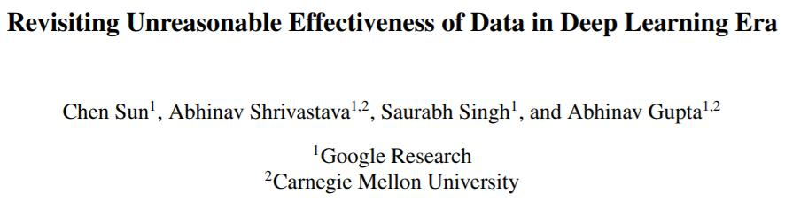

# 反思深度学习时代的数据的不合理有效性

> 原文：[Revisiting Unreasonable Effectiveness of Data in Deep Learning Era](https://arxiv.org/abs/1707.02968)

> 译者：[飞龙](https://github.com/wizardforcel)

> 协议：[CC BY-NC-SA 4.0](http://creativecommons.org/licenses/by-nc-sa/4.0/)

## 摘要

视觉深度学习的成功可归结为：（a）具有高容量的模型; （b）增加的计算能力; （c）大规模标记数据的可用性。自 2012 年以来，GPU 的模型和计算能力的表示能力已经取得了重大进展。但是，最大数据集的大小令人惊讶地保持不变。如果我们将数据集大小增加 10 倍或 100 倍会发生什么？本文朝着清除围绕“巨大数据”与深度学习之间关系的神秘之云迈出了一步。通过利用 JFT-300M 数据集，它具有超过 375M 噪声标签的 300M 图像，我们研究了当这些数据用于表示学习时当前视觉任务的性能将如何变化。我们的论文提供了一些令人惊讶的（和一些预期的）发现。首先，我们发现视觉任务的性能仍然随着训练数据大小的数量级线性增加。其次，我们表明表示学习（或预训练）仍然具有很多希望。只需训练更好的基础模型，就可以提高任何视觉任务的性能。最后，正如预期的那样，我们针对不同的视觉任务展示新的最新结果，包括图像分类，对象检测，语义分割和人体姿势估计。我们真诚地希望，这能激发视觉社区不要低估数据价值，并在构建更大数据集方面开展集体努力。

## 一、引言

大家一致同意，当前的 ConvNet 革命是大标签数据集（特别是来自 ImageNet 的 1M 标记图像 [34]）和大计算能力（归功于 GPU）的产物。 每年我们都会进一步提高计算能力（更新更快的 GPU）但我们的数据集并不是那么幸运。 ImageNet 是基于 1000 个类别的 1M 标记图像的数据集，在五年多前用于训练 AlexNet [24]。 奇怪的是，虽然 GPU 和模型容量都在不断增长，但训练这些模型的数据集仍然停滞不前。 即使是具有显着更大容量和深度的 101 层 ResNet，仍然可以使用大约 2011 年的 ImageNet 的 1M 图像进行训练。为什么会这样？ 我们是否再次在更深的模型和计算能力面前贬低数据的重要性？ 如果我们将训练数据量增加 10 倍或 100 倍会发生什么，性能会翻倍？

图 1. 视觉数据集的奇怪案例：虽然 GPU 计算能力和模型大小在过去五年中持续增长，但最大的训练数据集的大小却令人惊讶地保持不变。 这是为什么？如果我们使用我们的资源来增加数据集大小，会发生什么？本文简要介绍了如果数据集大小显着增加可能会出现的情况。

本文向“巨大数据”与深度学习之间关系的神秘云层迈出了第一步。 当然，房间里的大象是我们如何收集比 ImageNet 更大的数据集。 为了测试当前模型的限制和容量，我们可能需要一个比 ImageNet 大 100 倍的数据集。 封套计算的背面表明，收集 1000 个类别的 1M 图像，每个问题 1 美分，需要 1000 万美元。 ImageNet 使用了几种启发式方法（例如，标签层次结构）来减少问题空间，从而将成本降低到 10 万美元。 但是，大 100 倍的数据集仍然需要超过 10M。

在本文中，我们利用已经存在的 JFT 图像数据集，首先由 Hinton 等人引入 [17] 并扩展 [7]。 JFT 数据集具有超过 300M 的图像，标签有 18291 个类别。 注释已经自动获得，因此是有噪声的而不是详尽的。 这些注释已使用复杂算法进行清理，来提高标签的精度；但是精度仍有大约 20% 的误差。 我们将使用此数据来研究数据量与视觉任务性能之间关系的性质。 具体来说，我们将研究用于视觉表示学习（预训练）的数据的力量。 我们评估我们在各种视觉任务上的学习表示：图像分类，对象检测，语义分割和人体姿势估计。 我们的实验产生了一些令人惊讶的（和一些预期的）发现：

更好的表示学习有所帮助！ 我们的第一个观察是大规模数据有助于表示学习，这可以通过我们研究的每个视觉任务的性能改进来证明。 这表明收集更大规模的数据集来研究预训练可能会对该领域产生很大的好处。 我们的研究结果还表明，无监督或自我监督 [10,42]表示学习方法的前景光明。 似乎数据规模可以压倒标签空间中的噪音。

表现随着训练数据的数量级线性增加！ 也许我们发现中最令人惊讶的因素，是视觉任务的表现与用于表征学习的训练数据（对数尺度）之间的关系。 我们发现这种关系仍然是线性的！ 即使有 300M 训练图像，我们也没有观察到所研究任务的任何高原效应。

容量至关重要：我们还观察到，为了充分利用 300M 图像，需要更高容量的模型。 例如，使用 ResNet-152 时，COCO 对象检测的增益要小得多（1.87%），与 ResNet-50（3%）相比 。

长尾训练：我们的数据有很长的尾巴，但表示学习似乎有效。 这种长尾似乎不会对 ConvNet 的随机训练产生负面影响（训练仍然收敛）。

最新的技术成果：最后，我们的论文使用从 JFT-300M 学到的模型，在几个基准测试中呈现了最新的最新结果。 例如，单个模型（没有任何铃声和口哨声）现在可以达到 37.4 AP，而 COCO 检测基准则为 34.3 AP。

## 二、相关工作

自从 Krizhevsky 等人的开创性工作以来。 [24] 展示了卷积神经网络（ConvNets）对大规模图像识别任务的强大功能，已经做了大量工作使其更加准确。 常见的方法是通过增加这些网络的宽度或深度来增加这些网络的复杂性。 例如，Simonyan 和 Zisserman [36] 提出了 VGG-19 模型，它使用较小的卷积滤波器，深度为 19 层。 从那时起，这些模型的表示能力和深度每年都在不断增长。 GoogleNet [38] 是一个 22 层网络。 在本文中，我们使用 He 等人提出的 ResNet 模型进行所有实验 [16]。 核心思想是在层之间添加残余连接，这有助于优化非常深的模型。 这导致了许多识别任务的新的最先进的表现。

卷积神经网络学习视觉表示的层次结构。 这些视觉表示已被证明对广泛的计算机视觉任务有效 [1,4,14,22,28,32,35]。 学习这些视觉表示需要大规模的训练数据。 然而，最大的检测和分割数据集仍然是数十万个图像的数量级。 因此，这些方法中的大多数采用预训练。 原始模型在 ImageNet 中使用百万个标记图像进行学习，然后进一步训练目标任务（微调）以产生更好的性能 [4,14,32]。 黄等人 [18] 彻底评估了多种 ConvNet 架构对物体检测性能的影响，发现它与 ImageNet 上的模型容量和分类表现密切相关。

尽管在提高 ConvNets 的表示能力方面已经做了大量工作，但是预训练的训练数据量仍然是多年来确定的。 这背后的主要原因是缺乏比 ImageNet 更大的人类验证的图像数据集。 为了克服瓶颈，最近大量努力都花在使用网络监督[2,5,6,9,21,23,26]或无监督[10,11,30,31,33,41， 42]范式的视觉表示。 然而，与完全监督学习相比，这些努力中的大多数仍然是探索性的并且表现过低。

在本文中，我们的目标是将讨论从模型转移到数据。 我们的论文受到多篇论文的启发，这些论文一次又一次地关注数据的影响和属性，而不是模型。 2009 年，Pereira 等人 [29] 提交了一份调查文件，研究数据在自然语言处理和计算机视觉等领域的影响。 他们认为，与物理学不同，人工智能领域更有可能使用更多数据驱动的方法来观察影响。 另一项相关工作是 Torralba 和 Efros [40] 的实证研究，该研究强调了当前计算机视觉方法中的数据集偏差及其对未来研究的影响。

具体而言，我们专注于理解数据与深度学习之间的关系。 已经有一些努力用于理解这种关系。 例如，Oquab 等人 [27] 表明，扩展训练数据来覆盖 ImageNet-14M 的 1512 个标签，进一步提高了物体检测性能。 同样，Huh 等人 [19] 表明，使用较小的图像子集进行 ImageNet 训练会损害性能。 这两项研究还表明，选择训练类别很重要，随机添加类别往往会损害效果。 但是当类别数量增加 10 倍时会发生什么？ 我们还需要手动选择类别吗？ 同样，这些努力都没有显示出更大规模的数据效应。

最近的一些工作 [23,43] 研究了具有更大数据的 ConvNet 训练。 虽然 [43] 研究了地理定位，[23] 利用 YFCC-100M 数据集 [39] 进行表示学习。 然而，与我们不同，[23] 在 100M 图像训练时表现出检测表现的高原（平台）。 这是为什么？ 我们认为可能有两个可能的原因：a）YFCC-100M 图像仅来自 Flickr。 JFT 包括整个网络上的图像，并具有更好的视觉多样性。 在 JFT 中使用用户反馈信号进一步降低了标签噪声。 YFCC-100M 具有更大的词汇量和更嘈杂的注释。 b）但更重要的是，由于使用较小的 AlexNet VGG 模型，他们没有看到数据的真实效果。 在我们的实验中，我们看到更大的模型尺寸获得更多的收益。

## 三、JFT-300M 数据集

我们现在介绍本文中使用的 JFT-300M 数据集。 JFT-300M 是 [7,17] 引入的数据集的后续版本。 JFT-300M 数据集密切相关，并从图像搜索的数据中获得。 在此版本中，数据集具有 300M 图像和 375M 标签，平均每个图像具有 1.26 个标签。 这些图像用 18291 类别标记：例如，在数据集中标记了 1165 种类型的动物和 5720 种类型的机动车。 这些类别形成一个丰富的层次结构，层次结构的最大深度为 12，父节点的最大子节点数为 2876。

图像使用一种算法进行标记，该算法使用原始网络信号的复杂混合，网页与用户反馈之间的连接。 该算法从超过 10 亿个图像标签对开始，最终得到 375M 标签，用于 300M 图像，目的是选择高精度的标记图像。 但是，标签中仍然存在一些噪音：此数据集中大约 20% 的标签有噪音。 由于没有详尽的注释，我们无法估计标签的召回率。 图 2 显示了数据集中存在的噪声类型。 因为标签是自动生成的，所以存在“乌龟”与“龟壳眼镜”混淆的问题。

图 2. JFT-300M 数据集在标签混淆和不正确标签方面可能会产生噪音。 这是因为标签是通过网络信号的复杂混合产生的，而不是由人注释或清理。 x 轴对应于到 K-Means 质心的量化距离，其基于视觉特征计算。

最后，讨论 JFT-300M 的数据分布很重要。 分布严重长尾：例如，有超过 2M 个'花'，3250 个 'subarau360'，但只有 131 个 '列车长' 图像。 实际上，尾部非常重，我们有超过 3K 个类别，每个类别少于 100 个图像，大约 2K 个类别，每个类别少于 20 个图像。

## 四、训练和评估框架

我们现在描述我们的论文训练和评估框架。

### 4.1 JFT-300M 数据集上的训练

尽管最近提出了几种新颖的 ConvNet 架构，但我们决定使用标准的残余网络架构 [16] 和 101 层（ResNet-101），来实现其最先进的性能以及与以前工作相比的易用性。 为了在 JFT300M 上训练 ResNet-101 模型，我们在网络末端添加了一个带有 18291 个输出的全连接层，用于分类。 由于图像标签不是互斥的，我们计算每标签 logistic 损失，并将所有不存在的标签视为负类。 为了缓解缺少标签的问题，我们使用手工设计的标签层次结构并相应地填写缺失的标签。 例如，带有标签 'apple' 的图像也被视为 'fruit' 的正确示例。
