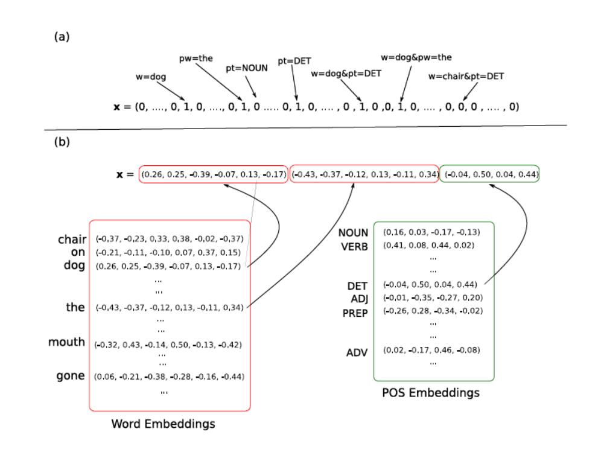
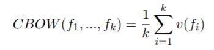
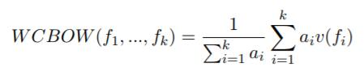

## 三、特征表示

在更深入地讨论网络结构之前，重要的是要注意如何表示特征。现在，我们可以将一个前馈神经网络想象为一个函数`NN(x)`，它将一个 $d_{in}$ 维向量`x`作为输入，并生成一个 $d_{out}$ 维输出向量。该函数通常用作分类器，将输入`x`分配为一个或多个 $d_{out}$ 类中的成员。该函数可能很复杂，并且几乎总是非线性的。这个函数的通用结构将在第 4 节讨论。在这里，我们关注输入`x`。在处理自然语言时，输入`x`编码单词，词性标签或其他语言信息之类的特征。当从稀疏输入线性模型转变为基于神经网络的模型时，也许最大的变化是不再将每个特征表示为唯一维度（即所谓的单热表示）并将它们表示为密集向量。也就是说，每个核心特征都被嵌入到一个`d`维空间中，并被表示为该空间中的一个向量。然后，可以像 NN 函数的其他参数一样训练嵌入（每个核心特征的向量表示）。图 1 显示了两种特征表示方法。

特征嵌入（每个特征的向量条目的值）被视为模型参数，需要与网络的其他组件一起训练。 训练（或获取）特征嵌入的方法将在后面讨论。 现在，考虑给定的特征嵌入。 

因此，基于前馈神经网络的 NLP 分类系统的一般结构是：

1.  提取一系列核心语言特征 $f_1, ..., f_k$，和输出类相关。

2.  对于每个感兴趣的特征 $f_i$，获取对应向量 $v(f_i)$

3.  组合向量（通过连接，求和，或者二者都有）。

4.  将`x`放进非线性分类器（前馈神经网络）

之后，输入的最大变化就是，从每个特征是它自己的维度的稀疏表示，变为每个特征都是一个向量的密集表示。 另一个区别是我们只提取核心特征而不是特征组合。 我们将简要阐述这些变化。

密集向量 vs 单热表示

将我们的特征表示为向量而不是唯一的 ID 有什么好处？ 我们是否应该始终将特征表示为密集向量？ 让我们考虑两种表示：

单热：每个特征是它自己的维度

+   单热向量的维度和不同特征的数量相同。
+   特征完全独立于其他特征。“word is 'dog'”的特征不相似于“word is 'thinking'”，“word is 'cat'”也一样。

密集：每个特征是 D 维向量

+   向量维度是`d`
+   相似特征拥有相似向量 -- 信息在相似特征之间共享

图 1：稀疏与密集的特征表示。 信息的两种编码：当前字是“dog”；前一个字是“the”；前一个词性是“DET”。（a）稀疏特征向量，每个维度代表一个特征，特征组合接收它们自己的维度，特征值是二进制的，维度非常高；（b）密集的，基于嵌入的特征向量。 每个核心特征表示为一个向量，每个特征对应多个输入向量条目，没有明确的特征组合编码，维度较低，特征向量映射来自嵌入表。

使用密集和低维向量的一个好处是计算：大多数神经网络工具包在高维稀疏向量中不能很好地发挥作用。 然而，这只是一个技术障碍，可以通过一些工程努力来解决。

密集表示的主要优点在于泛化能力：如果我们相信某些特征可能提供相似的线索，那么值得提供能够捕获这些相似性的表示。 例如，假设我们在训练过程中多次观察到“dog”这个词，但只观察了几次“cat”这个词，或者根本没有。 如果每个单词与它自己的维度相关联，“dog”的出现不会告诉我们有关“cat”出现的任何信息。 然而，在密集的向量表示中，学习到的“dog”向量可能类似于从“cat”学习到的向量，从而允许模型共享这两个事件之间的统计强度。 这个论点假设“好的”向量以某种方式提供给我们，第 5 节描述了获得这种向量表示的方法。

如果我们在该类别中的特征相对较少，并且我们认为不同特征之间不存在相关性，那么我们可以使用单热表示。但是，如果我们相信组中不同特征之间会存在相关性（例如，对于词性标签，我们可能会认为。不同的动词变化 VB 和 VBZ 可能会有相似的行为，就我们的任务而言有关），可能值得让网络通过共享参数找出相关性，并获得一些统计强度。可能的情况是，在某些情况下，当特征空间相对较小并且训练数据丰富时，或者当我们不希望在不同词语之间共享统计信息时，可以通过使用单热表示。但是，这仍然是一个开放的研究问题，双方都没有有力的证据。大部分工作（由（Collobert & Weston，2008; Collobert 等人，2011; Chen & Manning，2014）开创）主张使用密集的，可训练的嵌入向量来表示所有特征。对于使用稀疏向量编码的神经网络体系结构的工作，请参阅（Johnson & Zhang，2015）。

最后，值得注意的是，将特征表示为密集向量是神经网络框架的一个组成部分，因此稀疏特征表示和密集特征表示之间的差异，要比起初它们可能出现的情况要微妙。 事实上，在训练神经网络时使用稀疏的单热向量作为输入，这相当于将网络的第一层用于基于训练数据为每个特征学习密集嵌入向量。 我们在 4.4 节中谈到这一点。

可变数量的特征：连续的词袋（BOW）前馈网络假设输入是固定尺寸的。 这可以轻易适应提取固定数量特征的情况：每个特征被表示为向量，并且向量被连接。 这样，得到的输入向量的每个区域对应于不同的特征。 然而，在某些情况下，特征的数量并不是事先知道的（例如，在文档分类中，通常句子中的每个单词都是一个特征）。 因此，我们需要使用固定大小的向量来表示无限数量的特征。 实现这一目标的一种方式是通过所谓的连续词袋（CBOW）表示（Mikolov，Chen，Corrado 和 Dean，2013）。 CBOW 与我们放弃顺序信息的，传统的词袋表示非常相似，并且原理是对相应特征的嵌入向量求和或求均值 [2]：

> [2] 请注意，如果 $v(f_i)s$ 是单热向量而不是密集的特征表示，则上面的 CBOW 和 WCBOW 方程将退化为到传统（加权）的词袋表示，而这相当于一个稀疏的特征向量表示，其中每个二元指标特征对应于唯一的“单词”。

CBOW 表示的一个简单变体是加权 CBOW，其中不同的向量接收不同的权重：

这里，每个特征 $f_i$ 具有相关联的权重 $a_i$，表示该特征的相对重要性。 例如，在文档分类任务中，特征 $f_i$ 可以对应于文档中的单词，并且相关联的权重 $a_i$ 可以是单词的 TF-IDF 分数。

距离和位置特征。句子中两个单词之间的直线距离可用作信息特征。例如，在事件提取任务 [3] 中，我们可能会得到一个触发词和一个候选参数词，并要求预测该词是否确实是触发词的一个参数。触发词和参数词之间的距离（或相对位置）是这个预测任务的强信号。在“传统”NLP 设置中，通常通过将距离装箱到若干组（即 1, 2, 3, 4, 5-10, 10 +）并将每个箱与单热向量相关联来编码距离。在神经架构中，输入向量不是由二元指标特征组成的，将单个输入向量条目分配给距离特征似乎很自然，其中该条目的数值是距离。但是，这种做法在实践中并未采用。相反，距离特征的编码方式与其他特征类型相似：每个箱与一个`d`维向量相关联，然后这些距离嵌入向量在网络中被训练为常规参数（Zeng 等，2014; dos Santos et 2015; Zhu 等，2015a; Nguyen & Grishman，2015）。

特征组合。请注意，神经网络设置中的特征提取阶段，仅处理核心特征的提取。这与传统的基于线性模型的 NLP 系统形成对比，其中特征设计者不得不手动指定感兴趣的核心特征，而且还需要手动指定它们之间的相互作用（例如，不仅引入说明“词是 X”的特征和“标记为 Y”的特征，还有一个说明“单词为 X 且标签为 Y”的特征，或有时甚至“单词为 X，标签为 Y 且前一单词为 Z”的组合特征）。这些组合特征在线性模型中至关重要，因为它们为输入引入更多维度，将其转化为数据点更接近线性可分的空间。另一方面，可能组合的空间非常大，特征设计者不得不花费大量时间来设计一组有效的特征组合。非线性神经网络模型的一个承诺是，只需要定义核心特征。如网络结构所定义的，分类器的非线性预期负责查找指示性特征组合，从而减轻对特征组合工程的需求。

核方法（Shawe-Taylor & Cristianini，2004），特别是多项式核（Kudo & Matsumoto，2003）也允许特征设计者仅指定核心特征，而将特征组合方面留给学习算法。 与神经网络模型相反，核方法是凸的，为优化问题提供了精确的解决方案。 然而，核方法中的分类效率与训练数据的大小成线性关系，使得它们对于大多数实际目的来说太慢，并且不适合用大数据集进行训练。 另一方面，神经网络分类效率与网络大小成线性比例关系，与训练数据大小无关。

维度。我们应该为每个特征分配多少维度？ 不幸的是，这个领域没有理论界限，甚至没有建立最佳实践。 显然，维度应随着类中成员的数量而增加（您可能希望为词嵌入而不是词性嵌入，指定更多维度），但多少就足够了？ 在当前的研究中，词嵌入向量的维数在大约 50 到数百之间，在某些极端情况下，数千。 由于向量的维度直接影响内存需求和处理时间，所以一个好的经验法则是试验几种不同的尺寸，并在速度和任务精度之间选择一个好的折衷。

向量共享。考虑一个案例，你有几个共享相同词汇表的特征。例如，当给一个给定的单词分配一个词性时，我们可能会考虑前一个单词的一组特征，以及考虑下一个单词的一组特征。在构建分类器的输入时，我们会将前一个单词的向量表示与下一个单词的向量表示连接起来。分类器将能够区分两个不同的指标，并以不同的方式对待它们。但是，这两个特征应该共享相同的向量吗？ “dog:previous-word”的向量应该与“dog:next-word”的向量相同吗？或者我们应该为它们分配两个不同的向量？这又是一个经验问题。如果您相信单词出现在不同的位置时行为会有所不同（例如，在上一个位置，单词`X`的行为类似于单词`Y`，但在下一个位置时，`X`的行为类似于`Z`），那么使用两个不同的词汇表，并为每个特征类型分配一组不同的向量，是个好主意。但是，如果您认为这两个词在两个位置的行为都相似，则可以通过为这两种特征类型使用共享词汇表来获得某些内容。

网络输出。对于具有`k`类的多类分类问题，网络的输出是一个`k`维向量，其中每个维度表示特定输出类别的强度。 也就是说，输出和传统线性模型一样 - 离散集合中的项目的标量得分。 但是，我们将在第 4 节中看到，有一个与输出层相关的`d×k`矩阵。 这个矩阵的列可以被认为是输出类的`d`维嵌入。         `k`个类别的向量表示之间的向量相似性，表示模型在输出类别之间所学习的相似性。

历史注解。Bengio 等人（2003）在神经语言建模的背景下，引入了一种机制，将单词表示为密集向量来输入到神经网络。 它在 Collobert，Weston 及其同事（2008，2011）的开创性工作中被引入到 NLP 任务。 在 Chen 和 Manning（2014）的基础上，嵌入用于表示单词以及任意特征。
