## 四、前馈神经网络

大脑启发的隐喻。顾名思义，神经网络受大脑计算机制的启发，该机制由称为神经元的计算单元组成。 在隐喻中，神经元是一个具有标量输入和输出的计算单位。 每个输入都有相关的权重。 神经元将每个输入乘以它的权重，然后求和它们 [4]，对结果应用一个非线性函数，并将其传递给它的输出。 神经元相互连接，形成一个网络：神经元的输出可以馈入一个或多个神经元的输入。 据证明，这种网络是非常有能力的计算设备。 如果权重设置正确，那么具有足够神经元和非线性激活函数的神经网络，可以逼近非常广泛的数学函数（我们后面会更精确）。

> [4] 求和是最常见的操作，其它操作，比如最大值，也是可能的。

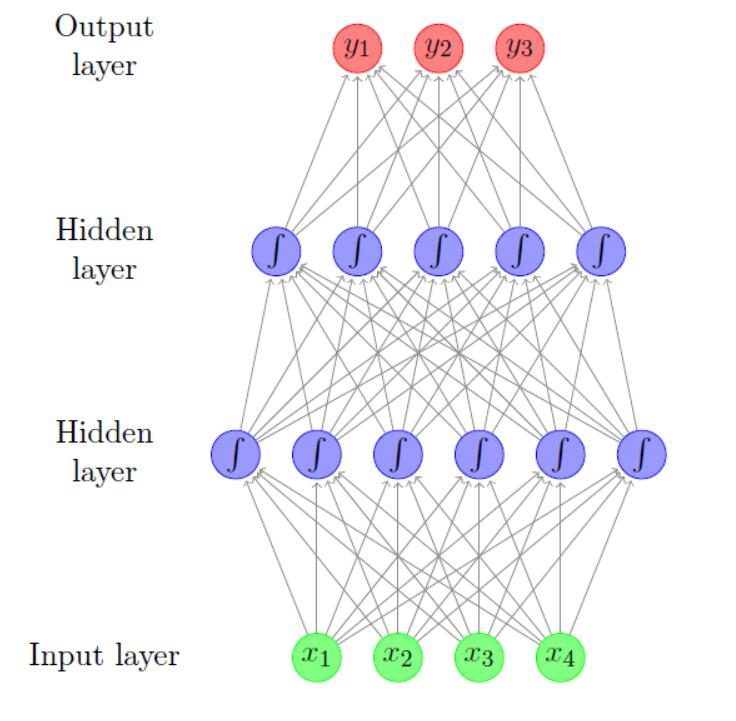

图 2：带有两个隐层的前馈神经网络

一个典型的前馈神经网络可能如图 2 所示。每个圆圈都是一个神经元，其中输入箭头是神经元的输入，输出箭头是神经元的输出。 每个箭头都带有权重，反映其重要性（未显示）。 神经元分层排列，反映信息流。 底层没有传入的箭头，并且是网络的输入。 顶层没有输出箭头，并且是网络的输出。 其他层被认为是“隐藏的”。中层神经元内的 S 形表示一个非线性函数（通常是 $\sigma(x) = 1 / (1 + e^{-x})$，但有更好的函数），将神经元的值传递给 输出之前，它应用于神经元的值。图中，每个神经元连接到下一层的所有神经元（这称为全连接层或仿射层）。

虽然大脑隐喻性感而有趣，但从数学上操作，它也是分散注意力和繁琐的。 因此，我们转而使用更简洁的数学符号。 网络中每行神经元的值可以当做是一个向量。 在图 2 中，输入层是一个 4 维矢量（`x`），而它上面的层是一个 6 维矢量（$h^1$）。 全连接层可以当做从 4 维到 6 维的线性变换。全连接层实现向量矩阵乘法，$h = xW$，其中 $W_{ij}$ 是从输入行中的第`i`个神经元到输出行中的第`j`个神经元的连接权重 [5]。然后，`h`的值被非线性函数`g`转换，它在传递到下一个输入之前应用于每个值。 从输入到输出的整个计算可写为：$g(xW^1)W^2$，其中 $W^1$ 是第一层的权重，$W^2$ 是第二层的权重。

> [5] 为了弄清为什么是这样，将`h`中第`j`个神经元的第`i`个输入表示为 $w_{ij}$。$h_j$ 的值就为 $h_j = \sum^4_{i=1} x_i \cdot w_{ij}$。

在数学符号中。从这一点开始，我们将放弃大脑隐喻，并专门用向量矩阵运算来描述网络。 最简单的神经网络是感知器，它是其输入的线性函数：

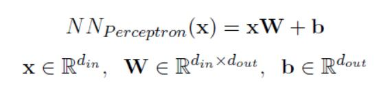

`W`是权重矩阵，`b`是偏差项 [6]。为了超越线性函数，我们引入了一个非线性隐层（图 2 中的网络有两个这样的层），产生了 1 层的多层感知机（MLP 1）。 单层前馈神经网络的形式如下：

> [6] 图2中的网络不包含偏差项。 可以通过向其添加一个没有任何传入连接的额外神经元，来将偏置项添加到层，其值始终为 1。

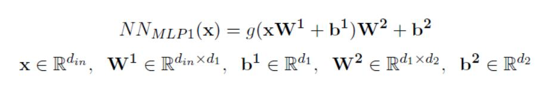

这里 $W^1$ 和 $b^1$ 是用于输入的第一个线性变换的矩阵和偏置项，`g`是逐元素应用的非线性函数（也称激活函数），并且 $W^2$ 和 $b^2$ 是第二个线性变换的矩阵和偏差项。

将其分解，$xW^1 + b^1$ 是输入`x`从 $d_{in}$ 尺寸到 $d^1$ 尺寸的线性变换。 然后将`g`应用于每个 $d^1$ 维度，然后将矩阵 $W^2$ 与偏差向量 $b^2$ 一起用于将结果转换为 $d^2$ 维输出向量。 在网络表示复杂功能的能力中，非线性激活函数`g`起着至关重要的作用。 如果没有`g`中的非线性，神经网络只能表示输入的线性变换 [7]。

> [7] 为了弄清楚为什么，考虑一系列线性变换还是线性变换。

我们可以增加额外的线性变换和非线性，产生 2 层 MLP（图 2 中的网络是这种形式的）。

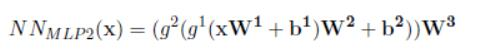

使用中间变量编写像这样的更深层的网络也许更清楚：

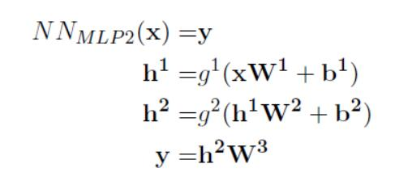

由每个线性变换产生的向量被称为层。 最外面的线性变换产生输出层，而其他线性变换产生隐层。 每个隐层后面都有一个非线性激活。 在某些情况下，比如在我们的例子的最后一层，偏置向量被强制为 0（丢弃了）。

线性转换产生的层通常被称为全连接或仿射。其他类型的架构也存在。 特别是，图像识别问题受益于卷积层和池化层，这些层也用于语言处理，将在第 9 节讨论。具有多于一个隐层的网络被认为是深度网络，因此称为深度学习。

在描述神经网络时，应该指定层的尺寸和输入。一个图层将期望 $d_{in}$ 维向量作为其输入，并将其转换为 $d_{out}$ 维向量。该层的维度被视为其输出的维度。对于输入维数为 $d_{in}$，输出维数为 $d_{out}$ 的全连接层 $l(x)= xW + b$，`x`的维数为 $1 \times d_{in}$，`W`为 $d_{in} \times d_{out}$，`b`的维数为 $1 \times d_{out}$。

网络的输出是一个 $d_{out}$ 维的向量。在 $d_{out} = 1$ 的情况下，网络的输出是标量。这种网络可以通过考虑输出值来进行回归（或评分），或者通过查询输出的符号来进行二元分类。 $d_{out} = k > 1$ 的网络可用于`k`元分类，方法是将每个维与一个类相关联，然后查找具有最大值的维。与之类似，如果输出向量条目是正数并且总和为 1，则输出可以被解释为类别上的分布（这种输出归一化通常通过在输出层上应用 softmax 变换来实现，参见 4.3 节）。

定义线性变换的矩阵和偏差项是网络的参数。通常将所有参数的集合称为`θ`。参数与输入一起决定网络的输出。训练算法负责设置它们的值，使网络的预测是正确的。训练在第 6 节中讨论。

## 4.1 表现力

在表现力方面，（Hornik，Stinchcombe，& White，1989; Cybenko，1989）表明 MLP1 是一个通用逼近器 - 它可以以任意期望的非零误差量，近似一系列函数 [8] 包括 $R ^n$ 的闭合和有界子集上的所有连续函数，以及从任何有限维离散空间到另一个有限维离散空间的任何函数映射。这可能意味着，没有理由去做超越 MLP1 的更复杂的体系结构。然而，理论结果并没有说明隐藏层应该有多大，也没有说明神经网络的学习能力（它只是说表示是存在的，但没有说明，基于训练数据和特定的学习算法，设置参数有多容易或困难）。它也不能保证，训练算法会找到生成我们训练数据的正确函数。因为在实践中我们使用反向传播算法和随机梯度下降变体的组合，并且使用相对适中大小的隐藏层（高达数千），在相对少量数据上训练神经网络，因此尝试比 MLP1 更复杂的体系结构是有帮助的。然而，在许多情况下，MLP1 确实提供了非常有力的结果。前馈神经网络表示能力的进一步讨论，请参阅（Bengio 等，2015，第 6.5 节）。

## 4.2 常见的非线性函数

非线性`g`可以采取多种形式。 目前还没有很好的理论来说明，应用哪种非线性条件，以及为给定任务选择正确的非线性函数大部分是经验问题。 现在我将回顾文献中常见的非线性：sigmoid，tanh，hard tanh和整流线性单元（ReLU）。 一些 NLP 研究人员还尝试了其他形式的非线性，例如 cube 和 tanh-cube。

Sigmoid：sigmoid 激活函数 $\sigma(x) = 1 / (1 + e^{-x})$ 是 S 形函数，将`x`的每个值转换到范围`[0,1]`中。

双曲正切（tanh）：双曲正切 $tanh(x) = \frac{e^{2x} - 1}{e^{2x} + 1}$ 激活函数是 S 形函数，将`x`的每个值转换到范围`[-1,1]`中。

Hard tanh：Hard tanh 激活函数是 tanh 函数的近似，它计算更快，并且衍生为：

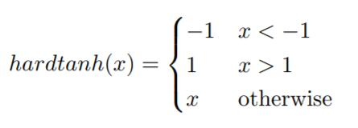

整流器（ReLU）：整流器激活函数（Glorot，Bordes 和 Bengio，2011）也称为整流线性单元，它是一种非常简单的激活函数，易于使用，并且多次表明可以产生出色的结果 [9]。ReLU 单元在 0 处截断每个`x <0`的值。尽管简单，但它在很多任务中表现良好，特别是与 dropout 正则化技术结合使用时（见 6.4 节）。

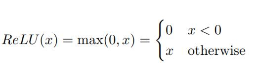

作为经验之谈。ReLU 单元比 tanh 好，tanh 比 sigmoid 好 [10]。

## 4.3 输出转换

许多情况下，输出层向量也会转换。常见的转换是 softmax：

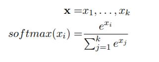

结果是和为 1 的非负实数的向量，使其成为`k`个可能结果上的离散概率分布。 

当我们有兴趣对可能的输出类别进行概率分布建模时，使用 sof tmax 输出变换。 为了有效，它应该与例如交叉熵的概率性训练目标结合使用（见下面的第 4.5 节）。 

当 softmax 变换应用于没有隐藏层的网络输出时，结果是众所周知的多项逻辑回归模型，也称为最大熵分类器。

## 4.4 内嵌层

到目前为止，讨论忽略了`x`的来源，将其视为任意向量。 在 NLP 应用中，`x`通常由各种嵌入向量组成。 我们可以明确`x`的来源，并将其包含在网络的定义中。 我们引入了`c(・)`，这是一个从核心特征到输入向量的函数。 `c`通常提取与每个特征相关的嵌入向量，并将它们连接起来：

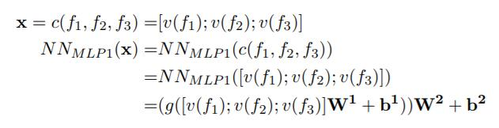

`c`的另一个常见选择是对嵌入向量求和（这假设嵌入向量共享相同）。

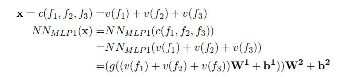

`c`的形式是网络设计的重要组成部分。 在许多论文中，通常将`c`指为网络的一部分，并且同样将嵌入 $v(f_i)$ 的单词视为由“嵌入层”或“查找层”产生的结果。 考虑一下单词`|V|`的词汇表，每个词嵌入为一个`d`维向量。 然后可以将向量集合视为`|V| ×d`嵌入矩阵`E`，其中每行对应于嵌入特征。 假设 $f_i$ 是一个`|V|`维向量，它除了一个下标外全部为零，下标对应于第`i`个特征的值，其值为 1（这被称为单热向量）。 然后乘法 $f_iE$ 将“选择”`E`的对应行。因此，$v(f_i)$ 可以用`E`和 $f_i$ 来定义：

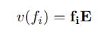

与之相似：

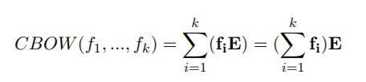

网络的输入被认为是单热向量的集合。 虽然这在数学上是优雅的且明确定义的，但高效的实现通常涉及基于散列的数据结构，将特征映射到其对应的嵌入向量，而不经历单热表示。 

在本教程中，我们将`c`与网络架构分开：网络的输入始终是密集的实值输入向量，在输入通过网络之前应用`c`，类似于熟悉的线性模型术语中的“特征函数”。 但是，在训练网络时，输入向量`x`确实记得它是如何构建的，并且可以将误差梯度传播回其成分，嵌入向量。

符号注释。当描述网络层，它将连接的向量`x`，`y`和`z`作为输入的时，有些作者使用显式连接（`[x; y; z] W + b`），而另一些使用仿射变换（`xU + yV + zW + b`）。 如果仿射变换中的权重矩阵`U`，`V`，`W`彼此不同，则这两个符号是等价的。
