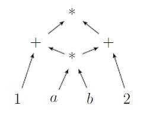
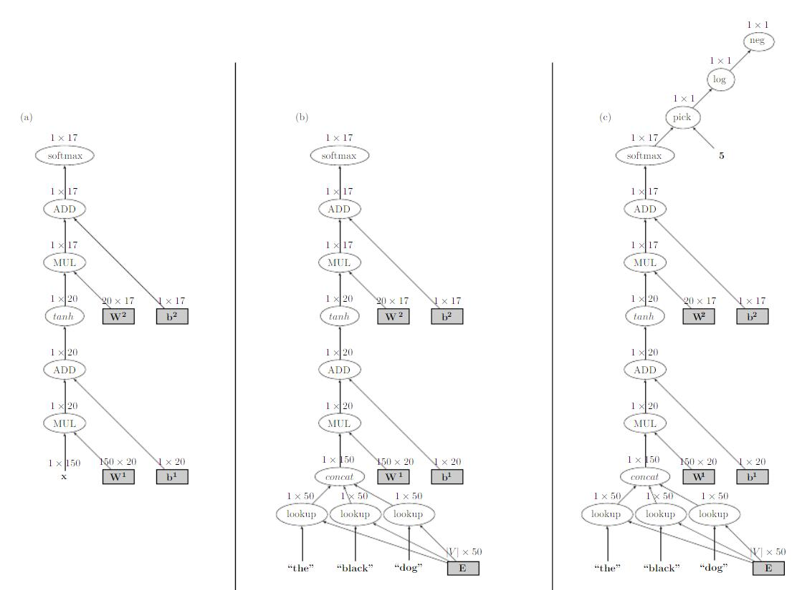
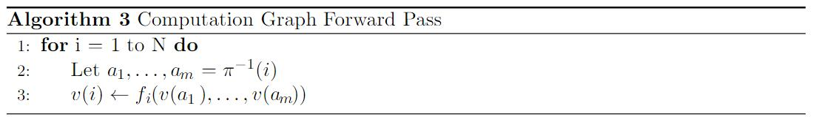
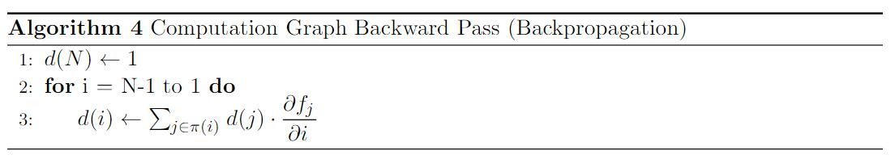
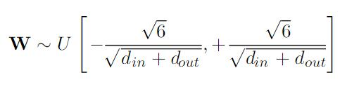
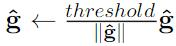
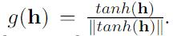

# 六、神经网络的训练

神经网络的训练是通过尝试使用基于梯度的方法，最小化训练集上的损失函数来完成的。 粗略地说，所有训练方法的原理都是重复计算数据集上的误差估计，计算误差的梯度，然后沿梯度方向移动参数。 如何计算误差估计，以及如何定义“在梯度方向上移动”，不同模型是不同的。 我们描述了基本算法，随机梯度下降（SGD），然后提到其他方法，带有用于进一步阅读的链接。 梯度计算是该方法的核心。 梯度可以使用计算图上的反向模式微分来有效自动计算 - 它是一种通用的算法框架，可以自动计算任何网络和损失函数的梯度。

## 6.1 随机梯度训练

训练神经网络的常用方法是使用随机梯度下降（SGD）算法（Bottou，2012; LeCun，Bottou，Orr，和 Muller，1998a）或其变体。SGD 是一种通用优化算法。 它接收参数为`θ`的损失函数`f`，和所需的输入输出。 然后，它尝试设置参数`θ`，使得相对于训练样本的`f`的损失很小。 该算法的工作原理如下：


该算法的目标是设置参数`θ`，来最小化训练集上的总损失$\sigma_{i=1}^n L(f(x_i; \theta), y_i)$。 它的工作原理是重复采样训练样本，并计算误差对于参数`θ`的梯度（第 7 行） - 假设输入和预期输出是固定的，并且损失被视为参数`θ`函数。然后在梯度方向上更新参数`θ`，通过学习速率`η`（第 8 行）来缩放。 对于设置学习率的进一步讨论，请参见第 6.3 节。

请注意，第 6 行中计算的误差基于单个训练示例，因此仅仅是对我们打算使其最小的，语料库范围的损失的粗略估计。 损失计算中的噪声可能导致梯度不准确。 减少这种噪声的常用方法是基于`m`个样本来估计误差和梯度。 这就上升为小批量 SGD 算法：


在第 6-9 行中，算法基于小批量估计语料库损失的梯度。 在循环之后，`g`包含梯度估计，并且参数`θ`朝着`g`更新。 小批量大小的大小可以从`m = 1`到`m = n`。 较高的值可以更好地估计语料库范围的梯度，而较小的值可以提供更多的更新，从而更快地收敛。 除了提高梯度估计的准确性之外，小批量算法有机会提高训练效率。对于适度大小的`m`，一些计算架构（即 GPU）可以高效并行实现行 6-9 中的计算。 学习率足够小的情况下，如果函数是凸的，SGD 可以保证收敛到全局最优。 然而，它也可以用于优化非凸函数，例如神经网络。 虽然不再保证找到全局最优，但据证明该算法是健壮的并且在实践中表现良好。

在训练神经网络时，参数化函数`f`是神经网络，参数`θ`是层间传递矩阵，偏置项，嵌入矩阵等等。梯度计算是 SGD 算法以及所有其他神经网络训练算法中的关键步骤。那么问题是，如何计算网络误差对参数的梯度。幸运的是，有一种简单的解法，形式为反向传播算法（Rumelhart，Hinton，&Williams，1986; Lecun，Bottou，Bengio，&Haffner，1998b）。反向传播算法是一个奇特的名称，指代使用链式法则计算复杂表达式的导数，同时缓存中间结果。更一般，爱说，反向传播算法是反向模式自动微分算法的特例（Neidinger，2010，Section 7），（Baydin，Pearlmutter，Radul，&Siskind，2015; Bengio，2012）。以下部分描述了反向模式自动微分算法，在计算图抽象的上下文中。

超越 SGD。虽然 SGD 算法可以并且通常确实产生了良好的结果，但也可以使用更先进的算法。 SGD + 动量（Polyak，1964）和 Nesterov 动量（Sutskever，Martens，Dahl，&Hinton，2013）算法是 SGD 的变体，其中累积先前的梯度并且影响当前的更新。 自适应学习算法包括 AdaGrad（Duchi，Hazan，&Singer，2011），AdaDelta（Zeiler，2012），RMSProp（Tieleman & Hinton，2012）和 Adam（Kingma & Ba，2014），旨在为每个小批量选择学习率， 有时基于每个坐标，学习速率调度的需要可能会减少。 对于这些算法的详细信息，请参阅原始论文或（Bengio等，2015，第 8.3 和 8.4 节）。 由于许多神经网络软件框架提供了这些算法的实现，因此尝试不同的变体很容易，有时候也是值得的。

## 6.2 计算图抽象

虽然可以手动计算网络的各种参数的梯度，并且在代码中实现它们，但是该过程是麻烦且容易出错的。 对于大多数情况，最好使用自动工具进行梯度计算（Bengio，2012）。 计算图抽象允许我们轻松地构造任意网络，评估给定输入的预测（正向传递），并计算任意标量损失相对于其参数（反向传递）的梯度。


计算图是任意数学计算的表示，如图。 它是有向无环图（DAG），其中节点对应于数学运算或变量（绑定），并且边对应于节点之间的中间值的流。 根据不同组件之间的依赖关系，图结构定义计算的顺序。 图是 DAG 而不是树，因为一个操作的结果可以是几个后续的输入。 考虑例如用于计算`(a ∗ b + 1) ∗ (a ∗ b + 2)`的图：



a * b的计算是共享的。 我们将自己局限于计算图连通的情况。由于神经网络本质上是一个数学表达式，它可以表示为计算图。

例如，图 3a 给出了具有 softmax 输出变换的 1 层 MLP 的计算图。 在我们的表示法中，椭圆形节点表示数学运算或函数，阴影矩形节点表示参数（绑定变量）。 网络的输入被视为常量，并且在没有周围节点的情况下绘制。 输入和参数节点没有传入边，输出节点没有传出边。 每个节点的输出是一个矩阵，其维度在节点上方标明。

该图是不完整的：没有指定输入，我们无法计算输出。图 3b 显示了 MLP 的完整图，它将三个单词作为输入，并预测第三个单词的词性标签的分布。 此图可用于预测，但不能用于训练，因为输出是矢量（不是标量），图并没有考虑正确答案或损失项。 最后，3c 中的图显示了特定训练示例的计算图，其中输入是“嵌入”单词“the”，“black”，“dog”，预期输出是“NOUN”（其索引为 5）。



图 3：MLP1 的计算图。（a）输入未绑定的图表。（b）带有具体输入的图表。（c）带有输入，预期输出和损失节点的图表。

一旦构建了图，就可以直接执行正向计算（计算结果）或反向计算（计算梯度），如下所示。 构建图表可能看起来令人生畏，但实际上使用专用软件库和 API 非常容易。

正向计算。正向传播计算图中节点的输出。 由于每个节点的输出，仅取决于它自身及其传入边，因此通过以拓扑顺序遍历节点，并在其前驱的输出已计算的情况下，计算每个节点的输出来计算所有节点的输出是很简单的。

更正式来讲，在 N 个节点的图中，我们根据它们的拓扑序将每个节点与关联到下标 i。 让`fi`为由节点`i`计算的函数（例如乘法和加法等）。 令`π(i)`为节点`i`的父节点，并且`π−1(i) = {j | i ∈ π(j)}`，为节点`i`的子节点（这些是`fi`的参数）。 用`v(i)`表示节点`i`的输出，即`fi`在`π-1(i)`输出值上的应用。 对于变量和输入节点，`fi`是常函数，`π−1(i)`是空的。 前向算法计算所有的值`v(i), i∈[1,N]`。



反向计算（导数，反向传播）。反向传播首先指定带有标量输出（1×1）节点`N`作为损失节点，并执行前向计算到该节点。 反向计算将根据该节点的值计算梯度。 用`d(i)`表示`∂N/∂i`。 反向传播算法用于计算所有节点`i`的值`d(i)`。反向传播填充表`d(i)`，像这样：



`∂fj/∂i`是`fj(π-1(j))`对于参数`i∈π-1(j)`的偏导数。该值取决于函数`fj`和参数的值`v(a1), ..., v(am)`（其中`a1, ..., am =π-1(j)`），在前向传递中计算。

因此，为了定义新的节点，需要定义两种方法：一种用于根据节点输入计算前向值`v(i)`，另一种用于为每个`x ∈ π−1(i)`计算每个`x∈π-1`的`∂fi/∂x`。

对于自动微分的更多信息，请参阅（Neidinger，2010，第7节），（Baydin等，2015）。 对于反向传播算法和计算图（也称为流图）的更深入讨论，请参阅（Bengio 等，2015，第 6.4 节），（Lecunet 等，1998b; Bengio，2012）。 对于流行的技术展示，请参阅 <http://colah.github.io/posts/2015-08-Backprop/> 上的 Chris Olah 的描述。

软件。几个软件包实现了计算图模型，包括 Theano [18]，Chainer [19]，penne [20] 和 CNN/pyCNN [21]。 所有这些软件包都支持所有基本组件（节点类型），用于定义各种神经网络体系结构，涵盖本教程中描述的结构，以及其他。 通过使用运算符重载，图的创建几乎是透明的。 该框架定义了一种表示图节点的类型（通常称为表达式），构造输入和参数的节点的方法，以及一组函数和数学运算，它们将表达式作为输入并产生更复杂的表达式。 例如，使用 pyCNN 框架从图（3c）创建计算图的 python 代码是：

```py
from pycnn import*
# model initialization.
model = Model()
model.add_parameters("W1", (20,150))
model.add_parameters("b1", 20)
model.add_parameters("W2", (17,20))
model.add_parameters("b2", 17)
model.add_lookup_parameters("words", (100, 50))

# Building the computation graph:
renew_cg() 
# create a new graph.
# Wrap the model parameters as graph-nodes.
W1 = parameter(model["W1"])
b1 = parameter(model["b1"])
W2 = parameter(model["W2"])
b2 = parameter(model["b2"])
def get_index(x): return 1
# Generate the embeddings layer.
vthe = lookup(model["words"], get_index("the"))
vblack = lookup(model["words"], get_index("black"))
vdog = lookup(model["words"], get_index("dog"))

# Connect the leaf nodes into a complete graph.
x = concatenate([vthe, vblack, vdog])
output = softmax(W2*(tanh(W1*x)+b1)+b2)
loss = -log(pick(output, 5))

loss_value = loss.forward()
loss.backward() 
# the gradient is computed
# and stored in the corresponding
# parameters.
```

大多数代码涉及各种初始化：第一个块定义模型参数，这些参数可以在不同的计算图之间共享（回想一下，每个图对应于一个特定的训练示例）。 第二个块将模型参数转换为图节点（表达式）类型。 第三个块检索用于嵌入输入单词的表达式。 最后，第四个块是图的创建位置。 请注意图的创建的透明程度 - 在图的创建和数学方式描述之间几乎存在一对一的对应关系。 最后一个块显示前向和后向传播。 其他软件框架遵循类似的模式。

Theano 自带计算图的优化编译器，既是祝福又是诅咒。 一方面，一旦编译完成，大型图就可以在 CPU 或 GPU 上高效运行，使其成为具有固定结构的大型图的理想选择，其中只有输入在实例之间变化。 但是，编译步骤本身可能成本很高，并且使得接口使用起来有点麻烦。 相比之下，其他软件包专注于构建大型动态计算图并在没有编译步骤的情况下“凭空”执行。 虽然执行速度可能与 Theano 的优化版本有关，但在使用第 10,12 节中描述的循环和递归网络以及第 8 节中描述的结构化预测设置时，这些软件包特别方便。

实现秘籍。使用计算图抽象，算法 5 给出了网络训练算法的伪代码。


这里，`build_computation_graph`是一个用户定义的函数，它为给定的输入，输出和网络结构构建计算图，返回单个损失节点。`update_parameters`是优化器特定的更新规则。 该秘籍指定为每个训练示例创建一个新图。 这适用于网络结构在训练示例之间变化的情况，例如循环和递归神经网络，将在第 10-12 节中讨论。对于结构固定的网络，例如 MLP，可能创建一个基本的计算图，并且仅改变示例之间的输入和预期输出，更加有效。

网络组合。只要网络的输出是矢量（`1×k`矩阵），通过使一个网络的输出成为另一个网络的输入来创建任意网络，就可以轻松地组成网络。 计算图抽象使得这种能力显而易见：计算图中的节点本身可以是具有指定输出节点的计算图。 然后，人们可以设计任意深度和复杂的网络，并且由于自动计算前向和梯度，能够轻松地评估和训练它们。 正如第 10-12 节所讨论的那样，这可以很容易地为结构化输出和多目标训练定义和训练网络，如第 7 节所述，以及复杂的循环和递归网络。

## 6.3 最优化的问题

一旦处理了梯度计算，就使用 SGD 或基于其他梯度的优化算法来训练网络。 被优化的函数不是凸的，并且神经网络的长时间训练被认为是“黑魔法”，其只能通过调参来完成。 实际上，许多参数都会影响优化过程，并且必须注意调整这些参数。 虽然本教程并非作为成功训练神经网络的综合指南，但我们在此列出了一些突出问题。神经网络优化技术和算法的进一步讨论，请参阅（Bengio 等，2015，第 8 章）。 理论上的讨论和分析，请参阅（Glorot & Bengio，2010）。 各种实用技巧和建议，请参阅（LeCunet al。，1998a; Bottou，2012）。

初始化。损失函数的非凸性意味着，优化过程可能陷入局部最小值或鞍点，并且从不同的初始点开始（例如，参数的不同随机值）可能产生不同的结果。 因此，建议从不同的随机初始化开始，多次重新开始训练，并根据开发集选择最佳的参数。对于不同的网络公式和数据集，结果的方差不同，无法预先预测。

随机值的大小对训练的成功具有重要影响。由于 Glorot 和 Bengio（2010）的一个有效方案，以 Glorot 的名字命名，称为 xavier 初始化，建议将权重矩阵 $W \in R^{d_{in} \times d_{out}}$ 初始化为：



其中`U [a，b]`是`[a，b]`范围内的均匀采样随机值。 这个建议可以在很多场合下使用，并且是许多人首选的默认初始化方法。

He 等人（2015）的分析表明，当使用 ReLU 非线性时，应通过从标准差为 $\sqrt{2/d_{in}}$，均值为零高斯分布进行采样来初始化权重。 He 等人发现这种初始化比图像分类任务中的 xavier 初始化更好，特别是当涉及深度网络时。

梯度消失和爆炸。在深度网络中，误差梯度通常会在通过计算图反向传播时消失（变得非常接近 0）或爆炸（变得非常高）。在更深的网络中问题变得更加严重，特别是在递归和循环网络中（Pascanu，Mikolov 和 Bengio，2012）。处理梯度消失问题仍然是一个开放研究的问题。解决方案包括使网络更浅，逐步训练（首先根据一些辅助输出信号对第一层进行跟踪，然后根据实际任务信号对其进行固定，并训练整个网络的上层），或者在梯度流中起辅助作用的专用架构（例如，第 11 节中讨论的用于循环网络的 LSTM 和 GRU 架构）。处理梯度爆炸具有简单但非常有效的解决方案：如果梯度超过给定阈值，则剪切梯度。设`g`是网络中所有参数的梯度，而`||g||`是它们的 L2 范式。 Pascanu 等人（2012）建议设置：如果`||g||`大于阈值，则 。

饱和度和死神经元。具有`tanh`和`sigmoid`激活的层可能变得饱和 - 导致该层的输出值都接近 1，即激活函数的上限。饱和神经元梯度非常小，应该避免。具有 ReLU 激活的层不能饱和，但可以“死掉” - 大部分或所有值都是负的，因此所有输入剪切为零，导致该层的梯度为零。如果你的网络训练不好，建议监视网络是否有饱和或死亡层。饱和神经元是由该层的输入值太大引起的。这可以通过改变初始化，缩放输入值的范围，或改变学习率来控制。死亡神经元是由于进入该层的所有权重为负（例如，这可能发生在大的梯度更新之后）。在这种情况下，降低学习率将有所帮助。对于饱和层，另一个选择是在激活之后归一化饱和层中的值，即使用  来代替`g(h)= tanh(h)`。层的标准化是用于抵抗饱和度的有效手段，但在梯度计算方面开销也大。


打乱。训练示例呈现给网络的顺序非常重要。 上面的 SGD 公式指定，在每个回合中选择一个随机示例。在实践中，大多数实现按顺序检查训练示例。 建议在数据的每次遍历之前打乱训练示例。

学习率。学习率的选择很重要。 太大的学习率将阻止网络收敛在有效的解决方案上。 太小的学习率会花费很长时间才能收敛。 根据经验，人们应该在`[0,1]`范围内试验一系列初始学习率，例如`0.001,0.01,0.1,1`。监控网络随时间的损失，一旦网络似乎在固定区域中反弹，降低学习速率。 学习率调度降低学习率，作为观察到的小批量的函数。 常见的调度是将初始学习率除以迭代次数。 Leon Bottou（2012）建议使用形式为 $\ita_t=\ita_0(1 + \ita_0 \lambda t）^{-1}$ 的学习率，其中 $\ita_0$ 是初始学习率，$\ita_t$ 是在第`t`个训练样本上使用的学习率，`λ`是另外的超参数。 他进一步建议，在运行整个数据集之前，根据一小部分数据确定一个良好的 $\ita_0$ 值。

小批量。参数更新发生在每个训练示例（大小为 1 的小批量）或每`k`个训练示例中。 使用较大的批量进行训练可以解决一些问题。 在计算图抽象方面，可以为每`k`个训练样本创建计算图，然后将`k`个损失节点连接到平均节点，其输出将是小批量的损失。 对于专用计算架构（如 GPU）的计算效率而言，较大的批量的训练也是有益的。 这超出了本教程的范围。

## 6.4 正则化

神经网络模型具有许多参数，并且很容易发生过拟合。 通过正则化可以在一定程度上缓解过拟合。 一种常见的正则化方法是 L2 正则化，通过将可加的 $\frac{\lambda}{2} \|\theta\|^2$ 加到需要最小化的目标函数上，对具有大值的参数设置平方惩罚，其中`θ`是模型参数集，$\|·\|^2$ 是平方 L2 范式（值的平方和），并且 `λ`是控制正则化量的超参数。

最近提出的备选正则化方法是 dropout （Hinton，Srivastava，Krizhevsky，Sutskever，&Salakhutdinov，2012）。 dropout 方法旨在防止网络学习依赖于特定权重。 它的原理是，随机丢弃（设置为 0）每个训练示例的网络（或特定层）中的一半神经元。Wager 等人（2013）的工作在 dropout 方法和 L2 正则化之间建立了强有力的联系。 Gal 和 Gharamani（2015）表明，每层应用 dropout 的多层感知器可以解释为贝叶斯模型平均。

dropout 技术是图像分类任务中神经网络方法的非常强大的结果的关键因素之一（Krizhevsky，Sutskever，&Hinton，2012），特别是与 ReLU 激活单元结合时（Dahl，Sainath，& Hinton，2013）。 在神经网络的 NLP 应用中，dropout 技术也是有效的。
