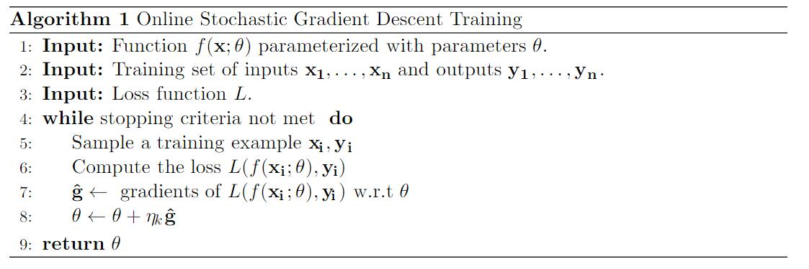

# 六、神经网络的训练

神经网络的训练是通过尝试使用基于梯度的方法，最小化训练集上的损失函数来完成的。 粗略地说，所有训练方法的原理都是重复计算数据集上的误差估计，计算误差的梯度，然后沿梯度方向移动参数。 如何计算误差估计，以及如何定义“在梯度方向上移动”，不同模型是不同的。 我们描述了基本算法，随机梯度下降（SGD），然后提到其他方法，带有用于进一步阅读的链接。 梯度计算是该方法的核心。 梯度可以使用计算图上的反向模式微分来有效自动计算 - 它是一种通用的算法框架，可以自动计算任何网络和损失函数的梯度。

## 6.1 随机梯度训练

训练神经网络的常用方法是使用随机梯度下降（SGD）算法（Bottou，2012; LeCun，Bottou，Orr，和 Muller，1998a）或其变体。SGD 是一种通用优化算法。 它接收参数为`θ`的损失函数`f`，和所需的输入输出。 然后，它尝试设置参数`θ`，使得相对于训练样本的`f`的损失很小。 该算法的工作原理如下：

该算法的目标是设置参数`θ`，来最小化训练集上的总损失$\sigma_{i=1}^n L(f(x_i; \theta), y_i)$。 它的工作原理是重复采样训练样本，并计算误差对于参数`θ`的梯度（第 7 行） - 假设输入和预期输出是固定的，并且损失被视为参数`θ`函数。然后在梯度方向上更新参数`θ`，通过学习速率`η`（第 8 行）来缩放。 对于设置学习率的进一步讨论，请参见第 6.3 节。

请注意，第 6 行中计算的误差基于单个训练示例，因此仅仅是对我们打算使其最小的，语料库范围的损失的粗略估计。 损失计算中的噪声可能导致梯度不准确。 减少这种噪声的常用方法是基于`m`个样本来估计误差和梯度。 这就上升为小批量 SGD 算法：
