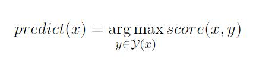
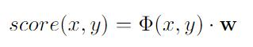
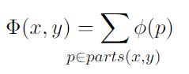
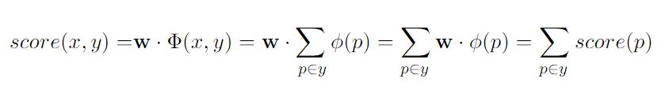
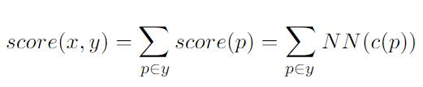
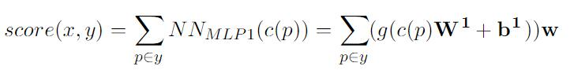
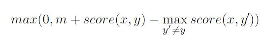
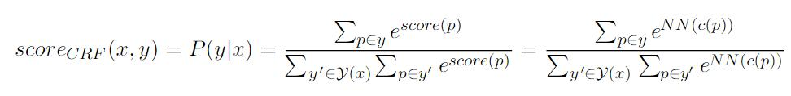
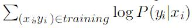
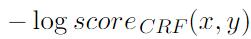

# 八、结构化输出预测

NLP 中的许多问题涉及结构化输出：预期输出不是类标签或类标签上的分布，而是结构化对象（例如序列，树或图）的情况。 典型示例是序列标记（例如，词性标记），序列分割（分块，NER）和句法解析。 在本节中，我们将讨论可用于结构化任务的前馈神经网络模型。 在后面的章节中，我们讨论了用于处理序列（第 10 节）和树（第 12 节）的专用神经网络模型。

## 8.1 贪婪结构化预测

结构化预测的贪婪方法，是将结构预测问题分解为一系列局部预测问题，并训练分类器来执行局部决策。 在测试时，训练好的分类器以贪婪的方式使用。 这种方法的例子是从左到右的标记模型（Gim'enez & M'arquez，2004）和基于转移的贪婪解析（Nivre，2008）。 通过简单地将局部分类器从线性分类器（例如 SVM 或 logistic 回归模型）替换为神经网络，这些方法很容易适用于使用神经网络，如（Chen & Manning，2014; Lewis & Steedman，2014）所示。

贪婪的方法受制于误差传播，早期决策中的误差会影响以后的决策。 使用非线性神经网络分类器可实现整体更高精度，有助于在一定程度上解决此问题。 此外，人们提出了训练技术，通过在更难的预测之前进行更简单的预测（简单优先的方法（Goldberg & Elhadad，2010），或通过将训练程序暴露给产生相似错误的输入（Hal Daum'e III，Langford，& Marcu，2009; Goldberg＆Nivre，2013），使训练条件更相似于测试条件，从而减轻误差传播问题。 这些对于训练神经网络模型也是有效的，正如 Ma 等人（Ma，Zhang，& Zhu，2014）（easy-first-first tagger）和（？）（用于贪婪依赖解析的动态 oracle 训练）所证明的那样。

## 8.2 基于搜索的结构化预测

预测自然语言结构的常用方法是基于搜索。 对于 NLP 中基于搜索的结构预测的深入讨论，请参阅 Smith 的书（Smith，2011）。 这些技术可以很容易地应用于神经网络。 在神经网络文献中，在基于能量的学习框架下讨论了这些模型（LeCunet al.，2006，Section 7）。 这里使用 NLP 社区所熟悉的设置和术语来展示它们。

基于搜索的结构化预测，被公式化为可能的结构的搜索问题：

其中`x`是输入结构，`y`是`x`上的输出（在典型示例中`x`是句子，`y`是句子上的标签分配或解析树），`Y(x)`是`x`上所有合法结构的集合，我们正在寻找输出`y`，它将最大化`x, y`对的得分。

得分函数定义为线性模型：

其中`Φ`是特征提取函数，`w`是权重向量。

为了搜索易处理的最优`y`，结构`y`被分解为部分，并且特征函数根据部分来定义，其中`φ(p)`是局部部分特征提取函数：

每个部分分别打分，结构分数是部分分数的总和：

其中`p∈y`是`p∈part(x, y)`的简写。 将`y`分解成部分是这样的，即存在推理算法，在给定各个部分的得分的情况下，该算法能够有效搜索评分最高的结构。

现在可以用神经网络简单地替换部分上的线性评分函数：

其中`c(p)`将部分`p`映射到一个二维向量。

如果是单隐层前馈网络：

$c(p) \in R^{d_{in}}, W^1 \in R^{d_{in} \times d_1}, b^1 \in R^{d_1}, w \in R^{d_1}$。 结构性预测的一个共同目标是，使最佳结构的得分高于任何其他结构`y'`，产生以下（广义感知器）损失：

在实现方面，这意味着：为每个可能的部分创建计算图`CGp`，并计算其得分。 然后，对得分部分进行推理，找到最佳得分结构`y'`。 将计算图的输出节点（对应于最佳（预测）结构`y(y')`中的部分）连接到求和节点`CGy(CG'y)`。 使用“减法”节点`CGl`连接`CGy`和`CG0`，并计算梯度。

正如（LeCun 等人，2006，第 5 节）所述，广义感知器损失在训练结构化预测神经网络时，可能不是一个很好的损失函数，因为它没有余量，并且基于余量的 Hinge 损失是首选：

修改上面的实现来使用铰链损失是很简单的。

请注意，在这两种情况下，我们都会失去线性模型的优良特性。 特别是，模型不再是凸的。 这是可以预期的，因为即使是最简单的非线性神经网络也已经是非凸的。 尽管如此，我们仍然可以使用标准的神经网络优化技术来训练结构化模型。

训练和推理较慢，因为我们必须评估神经网络（和梯度）`|parts(x, y)|`倍。

结构化预测是一个巨大的领域，超出了本教程的范围，但是，例如（Smith，2011）中描述的损失函数，正则化器和方法，例如成本增加的解码，可以很容易地应用或适配神经网络框架。

概率目标（CRF）。在概率框架（CRF）中，我们将每个部分得分视为一个集团势能（clique potential）（参见（Smith，2011）并定义每个结构`y`的得分：

评分函数定义条件分布`P(y | x)`，并且我们希望设置网络的参数，使得语料库的条件对数似然  最大化。

然后，给定训练示例`(x, y)`的损失是：。 计算损失的梯度就像构建相关的计算图一样。 棘手的部分是分母（分区函数），它需要对`Y`中潜在的指数级的多个结构进行求和。但是，对于某些问题，存在动态编程算法，以便在多项式时间内有效求和。 当存在这样的算法时，它还可以适用于创建多项式级别的计算图。

当用于计算分区函数的足够高效的算法不可用时，可以使用近似方法。 例如，可以使用波束搜索（beam search）来进行推断，对于保留在波束中的结构而不是指数级的较大`Y(x)`的分区函数和。

Pei 等人（2015）使用基于 Hinge 的方法进行 arc-factored 依赖性分析，以及 Durrett 和 Klein（Durrett & Klein，2015）的用于 CRF 分区分析器的概率方法。 Zhou 等人（2015）在基于转换的解析器中有效地使用了基于波束的近似分区函数。
