# BAT 机器学习 1000 题 201-300

> 来源：[201-300](https://mp.weixin.qq.com/s?__biz=MzI4MTQ2NjU5NA==&mid=2247486195&idx=2&sn=435a55eaf7e6ba818beb0c1d11ade948&chksm=eba9897edcde00686f374e299590ea68d745c7cefca181a86075e39f1dcea2c1206be4dee91e&scene=21#wechat_redirect)

## 201、下列属于无监督学习的是： 

A.k-means

B.SVM

C.最大熵

D.CRF

正确答案：A

解析： A是聚类，BC是分类，D是序列化标注，也是有监督学习。

## 202、下列哪个不属于CRF模型对于HMM和MEMM模型的优势（ ） 

A.特征灵活

B.速度快

C.可容纳较多上下文信息

D.全局最优

正确答案：B

解析： CRF 的优点：特征灵活，可以容纳较多的上下文信息，能够做到全局最优CRF 的缺点：速度慢

CRF没有HMM那样严格的独立性假设条件，因而可以容纳任意的上下文信息。特征设计灵活（与ME一样） ————与HMM比较

同时，由于CRF计算全局最优输出节点的条件概率，它还克服了最大熵马尔可夫模型标记偏置（Label-bias）的缺点。 ­­————与MEMM比较

CRF是在给定需要标记的观察序列的条件下，使用维特比算法，计算整个标记序列的联合概率分布，而不是在给定当前状态条件下，定义下一个状态的状态分布。————与ME比较

## 203、数据清理中，处理缺失值的方法是? 

A.估算

B.整例删除

C.变量删除

D.成对删除

正确答案：ABCD

@刘炫320，本题题目及解析来源：http://blog.csdn.net/column/details/16442.html

由于调查、编码和录入误差，数据中可能存在一些无效值和缺失值，需要给予适当的处理。常用的处理方法有：估算，整例删除，变量删除和成对删除。

估算(estimation)。最简单的办法就是用某个变量的样本均值、中位数或众数代替无效值和缺失值。这种办法简单，但没有充分考虑数据中已有的信息，误差可能较大。另一种办法就是根据调查对象对其他问题的答案，通过变量之间的相关分析或逻辑推论进行估计。例如，某一产品的拥有情况可能与家庭收入有关，可以根据调查对象的家庭收入推算拥有这一产品的可能性。

整例删除(casewise deletion)是剔除含有缺失值的样本。由于很多问卷都可能存在缺失值，这种做法的结果可能导致有效样本量大大减少，无法充分利用已经收集到的数据。因此，只适合关键变量缺失，或者含有无效值或缺失值的样本比重很小的情况。

变量删除(variable deletion)。如果某一变量的无效值和缺失值很多，而且该变量对于所研究的问题不是特别重要，则可以考虑将该变量删除。这种做法减少了供分析用的变量数目，但没有改变样本量。

成对删除(pairwise deletion)是用一个特殊码(通常是9、99、999等)代表无效值和缺失值，同时保留数据集中的全部变量和样本。但是，在具体计算时只采用有完整答案的样本，因而不同的分析因涉及的变量不同，其有效样本量也会有所不同。这是一种保守的处理方法，最大限度地保留了数据集中的可用信息。

采用不同的处理方法可能对分析结果产生影响，尤其是当缺失值的出现并非随机且变量之间明显相关时。因此，在调查中应当尽量避免出现无效值和缺失值，保证数据的完整性。

## 204、关于线性回归的描述,以下正确的有: 

A.基本假设包括随机干扰项是均值为0,方差为1的标准正态分布

B.基本假设包括随机干扰下是均值为0的同方差正态分布

C.在违背基本假设时,普通最小二乘法估计量不再是最佳线性无偏估计量

D.在违背基本假设时,模型不再可以估计

E.可以用DW检验残差是否存在序列相关性

F.多重共线性会使得参数估计值方差减小 

正确答案：ACEF

@刘炫320，本题题目及解析来源：http://blog.csdn.net/column/details/16442.html

1、AB一元线性回归的基本假设有：

（1）随机误差项是一个期望值或平均值为0的随机变量； 

（2）对于解释变量的所有观测值，随机误差项有相同的方差； 

（3）随机误差项彼此不相关； 

（4）解释变量是确定性变量，不是随机变量，与随机误差项彼此之间相互独立； 

（5）解释变量之间不存在精确的（完全的）线性关系，即解释变量的样本观测值矩阵是满秩矩阵； 

（6）随机误差项服从正态分布

2、CD 违背基本假设的计量经济学模型还是可以估计的，只是不能使用普通最小二乘法进行估计。

当存在异方差时，普通最小二乘法估计存在以下问题： 参数估计值虽然是无偏的，但不是最小方差线性无偏估计。

3、E杜宾-瓦特森（DW）检验，计量经济，统计分析中常用的一种检验序列一阶 自相关 最常用的方法。

4、F所谓多重共线性（Multicollinearity）是指线性回归模型中的解释变量之间由于存在精确相关关系或高度相关关系而使模型估计失真或难以估计准确。影响 

（1）完全共线性下参数估计量不存在 

（2）近似共线性下OLS估计量非有效 

多重共线性使参数估计值的方差增大，1/(1-r2)为方差膨胀因子(Variance Inflation Factor, VIF) 

（3）参数估计量经济含义不合理 

（4）变量的显著性检验失去意义，可能将重要的解释变量排除在模型之外 

（5）模型的预测功能失效。变大的方差容易使区间预测的“区间”变大，使预测失去意义。

对于线性回归模型,当响应变量服从正态分布,误差项满足高斯–马尔科夫条件（零均值、等方差、不相关）时,回归参数的最小二乘估计是一致最小方差无偏估计。

当然，该条件只是理想化的假定，为的是数学上有相应的较为成熟的结论。其实大多数实际问题都不完全满足这些理想化的假定。

线性回归模型理论的发展正是在不断克服理想化条件不被满足时得到许多新方法。如加权LSE、岭估计、压缩估计、BOX\_COX变换等一系列段。做实际工作时一定是要超越书本上的理想化条件的。

## 205、影响聚类算法效果的主要原因有：

A.特征选取

B.模式相似性测度

C.分类准则

D.已知类别的样本质量

正确答案：ABC

@刘炫320，本题题目及解析来源：http://blog.csdn.net/column/details/16442.html

解析：这道题应该是很简单的，D之所以不正确，是因为聚类是对无类别的数据进行聚类，不使用已经标记好的数据。

前面的ABC选项，可以参考：《聚类分析》与《各类算法的比较》。

## 206、以下哪个是常见的时间序列算法模型

A.RSI

B.MACD

C.ARMA

D.KDJ

正确答案：C

解析： 自回归滑动平均模型(ARMA) ，其建模思想可概括为：逐渐增加模型的阶数，拟合较高阶模型，直到再增加模型的阶数而剩余残差方差不再显著减小为止。

其他三项都不是一个层次的。 

A.相对强弱指数 (RSI, Relative Strength Index) 是通过比较一段时期内的平均收盘涨数和平均收盘跌数来分析市场买沽盘的意向和实力 , 从而作出未来市场的走势 .

B.移动平均聚散指标 (MACD, Moving Average Convergence Divergence), 是根据均线的构造原理 , 对股票价格的收盘价进行平滑处理 , 求出算术平均值以后再进行计算 , 是一种趋向类指标 .

D. 随机指标 (KDJ) 一般是根据统计学的原理 , 通过一个特定的周期 ( 常为 9 日 ,9 周等 ) 内出现过的最高价 , 最低价及最后一个计算周期的收盘价及这三者之间的比例关系 , 来计算最后一个计算周期的未成熟随机值 RSV, 然后根据平滑移动平均线的方法来计算 K 值 , D 值与 J 值 , 并绘成曲线图来研判股票走势 .

## 207、下列不是SVM核函数的是：

A.多项式核函数

B.logistic核函数

C.径向基核函数

D.Sigmoid核函数

正确答案：B

@刘炫320，本题题目及解析来源：http://blog.csdn.net/column/details/16442.html 

SVM核函数包括线性核函数、多项式核函数、径向基核函数、高斯核函数、幂指数核函数、拉普拉斯核函数、ANOVA核函数、二次有理核函数、多元二次核函数、逆多元二次核函数以及Sigmoid核函数.

核函数的定义并不困难，根据泛函的有关理论，只要一种函数 K ( x i , x j ) 满足Mercer条件，它就对应某一变换空间的内积．对于判断哪些函数是核函数到目前为止也取得了重要的突破，得到Mercer定理和以下常用的核函数类型：

(1)线性核函数 ：K ( x , x i ) = x ⋅ x i

(2)多项式核 ：K ( x , x i ) = ( ( x ⋅ x i ) + 1 ) d

(3)径向基核（RBF）：K ( x , x i ) = exp ( − ∥ x − x i ∥ 2 σ 2 ) 

Gauss径向基函数则是局部性强的核函数，其外推能力随着参数 σ 的增大而减弱。多项式形式的核函数具有良好的全局性质。局部性较差。

(4)傅里叶核 ：K ( x , x i ) = 1 − q 2 2 ( 1 − 2 q cos ( x − x i ) + q 2 )

(5)样条核 ：K ( x , x i ) = B 2 n + 1 ( x − x i )

(6)Sigmoid核函数 ：K ( x , x i ) = tanh ( κ ( x , x i ) − δ )

采用Sigmoid函数作为核函数时，支持向量机实现的就是一种多层感知器神经网络，应用SVM方法，隐含层节点数目(它确定神经网络的结构)、隐含层节点对输入节点的权值都是在设计(训练)的过程中自动确定的。而且支持向量机的理论基础决定了它最终求得的是全局最优值而不是局部最小值，也保证了它对于未知样本的良好泛化能力而不会出现过学习现象。

在选取核函数解决实际问题时，通常采用的方法有：

一是利用专家的先验知识预先选定核函数；

二是采用Cross-Validation方法，即在进行核函数选取时，分别试用不同的核函数，归纳误差最小的核函数就是最好的核函数．如针对傅立叶核、RBF核，结合信号处理问题中的函数回归问题，通过仿真实验，对比分析了在相同数据条件下，采用傅立叶核的SVM要比采用RBF核的SVM误差小很多．

三是采用由Smits等人提出的混合核函数方法，该方法较之前两者是目前选取核函数的主流方法，也是关于如何构造核函数的又一开创性的工作．将不同的核函数结合起来后会有更好的特性，这是混合核函数方法的基本思想．

## 208、已知一组数据的协方差矩阵P,下面关于主分量说法错误的是()

A.主分量分析的最佳准则是对一组数据进行按一组正交基分解, 在只取相同数量分量的条件下,以均方误差计算截尾误差最小

B.在经主分量分解后,协方差矩阵成为对角矩阵

C.主分量分析就是K-L变换

D.主分量是通过求协方差矩阵的特征值得到

正确答案：C

解析：K-L变换与PCA变换是不同的概念，PCA的变换矩阵是协方差矩阵，K-L变换的变换矩阵可以有很多种（二阶矩阵、协方差矩阵、总类内离散度矩阵等等）。当K-L变换矩阵为协方差矩阵时，等同于PCA。

## 209、在分类问题中,我们经常会遇到正负样本数据量不等的情况,比如正样本为10w条数据,负样本只有1w条数据,以下最合适的处理方法是()

A.将负样本重复10次,生成10w样本量,打乱顺序参与分类

B.直接进行分类,可以最大限度利用数据

C.从10w正样本中随机抽取1w参与分类

D.将负样本每个权重设置为10,正样本权重为1,参与训练过程

正确答案:ACD

解析：1. 重采样。 A可视作重采样的变形。改变数据分布消除不平衡，可能导致过拟合。 

2\. 欠采样。 C的方案 提高少数类的分类性能，可能丢失多数类的重要信息。 

如果1：10算是均匀的话，可以将多数类分割成为1000份。然后将每一份跟少数类的样本组合进行训练得到分类器。而后将这1000个分类器用assemble的方法组合位一个分类器。A选项可以看作此方式，因而相对比较合理。 

另：如果目标是 预测的分布 跟训练的分布一致，那就加大对分布不一致的惩罚系数。 

3\. 权值调整。 D方案也是其中一种方式。

当然，这只是在数据集上进行相应的处理，在算法上也有相应的处理方法。

## 210、在统计模式识分类问题中，当先验概率未知时，可以使用()?

A.最小损失准则

B.N-P判决

C.最小最大损失准则

D.最小误判概率准则

正确答案:BC

@刘炫320，本题题目及解析来源：http://blog.csdn.net/column/details/16442.html

选项 A ,最小损失准则中需要用到先验概率

选项B ,在贝叶斯决策中，对于先验概率p(y)，分为已知和未知两种情况。 

1\. p(y)已知，直接使用贝叶斯公式求后验概率即可； 

2\. p(y)未知，可以使用聂曼-皮尔逊决策(N-P决策)来计算决策面。 

聂曼-皮尔逊决策（N-P判决）可以归结为找阈值a，即： 

如果p（x|w1）/p（x|w2）>a，则 x属于w1； 

如果p（x|w1）/p（x|w2）<a，则 x属于w 2；

选项C ,最大最小损失规则主要就是使用解决最小损失规则时先验概率未知或难以计算的问题的。

## 211、解决隐马模型中预测问题的算法是?

A.前向算法

B.后向算法

C.Baum-Welch算法

D.维特比算法

正确答案：D

@刘炫320，本题题目及解析来源：http://blog.csdn.net/column/details/16442.html

A、B：前向、后向算法解决的是一个评估问题，即给定一个模型，求某特定观测序列的概率，用于评估该序列最匹配的模型。

C：Baum-Welch算法解决的是一个模型训练问题，即参数估计，是一种无监督的训练方法，主要通过EM迭代实现；

D：维特比算法解决的是给定 一个模型和某个特定的输出序列，求最可能产生这个输出的状态序列。如通过海藻变化（输出序列）来观测天气（状态序列），是预测问题，通信中的解码问题。

## 212、一般，k-NN最近邻方法在( )的情况下效果较好

A.样本较多但典型性不好

B.样本较少但典型性好

C.样本呈团状分布

D.样本呈链状分布

正确答案：B

解析：K近邻算法主要依靠的是周围的点，因此如果样本过多，那肯定是区分不出来的。因此应当选择B

样本呈团状颇有迷惑性，这里应该指的是整个样本都是呈团状分布，这样kNN就发挥不出其求近邻的优势了，整体样本应该具有典型性好，样本较少，比较适宜。

## 213、下列方法中，可以用于特征降维的方法包括（）

A.主成分分析PCA

B.线性判别分析LDA

C.深度学习SparseAutoEncoder

D.矩阵奇异值分解SVD

E.最小二乘法LeastSquares

正确答案：ABCD

解析：降维的3种常见方法ABD，都是线性的。深度学习是降维的方法这个就比较新鲜了，事实上，细细想来，也是降维的一种方法，因为如果隐藏层中的神经元数目要小于输入层，那就达到了降维，但如果隐藏层中的神经元如果多余输入层，那就不是降维了。

最小二乘法是线性回归的一种解决方法，其实也是投影，但是并没有进行降维。

## 214、下面哪些是基于核的机器学习算法?()

A.Expectation Maximization（EM）（最大期望算法）

B.Radial Basis Function（RBF）（径向基核函数）

C.Linear Discrimimate Analysis（LDA）（主成分分析法）

D.Support Vector Machine（SVM）（支持向量机）

正确答案：BCD

解析：径向基核函数是非常常用的核函数，而主成分分析法的常规方法是线性的，但是当遇到非线性的时候，同样可以使用核方法使得非线性问题转化为线性问题。支持向量机处理非线性的问题的时候，核函数也是非常重要的。

## 215.试推导样本空间中任意点x到超平面（w,b）的距离公式。

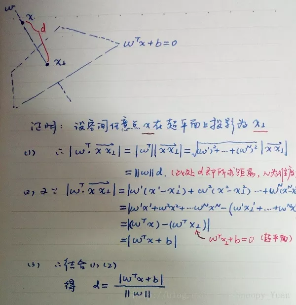

## 216、从网上下载或自己编程实现一个卷积神经网络，并在手写字符识别数据MNIST上进行试验测试。

解析详见：http://blog.csdn.net/snoopy\_yuan/article/details/71703019

## 217、神经网络中激活函数的真正意义？一个激活函数需要具有哪些必要的属性？还有哪些属是好的属性但不必要的？

@Hengkai Guo，本题解析来源：https://www.zhihu.com/question/67366051

说说我对一个好的激活函数的理解吧，有些地方可能不太严谨，欢迎讨论。（部分参考了Activation function。）

1\. 非线性：即导数不是常数。这个条件前面很多答主都提到了，是多层神经网络的基础，保证多层网络不退化成单层线性网络。这也是激活函数的意义所在。

2\. 几乎处处可微：可微性保证了在优化中梯度的可计算性。传统的激活函数如sigmoid等满足处处可微。对于分段线性函数比如ReLU，只满足几乎处处可微（即仅在有限个点处不可微）。对于SGD算法来说，由于几乎不可能收敛到梯度接近零的位置，有限的不可微点对于优化结果不会有很大影响\[1\]。

3\. 计算简单：正如题主所说，非线性函数有很多。极端的说，一个多层神经网络也可以作为一个非线性函数，类似于Network In Network\[2\]中把它当做卷积操作的做法。但激活函数在神经网络前向的计算次数与神经元的个数成正比，因此简单的非线性函数自然更适合用作激活函数。这也是ReLU之流比其它使用Exp等操作的激活函数更受欢迎的其中一个原因。

4\. 非饱和性（saturation）：饱和指的是在某些区间梯度接近于零（即梯度消失），使得参数无法继续更新的问题。最经典的例子是Sigmoid，它的导数在x为比较大的正值和比较小的负值时都会接近于0。更极端的例子是阶跃函数，由于它在几乎所有位置的梯度都为0，因此处处饱和，无法作为激活函数。ReLU在x>0时导数恒为1，因此对于再大的正值也不会饱和。但同时对于x<0，其梯度恒为0，这时候它也会出现饱和的现象（在这种情况下通常称为dying ReLU）。Leaky ReLU\[3\]和PReLU\[4\]的提出正是为了解决这一问题。

5\. 单调性（monotonic）：即导数符号不变。这个性质大部分激活函数都有，除了诸如sin、cos等。个人理解，单调性使得在激活函数处的梯度方向不会经常改变，从而让训练更容易收敛。

6\. 输出范围有限：有限的输出范围使得网络对于一些比较大的输入也会比较稳定，这也是为什么早期的激活函数都以此类函数为主，如Sigmoid、TanH。但这导致了前面提到的梯度消失问题，而且强行让每一层的输出限制到固定范围会限制其表达能力。因此现在这类函数仅用于某些需要特定输出范围的场合，比如概率输出（此时loss函数中的log操作能够抵消其梯度消失的影响\[1\]）、LSTM里的gate函数。

7\. 接近恒等变换（identity）：即约等于x。这样的好处是使得输出的幅值不会随着深度的增加而发生显著的增加，从而使网络更为稳定，同时梯度也能够更容易地回传。这个与非线性是有点矛盾的，因此激活函数基本只是部分满足这个条件，比如TanH只在原点附近有线性区（在原点为0且在原点的导数为1），而ReLU只在x>0时为线性。这个性质也让初始化参数范围的推导更为简单\[5\]\[4\]。额外提一句，这种恒等变换的性质也被其他一些网络结构设计所借鉴，比如CNN中的ResNet\[6\]和RNN中的LSTM。

8\. 参数少：大部分激活函数都是没有参数的。像PReLU带单个参数会略微增加网络的大小。还有一个例外是Maxout\[7\]，尽管本身没有参数，但在同样输出通道数下k路Maxout需要的输入通道数是其它函数的k倍，这意味着神经元数目也需要变为k倍；但如果不考虑维持输出通道数的情况下，该激活函数又能将参数个数减少为原来的k倍。

9\. 归一化（normalization）：这个是最近才出来的概念，对应的激活函数是SELU\[8\]，主要思想是使样本分布自动归一化到零均值、单位方差的分布，从而稳定训练。在这之前，这种归一化的思想也被用于网络结构的设计，比如Batch Normalization\[9\]。

参考文献：

\[1\] Goodfellow I, Bengio Y, Courville A. Deep learning\[M\]. MIT press, 2016.

\[2\] Lin M, Chen Q, Yan S. Network in network\[J\]. arXiv preprint arXiv:1312.4400, 2013.

\[3\] Maas A L, Hannun A Y, Ng A Y. Rectifier nonlinearities improve neural network acoustic models\[C\]//Proc. ICML. 2013, 30(1).

\[4\] He K, Zhang X, Ren S, et al. Delving 

deep into rectifiers: Surpassing human-level performance on imagenet 

classification\[C\]//Proceedings of the IEEE international conference on 

computer vision. 2015: 1026-1034.

\[5\] Glorot X, Bengio Y. Understanding the 

difficulty of training deep feedforward neural networks\[C\]//Proceedings 

of the Thirteenth International Conference on Artificial Intelligence 

and Statistics. 2010: 249-256.

\[6\] He K, Zhang X, Ren S, et al. Deep 

residual learning for image recognition\[C\]//Proceedings of the IEEE 

conference on computer vision and pattern recognition. 2016: 770-778.

\[7\] Goodfellow I J, Warde-Farley D, Mirza M, et al. Maxout networks\[J\]. arXiv preprint arXiv:1302.4389, 2013.

\[8\] Klambauer G, Unterthiner T, Mayr A, et al. Self-Normalizing Neural Networks\[J\]. arXiv preprint arXiv:1706.02515, 2017.

\[9\] Ioffe S, Szegedy C. Batch 

normalization: Accelerating deep network training by reducing internal 

covariate shift\[C\]//International Conference on Machine Learning. 2015: 

448-456.

## 218、梯度下降法的神经网络容易收敛到局部最优，为什么应用广泛？

@李振华，https://www.zhihu.com/question/68109802/answer/262143638

深度神经网络“容易收敛到局部最优”，很可能是一种想象，实际情况是，我们可能从来没有找到过“局部最优”，更别说全局最优了。

很多人都有一种看法，就是“局部最优是神经网络优化的主要难点”。这来源于一维优化问题的直观想象。在单变量的情形下，优化问题最直观的困难就是有很多局部极值，如

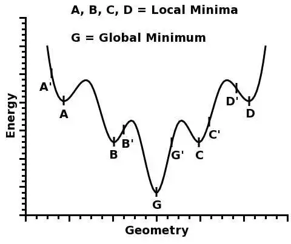

人们直观的想象，高维的时候这样的局部极值会更多，指数级的增加，于是优化到全局最优就更难了。然而单变量到多变量一个重要差异是，单变量的时候，Hessian矩阵只有一个特征值，于是无论这个特征值的符号正负，一个临界点都是局部极值。但是在多变量的时候，Hessian有多个不同的特征值，这时候各个特征值就可能会有更复杂的分布，如有正有负的不定型和有多个退化特征值（零特征值）的半定型

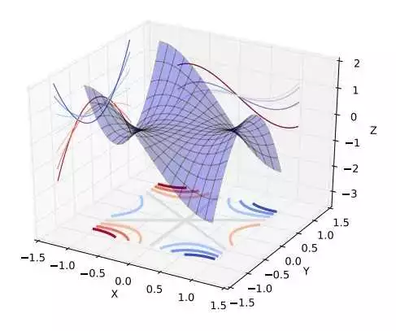

在后两种情况下，是很难找到局部极值的，更别说全局最优了。

现在看来，神经网络的训练的困难主要是鞍点的问题。在实际中，我们很可能也从来没有真的遇到过局部极值。Bengio组这篇文章Eigenvalues of the Hessian in Deep Learning（https://arxiv.org/abs/1611.07476）里面的实验研究给出以下的结论：

> • Training stops at a point that has a small gradient. The norm of the gradient is not zero, therefore it does not, technically speaking, converge to a critical point.

> • There are still negative eigenvalues even when they are small in magnitude.

另一方面，一个好消息是，即使有局部极值，具有较差的loss的局部极值的吸引域也是很小的Towards Understanding Generalization of Deep Learning: Perspective of Loss Landscapes。（https://arxiv.org/abs/1706.10239）

> For the landscape of loss function for deep networks, the volume of basin of attraction of good minima dominates over that of poor minima, which guarantees optimization methods with random initialization to converge to good minima.

所以，很可能我们实际上是在“什么也没找到”的情况下就停止了训练，然后拿到测试集上试试，“咦，效果还不错”。

补充说明，这些都是实验研究结果。理论方面，各种假设下，深度神经网络的Landscape 的鞍点数目指数增加，而具有较差loss的局部极值非常少。

## 219、EM算法、HMM、CRF

这三个放在一起不是很恰当，但是有互相有关联，所以就放在这里一起说了。注意重点关注算法的思想。 

（1）EM算法 

EM算法是用于含有隐变量模型的极大似然估计或者极大后验估计，有两步组成：E步，求期望（expectation）；M步，求极大（maxmization）。本质上EM算法还是一个迭代算法，通过不断用上一代参数对隐变量的估计来对当前变量进行计算，直到收敛。 

注意：EM算法是对初值敏感的，而且EM是不断求解下界的极大化逼近求解对数似然函数的极大化的算法，也就是说EM算法不能保证找到全局最优值。对于EM的导出方法也应该掌握。 

（2）HMM算法 

隐马尔可夫模型是用于标注问题的生成模型。有几个参数（π，A，B）：初始状态概率向量π，状态转移矩阵A，观测概率矩阵B。称为马尔科夫模型的三要素。 

马尔科夫三个基本问题：

*   概率计算问题：给定模型和观测序列，计算模型下观测序列输出的概率。–》前向后向算法

*   学习问题：已知观测序列，估计模型参数，即用极大似然估计来估计参数。–》Baum-Welch(也就是EM算法)和极大似然估计。

*   预测问题：已知模型和观测序列，求解对应的状态序列。–》近似算法（贪心算法）和维比特算法（动态规划求最优路径）

（3）条件随机场CRF 

给定一组输入随机变量的条件下另一组输出随机变量的条件概率分布密度。条件随机场假设输出变量构成马尔科夫随机场，而我们平时看到的大多是线性链条随机场，也就是由输入对输出进行预测的判别模型。求解方法为极大似然估计或正则化的极大似然估计。 

之所以总把HMM和CRF进行比较，主要是因为CRF和HMM都利用了图的知识，但是CRF利用的是马尔科夫随机场（无向图），而HMM的基础是贝叶斯网络（有向图）。而且CRF也有：概率计算问题、学习问题和预测问题。大致计算方法和HMM类似，只不过不需要EM算法进行学习问题。

（4）HMM和CRF对比 

其根本还是在于基本的理念不同，一个是生成模型，一个是判别模型，这也就导致了求解方式的不同。 

## 220、CNN常用的几个模型

LeNet5

没啥特点-不过是第一个CNN应该要知道

AlexNet

引入了ReLU和dropout，引入数据增强、池化相互之间有覆盖，三个卷积一个最大池化+三个全连接层

VGGNet

采用1*1和3*3的卷积核以及2*2的最大池化使得层数变得更深。常用VGGNet-16和VGGNet19

Google Inception Net

这个在控制了计算量和参数量的同时，获得了比较好的分类性能，和上面相比有几个大的改进：

1、去除了最后的全连接层，而是用一个全局的平均池化来取代它；

2、引入Inception Module，这是一个4个分支结合的结构。所有的分支都用到了1*1的卷积，这是因为1*1性价比很高，可以用很少的参数达到非线性和特征变换。

3、Inception V2第二版将所有的5*5变成2个3*3，而且提出来著名的Batch Normalization；

4、Inception V3第三版就更变态了，把较大的二维卷积拆成了两个较小的一维卷积，加速运算、减少过拟合，同时还更改了Inception Module的结构。

微软ResNet残差神经网络(Residual Neural Network)

1、引入高速公路结构，可以让神经网络变得非常深

2、ResNet第二个版本将ReLU激活函数变成y=x的线性函数

## 221、带核的SVM为什么能分类非线性问题？ 

核函数的本质是两个函数的內积，而这个函数在SVM中可以表示成对于输入值的高维映射。注意核并不是直接对应映射，核只不过是一个內积 

## 222、常用核函数及核函数的条件： 

核函数选择的时候应该从线性核开始，而且在特征很多的情况下没有必要选择高斯核，应该从简单到难的选择模型。我们通常说的核函数指的是正定和函数，其充要条件是对于任意的x属于X，要求K对应的Gram矩阵要是半正定矩阵。

*   RBF核径向基，这类函数取值依赖于特定点间的距离，所以拉普拉斯核其实也是径向基核。

*   线性核：主要用于线性可分的情况

*   多项式核

## 223、Boosting和Bagging

（1）随机森林 

随机森林改变了决策树容易过拟合的问题，这主要是由两个操作所优化的：

1）Boostrap从袋内有放回的抽取样本值

2）每次随机抽取一定数量的特征（通常为sqr(n)）。 

分类问题：采用Bagging投票的方式选择类别频次最高的 

回归问题：直接取每颗树结果的平均值。

常见参数

+   1、树最大深度
+   2、树的个数 
+   3、节点上的最小样本数
+   4、特征数(sqr(n))

误差分析

+   oob(out-of-bag)
+   将各个树的未采样样本作为预测样本统计误差作为误分率

优点

+   可以并行计算
+   不需要特征选择
+   可以总结出特征重要性
+   可以处理缺失数据
+   不需要额外设计测试集

缺点

在回归上不能输出连续结果

（2）Boosting之AdaBoost 

Boosting的本质实际上是一个加法模型，通过改变训练样本权重学习多个分类器并进行一些线性组合。而Adaboost就是加法模型+指数损失函数+前项分布算法。Adaboost就是从弱分类器出发反复训练，在其中不断调整数据权重或者是概率分布，同时提高前一轮被弱分类器误分的样本的权值。最后用分类器进行投票表决（但是分类器的重要性不同）。 

（3）Boosting之GBDT 

将基分类器变成二叉树，回归用二叉回归树，分类用二叉分类树。和上面的Adaboost相比，回归树的损失函数为平方损失，同样可以用指数损失函数定义分类问题。但是对于一般损失函数怎么计算呢？GBDT（梯度提升决策树）是为了解决一般损失函数的优化问题，方法是用损失函数的负梯度在当前模型的值来模拟回归问题中残差的近似值。 

注：由于GBDT很容易出现过拟合的问题，所以推荐的GBDT深度不要超过6，而随机森林可以在15以上。 

（4）Xgboost 

这个工具主要有以下几个特点：

*   支持线性分类器

*   可以自定义损失函数，并且可以用二阶偏导

*   加入了正则化项：叶节点数、每个叶节点输出score的L2-norm

*   支持特征抽样

*   在一定情况下支持并行，只有在建树的阶段才会用到，每个节点可以并行的寻找分裂特征。

## 224、逻辑回归相关问题

（1）公式推导一定要会

（2）逻辑回归的基本概念 

这个最好从广义线性模型的角度分析，逻辑回归是假设y服从Bernoulli分布。

（3）L1-norm和L2-norm 

其实稀疏的根本还是在于L0-norm也就是直接统计参数不为0的个数作为规则项，但实际上却不好执行于是引入了L1-norm；而L1norm本质上是假设参数先验是服从Laplace分布的，而L2-norm是假设参数先验为Gaussian分布，我们在网上看到的通常用图像来解答这个问题的原理就在这。 

但是L1-norm的求解比较困难，可以用坐标轴下降法或是最小角回归法求解。

（4）LR和SVM对比 

首先，LR和SVM最大的区别在于损失函数的选择，LR的损失函数为Log损失（或者说是逻辑损失都可以）、而SVM的损失函数为hinge loss。 

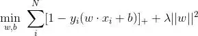 

其次，两者都是线性模型。 

最后，SVM只考虑支持向量（也就是和分类相关的少数点） 

（5）LR和随机森林区别 

随机森林等树算法都是非线性的，而LR是线性的。LR更侧重全局优化，而树模型主要是局部的优化。 

（6）常用的优化方法 

逻辑回归本身是可以用公式求解的，但是因为需要求逆的复杂度太高，所以才引入了梯度下降算法。 

一阶方法：梯度下降、随机梯度下降、mini 随机梯度下降降法。随机梯度下降不但速度上比原始梯度下降要快，局部最优化问题时可以一定程度上抑制局部最优解的发生。 

二阶方法：牛顿法、拟牛顿法： 

这里详细说一下牛顿法的基本原理和牛顿法的应用方式。牛顿法其实就是通过切线与x轴的交点不断更新切线的位置，直到达到曲线与x轴的交点得到方程解。在实际应用中我们因为常常要求解凸优化问题，也就是要求解函数一阶导数为0的位置，而牛顿法恰好可以给这种问题提供解决方法。实际应用中牛顿法首先选择一个点作为起始点，并进行一次二阶泰勒展开得到导数为0的点进行一个更新，直到达到要求，这时牛顿法也就成了二阶求解问题，比一阶方法更快。我们常常看到的x通常为一个多维向量，这也就引出了Hessian矩阵的概念（就是x的二阶导数矩阵）。缺点：牛顿法是定长迭代，没有步长因子，所以不能保证函数值稳定的下降，严重时甚至会失败。还有就是牛顿法要求函数一定是二阶可导的。而且计算Hessian矩阵的逆复杂度很大。 

拟牛顿法： 不用二阶偏导而是构造出Hessian矩阵的近似正定对称矩阵的方法称为拟牛顿法。拟牛顿法的思路就是用一个特别的表达形式来模拟Hessian矩阵或者是他的逆使得表达式满足拟牛顿条件。主要有DFP法（逼近Hession的逆）、BFGS（直接逼近Hession矩阵）、 L-BFGS（可以减少BFGS所需的存储空间）。

## 225、用贝叶斯机率说明Dropout的原理

--------------------------

@许韩，来源：https://zhuanlan.zhihu.com/p/25005808

参见论文：Dropout as a Bayesian Approximation: Insights and Applications

（http://mlg.eng.cam.ac.uk/yarin/PDFs/Dropout\_as\_a\_Bayesian\_approximation.pdf）

## 226、为什么很多做人脸的Paper会最后加入一个Local Connected Conv？

@许韩，来源：https://zhuanlan.zhihu.com/p/25005808

以FaceBook DeepFace 为例：

****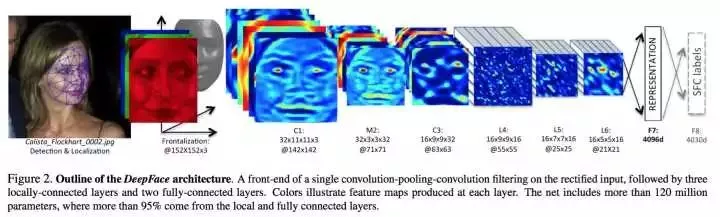****

DeepFace 先进行了两次全卷积＋一次池化，提取了低层次的边缘／纹理等特征。后接了3个Local-Conv层，这里是用Local-Conv的原因是，人脸在不同的区域存在不同的特征（眼睛／鼻子／嘴的分布位置相对固定），当不存在全局的局部特征分布时，Local-Conv更适合特征的提取。

## 227、什么事共线性, 跟过拟合有什么关联?

--------------------------

@抽象猴，来源：https://www.zhihu.com/question/41233373/answer/145404190

共线性：多变量线性回归中，变量之间由于存在高度相关关系而使回归估计不准确。

---------------------------------------

共线性会造成冗余，导致过拟合。

-----------------

解决方法：排除变量的相关性／加入权重正则。

-----------------------

## 228、为什么网络够深(Neurons 足够多)的时候，总是可以避开较差Local Optima？

参见：The Loss Surfaces of Multilayer Networks（https://arxiv.org/pdf/1412.0233.pdf）

## 229、机器学习中的正负样本

在分类问题中，这个问题相对好理解一点，比如人脸识别中的例子，正样本很好理解，就是人脸的图片，负样本的选取就与问题场景相关，具体而言，如果你要进行教室中学生的人脸识别，那么负样本就是教室的窗子、墙等等，也就是说，不能是与你要研究的问题毫不相关的乱七八糟的场景图片，这样的负样本并没有意义。负样本可以根据背景生成，有时候不需要寻找额外的负样本。一般3000-10000的正样本需要5，000,000-100,000,000的负样本来学习，在互金领域一般在入模前将正负比例通过采样的方法调整到3:1-5:1。

## 230、机器学习中，有哪些特征选择的工程方法？

数据和特征决定了机器学习的上限，而模型和算法只是逼近这个上限而已

1. 计算每一个特征与响应变量的相关性：工程上常用的手段有计算皮尔逊系数和互信息系数，皮尔逊系数只能衡量线性相关性而互信息系数能够很好地度量各种相关性，但是计算相对复杂一些，好在很多toolkit里边都包含了这个工具（如sklearn的MINE），得到相关性之后就可以排序选择特征了；

2. 构建单个特征的模型，通过模型的准确性为特征排序，借此来选择特征；

3.通过L1正则项来选择特征：L1正则方法具有稀疏解的特性，因此天然具备特征选择的特性，但是要注意，L1没有选到的特征不代表不重要，原因是两个具有高相关性的特征可能只保留了一个，如果要确定哪个特征重要应再通过L2正则方法交叉检验\*；

4. 训练能够对特征打分的预选模型：RandomForest和Logistic Regression等都能对模型的特征打分，通过打分获得相关性后再训练最终模型；

5.通过特征组合后再来选择特征：如对用户id和用户特征最组合来获得较大的特征集再来选择特征，这种做法在推荐系统和广告系统中比较常见，这也是所谓亿级甚至十亿级特征的主要来源，原因是用户数据比较稀疏，组合特征能够同时兼顾全局模型和个性化模型，这个问题有机会可以展开讲。

6.通过深度学习来进行特征选择：目前这种手段正在随着深度学习的流行而成为一种手段，尤其是在计算机视觉领域，原因是深度学习具有自动学习特征的能力，这也是深度学习又叫unsupervised feature learning的原因。从深度学习模型中选择某一神经层的特征后就可以用来进行最终目标模型的训练了。

## 231、在一个n维的空间中， 最好的检测outlier(离群点)的方法是：

A. 作正态分布概率图

B. 作盒形图

C. 马氏距离

D. 作散点图

答案：C

马氏距离是基于卡方分布的，度量多元outlier离群点的统计方法。

更多请详见：http://eurekastatistics.com/using-mahalanobis-distance-to-find-outliers/和http://blog.csdn.net/v\_july\_v/article/details/8203674

## 232、对数几率回归（logistics regression）和一般回归分析有什么区别？

A. 对数几率回归是设计用来预测事件可能性的

B. 对数几率回归可以用来度量模型拟合程度

C. 对数几率回归可以用来估计回归系数

D. 以上所有

答案：D

A: 对数几率回归其实是设计用来解决分类问题的

B: 对数几率回归可以用来检验模型对数据的拟合度

C: 虽然对数几率回归是用来解决分类问题的，但是模型建立好后，就可以根据独立的特征，估计相关的回归系数。就我认为，这只是估计回归系数，不能直接用来做回归模型。

## 233、bootstrap数据是什么意思？（提示：考“bootstrap”和“boosting”区别）

A. 有放回地从总共M个特征中抽样m个特征

B. 无放回地从总共M个特征中抽样m个特征

C. 有放回地从总共N个样本中抽样n个样本

D. 无放回地从总共N个样本中抽样n个样本

答案：C

## 234、“过拟合”只在监督学习中出现，在非监督学习中，没有“过拟合”，这是：

A. 对的

B. 错的

答案：B

我们可以评估无监督学习方法通过无监督学习的指标，如：我们可以评估聚类模型通过调整兰德系数（adjusted rand score）

## 235、对于k折交叉验证, 以下对k的说法正确的是 :

A. k越大, 不一定越好, 选择大的k会加大评估时间

B. 选择更大的k, 就会有更小的bias (因为训练集更加接近总数据集)

C. 在选择k时, 要最小化数据集之间的方差

D. 以上所有

答案：D

k越大, bias越小, 训练时间越长. 在训练时, 也要考虑数据集间方差差别不大的原则. 比如, 对于二类分类问题, 使用2-折交叉验证, 如果测试集里的数据都是A类的, 而训练集中数据都是B类的, 显然, 测试效果会很差.

如果不明白bias和variance的概念, 参考:

Gentle Introduction to the Bias-Variance Trade-Off in Machine Learning

Understanding the Bias-Variance Tradeoff

## 236、回归模型中存在多重共线性, 你如何解决这个问题？

1\. 去除这两个共线性变量

2\. 我们可以先去除一个共线性变量

3\. 计算VIF(方差膨胀因子), 采取相应措施

4\. 为了避免损失信息, 我们可以使用一些正则化方法, 比如, 岭回归和lasso回归.

以下哪些是对的:

A. 1

B. 2

C. 2和3

D. 2, 3和4

答案: D

解决多重公线性, 可以使用相关矩阵去去除相关性高于75%的变量 (有主观成分). 也可以VIF, 如果VIF值<=4说明相关性不是很高, VIF值>=10说明相关性较高.

我们也可以用 岭回归和lasso回归的带有惩罚正则项的方法. 我们也可以在一些变量上加随机噪声, 使得变量之间变得不同, 但是这个方法要小心使用, 可能会影响预测效果。

## 237、模型的高bias是什么意思, 我们如何降低它 ?

A. 在特征空间中减少特征

B. 在特征空间中增加特征

C. 增加数据点

D. B和C

E. 以上所有

答案: B

bias太高说明模型太简单了, 数据维数不够, 无法准确预测数据, 所以, 升维吧 !

## 238、训练决策树模型, 属性节点的分裂, 具有最大信息增益的图是下图的哪一个: 

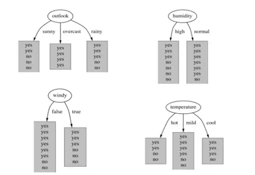

A. Outlook

B. Humidity

C. Windy

D. Temperature

答案: A信息增益, 增加平均子集纯度, 详细研究, 请戳下面链接:

A Complete Tutorial on Tree Based Modeling from Scratch (in R & Python)

Lecture 4 Decision Trees (2): Entropy, Information Gain, Gain Ratio

## 239、对于信息增益, 决策树分裂节点, 下面说法正确的是: 

1\. 纯度高的节点需要更多的信息去区分

2\. 信息增益可以用”1比特-熵”获得

3\. 如果选择一个属性具有许多归类值, 那么这个信息增益是有偏差的

A. 1

B. 2

C.2和3

D. 所有以上

答案: C

详细研究, 请戳下面链接:

A Complete Tutorial on Tree Based Modeling from Scratch (in R & Python)

Lecture 4 Decision Trees (2): Entropy, Information Gain, Gain Ratio

## 240、如果SVM模型欠拟合, 以下方法哪些可以改进模型 : 

A. 增大惩罚参数C的值

B. 减小惩罚参数C的值

C. 减小核系数(gamma参数)

答案: A

如果SVM模型欠拟合, 我们可以调高参数C的值, 使得模型复杂度上升.LibSVM中，SVM的目标函数是：

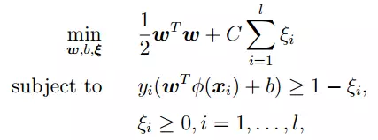

而, gamma参数是你选择径向基函数作为kernel后,该函数自带的一个参数.隐含地决定了数据映射到新的特征空间后的分布.

gamma参数与C参数无关. gamma参数越高, 模型越复杂. 

## 241、下图是同一个SVM模型, 但是使用了不同的径向基核函数的gamma参数, 依次是g1, g2, g3 , 下面大小比较正确的是 : 

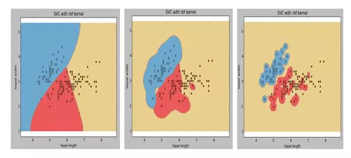

A. g1 > g2 > g3

B. g1 = g2 = g3

C. g1 < g2 < g3

D. g1 >= g2 >= g3

E. g1 <= g2 <= g3

答案: C

## 242、假设我们要解决一个二类分类问题, 我们已经建立好了模型, 输出是0或1, 初始时设阈值为0.5, 超过0.5概率估计, 就判别为1, 否则就判别为0 ; 如果我们现在用另一个大于0.5的阈值,  那么现在关于模型说法, 正确的是 : 

1\. 模型分类的召回率会降低或不变

2\. 模型分类的召回率会升高

3\. 模型分类准确率会升高或不变

4\. 模型分类准确率会降低

A. 1

B. 2

C.1和3

D. 2和4

E. 以上都不是

答案: C

这篇文章讲述了阈值对准确率和召回率影响 :

Confidence Splitting Criterions Can Improve Precision And Recall in Random Forest Classifiers

## 243、”点击率问题”是这样一个预测问题, 99%的人是不会点击的, 而1%的人是会点击进去的, 所以这是一个非常不平衡的数据集. 假设, 现在我们已经建了一个模型来分类, 而且有了99%的预测准确率, 我们可以下的结论是 : 

A. 模型预测准确率已经很高了, 我们不需要做什么了

B. 模型预测准确率不高, 我们需要做点什么改进模型

C. 无法下结论

D. 以上都不对

答案: B

99%的预测准确率可能说明, 你预测的没有点进去的人很准确 (因为有99%的人是不会点进去的, 这很好预测). 不能说明你的模型对点进去的人预测准确, 所以, 对于这样的非平衡数据集, 我们要把注意力放在小部分的数据上, 即那些点击进去的人.

详细参考: https://www.analyticsvidhya.com/blog/2016/03/practical-guide-deal-imbalanced-classification-problems/

## 244、使用k=1的knn算法, 下图二类分类问题, “+” 和 “o” 分别代表两个类, 那么, 用仅拿出一个测试样本的交叉验证方法, 交叉验证的错误率是多少 : 

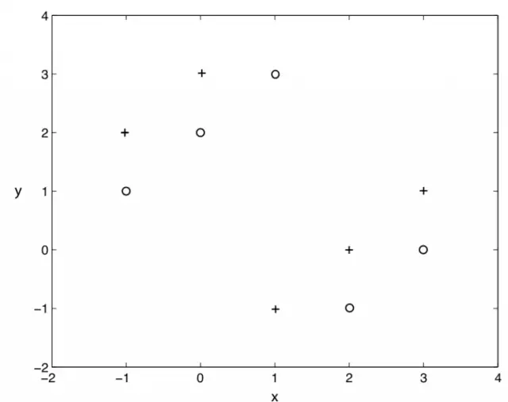

A. 0%

B. 100%

C.  0% 到  100%

D. 以上都不是

答案: B

knn算法就是, 在样本周围看k个样本, 其中大多数样本的分类是A类, 我们就把这个样本分成A类. 显然, k=1 的knn在上图不是一个好选择, 分类的错误率始终是100%

## 245、我们想在大数据集上训练决策树, 为了使用较少时间, 我们可以 : 

A.  增加树的深度

B.  增加学习率 (learning rate)

C.  减少树的深度

D. 减少树的数量

答案: C

A.增加树的深度, 会导致所有节点不断分裂, 直到叶子节点是纯的为止. 所以, 增加深度, 会延长训练时间.

B.决策树没有学习率参数可以调. (不像集成学习和其它有步长的学习方法)

D.决策树只有一棵树, 不是随机森林.

## 246、对于神经网络的说法, 下面正确的是 : 

1\. 增加神经网络层数, 可能会增加测试数据集的分类错误率

2\. 减少神经网络层数, 总是能减小测试数据集的分类错误率

3\. 增加神经网络层数, 总是能减小训练数据集的分类错误率

A. 1

B. 1 和 3

C. 1 和 2

D. 2

答案: A

深度神经网络的成功, 已经证明, 增加神经网络层数, 可以增加模型范化能力, 即, 训练数据集和测试数据集都表现得更好. 但更多的层数, 也不一定能保证有更好的表现（https://arxiv.org/pdf/1512.03385v1.pdf）. 所以, 不能绝对地说层数多的好坏, 只能选A

## 247、假如我们使用非线性可分的SVM目标函数作为最优化对象, 我们怎么保证模型线性可分？

A. 设C=1

B. 设C=0

C. 设C=无穷大

D. 以上都不对

答案: C

C无穷大保证了所有的线性不可分都是可以忍受的.

## 248、训练完SVM模型后, 不是支持向量的那些样本我们可以丢掉, 也可以继续分类:

A. 正确

B. 错误

答案: A

SVM模型中, 真正影响决策边界的是支持向量

## 249、以下哪些算法, 可以用神经网络去构造: 

1\. KNN

2\. 线性回归

3\. 对数几率回归

A. 1和 2

B. 2 和 3

C. 1, 2 和 3

D. 以上都不是

答案: B

1\. KNN算法不需要训练参数, 而所有神经网络都需要训练参数, 因此神经网络帮不上忙

2\. 最简单的神经网络, 感知器, 其实就是线性回归的训练

3\. 我们可以用一层的神经网络构造对数几率回归

## 250、请选择下面可以应用隐马尔科夫(HMM)模型的选项: 

A. 基因序列数据集

B. 电影浏览数据集

C. 股票市场数据集

D. 所有以上

答案: D

只要是和时间序列问题有关的 , 都可以试试HMM

## 251、我们建立一个5000个特征, 100万数据的机器学习模型. 我们怎么有效地应对这样的大数据训练 : 

A. 我们随机抽取一些样本, 在这些少量样本之上训练

B. 我们可以试用在线机器学习算法

C. 我们应用PCA算法降维, 减少特征数

D. B 和 C

E. A 和 B

F. 以上所有

答案: F

## 252、我们想要减少数据集中的特征数, 即降维. 选择以下适合的方案 :

1\. 使用前向特征选择方法

2\. 使用后向特征排除方法

3\. 我们先把所有特征都使用, 去训练一个模型, 得到测试集上的表现. 然后我们去掉一个特征, 再去训练, 用交叉验证看看测试集上的表现. 如果表现比原来还要好, 我们可以去除这个特征.

4\. 查看相关性表, 去除相关性最高的一些特征

A. 1 和 2

B. 2, 3和4

C. 1, 2和4

D. All

答案: D

1.前向特征选择方法和后向特征排除方法是我们特征选择的常用方法

2.如果前向特征选择方法和后向特征排除方法在大数据上不适用, 可以用这里第三种方法.

3.用相关性的度量去删除多余特征, 也是一个好方法

所有D是正确的

## 253、对于随机森林和GradientBoosting Trees, 下面说法正确的是:

1.在随机森林的单个树中, 树和树之间是有依赖的, 而GradientBoosting Trees中的单个树之间是没有依赖的.

2.这两个模型都使用随机特征子集, 来生成许多单个的树.

3.我们可以并行地生成GradientBoosting Trees单个树, 因为它们之间是没有依赖的, GradientBoosting Trees训练模型的表现总是比随机森林好

A. 2

B. 1 and 2

C. 1, 3 and 4

D. 2 and 4

答案: A

1.随机森林是基于bagging的, 而Gradient Boosting trees是基于boosting的, 所有说反了,在随机森林的单个树中, 树和树之间是没有依赖的, 而GradientBoosting Trees中的单个树之间是有依赖关系.

2.这两个模型都使用随机特征子集, 来生成许多单个的树.

所有A是正确的

## 254、对于PCA(主成分分析)转化过的特征 ,  朴素贝叶斯的”不依赖假设”总是成立, 因为所有主要成分是正交的, 这个说法是 :

A. 正确的

B. 错误的

答案: B.

这个说法是错误的, 首先, “不依赖”和”不相关”是两回事, 其次, 转化过的特征, 也可能是相关的

## 255、对于PCA说法正确的是 :

1\. 我们必须在使用PCA前规范化数据

2\. 我们应该选择使得模型有最大variance的主成分

3\. 我们应该选择使得模型有最小variance的主成分

4\. 我们可以使用PCA在低维度上做数据可视化

A. 1, 2 and 4

B. 2 and 4

C. 3 and 4

D. 1 and 3

E. 1, 3 and 4

答案: A

1）PCA对数据尺度很敏感, 打个比方, 如果单位是从km变为cm, 这样的数据尺度对PCA最后的结果可能很有影响(从不怎么重要的成分变为很重要的成分).

2）我们总是应该选择使得模型有最大variance的主成分

3）有时在低维度上左图是需要PCA的降维帮助的

## 256、对于下图, 最好的主成分选择是多少 ? 

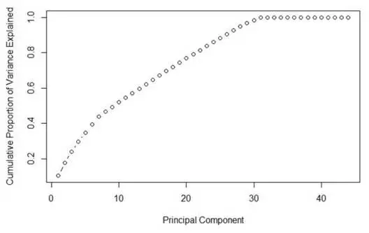

A. 7

B. 30

C. 35

D. 不确定

答案: B

主成分选择使variance越大越好， 在这个前提下， 主成分越少越好。

## 257、数据科学家可能会同时使用多个算法（模型）进行预测， 并且最后把这些算法的结果集成起来进行最后的预测（集成学习），以下对集成学习说法正确的是 :

A. 单个模型之间有高相关性

B. 单个模型之间有低相关性

C. 在集成学习中使用“平均权重”而不是“投票”会比较好

D. 单个模型都是用的一个算法

答案: B

详细请参考下面文章:

Basics of Ensemble Learning Explained in Simple English

Kaggle Ensemble Guide

5 Easy questions on Ensemble Modeling everyone should know

## 258、在有监督学习中， 我们如何使用聚类方法？

A. 我们可以先创建聚类类别， 然后在每个类别上用监督学习分别进行学习

B. 我们可以使用聚类“类别id”作为一个新的特征项， 然后再用监督学习分别进行学习

C. 在进行监督学习之前， 我们不能新建聚类类别

D. 我们不可以使用聚类“类别id”作为一个新的特征项， 然后再用监督学习分别进行学习

A. 2 和 4

B. 1 和 2

C. 3 和 4

D. 1 和 3

答案: B

我们可以为每个聚类构建不同的模型， 提高预测准确率。

“类别id”作为一个特征项去训练， 可以有效地总结了数据特征。

所以B是正确的

## 259、以下说法正确的是 :

A. 一个机器学习模型，如果有较高准确率，总是说明这个分类器是好的

B. 如果增加模型复杂度， 那么模型的测试错误率总是会降低

C. 如果增加模型复杂度， 那么模型的训练错误率总是会降低

D. 我们不可以使用聚类“类别id”作为一个新的特征项， 然后再用监督学习分别进行学习

答案: C

考的是过拟合和欠拟合的问题。

## 260、对应GradientBoosting tree算法， 以下说法正确的是 :

A. 当增加最小样本分裂个数，我们可以抵制过拟合

B. 当增加最小样本分裂个数，会导致过拟合

C. 当我们减少训练单个学习器的样本个数，我们可以降低variance

D. 当我们减少训练单个学习器的样本个数，我们可以降低bias

A. 2 和 4

B. 2 和 3

C. 1 和 3

D. 1 和 4

答案: C

最小样本分裂个数是用来控制“过拟合”参数。太高的值会导致“欠拟合”，这个参数应该用交叉验证来调节。

第二点是靠bias和variance概念的。

## 261、以下哪个图是KNN算法的训练边界 :

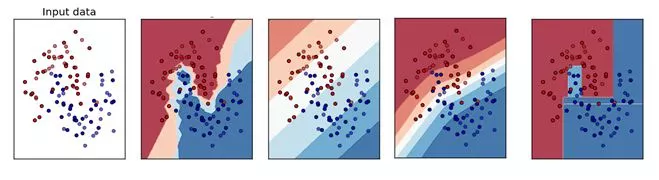

A) B

B) A

C) D

D) C

E) 都不是

答案: B

KNN算法肯定不是线性的边界， 所以直的边界就不用考虑了。另外这个算法是看周围最近的k个样本的分类用以确定分类，所以边界一定是坑坑洼洼的。

## 262、如果一个训练好的模型在测试集上有100%的准确率， 这是不是意味着在一个新的数据集上，也会有同样好的表现？ 

A. 是的，这说明这个模型的范化能力已经足以支持新的数据集合了

B. 不对，依然后其他因素模型没有考虑到，比如噪音数据

答案: B

没有一个模型是可以总是适应新数据的。我们不可能可到100%准确率。

## 263、下面的交叉验证方法 :

i. 有放回的Bootstrap方法

ii. 留一个测试样本的交叉验证

iii. 5折交叉验证

iv. 重复两次的5折教程验证

当样本是1000时，下面执行时间的顺序，正确的是：

A. i > ii > iii > iv

B. ii > iv > iii > i

C. iv > i > ii > iii

D. ii > iii > iv > i

答案: B

所有B是正确的

*   Boostrap方法是传统地随机抽样，验证一次的验证方法，只需要训练1次模型，所以时间最少。

*   留一个测试样本的交叉验证，需要n次训练过程（n是样本个数），这里，要训练1000个模型。

*   5折交叉验证需要训练5个模型。

*   重复2次的5折交叉验证，需要训练10个模型。

## 264、变量选择是用来选择最好的判别器子集， 如果要考虑模型效率，我们应该做哪些变量选择的考虑？ 

1\. 多个变量其实有相同的用处

2\. 变量对于模型的解释有多大作用

3\. 特征携带的信息

4\. 交叉验证

A. 1 和 4

B. 1, 2 和 3

C. 1,3 和 4

D. 以上所有

答案: C

注意， 这题的题眼是考虑模型效率，所以不要考虑选项2.

## 265、对于线性回归模型，包括附加变量在内，以下的可能正确的是 :

1\. R-Squared 和 Adjusted R-squared都是递增的

2\. R-Squared 是常量的，Adjusted R-squared是递增的

3\. R-Squared 是递减的， Adjusted R-squared 也是递减的

4\. R-Squared 是递减的， Adjusted R-squared是递增的

A. 1 和 2

B. 1 和 3

C. 2 和 4

D. 以上都不是

答案: D

R-squared不能决定系数估计和预测偏差，这就是为什么我们要估计残差图。但是，R-squared有R-squared 和 predicted R-squared 所没有的问题。

每次你为模型加入预测器，R-squared递增或不变.

详细请看这个链接：https://discuss.analyticsvidhya.com/t/difference-between-r-square-and-adjusted-r-square/264/3

## 266、对于下面三个模型的训练情况， 下面说法正确的是 :

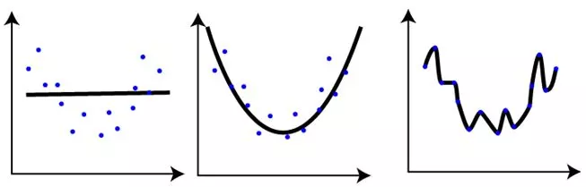

1\. 第一张图的训练错误与其余两张图相比，是最大的

2\. 最后一张图的训练效果最好，因为训练错误最小

3\. 第二张图比第一和第三张图鲁棒性更强，是三个里面表现最好的模型

4\. 第三张图相对前两张图过拟合了

5\. 三个图表现一样，因为我们还没有测试数据集

A. 1 和 3

B. 1 和 3

C. 1, 3 和 4

D. 5

答案: C

## 267、对于线性回归，我们应该有以下哪些假设？ :

1\. 找到利群点很重要, 因为线性回归对利群点很敏感

2\. 线性回归要求所有变量必须符合正态分布

3\. 线性回归假设数据没有多重线性相关性

A. 1 和 2

B. 2 和 3

C. 1,2 和 3

D. 以上都不是

答案: D

利群点要着重考虑, 第一点是对的

不是必须的, 当然, 如果是正态分布, 训练效果会更好

有少量的多重线性相关性是可以的, 但是我们要尽量避免

## 268、当我们构造线性模型时, 我们注意变量间的相关性. 在相关矩阵中搜索相关系数时, 如果我们发现3对变量的相关系数是(Var1 和Var2, Var2和Var3, Var3和Var1)是-0.98, 0.45, 1.23 . 我们可以得出什么结论: 

1\. Var1和Var2是非常相关的

2\. 因为Var和Var2是非常相关的, 我们可以去除其中一个

3\. Var3和Var1的1.23相关系数是不可能的

A. 1 and 3

B. 1 and 2

C. 1,2 and 3

D. 1

答案: C

Var1和Var2相关系数是负的, 所以这是多重线性相关, 我们可以考虑去除其中一个.

一般地, 如果相关系数大于0.7或者小于-0.7, 是高相关的

相关性系数范围应该是 \[-1,1\]

## 269、如果在一个高度非线性并且复杂的一些变量中“一个树模型可能比一般的回归模型效果更好”是

A. 对的

B. 错的

答案: A

## 270、对于维度极低的特征，选择线性还是非线性分类器？

非线性分类器，低维空间可能很多特征都跑到一起了，导致线性不可分。

1\. 如果Feature的数量很大，跟样本数量差不多，这时候选用LR或者是Linear Kernel的SVM

2\. 如果Feature的数量比较小，样本数量一般，不算大也不算小，选用SVM+Gaussian Kernel

3\. 如果Feature的数量比较小，而样本数量很多，需要手工添加一些feature变成第一种情况。

## 271、SVM、LR、决策树的对比。

模型复杂度：SVM支持核函数，可处理线性非线性问题;LR模型简单，训练速度快，适合处理线性问题;决策树容易过拟合，需要进行剪枝

损失函数：SVM hinge loss; LR L2正则化; adaboost 指数损失

数据敏感度：SVM添加容忍度对outlier不敏感，只关心支持向量，且需要先做归一化; LR对远点敏感

数据量：数据量大就用LR，数据量小且特征少就用SVM非线性核

## 272、什么是ill-condition病态问题？

训练完的模型，测试样本稍作修改就会得到差别很大的结果，就是病态问题，模型对未知数据的预测能力很差，即泛化误差大。

## 273、简述KNN最近邻分类算法的过程？

1\. 计算训练样本和测试样本中每个样本点的距离（常见的距离度量有欧式距离，马氏距离等）；

2\. 对上面所有的距离值进行排序；

3\. 选前k个最小距离的样本；

4\. 根据这k个样本的标签进行投票，得到最后的分类类别；

## 274、常用的聚类划分方式有哪些？列举代表算法。

1\. 基于划分的聚类:K-means，k-medoids，CLARANS。

2\. 基于层次的聚类：AGNES（自底向上），DIANA（自上向下）。

3\. 基于密度的聚类：DBSACN，OPTICS，BIRCH(CF-Tree)，CURE。

4\. 基于网格的方法：STING，WaveCluster。

5\. 基于模型的聚类：EM,SOM，COBWEB。

## 275、下面对集成学习模型中的弱学习者描述错误的是？

A.他们经常不会过拟合

B.他们通常带有高偏差，所以其并不能解决复杂学习问题

C.他们通常会过拟合

答案：C，弱学习者是问题的特定部分。所以他们通常不会过拟合，这也就意味着弱学习者通常拥有低方差和高偏差。

## 276、下面哪个/些选项对 K 折交叉验证的描述是正确的？

1.增大 K 将导致交叉验证结果时需要更多的时间

2.更大的 K 值相比于小 K 值将对交叉验证结构有更高的信心

3.如果 K=N，那么其称为留一交叉验证，其中 N 为验证集中的样本数量

A. 1 和 2

B. 2 和 3

C. 1 和 3

D. 1、2 和 3

答案（D)：大 K 值意味着对过高估计真实预期误差（训练的折数将更接近于整个验证集样本数）拥有更小的偏差和更多的运行时间（并随着越来越接近极限情况：留一交叉验证）。我们同样在选择 K 值时需要考虑 K 折准确度和方差间的均衡。

## 277、最出名的降维算法是 PAC 和 t-SNE。将这两个算法分别应用到数据「X」上，并得到数据集「X\_projected\_PCA」，「X\_projected\_tSNE」。下面哪一项对「X\_projected\_PCA」和「X\_projected\_tSNE」的描述是正确的？

A. X\_projected\_PCA 在最近邻空间能得到解释

B. X\_projected\_tSNE 在最近邻空间能得到解释

C. 两个都在最近邻空间能得到解释

D. 两个都不能在最近邻空间得到解释

答案（B）：t-SNE 算法考虑最近邻点而减少数据维度。所以在使用 t-SNE 之后，所降的维可以在最近邻空间得到解释。但 PCA 不能。

## 278、给定三个变量 X，Y，Z。(X, Y)、(Y, Z) 和 (X, Z) 的 Pearson 相关性系数分别为 C1、C2 和 C3。现在 X 的所有值加 2（即 X+2），Y 的全部值减 2（即 Y-2），Z 保持不变。那么运算之后的 (X, Y)、(Y, Z) 和 (X, Z) 相关性系数分别为 D1、D2 和 D3。现在试问 D1、D2、D3 和 C1、C2、C3 之间的关系是什么？

A. D1= C1, D2 < C2, D3 > C3

B. D1 = C1, D2 > C2, D3 > C3

C. D1 = C1, D2 > C2, D3 < C3

D. D1 = C1, D2 < C2, D3 < C3

E. D1 = C1, D2 = C2, D3 = C3

答案（E）：特征之间的相关性系数不会因为特征加或减去一个数而改变。

## 279、为了得到和 SVD 一样的投射（projection），你需要在 PCA 中怎样做？

A. 将数据转换成零均值

B. 将数据转换成零中位数

C. 无法做到

答案（A）：当数据有一个 0 均值向量时，PCA 有与 SVD 一样的投射，否则在使用 SVD 之前，你必须将数据均值归 0。

## 280、假设我们有一个数据集，在一个深度为 6 的决策树的帮助下，它可以使用 100% 的精确度被训练。现在考虑一下两点，并基于这两点选择正确的选项。

注意：所有其他超参数是相同的，所有其他因子不受影响。

1.深度为 4 时将有高偏差和低方差

2.深度为 4 时将有低偏差和低方差

A. 只有 1

B. 只有 2

C. 1 和 2

D. 没有一个

答案（A)：如果在这样的数据中你拟合深度为 4 的决策树，这意味着其更有可能与数据欠拟合。因此，在欠拟合的情况下，你将获得高偏差和低方差。

## 281、在 k-均值算法中，以下哪个选项可用于获得全局最小？

A. 尝试为不同的质心（centroid）初始化运行算法

B. 调整迭代的次数

C. 找到集群的最佳数量

D. 以上所有

答案（D）：所有都可以用来调试以找到全局最小。

## 282、你正在使用带有 L1 正则化的 logistic 回归做二分类，其中 C 是正则化参数，w1 和 w2 是 x1 和 x2 的系数。当你把 C 值从 0 增加至非常大的值时，下面哪个选项是正确的？

A. 第一个 w2 成了 0，接着 w1 也成了 0

B. 第一个 w1 成了 0，接着 w2 也成了 0

C. w1 和 w2 同时成了 0

D. 即使在 C 成为大值之后，w1 和 w2 都不能成 0

答案（B）：通过观察图像我们发现，即使只使用 x2，我们也能高效执行分类。因此一开始 w1 将成 0；当正则化参数不断增加时，w2 也会越来越接近 0。

## 283、假设你使用 log-loss 函数作为评估标准。下面这些选项，哪些是对作为评估标准的 log-loss 的正确解释。

A.如果一个分类器对不正确的分类很自信，log-loss 会严重的批评它。

B.对一个特别的观察而言，分类器为正确的类别分配非常小的概率，然后对 log-loss 的相应分布会非常大。

C.log-loss 越低，模型越好

D.以上都是

答案为（D）

## 284、下面哪个选项中哪一项属于确定性算法？

A.PCA

B.K-Means

C. 以上都不是

答案为（A）：确定性算法表明在不同运行中，算法输出并不会改变。如果我们再一次运行算法，PCA 会得出相同的结果，而 k-means 不会。

## 285、特征向量的归一化方法有哪些？

*   线性函数转换，表达式如下：

y=(x-MinValue)/(MaxValue-MinValue)

*   对数函数转换，表达式如下：

y=log10 (x)

*   反余切函数转换 ，表达式如下：

y=arctan(x)\*2/PI

*   减去均值，除以方差：

y=(x-means)/ variance

## 286、优化算法及其优缺点？

温馨提示：在回答面试官的问题的时候，往往将问题往大的方面去回答，这样不会陷于小的技术上死磕，最后很容易把自己嗑死了。

1）随机梯度下降

优点：可以一定程度上解决局部最优解的问题

缺点：收敛速度较慢

2）批量梯度下降

优点：容易陷入局部最优解

缺点：收敛速度较快

3）mini\_batch梯度下降

综合随机梯度下降和批量梯度下降的优缺点，提取的一个中和的方法。

4）牛顿法

牛顿法在迭代的时候，需要计算Hessian矩阵，当维度较高的时候，计算  Hessian矩阵比较困难。

5）拟牛顿法

拟牛顿法是为了改进牛顿法在迭代过程中，计算Hessian矩阵而提取的算法，它采用的方式是通过逼近Hessian的方式来进行求解。

## 287、RF与GBDT之间的区别与联系？

1）相同点：都是由多棵树组成，最终的结果都是由多棵树一起决定。

2）不同点：

a 组成随机森林的树可以分类树也可以是回归树，而GBDT只由回归树组成

b 组成随机森林的树可以并行生成，而GBDT是串行生成

c 随机森林的结果是多数表决表决的，而GBDT则是多棵树累加之和

d 随机森林对异常值不敏感，而GBDT对异常值比较敏感

e 随机森林是减少模型的方差，而GBDT是减少模型的偏差

f 随机森林不需要进行特征归一化。而GBDT则需要进行特征归一化

## 288、两个变量的 Pearson 相关性系数为零，但这两个变量的值同样可以相关。

A 正确   

B 错误

答案为（A）：Pearson相关系数只能衡量线性相关性，但无法衡量非线性关系。如y=x^2，x和y有很强的非线性关系。

## 289、下面哪个/些超参数的增加可能会造成随机森林数据过拟合？

A 树的数量 

B 树的深度  

C 学习速率

答案为（B）：通常情况下，我们增加树的深度有可能会造成模型过拟合。学习速率并不是随机森林的超参数。增加树的数量可能会造成欠拟合。

## 290、目标变量在训练集上的 8 个实际值 \[0,0,0,1,1,1,1,1\]，目标变量的熵是多少？

A. -(5/8 log(5/8) + 3/8 log(3/8))

B. 5/8 log(5/8) + 3/8 log(3/8)

C. 3/8 log(5/8) + 5/8 log(3/8)

D. 5/8 log(3/8) – 3/8 log(5/8)

答案为（A）

## 291、下面有关序列模式挖掘算法的描述，错误的是？（C）

A AprioriAll算法和GSP算法都属于Apriori类算法，都要产生大量的候选序列

B FreeSpan算法和PrefixSpan算法不生成大量的候选序列以及不需要反复扫描原数据库

C 在时空的执行效率上，FreeSpan比PrefixSpan更优

D 和AprioriAll相比，GSP的执行效率比较高

@CS青雀，本题解析来源：http://blog.csdn.net/ztf312/article/details/50889238

1\. Apriori算法 ：关联分析原始算法，用于从候选项集中发现频繁项集。两个步骤：进行自连接、进行剪枝。缺点：无时序先后性。

AprioriAll算法：AprioriAll算法与Apriori算法的执行过程是一样的，不同点在于候选集的产生，需要区分最后两个元素的前后。

AprioriSome算法：可以看做是AprioriAll算法的改进

AprioriAll算法和AprioriSome算法的比较：

（1）AprioriAll用 去计算出所有的候选Ck，而AprioriSome会直接用 去计算所有的候选 ，因为 包含 ，所以AprioriSome会产生比较多的候选。

（2）虽然AprioriSome跳跃式计算候选，但因为它所产生的候选比较多，可能在回溯阶段前就占满内存。

（3）如果内存占满了，AprioriSome就会被迫去计算最后一组的候选。

（4）对于较低的支持度，有较长的大序列，AprioriSome算法要好些。

2\. GPS算法：类Apriori算法。用于从候选项集中发现具有时序先后性的频繁项集。两个步骤：进行自连接、进行剪枝。缺点：每次计算支持度，都需要扫描全部数据集；对序列模式很长的情况，由于其对应的短的序列模式规模太大，算法很难处理。

3\. SPADE算法：改进的GPS算法，规避多次对数据集D进行全表扫描的问题。与GSP算法大体相同，多了一个ID\_LIST记录，使得每一次的ID\_LIST根据上一次的ID\_LIST得到（从而得到支持度）。而ID\_LIST的规模是随着剪枝的不断进行而缩小的。所以也就解决了GSP算法多次扫描数据集D问题。

4.  FreeSpan算法：即频繁模式投影的序列模式挖掘。核心思想是分治算法。基本思想为：利用频繁项递归地将序列数据库投影到更小的投影数据库集中，在每个投影数据库中生成子序列片断。这一过程对数据和待检验的频繁模式集进行了分割，并且将每一次检验限制在与其相符合的更小的投影数据库中。

优点：减少产生候选序列所需的开销。缺点：可能会产生许多投影数据库，开销很大，会产生很多的

5\. PrefixSpan 算法：从FreeSpan中推导演化而来的。收缩速度比FreeSpan还要更快些。

## 292、下列哪个不属于常用的文本分类的特征选择算法？

A 卡方检验值

B 互信息

C 信息增益

D 主成分分析

常采用特征选择方法。常见的六种特征选择方法：

1）DF(Document Frequency) 文档频率

DF:统计特征词出现的文档数量，用来衡量某个特征词的重要性

2）MI(Mutual Information) 互信息法

互信息法用于衡量特征词与文档类别直接的信息量。

如果某个特征词的频率很低，那么互信息得分就会很大，因此互信息法倾向"低频"的特征词。

相对的词频很高的词，得分就会变低，如果这词携带了很高的信息量，互信息法就会变得低效。

3）(Information Gain) 信息增益法

通过某个特征词的缺失与存在的两种情况下，语料中前后信息的增加，衡量某个特征词的重要性。

4）CHI(Chi-square) 卡方检验法

利用了统计学中的"假设检验"的基本思想：首先假设特征词与类别直接是不相关的

如果利用CHI分布计算出的检验值偏离阈值越大，那么更有信心否定原假设，接受原假设的备则假设：特征词与类别有着很高的关联度。

5）WLLR(Weighted Log Likelihood Ration)加权对数似然

6）WFO（Weighted Frequency and Odds）加权频率和可能性

http://blog.csdn.net/ztf312/article/details/50890099

## 293、类域界面方程法中，不能求线性不可分情况下分类问题近似或精确解的方法是？(D)

A 伪逆法-径向基（ＲＢＦ）神经网络的训练算法，就是解决线性不可分的情况

B 基于二次准则的H-K算法：最小均方差准则下求得权矢量，二次准则解决非线性问题

C 势函数法－非线性

D 感知器算法－线性分类算法

## 294、机器学习中做特征选择时，可能用到的方法有？ （E）

A、卡方 

B、信息增益 

C、平均互信息 

D、期望交叉熵

E 以上都有

## 295、下列方法中，不可以用于特征降维的方法包括（E）

A 主成分分析PCA

B 线性判别分析LDA

C 深度学习SparseAutoEncoder

D 矩阵奇异值分解SVD

E 最小二乘法LeastSquares

A.特征降维方法主要有：PCA，LLE，Isomap

B.LDA:线性判别分析，可用于降维

C.稀疏自编码就是用少于输入层神经元数量的隐含层神经元去学习表征输入层的特征，相当于把输入层的特征压缩了，所以是特征降维。

D.SVD和PCA类似，也可以看成一种降维方法

## 296、一般，k-NN最近邻方法在（ A）的情况下效果较好。

A．样本较多但典型性不好 

B．样本呈团状分布

C．样本较少但典型性好

D．样本呈链状分布

## 297、下列哪些方法可以用来对高维数据进行降维（A B C D E F）

A LASSO

B 主成分分析法

C 聚类分析

D 小波分析法

E 线性判别法

F 拉普拉斯特征映射

解析：lasso通过参数缩减达到降维的目的；

pca就不用说了

线性鉴别法即LDA通过找到一个空间使得类内距离最小类间距离最大所以可以看做是降维；

小波分析有一些变换的操作降低其他干扰可以看做是降维

拉普拉斯请看这个http://f.dataguru.cn/thread-287243-1-1.html

## 298、以下描述正确的是（D）

A SVM是这样一个分类器，它寻找具有最小边缘的超平面，因此它也经常被称为最小边缘分类器

B 在聚类分析当中，簇内的相似性越大，簇间的差别越大，聚类的效果就越差

C 在决策树中，随着树中结点输变得太大，即使模型的训练误差还在继续降低，但是检验误差开始增大，这是出现了模型拟合不足的原因

D 聚类分析可以看作是一种非监督的分类

## 299、以下说法中正确的是（C）

A SVM对噪声（如来自其他分部的噪声样本）具备鲁棒性

B 在adaboost算法中，所有被分错样本的权重更新比例相同

C boosting和bagging都是组合多个分类器投票的方法，二者都是根据单个分类器的正确率确定其权重

D 给定n个数据点，如果其中一半用于训练，一半用户测试，则训练误差和测试误差之间的差别会随着n的增加而减少

## 300、关于正态分布,下列说法错误的是**（C）

A.正态分布具有集中性和对称性

B.正态分布的均值和方差能够决定正态分布的位置和形态

C.正态分布的偏度为0，峰度为1

D.标准正态分布的均值为0，方差为1
