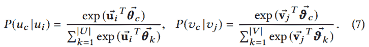
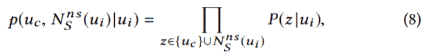
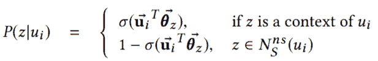
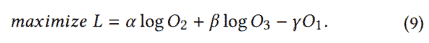
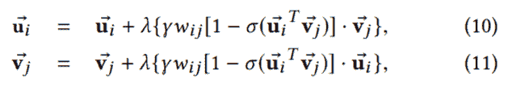
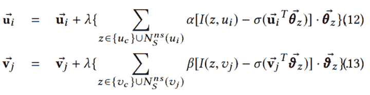
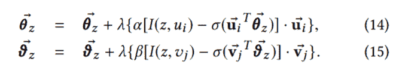

# 【论文笔记】BINE：二分网络嵌入

## BiNE: Bipartite Network Embedding


## 三、问题定义

我们首先给出本文中使用的符号，然后形式化要解决的二分网络嵌入问题。

符号：设`G = (U, V, E)`为二分网络，其中`U`和`V`分别表示两种顶点的集合，`E ⊆ U × V`定义集合间的边。 如图 2 所示，`u[i]`和`v[j]`分别表示`U`和`V`中的第`i`和第`j`个顶点，其中`i = 1,2, ..., |U|`和`j = 1, 2, ..., |V|`。 每个边带有一个非负权重`w[ij]`，描述顶点`u[i]`和`v[j]`之间的连接强度；如果`u[i]`和`v[j]`断开连接，则边权重`w[ij]`设置为零。 因此，我们可以使用`|U|×|V|`矩阵`W = (w[ij])`表示二分网络中的所有权重。

问题定义：二分网络嵌入的任务，旨在将网络中的所有顶点映射到低维嵌入空间，其中每个顶点表示为密集嵌入向量。 在嵌入空间中，应保留相同类型的顶点之间的隐式关系，和不同类型的顶点之间的显式关系。形式上，问题可以定义为：

+   输入：二分网络`G = (U, V, E)`和权重矩阵`W`
+   输出：映射函数`f: U ∪ V -> R^d`，它将`G`中每个节点映射为`d`维嵌入向量

为了使符号简单，我们使用（带箭头的）`u[i]`和`v[j]`分别表示顶点`u[i]`和`v[j]`的嵌入向量。 因此，我们可以将二分网络中所有顶点的嵌入向量表示为两个矩阵`U = (u[i])`和`V = (v[j])`。

## 四、BINE：二分网络嵌入

良好的网络嵌入应该能够很好地重建原始网络。 为了对二分网络实现这一目标，我们考虑从两个角度重构二分网络 - 由观察到的边证明的显式关系和由未观察但传递的链接隐含的隐含关系。 然后，我们通过联合优化这两个任务来学习顶点嵌入。本节介绍了我们的 BiNE 方法。

### 4.1 建模显式关系

在二分网络中，边存在于两种不同类型的顶点之间，在构建二分网络时提供显式信号。 类似于 LINE [20] 中的一阶邻近度建模，我们通过考虑两个连接顶点之间的局部邻近度来建模显式关系。 顶点`u[i]`和`v[j]`之间的联合概率定义为：

 (1)

其中`w[ij]`是边`e[ij]`的权重。显然，如果两个顶点以较大权重紧密相连，则它们共同出现的概率较高。

现在我们考虑如何估计嵌入空间中两个顶点之间的局部邻近度。 word2vec 的有效性和普及性激发了许多工作 [4,8,20]，使用内积来模拟两个实体之间的相互作用。 我们遵循这个设置，并使用 sigmoid 函数将交互值转换为概率空间：

 (2)

其中`u[i] ∈ R^d`和`v[j] ∈ R^d`分别是顶点`u[i]`和`v[j]`的嵌入向量。

利用顶点间共现概率的经验分布和重建分布，我们可以通过最小化它们的差异来学习嵌入向量。 我们选择 KL 散度作为分布之间的差异度量，可以定义为：


 (3)

直观上，最小化该目标函数将使得在原始网络中强连接的两个顶点在嵌入空间中也彼此靠近，这保留了所需的局部邻近度。

### 4.2 建模隐式关系

现有的推荐工作 [12,15] 所示，显性和隐性关系都有助于揭示二分网络中的不同语义。为了全面，同样重要的是还要考虑相同类型的两个顶点之间的隐式关系，即使它们没有显式连接。直观上，对于相同类型的两个顶点，如果它们之间存在路径，则它们之间应该存在某种隐式关系；路径的数量及其长度表示隐式关系的强度。不幸的是，计算两个顶点之间的路径具有指数阶的相当高的复杂度，这对于大型网络是不可行的。为了在二分网络中的顶点之间编码这种高阶隐式关系，我们求助于 DeepWalk 的解决方案。具体地，首先通过执行随机游走将二分网络转换为顶点序列的两个语料库；然后从语料库中学习嵌入，语料库编码顶点之间的高阶关系。在下文中，我们首先详细说明如何为二分网络生成两个高质量的语料库。

#### 4.2.1 构建顶点序列的语料库

这是一种常用方法，通过在网络上执行随机游走将网络转换为顶点序列语料库，已经在一些同构网络嵌入方法中使用 [4,8]。 然而，直接在二分网络上执行随机游走可能会失败，因为由于周期性问题，二分网络上没有随机游走的固定分布 [34]。 为了解决这个问题，我们考虑在两个同构网络上进行随机漫游，这两个网络包含相同类型顶点之间的二阶邻近度。 按照 Co-HITS [1] 的思想，我们将两个顶点之间的二阶邻近度定义为：


其中`w[ij]`是边`e[ij]`的权重。 因此，我们可以使用`|U|×|U|`矩阵`W^U = (w^U[ij])`和`|V|×|V|`矩阵`W^V = (w^V[ij])`分别表示两个所得同质网络。

现在我们可以在两个同构网络上执行截断随机游走，来生成两个语料库来学习高阶隐式关系。 如图 1 所示，DeepWalk 生成的语料库可能无法捕获真实网络的特征。 为了生成具有高保真度的语料库，我们提出了一种偏置且自适应的随机游走生成器，其可以保持二分网络中的顶点分布。 我们将其核心设计如下重点介绍：

+   首先，我们将从每个顶点开始的随机游走的数量与其重要性相关联，这可以通过其中心性来衡量。 对于顶点，其中心性越大，随机游走就越有可能从它开始。 结果，可以在一定程度上保留顶点重要性。
+   我们指定在每个步骤中停止随机游走的概率。 与 DeepWalk 和其他在随机游走上应用固定长度的工作 [14] 相比，我们允许生成的顶点序列具有可变长度，以便模仿自然语言中的可变长度句子。

一般来说，上述生成过程遵循“富人更富”的原则，这是一种存在于许多真实网络中的物理现象，即顶点连通性遵循无标度幂律分布 [35]。

我们的随机游走生成器的工作流程总结在算法 1 中，其中`maxT`和`minT`分别是从每个顶点开始的随机游走的最大和最小数量。 算法 1 输出的`D^U`（或`D^V`）是从顶点集`U`（或`V`）生成的语料库。 顶点中心性可以通过许多度量来衡量，例如度中心性，PageRank 和 HITS [29] 等，我们在实验中使用 HITS。

```
Algorithm 1: WalkGenerator(W, R, maxT, minT, p)
-----------------------------------------------
Input: weight matrix of the bipartite network W,
       vertex set R (can be U or V ),
       maximal walks per vertex maxT, 
       minimal walks per vertex minT, 
       walk stopping probability p
Output: a set of vertex sequences D^R
1 Calculate vertices’ centrality: H = CentralityMeasure(W);
2 Calculate W^R w.r.t. Equation (4);
3 foreach vertex vi ∈ R do
4     l = max(H(vi) × maxT, minT);
5     for i = 0 to l do
6         D[v[i]] = BiasedRamdomWalk(W^R, v[i], p);
7         Add D[v[i]] into D^R;
8 return D^R;
```

#### 4.2.2 隐式关系建模

在分别对两个同构网络进行偏差随机游走后，我们得到顶点序列的两个语料库。 接下来，我们在两个语料库上使用 Skipgram 模型 [11] 来学习顶点嵌入。

目的是捕获高阶邻近度，其假定经常在序列的相同上下文中共同出现的顶点，应被分配给类似的嵌入。 给定顶点序列`S`和顶点`u[i]`，上下文被定义为`u[i]`之前和之后`u[i]`中的`ws`顶点；每个顶点与上下文向量相关联，来将其表示为上下文的角色。 由于二分网络中有两种类型的顶点，我们分别保留高阶邻近度。 具体而言，对于语料库`D^U`，最大化的条件概率是：

 (5)

其中`C[S](u[i])`表示序列`S`中顶点`u[i]`的上下文顶点。类似地，我们可以得到语料库`D^V`的目标函数：

 (6)

按照现有的神经嵌入方法 [4,8,20]，我们为输出使用带有 softmax 的内积核，参数化条件概率`P(u[c] | u[i])`和`P(v[c] | v[j])`：



其中`P(u[c] | u[i])`表示在`u[i]`的上下文中观察`u[c]`的可能性；类似的含义适用于`P(v[c] | v[j])`。 通过该定义，实现公式（5）和（6）中定义的目标，将迫使具有相似上下文的顶点在嵌入空间中接近。 然而，优化目标并非易事，因为 softmax 函数的每次评估都需要遍历一侧的所有顶点，这是非常耗费时间的。 为了降低学习的复杂性，我们采用了负采样的概念 [11]。

### 4.2.3 负采样

负采样的想法是用一些抽样的负实例逼近 softmax 的昂贵分母项 [36]。 然后，可以通过优化逐元素分类损失来执行学习。 对于中心顶点`u[i]`，高质量负样本应该是与`u[i]`不同的顶点。 为了实现这一目标，已经应用了一些启发式方法，例如从偏差为受欢迎程度的非均匀分布中抽样 [11]。 在这里，我们提出了一种更落地的采样方法，来满足网络数据。

首先，我们相对于输入二分网络中的拓扑结构，将每个顶点与其`ws`跳的邻居重叠，之后使用局部敏感散列（LSH）[37] 来封住顶点。 然后给定一个中心顶点，我们从与包含中心顶点的桶不同的桶中，随机选择负样本。 通过这种方式，我们可以获得高质量和多样化的负样本，因为 LSH 可以保证不同的顶点以概率方式位于不同的桶中 [37]。

令N^{ns}[S](u[i])`表示序列`S ∈ D^U`中的中心顶点`u[i]`的`ns`负样本，然后我们可以将公式（7）中定义的条件概率`p(u[c] | u[i])`近似为：



其中`P(z|u[j])`定义为：



其中`σ`表示 S 形函数`1 / (1 + exp(-x))`。 通过将公式（5）中的`p(u[c] | u[i])`替换为`p(u[c], N^{ns}[S](u[i])| u[i])`的定义，我们可以得到近似的目标函数来优化。 语义是中心顶点与其上下文顶点之间的邻近度应该最大化，而中心顶点和负样本之间的邻近度应该最小化。

按照类似的公式，我们可以得到条件概率`p(v[c] | v[j]）的对应物，由于空间限制，这里省略了其细节。

### 4.3 联合优化

为了通过同时保留显式和隐式关系来嵌入二分网络，我们将它们的目标函数组合起来形成一个联合优化框架。



其中参数`α`，`β`和`γ`是要指定的超参数，用于组合联合优化框架中的不同组件。

为了优化联合模型，我们使用随机梯度上升算法（SGA）。 注意，公式（9）的三个分量具有不同的训练实例定义。 为了解决这个问题，我们通过执行如下的梯度步骤来调整 SGA 算法：

第一步：对于随机显式关系，即边`e[ij] ∈ E`，我们首先通过利用 SGA 更新嵌入向量`u[i]`和`v[j]`以最大化最后的分量`L[1] = -γO[1]`。 我们为`u[i]`和`v[j]`提供 SGA 更新规则，如下所示：



其中`λ`表示学习率。

第二步：然后我们将顶点`u[i]`和`v[j]`视为中心顶点; 通过使用 SGA 最大化目标函数`L[2] = α logO[2]`和`L[3] = β logO[3]`，我们可以保留隐式关系。 具体来说，给定中心顶点`u[i]`（或`v[j]`）及其上下文顶点`u[c]`（或`v[c]`），我们更新它们的嵌入向量`u[i]`（或`v[j]`），如下所示：



其中`I(z, u[i])`是一个指标函数，用于确定顶点`z`是否在`u[i]`的上下文中；类似的含义适用于`I(z, v[j])`。 此外，正和负实例的上下文向量更新为：



我们在算法 2 中总结了学习过程。具体来说，第 1-2 行初始化所有嵌入向量和上下文向量；第 3-4 行产生顶点序列的语料库；第8和第12行进行负采样; 第 9-10 行和第 13-14 行使用 SGA 来学习嵌入。

```
Algorithm 2: Training algorithm of BiNE
---------------------------------------
Input: bipartite network G = (U, V, E), 
       weight matrix of the bipartite network W, 
       window size ws, 
       number of negative samples ns, 
       embedding size d, 
       maximal walks per vertex maxT, 
       minimal walks per vertex minT, 
       walk stopping probability p
Output: vertex embeding matrices U and V
 1 Initialize embedding vectors u[i] and v[j];
 2 Initialize context vectors θ[i] and ϑ[j];
 3 D^U = WalkGenerator(W,U,maxT,minT,p);
 4 D^V = WalkGenerator(W,V,maxT,minT,p);
 5 foreach edge (u[i], v[j]) ∈ E do
 6     Update u[i] and v[j] using Equations (10) and (11);
 7     foreach (u[i], u[c]) in the sequence S ∈ D^U do
 8         Negative sampling to generate N^{ns}[S](u[i]);
 9         Update u[i] using Equation (12);
10         Update θ[z] using Equation (14) where z ∈ {u[c]} ∪ N^{ns}[S](u[i]);
11     foreach (v[j], v[c]) in the sequence S ∈ D^V do
12         Negative sampling to generate N^{ns}[S](v[j]);
13         Update v[j] using Equation (13);
14         Update ϑ[z] using Equation (15) where z ∈ {v[c]} ∪ N^{ns}[S](v[j]);
15 return Vertex embeding matrices U and V
```

### 4.4 讨论

预训练：BiNE 在公式（9）中的联合目标函数是非凸的，因此初始化对于找到一个好的解决方案起着重要的作用。我们预训练公式（3）来获得初始顶点嵌入。

计算复杂性分析：语料库生成和联合模型优化是 BiNE 的两个关键过程。 然而，如果`W^U`或`W^V`变得密集，则生成语料库的复杂性将增加。 为了避免处理密集矩阵，另一种方法是在原始的二分网络中走两步。 假设`v[c]`是生成的语料库中顶点`v`的访问计数。 因此上下文大小为`v[c]·2ws`。 对于高度的顶点，它可能是一个大值，但我们只是随机选择一小部分上下文顶点，例如`bs (bs « vc)`。 因此，算法的复杂度为`O(2|E|·bs·2ws·(ns + 1))`，其中`ns`是负样本的数量。 在某种程度上，通过设置适当的`bs`，可以在每次迭代中训练中心顶点的所有上下文顶点，因为在遍历所有边时将多次访问中心顶点。
