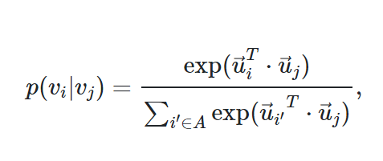
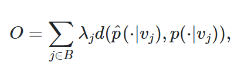
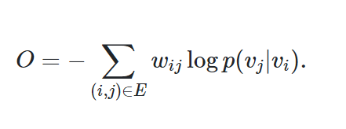
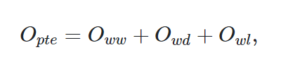
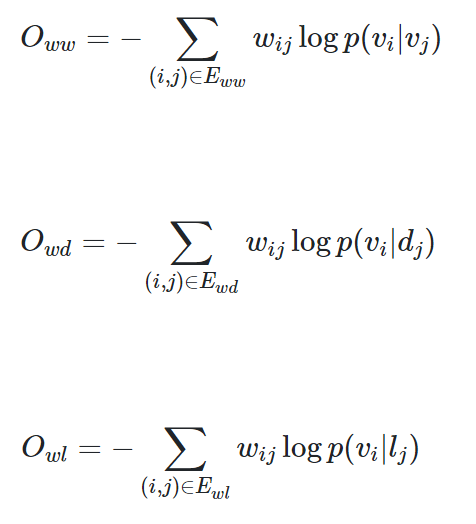
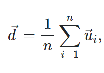
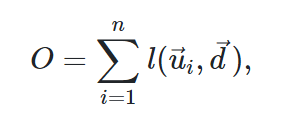

# 【论文笔记】PTE：预测性文本嵌入

## PTE: Predictive Text Embedding through Large-scale Heterogeneous Text Networks

[Arxiv 1508.00200](https://arxiv.org/abs/1508.00200/)

## 三、问题定义

让我们首先正式定义异构文本网络上的预测性文本嵌入的问题。 与无监督的文本嵌入方法（包括学习文本的一般语义表示的 Skip-gram 和段落向量）相比，我们的目标是学习为给定文本分类任务优化的文本表示。 换句话说，我们预期文本嵌入对给定任务具有强大的预测性表现力。 基本思想是在学习文本嵌入时合并有标签和无标签的信息。 为了实现这一点，希望首先具有统一表示来编码两种类型的信息。 在本文中，我们提出了不同类型的网络来实现这一点，包括单词共现网络，单词文档网络和单词标签网络。

定义 1（单词共现网络）：单词共现网络，表示为`G[ww] = (V, E[ww])`，在无标签数据的本地上下文中捕获单词共现信息。 `V`是单词的词汇表，`E[ww]`是单词之间的边的集合。单词`v[i]`和`v[j]`之间的边缘的权重`w[ij]`，被定义为两个单词在给定窗口大小的上下文窗口中共同出现的次数。

单词网络捕获本地上下文中的单词共现，这是现有单词嵌入方法（如 Skip-gram）使用的基本信息。 除了本地上下文之外，文档层面的单词共现也在经典文本表示中被广泛探索，例如统计主题模型，例如潜在的 Dirichlet 分配 [4]。 为了捕获文档级单词共现，我们引入了另一个网络，单词文档网络，定义如下：

定义 2（单词文档网络）：单词文档网络，表示为`G[wd] = (V∪D, E[wd]`)，是一个二分网络，其中`D`是一组文档，`V`是一组单词。`E[ wd]`是单词和文档之间的边集。 单词`v[i]`和文档`d[j]`之间的权重`w[ij]`简单地定义为`v[i]`出现在文档`d[j]`中的次数。

单词和单词文档网络在大规模语料库中编码未标记的信息，在本地上下文级别和文档级别捕获单词共现。 为了对带标签信息进行编码，我们引入了单词标签网络，它捕获了类别级别的单词共现。

定义 3（单词标签网络）：单词标签网络，表示为`G[wl] = (V∪L, E[ wl])`，是一个捕获类别级别单词共现的二分网络。 `L`是一组类标签，`V`是一组单词。 `E[wl]`是单词和类别之间的边集。 单词`v[i]`和类`c[j]`之间的边的权重`w[ij]`定义为：`w[ij] = Σn[di], d: l[d] = j`，其中`n[di]`是文档`d`中单词`v[i]`的术语频率，`l[d]`是文档`d`的类标签。

上述三种类型的网络可以进一步集成到一个异构文本网络中。

定义 4（异构文本网络）：异构文本网络是由无标签和带标签的文本数据构成单词，单词文档和单词标签网络的组合。 它捕获不同级别的单词共现，并包含带标签和无标签的信息。

注意，异构文本网络的定义可以概括为其他类型的网络的集成，例如单词句子，单词段落和文档标签网络。 在这项工作中，我们使用三种类型的网络（单词单词，单词文档和单词标签）作为说明性示例。 我们特别关注单词共现网络，以便首先将单词表示为低维空间。 然后可以通过聚合单词表示来计算其他文本单元（例如，句子或段落）的表示。

最后，我们正式定义预测性文本嵌入问题如下：

定义 5（预测性文本嵌入）：给定具有无标签和带标签信息的大量文本数据集合，预测性文本嵌入的问题，旨在通过将从集合构造的异构文本网络嵌入到低维向量空间中，来学习单词的低维表示。

## 四、预测性文本嵌入

在本节中，我们介绍了通过异构文本网络来学习预测性文本嵌入的方法。 我们的方法首先通过将由自由文本构造的异构文本网络，嵌入到低维空间中，来学习单词的向量表示，然后基于所学习的单词向量推断文本嵌入。 由于异构文本网络由三个二分网络组成，我们首先介绍一种嵌入单个二分网络的方法。

### 4.1 二分网络嵌入

在我们之前的工作中，我们引入了 LINE 模型来学习大规模信息网络的嵌入 [27]。 LINE 主要用于同构网络，即具有相同类型节点的网络。 LINE 不能直接应用于异构网络，因为不同类型边上的权重不可比较。 在这里，我们首先调整 LINE 模型以嵌入二分网络。 基本思想是利用顶点之间的二阶邻近 [27]，假设具有相似邻域的顶点彼此相似，因此应在低维空间中紧密表示。

给定二分网络`G = (V[A]∪V[B], E)`，其中`V[A]`和`V[ B]`是不同类型的两个不相交的顶点集合，`E`是它们之间的边集合。 我们首先将集合`V[A]`中的顶点`v[i]`由集合`V[B]`中的顶点`v[j]`生成的条件概率定义为：

 (1)

其中`u[i]`是`V[A]`中顶点`v[i]`的嵌入向量，`u[j]`是`V[B]`中顶点`v[j]`的嵌入向量。 对于`V[B]`中的每个顶点`v[j]`，公式（1）定义了集合`V[A]`中所有顶点上的条件分布`p(·| v[j])`; 对于每对顶点`v[j], v[j']`，二阶邻近度实际上可以通过它们的条件分布`p(·| v[j])`，`p(·| v[j'])`来确定。 为了保留二阶邻近度，我们可以使条件分布`p(·| v[j])`接近其经验分布`^p(·| v[j])`，这可以通过最小化以下目标函数来实现：

 (2)

其中`d(·,·)`是两个分布之间的 KL 散度，`λ[j]`是网络中顶点`v[j]`的重要性，可以设置为`deg[j]=Σi(w[ij])`，并且经验分布可以定义为`^p(v[i]|v[j]) = w[ij]/deg[j]`。 省略一些常量，目标函数（2）可以计算为：

 (3)

可以使用边采样 [27] 和负采样 [18] 的技术，利用随机梯度下降来优化目标（3）。 在每个步骤中，以与其权重`w[ij]`成比例的概率对二元边`e =(i, j)`进行采样，同时从噪声分布`p[n](j)`中采样多个负边`(i, j)`。 采样过程解决了学习网络嵌入中随机梯度下降的显着不足。 有关详细的优化过程，读者可以参考 [27]。

通过上述模型可以学习单词单词，单词文档和单词标签网络的嵌入。 注意，通过将每个无向边视为两个有向边，单词单词网络本质上是二分网络，然后`V[A]`被定义为源节点的集合，`V[B]`被定义为目标节点的集合。 因此，我们可以根据公式（1）定义条件概率`p(v[i] | v[j])`，`p(v[i]| d[j])`和`p(v[i] | l[j])`，然后通过优化目标函数（3）来学习嵌入。 接下来，我们将介绍嵌入异构文本网络的方法。

### 4.2 异构文本网络嵌入

异构文本网络由三个二分网络组成：单词单词，单词文档和单词标签网络，其中单词顶点在三个网络中共享。 为了学习异构文本网络的嵌入，一种直观的方法是联合嵌入三个二分网络，这可以通过最小化以下目标函数来实现：

 (4)

其中

 (5,6,7)

可以以不同方式优化目标函数（4），这取决于如何使用标签信息，即单词标签网络。 一种解决方案是使用不带标签的数据（单词单词和单词文档网络）和带标签数据同时训练模型。 我们将此方法称为联合训练。 另一种解决方案是首先使用无标签的数据学习嵌入，然后使用单词标签网络微调嵌入。 这是深度学习文献中预训练和微调的想法带来的启发 [2]。

在联合训练中，所有三种类型的网络一起使用。 优化目标（4）的直接解决方案是合并三组`E[ww]`，`E[wd]`，`E[wl]`中的所有边，然后部署边采样 [27]，其在每个步骤中对边采样来更新模型， 采样概率与其权重成正比。 然而，当网络是异构的时，不同类型的顶点之间的边的权重不能相互比较。更合理的解决方案是从三组边交替采样。 我们在算法 1 总结了详细训练算法。

```
Algorithm 1: Joint training.
----------------------------
Data: G[ww], G[wd], G[wl], 
      number of samples T, 
      number of negative samples K.
Result: word embeddings w.
while iter ≤ T do
    sample an edge from E[ww] and draw K negative edges,
    and update the word embeddings;
    sample an edge from E[wd] and draw K negative edges,
    and update the word and document embeddings;
    sample an edge from E[wl] and draw K negative edges,
    and update the word and label embeddings;
end

Algorithm 2: Pre-training + Fine-tuning.
----------------------------------------
Data: G[ww], G[wd], G[wl], 
      number of samples T, 
      number of negative samples K.
Result: word embeddings w.
while iter ≤ T do
    sample an edge from Eww and draw K negative edges,
    and update the word embeddings;
    sample an edge from Ewd and draw K negative edges,
    and update the word and document embeddings;
end
while iter ≤ T do
    sample an edge from Ewl and draw K negative edges,
    and update the word and label embeddings;
end
```

同样，我们总结了算法 2 中预训练和微调的训练过程。

### 4.3 文本嵌入

异构文本网络编码不同级别的单词共现，从无标签数据和特定分类任务的带标签信息中提取。 因此，通过嵌入异构文本网络而学习的单词表示不仅更健壮，而且还针对该任务进行了优化。 一旦学习了单词向量，就可以通过简单地平均该段文本中的单词的向量来获得任意一段文本的表示。 也就是说，一段文本`d = w[1], w[2], ..., w[n]`的向量表示可以被计算为。

 (8)

其中`u[i]`是单词`w[i]`的嵌入。 实际上，词嵌入的平均值是最小化以下目标函数的解决方案：

 (9)

其中词嵌入`u[i]`和文本嵌入`d`之间的损失函数`l(·, ·)`被指定为欧几里德距离。 相关的是段落向量 [10] 的推理过程，它最小化了相同的目标，但具有不同的损失函数`l(u[i], d) = σ(u[i]^T d)`。 然而，它不会产生封闭形式的解，必须通过梯度下降算法进行优化。

