# 第一部分 回归

## 二、回归 - 引言和数据

欢迎阅读 Python 机器学习系列教程的回归部分。这里，你应该已经安装了 Scikit-Learn。如果没有，安装它，以及 Pandas 和 Matplotlib。

```
pip install numpy

pip install scipy

pip install scikit-learn

pip install matplotlib

pip install pandas
```

除了这些教程范围的导入之外，我们还要在这里使用 Quandl：

```
pip install quandl
```

首先，对于我们将其用于机器学习而言，什么是回归呢？它的目标是接受连续数据，寻找最适合数据的方程，并能够对特定值进行预测。使用简单的线性回归，你可以仅仅通过创建最佳拟合直线，来实现它。

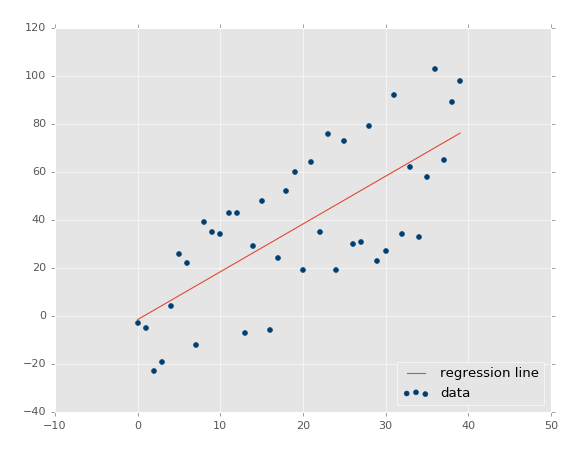

这里，我们可以使用这条直线的方程，来预测未来的价格，其中日期是 x 轴。

回归的热门用法是预测股票价格。由于我们会考虑价格随时间的流动，并且使用连续的数据集，尝试预测未来的下一个流动价格，所以可以这样做。

回归是监督的机器学习的一种，也就是说，科学家向其展示特征，之后向其展示正确答案来教会机器。一旦教会了机器，科学家就能够使用一些不可见的数据来测试机器，其中科学家知道正确答案，但是机器不知道。机器的答案会与已知答案对比，并且度量机器的准确率。如果准确率足够高，科学家就会考虑将其算法用于真实世界。

由于回归广泛用于股票价格，我们可以使用一个示例从这里开始。最开始，我们需要数据。有时候数据易于获取，有时你需要出去并亲自收集。我们这里，我们至少能够以简单的股票价格和成交量信息开始，它们来自 Quandl。我们会抓取 Google 的股票价格，它的代码是`GOOGL`：

```py
import pandas as pd
import quandl

df = quandl.get("WIKI/GOOGL")

print(df.head())
```

注意：写这篇文章的时候，Quandl 的模块使用大写 Q 引用，但现在是小写 q，所以`import quandl`。

到这里，我们拥有：

```
              Open    High     Low   Close    Volume  Ex-Dividend  \
Date                                                                
2004-08-19  100.00  104.06   95.96  100.34  44659000            0   
2004-08-20  101.01  109.08  100.50  108.31  22834300            0   
2004-08-23  110.75  113.48  109.05  109.40  18256100            0   
2004-08-24  111.24  111.60  103.57  104.87  15247300            0   
2004-08-25  104.96  108.00  103.88  106.00   9188600            0   

            Split Ratio  Adj. Open  Adj. High  Adj. Low  Adj. Close  \
Date                                                                  
2004-08-19            1     50.000      52.03    47.980      50.170   
2004-08-20            1     50.505      54.54    50.250      54.155   
2004-08-23            1     55.375      56.74    54.525      54.700   
2004-08-24            1     55.620      55.80    51.785      52.435   
2004-08-25            1     52.480      54.00    51.940      53.000   

            Adj. Volume  
Date                     
2004-08-19     44659000  
2004-08-20     22834300  
2004-08-23     18256100  
2004-08-24     15247300  
2004-08-25      9188600 
```

这是个非常好的开始，我们拥有了数据，但是有点多了。

这里，我们有很多列，许多都是多余的，还有些不怎么变化。我们可以看到，常规和修正（Adj）的列是重复的。修正的列看起来更加理想。常规的列是当天的价格，但是股票有个叫做分拆的东西，其中一股突然就变成了两股，所以一股的价格要减半，但是公司的价值不变。修正的列为股票分拆而调整，这使得它们对于分析更加可靠。

所以，让我们继续，削减原始的 DataFrame。

```py
df = df[['Adj. Open',  'Adj. High',  'Adj. Low',  'Adj. Close', 'Adj. Volume']]
```

现在我们拥有了修正的列，以及成交量。有一些东西需要注意。许多人谈论或者听说机器学习，就像无中生有的黑魔法。机器学习可以突出已有的数据，但是数据需要先存在。你需要有意义的数据。所以你怎么知道是否有意义呢？我的最佳建议就是，仅仅简化你的大脑。考虑一下，历史价格会决定未来价格吗？有些人这么认为，但是久而久之这被证实是错误的。但是历史规律呢？突出的时候会有意义（机器学习会有所帮助），但是还是太弱了。那么，价格变化和成交量随时间的关系，再加上历史规律呢？可能更好一点。所以，你已经能够看到，并不是数据越多越好，而是我们需要使用有用处的数据。同时，原始数据应该做一些转换。

考虑每日波动，例如最高价减最低价的百分比差值如何？每日的百分比变化又如何呢？你觉得`Open, High, Low, Close`这种简单数据，还是`Close, Spread/Volatility, %change daily`更好？我觉得后者更好一点。前者都是非常相似的数据点，后者基于前者的统一数据创建，但是带有更加有价值的信息。

所以，并不是你拥有的所有数据都是有用的，并且有时你需要对你的数据执行进一步的操作，并使其更加有价值，之后才能提供给机器学习算法。让我们继续并转换我们的数据：

```py
df['HL_PCT'] = (df['Adj. High'] - df['Adj. Low']) / df['Adj. Close'] * 100.0
```

这会创建一个新的列，它是基于收盘价的百分比极差，这是我们对于波动的粗糙度量。下面，我们会计算每日百分比变化：

```py
df['PCT_change'] = (df['Adj. Close'] - df['Adj. Open']) / df['Adj. Open'] * 100.0
```
现在我们会定义一个新的 DataFrame：

```py
df = df[['Adj. Close', 'HL_PCT', 'PCT_change', 'Adj. Volume']]
print(df.head())
```

```
            Adj. Close    HL_PCT  PCT_change  Adj. Volume
Date                                                     
2004-08-19      50.170  8.072553    0.340000     44659000
2004-08-20      54.155  7.921706    7.227007     22834300
2004-08-23      54.700  4.049360   -1.218962     18256100
2004-08-24      52.435  7.657099   -5.726357     15247300
2004-08-25      53.000  3.886792    0.990854      9188600
```


## 三、回归 - 特征和标签

基于上一篇机器学习回归教程，我们将要对我们的股票价格数据执行回归。目前的代码：

```py
import quandl
import pandas as pd

df = quandl.get("WIKI/GOOGL")
df = df[['Adj. Open',  'Adj. High',  'Adj. Low',  'Adj. Close', 'Adj. Volume']]
df['HL_PCT'] = (df['Adj. High'] - df['Adj. Low']) / df['Adj. Close'] * 100.0
df['PCT_change'] = (df['Adj. Close'] - df['Adj. Open']) / df['Adj. Open'] * 100.0
df = df[['Adj. Close', 'HL_PCT', 'PCT_change', 'Adj. Volume']]
print(df.head())
```

这里我们已经获取了数据，判断出有价值的数据，并通过操作创建了一些。我们现在已经准备好使用回归开始机器学习的过程。首先，我们需要一些更多的导入。所有的导入是：

```py
import quandl, math
import numpy as np
import pandas as pd
from sklearn import preprocessing, cross_validation, svm
from sklearn.linear_model import LinearRegression
```

我们会使用`numpy`模块来将数据转换为 NumPy 数组，它是 Sklearn 的预期。我们在用到`preprocessing `和`cross_validation `时，会深入谈论他们，但是预处理是用于在机器学习之前，对数据清洗和缩放的模块。交叉验证在测试阶段使用。最后，我们也从 Sklearn 导入了`LinearRegression`算法，以及`svm`。它们用作我们的机器学习算法来展示结果。

这里，我们已经获取了我们认为有用的数据。真实的机器学习如何工作呢？使用监督式学习，你需要特征和标签。特征就是描述性属性，标签就是你尝试预测的结果。另一个常见的回归示例就是尝试为某个人预测保险的保费。保险公司会收集你的年龄、驾驶违规行为、公共犯罪记录，以及你的信用评分。公司会使用老客户，获取数据，并得出应该给客户的“理想保费”，或者如果他们觉得有利可图的话，他们会使用实际使用的客户。

所以，对于训练机器学习分类器来说，特征是客户属性，标签是和这些属性相关的保费。

我们这里，什么是特征和标签呢？我们尝试预测价格，所以价格就是标签？如果这样，什么是特征呢？对于预测我们的价格来说，我们的标签，就是我们打算预测的东西，实际上是未来价格。这样，我们的特征实际上是：当前价格、HL 百分比和百分比变化。标签价格是未来某个点的价格。让我们继续添加新的行：

```py
forecast_col = 'Adj. Close'
df.fillna(value=-99999, inplace=True)
forecast_out = int(math.ceil(0.01 * len(df)))
```

这里，我们定义了预测列，之后我们将任何 NaN 数据填充为 -99999。对于如何处理缺失数据，你有一些选择，你不能仅仅将 NaN（不是数值）数据点传给机器学习分类西，你需要处理它。一个主流选项就是将缺失值填充为 -99999。在许多机器学习分类器中，会将其是被为离群点。你也可以仅仅丢弃包含缺失值的所有特征或标签，但是这样你可能会丢掉大量的数据。

真实世界中，许多数据集都很混乱。多数股价或成交量数据都很干净，很少有缺失数据，但是许多数据集会有大量缺失数据。我见过一些数据集，大量的行含有缺失数据。你并不一定想要失去所有不错的数据，如果你的样例数据有一些缺失，你可能会猜测真实世界的用例也有一些缺失。你需要训练、测试并依赖相同数据，以及数据的特征。

最后，我们定义我们需要预测的东西。许多情况下，就像尝试预测客户的保费的案例中，你仅仅需要一个数字，但是对于预测来说，你需要预测指定数量的数据点。我们假设我们打算预测数据集整个长度的 1%。因此，如果我们的数据是 100 天的股票价格，我们需要能够预测未来一天的价格。选择你想要的那个。如果你只是尝试预测明天的价格，你应该选取一天之后的数据，而且也只能一天之后的数据。如果你打算预测 10 天，我们可以为每一天生成一个预测。

我们这里，我们决定了，特征是一系列当前值，标签是未来的价格，其中未来是数据集整个长度的 1%。我们假设所有当前列都是我们的特征，所以我们使用一个简单的 Pnadas 操作添加一个新的列：

```py
df['label'] = df[forecast_col].shift(-forecast_out)
```

现在我们拥有了数据，包含特征和标签。下面我们在实际运行任何东西之前，我们需要做一些预处理和最终步骤，我们在下一篇教程会关注。


## 四、回归 - 训练和测试

欢迎阅读 Python 机器学习系列教程的第四部分。在上一个教程中，我们获取了初始数据，按照我们的喜好操作和转换数据，之后我们定义了我们的特征。Scikit 不需要处理 Pandas 和 DataFrame，我出于自己的喜好而处理它，因为它快并且高效。反之，Sklearn 实际上需要 NumPy 数组。Pandas 的 DataFrame 可以轻易转换为 NumPy 数组，所以事情就是这样的。

目前为止我们的代码：

```py
import quandl, math
import numpy as np
import pandas as pd
from sklearn import preprocessing, cross_validation, svm
from sklearn.linear_model import LinearRegression

df = quandl.get("WIKI/GOOGL")

print(df.head())
#print(df.tail())

df = df[['Adj. Open',  'Adj. High',  'Adj. Low',  'Adj. Close', 'Adj. Volume']]

df['HL_PCT'] = (df['Adj. High'] - df['Adj. Low']) / df['Adj. Close'] * 100.0
df['PCT_change'] = (df['Adj. Close'] - df['Adj. Open']) / df['Adj. Open'] * 100.0

df = df[['Adj. Close', 'HL_PCT', 'PCT_change', 'Adj. Volume']]
print(df.head())

forecast_col = 'Adj. Close'
df.fillna(value=-99999, inplace=True)
forecast_out = int(math.ceil(0.01 * len(df)))

df['label'] = df[forecast_col].shift(-forecast_out)
```

我们之后要丢弃所有仍旧是 NaN 的信息。

```py
df.dropna(inplace=True)
```

对于机器学习来说，通常要定义`X`（大写）作为特征，和`y`（小写）作为对于特征的标签。这样，我们可以定义我们的特征和标签，像这样：

```py
X = np.array(df.drop(['label'], 1))
y = np.array(df['label'])
```

上面，我们所做的就是定义`X`（特征），是我们整个的 DataFrame，除了`label`列，并转换为 NumPy 数组。我们使用`drop`方法，可以用于 DataFrame，它返回一个新的 DataFrame。下面，我们定义我们的`y`变量，它是我们的标签，仅仅是 DataFrame 的标签列，并转换为 NumPy 数组。

现在我们就能告一段落，转向训练和测试了，但是我们打算做一些预处理。通常，你希望你的特征在 -1 到 1 的范围内。这可能不起作用，但是通常会加速处理过程，并有助于准确性。因为大家都使用这个范围，它包含在了 Sklearn 的`preprocessing`模块中。为了使用它，你需要对你的`X`变量调用` preprocessing.scale`。

```py
X = preprocessing.scale(X)
```

下面，创建标签`y`：

```py
y = np.array(df['label'])
```

现在就是训练和测试的时候了。方式就是选取 75% 的数据用于训练机器学习分类器。之后选取剩下的 25% 的数据用于测试分类器。由于这是你的样例数据，你应该拥有特征和一直标签。因此，如果你测试后 25% 的数据，你就会得到一种准确度和可靠性，叫做置信度。有许多方式可以实现它，但是，最好的方式可能就是使用内建的`cross_validation`，因为它也会为你打乱数据。代码是这样：

```py
X_train, X_test, y_train, y_test = cross_validation.train_test_split(X, y, test_size=0.2)
```

这里的返回值是特征的训练集、测试集、标签的训练集和测试集。现在，我们已经定义好了分类器。Sklearn 提供了许多通用的分类器，有一些可以用于回归。我们会在这个例子中展示一些，但是现在，让我们使用`svm`包中的支持向量回归。

```py
clf = svm.SVR()
```

我们这里仅仅使用默认选项来使事情简单，但是你可以在[`sklearn.svm.SVR`](https://scikit-learn.org/stable/modules/generated/sklearn.svm.SVR.html)的文档中了解更多。

一旦你定义了分类器，你就可以训练它了。在 Sklearn 中，使用`fit`来训练。

```py
clf.fit(X_train, y_train)
```

这里，我们拟合了我们的训练特征和训练标签。

我们的分类器现在训练完毕。这非常简单，现在我们可以测试了。

```py
confidence = clf.score(X_test, y_test)
```

加载测试，之后：

```py
print(confidence)
# 0.960075071072
```

所以这里，我们可以看到准确率几乎是 96%。没有什么可说的，让我们尝试另一个分类器，这一次使用`LinearRegression`：

```py
clf = LinearRegression()
# 0.963311624499
```

更好一点，但是基本一样。所以作为科学家，我们如何知道，选择哪个算法呢？不久，你会熟悉什么在多数情况下都工作，什么不工作。你可以从 Scikit 的站点上查看[选择正确的评估工具](https://scikit-learn.org/stable/tutorial/machine_learning_map/)。这有助于你浏览一些基本的选项。如果你询问搞机器学习的人，它完全是试验和出错。你会尝试大量的算法并且仅仅选取最好的那个。要注意的另一件事情就是，一些算法必须线性运行，其它的不是。不要把线性回归和线性运行搞混了。所以这些意味着什么呢？一些机器学习算法会一次处理一步，没有多线程，其它的使用多线程，并且可以利用你机器上的多核。你可以深入了解每个算法，来弄清楚哪个可以多线程，或者你可以阅读文档，并查看`n_jobs`参数。如果拥有`n_jobs`，你就可以让算法通过多线程来获取更高的性能。如果没有，就很不走运了。所以，如果你处理大量的数据，或者需要处理中等规模的数据，但是需要很高的速度，你就可能想要线程加速。让我们看看这两个算法。

访问[`sklearn.svm.SVR`](https://scikit-learn.org/stable/modules/generated/sklearn.svm.SVR.html)的文档，并查看参数，看到`n_jobs`了嘛？反正我没看到，所以它就不能使用线程。你可能会看到，在我们的小型数据集上，差异不大。但是，假设数据集由 20MB，差异就很明显。然后，我们查看`LinearRegression`算法，看到`n_jobs`了嘛？当然，所以这里，你可以指定你希望多少线程。如果你传入`-1`，算法会使用所有可用的线程。

这样：

```py
clf = LinearRegression(n_jobs=-1)
```

就够了。虽然我让你做了很少的事情（查看文档），让我给你说个事实吧，仅仅由于机器学习算法使用默认参数工作，不代表你可以忽略它们。例如，让我们回顾`svm.SVR`。SVR 是支持向量回归，在执行机器学习时，它是一种架构。我非常鼓励那些有兴趣学习更多的人，去研究这个主题，以及向比我学历更高的人学习基础。我会尽力把东西解释得更简单，但是我并不是专家。回到刚才的话题，`svm.SVR`有一个参数叫做`kernel`。这个是什么呢？核就相当于你的数据的转换。这使得处理过程更加迅速。在`svm.SVR`的例子中，默认值是`rbf`，这是核的一个类型，你有一些选择。查看文档，你可以选择`'linear', 'poly', 'rbf', 'sigmoid', 'precomputed'`或者一个可调用对象。同样，就像尝试不同的 ML 算法一样，你可以做你想做的任何事情，尝试一下不同的核吧。

```py
for k in ['linear','poly','rbf','sigmoid']:
    clf = svm.SVR(kernel=k)
    clf.fit(X_train, y_train)
    confidence = clf.score(X_test, y_test)
    print(k,confidence)
```

```py
linear 0.960075071072
poly 0.63712232551
rbf 0.802831714511
sigmoid -0.125347960903
```

我们可以看到，线性的核表现最好，之后是`rbf`，之后是`poly`，`sigmoid`很显然是个摆设，并且应该移除。

所以我们训练并测试了数据集。我们已经有 71% 的满意度了。下面我们做什么呢？现在我们需要再进一步，做一些预测，下一章会涉及它。


## 五、预测

欢迎阅读机器学习系列教程的第五章，当前涉及到回归。目前为止，我们收集并修改了数据，训练并测试了分类器。这一章中，我们打算使用我们的分类器来实际做一些预测。我们目前所使用的代码为：

```py
import quandl, math
import numpy as np
import pandas as pd
from sklearn import preprocessing, cross_validation, svm
from sklearn.linear_model import LinearRegression

df = quandl.get("WIKI/GOOGL")
df = df[['Adj. Open',  'Adj. High',  'Adj. Low',  'Adj. Close', 'Adj. Volume']]
df['HL_PCT'] = (df['Adj. High'] - df['Adj. Low']) / df['Adj. Close'] * 100.0
df['PCT_change'] = (df['Adj. Close'] - df['Adj. Open']) / df['Adj. Open'] * 100.0

df = df[['Adj. Close', 'HL_PCT', 'PCT_change', 'Adj. Volume']]
forecast_col = 'Adj. Close'
df.fillna(value=-99999, inplace=True)
forecast_out = int(math.ceil(0.01 * len(df)))
df['label'] = df[forecast_col].shift(-forecast_out)

X = np.array(df.drop(['label'], 1))
X = preprocessing.scale(X)
X = X[:-forecast_out]
df.dropna(inplace=True)
y = np.array(df['label'])
X_train, X_test, y_train, y_test = cross_validation.train_test_split(X, y, test_size=0.2)

clf = LinearRegression(n_jobs=-1)
clf.fit(X_train, y_train)
confidence = clf.score(X_test, y_test)
print(confidence)
```

我会强调，准确率大于 95% 的线性模型并不是那么好。我当然不会用它来交易股票。仍然有一些需要考虑的问题，特别是不同公司有不同的价格轨迹。Google 非常线性，向右上角移动，许多公司不是这样，所以要记住。现在，为了做预测，我们需要一些数据。我们决定预测 1% 的数据，因此我们打算，或者至少能够预测数据集的后 1%。所以我们什么可以这样做呢？我们什么时候可以识别这些数据？我们现在就可以，但是要注意我们尝试预测的数据，并没有像训练集那样缩放。好的，那么做什么呢？是否要对后 1% 调用`preprocessing.scale()`？缩放方法基于所有给它的已知数据集。理想情况下，你应该一同缩放训练集、测试集和用于预测的数据。这永远是可能或合理的嘛？不是，如果你可以这么做，你就应该这么做。但是，我们这里，我们可以这么做。我们的数据足够小，并且处理时间足够低，所以我们会一次性预处理并缩放数据。

在许多例子中，你不能这么做。想象如果你使用几个 GB 的数据来训练分类器。训练分类器会花费几天，不能在每次想要做出预测的时候都这么做。因此，你可能需要不缩放任何东西，或者单独缩放数据。通常，你可能希望测试这两个选项，并看看那个对于你的特定案例更好。

要记住它，让我们在定义`X`的时候处理所有行：

```py
X = np.array(df.drop(['label'], 1))
X = preprocessing.scale(X)
X_lately = X[-forecast_out:]
X = X[:-forecast_out]

df.dropna(inplace=True)

y = np.array(df['label'])

X_train, X_test, y_train, y_test = cross_validation.train_test_split(X, y, test_size=0.2)
clf = LinearRegression(n_jobs=-1)
clf.fit(X_train, y_train)
confidence = clf.score(X_test, y_test)
print(confidence)
```

要注意我们首先获取所有数据，预处理，之后再分割。我们的`X_lately`变量包含最近的特征，我们需要对其进行预测。目前你可以看到，定义分类器、训练、和测试都非常简单。预测也非常简单：

```py
forecast_set = clf.predict(X_lately)
```

`forecast_set `是预测值的数组，表明你不仅仅可以做出单个预测，还可以一次性预测多个值。看看我们目前拥有什么：

```
[ 745.67829395  737.55633261  736.32921413  717.03929303  718.59047951
  731.26376715  737.84381394  751.28161162  756.31775293  756.76751056
  763.20185946  764.52651181  760.91320031  768.0072636   766.67038016
  763.83749414  761.36173409  760.08514166  770.61581391  774.13939706
  768.78733341  775.04458624  771.10782342  765.13955723  773.93369548
  766.05507556  765.4984563   763.59630529  770.0057166   777.60915879] 0.956987938167 30
```

所以这些就是我们的预测结果，然后呢？已经基本完成了，但是我们可以将其可视化。股票价格是每一天的，一周 5 天，周末没有。我知道这个事实，但是我们打算将其简化，把每个预测值当成每一天的。如果你打算处理周末的间隔（不要忘了假期），就去做吧，但是我这里会将其简化。最开始，我们添加一些新的导入：

```py
import datetime
import matplotlib.pyplot as plt
from matplotlib import style
```

我导入了`datetime`来处理`datetime`对象，Matplotlib 的`pyplot`包用于绘图，以及`style`来使我们的绘图更加时髦。让我们设置一个样式：


```py
style.use('ggplot')
```

之后，我们添加一个新的列，`forecast`列：


```py
df['Forecast'] = np.nan
```

我们首先将值设置为 NaN，但是我们之后会填充他。

预测集的标签正好从明天开始。因为我们要预测未来`m = 0.1 * len(df)`天的数据，相当于把收盘价往前移动`m`天生成标签。那么数据集的后`m`个是不能用作训练集和测试集的，因为没有标签。于是我们将后`m`个数据用作预测集。预测集的第一个数据，也就是数据集的第`n - m`个数据，它的标签应该是`n - m + m = n`天的收盘价，我们知道今天在`df`里面是第`n - 1`天，那么它就是明天。

我们首先需要抓取 DataFrame 的最后一天，将每一个新的预测值赋给新的日期。我们会这样开始。

```py
last_date = df.iloc[-1].name
last_unix = last_date.timestamp()
one_day = 86400
next_unix = last_unix + one_day
```

现在我们拥有了预测集的起始日期，并且一天有 86400 秒。现在我们将预测添加到现有的 DataFrame 中。

```py
for i in forecast_set:
    next_date = datetime.datetime.fromtimestamp(next_unix)
    next_unix += 86400
    df.loc[next_date] = [np.nan for _ in range(len(df.columns)-1)]+[i]
```

我们这里所做的是，迭代预测集的标签，获取每个预测值和日期，之后将这些值放入 DataFrame（使预测集的特征为 NaN）。最后一行的代码创建 DataFrame 中的一行，所有元素置为 NaN，然后将最后一个元素置为`i`（这里是预测集的标签）。我选择了这种单行的`for`循环，以便在改动 DataFrame 和特征之后，代码还能正常工作。所有东西都做完了吗？将其绘制出来。

```py
df['Adj. Close'].plot()
df['Forecast'].plot()
plt.legend(loc=4)
plt.xlabel('Date')
plt.ylabel('Price')
plt.show()
```

完整的代码：

```py
import Quandl, math
import numpy as np
import pandas as pd
from sklearn import preprocessing, cross_validation, svm
from sklearn.linear_model import LinearRegression
import matplotlib.pyplot as plt
from matplotlib import style
import datetime

style.use('ggplot')

df = Quandl.get("WIKI/GOOGL")
df = df[['Adj. Open',  'Adj. High',  'Adj. Low',  'Adj. Close', 'Adj. Volume']]
df['HL_PCT'] = (df['Adj. High'] - df['Adj. Low']) / df['Adj. Close'] * 100.0
df['PCT_change'] = (df['Adj. Close'] - df['Adj. Open']) / df['Adj. Open'] * 100.0

df = df[['Adj. Close', 'HL_PCT', 'PCT_change', 'Adj. Volume']]
forecast_col = 'Adj. Close'
df.fillna(value=-99999, inplace=True)
forecast_out = int(math.ceil(0.01 * len(df)))
df['label'] = df[forecast_col].shift(-forecast_out)

X = np.array(df.drop(['label'], 1))
X = preprocessing.scale(X)
X_lately = X[-forecast_out:]
X = X[:-forecast_out]

df.dropna(inplace=True)

y = np.array(df['label'])

X_train, X_test, y_train, y_test = cross_validation.train_test_split(X, y, test_size=0.2)
clf = LinearRegression(n_jobs=-1)
clf.fit(X_train, y_train)
confidence = clf.score(X_test, y_test)

forecast_set = clf.predict(X_lately)
df['Forecast'] = np.nan

last_date = df.iloc[-1].name
last_unix = last_date.timestamp()
one_day = 86400
next_unix = last_unix + one_day

for i in forecast_set:
    next_date = datetime.datetime.fromtimestamp(next_unix)
    next_unix += 86400
    df.loc[next_date] = [np.nan for _ in range(len(df.columns)-1)]+[i]

df['Adj. Close'].plot()
df['Forecast'].plot()
plt.legend(loc=4)
plt.xlabel('Date')
plt.ylabel('Price')
plt.show()
```

结果：

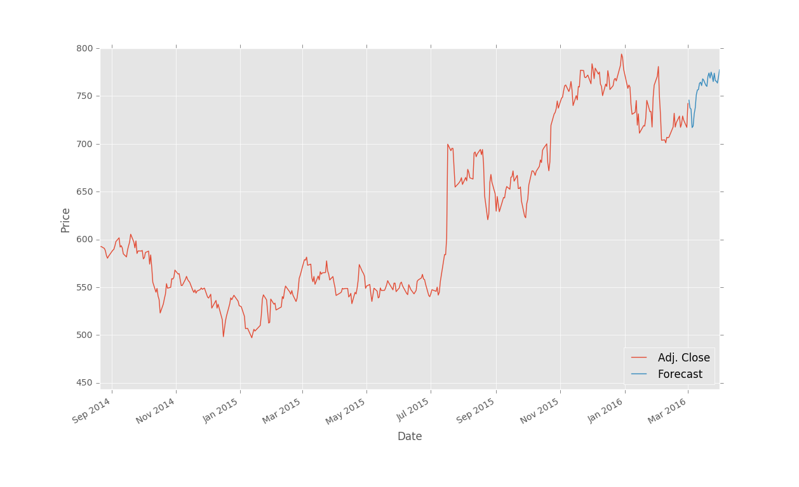

## 六、保存和扩展

上一篇教程中，我们使用回归完成了对股票价格的预测，并使用 Matplotlib 可视化。这个教程中，我们会讨论一些接下来的步骤。

我记得我第一次尝试学习机器学习的时候，多数示例仅仅涉及到训练和测试的部分，完全跳过了预测部分。对于那些包含训练、测试和预测部分的教程来说，我没有找到一篇解释保存算法的文章。在那些例子中，数据通常非常小，所以训练、测试和预测过程都很快。在真实世界中，数据都非常大，并且花费更长时间来处理。由于没有一篇教程真正谈论到这一重要的过程，我打算包含一些处理时间和保存算法的信息。

虽然我们的机器学习分类器花费几秒来训练，在一些情况下，训练分类器需要几个小时甚至是几天。想象你想要预测价格的每天都需要这么做。这不是必要的，因为我们呢可以使用 Pickle 模块来保存分类器。首先确保你导入了它：

```py
import pickle
```

使用 Pickle，你可以保存 Python 对象，就像我们的分类器那样。在定义、训练和测试你的分类器之后，添加：

```py
with open('linearregression.pickle','wb') as f:
    pickle.dump(clf, f)
```

现在，再次执行脚本，你应该得到了`linearregression.pickle`，它是分类器的序列化数据。现在，你需要做的所有事情就是加载`pickle`文件，将其保存到`clf`，并照常使用，例如：

```py
pickle_in = open('linearregression.pickle','rb')
clf = pickle.load(pickle_in)
```

代码中：

```py
import Quandl, math
import numpy as np
import pandas as pd
from sklearn import preprocessing, cross_validation, svm
from sklearn.linear_model import LinearRegression
import matplotlib.pyplot as plt
from matplotlib import style
import datetime
import pickle

style.use('ggplot')

df = Quandl.get("WIKI/GOOGL")
df = df[['Adj. Open',  'Adj. High',  'Adj. Low',  'Adj. Close', 'Adj. Volume']]
df['HL_PCT'] = (df['Adj. High'] - df['Adj. Low']) / df['Adj. Close'] * 100.0
df['PCT_change'] = (df['Adj. Close'] - df['Adj. Open']) / df['Adj. Open'] * 100.0

df = df[['Adj. Close', 'HL_PCT', 'PCT_change', 'Adj. Volume']]
forecast_col = 'Adj. Close'
df.fillna(value=-99999, inplace=True)
forecast_out = int(math.ceil(0.1 * len(df)))

df['label'] = df[forecast_col].shift(-forecast_out)

X = np.array(df.drop(['label'], 1))
X = preprocessing.scale(X)
X_lately = X[-forecast_out:]
X = X[:-forecast_out]

df.dropna(inplace=True)

y = np.array(df['label'])

X_train, X_test, y_train, y_test = cross_validation.train_test_split(X, y, test_size=0.2)
#COMMENTED OUT:
##clf = svm.SVR(kernel='linear')
##clf.fit(X_train, y_train)
##confidence = clf.score(X_test, y_test)
##print(confidence)
pickle_in = open('linearregression.pickle','rb')
clf = pickle.load(pickle_in)


forecast_set = clf.predict(X_lately)
df['Forecast'] = np.nan

last_date = df.iloc[-1].name
last_unix = last_date.timestamp()
one_day = 86400
next_unix = last_unix + one_day

for i in forecast_set:
    next_date = datetime.datetime.fromtimestamp(next_unix)
    next_unix += 86400
    df.loc[next_date] = [np.nan for _ in range(len(df.columns)-1)]+[i]
df['Adj. Close'].plot()
df['Forecast'].plot()
plt.legend(loc=4)
plt.xlabel('Date')
plt.ylabel('Price')
plt.show()
```

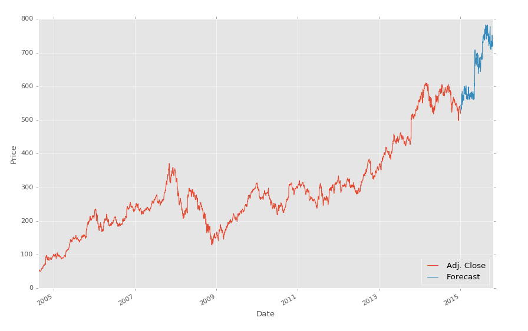

要注意我们注释掉了分类器的原始定义，并替换为加载我们保存的分类器。就是这么简单。

最后，我们要讨论一下效率和保存时间，前几天我打算提出一个相对较低的范式，这就是临时的超级计算机。严肃地说，随着按需主机服务的兴起，例如 AWS、DO 和 Linode，你能够按照小时来购买主机。虚拟服务器可以在 60 秒内建立，所需的模块可以在 15 分钟内安装，所以非常有限。你可以写一个 shell 脚本或者什么东西来给它加速。考虑你需要大量的处理，并且还没有一台顶级计算机，或者你使用笔记本。没有问题，只需要启动一台服务器。

我对这个方式的最后一个注解是，使用任何主机，你通常都可以建立一个非常小型的服务器，加载所需的东西，之后扩展这个服务器。我喜欢以一个小型服务器开始，之后，我准备好的时候，我会改变它的尺寸，给它升级。完成之后，不要忘了注销或者降级你的服务器。


## 七、回归 - 理论以及工作原理

欢迎阅读第七篇教程。目前为止，你已经看到了线性回归的价值，以及如何使用 Sklearn 来应用它。现在我们打算深入了解它如何计算。虽然我觉得不必要深入到每个机器学习算法数学中（你有没有进入到你最喜欢的模块的源码中，看看它是如何实现的？），线性代数是机器学习的本质，并且对于理解机器学习的构建基础十分实用。

线性代数的目标是计算向量空间中的点的关系。这可以用于很多事情，但是某天，有个人有了个非常狂野的想法，拿他处理数据集的特征。我们也可以。记得之前我们定义数据类型的时候，线性回归处理连续数据吗？这并不是因为使用线性回归的人，而是因为组成它的数学。简单的线性回归可用于寻找数据集的最佳拟合直线。如果数据不是连续的，就不是最佳拟合直线。让我们看看一些示例。

### 协方差

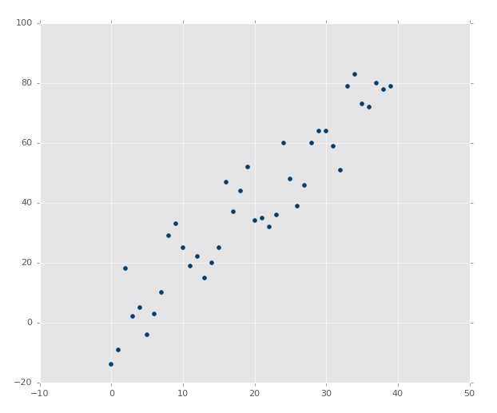

上面的图像显然拥有良好的协方差。如果你通过估计画一条最佳拟合直线，你应该能够轻易画出来：

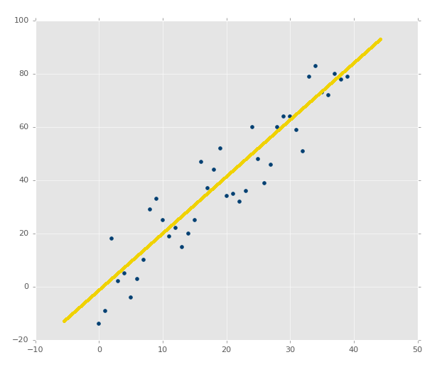

如果图像是这样呢？

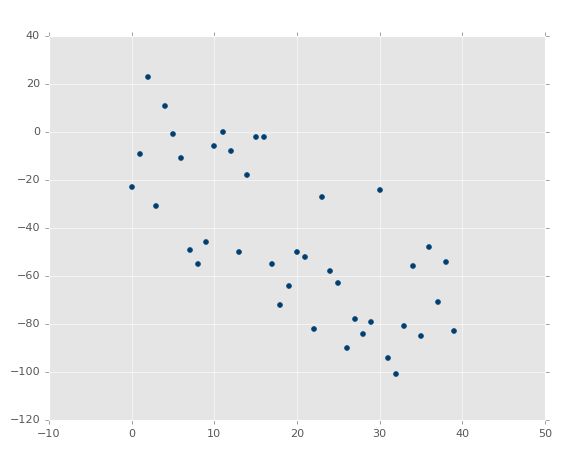

并不和之前一样，但是是清楚的负相关。你可能能够画出最佳拟合直线，但是更可能画不出来。

最后，这个呢？


啥？的确有最佳拟合直线，但是需要运气将其画出来。

将上面的图像看做特征的图像，所以 X 坐标是特征，Y 坐标是相关的标签。X 和 Y 是否有任何形式的结构化关系呢？虽然我们可以准确计算关系，未来我们就不太可能拥有这么多值了。

在其它图像的案例中，X 和 Y 之间显然存在关系。我们实际上可以探索这种关系，之后沿着我们希望的任何点绘图。我们可以拿 Y 来预测 X，或者拿 X 来预测 Y，对于任何我们可以想到的点。我们也可以预测我们的模型有多少的误差，即使模型只有一个点。我们如何实现这个魔法呢？当然是线性代数。

首先，让我们回到中学，我们在那里复习直线的定义：`y = mx + b`，其中`m`是斜率，`b`是纵截距。这可以是用于求解`y`的方程，我们可以将其变形来求解`x`，使用基本的代数原则：`x = (y-b)/m`。

好的，所以，我们的目标是寻找最佳拟合直线。不是仅仅是拟合良好的直线，而是最好的那条。这条直线的定义就是`y = mx + b`。`y`就是答案（我们其他的坐标，或者甚至是我们的特征），所以我们仍然需要`m`（斜率）和`b`（纵截距），由于`x`可能为沿 x 轴的任一点，所以它是已知的。

最佳拟合直线的斜率`m`定义为：


> 注：可简写为`m = cov(x, y) / var(x)`。

符号上面的横杠代表均值。如果两个符号挨着，就将其相乘。xs 和 ys 是所有已知坐标。所以我们现在求出了`y=mx+b`最佳拟合直线定义的`m`（斜率），现在我们仅仅需要`b`（纵截距）。这里是公式：


好的。整个部分不是个数学教程，而是个编程教程。下一个教程中，我们打算这样做，并且解释为什么我要编程实现它，而不是直接用模块。


## 八、回归 - 编程计算斜率

欢迎阅读第八篇教程，我们刚刚意识到，我们需要使用 Python 重复编写一些比较重要的算法，来尝试给定数据集的计算最佳拟合直线。

在我们开始之前，为什么我们会有一些小麻烦呢？线性回归是机器学习的构建基础。它几乎用于每个单独的主流机器学习算法之中，所以对它的理解有助于你掌握多数主流机器学习算法。出于我们的热情，理解线性回归和线性代数，是编写你自己的机器学习算法，以及跨入机器学习前沿，使用当前最佳的处理过程的第一步。由于处理过程的优化和硬件架构的改变。用于机器学习的方法论也会改变。最近出现的神经网络，使用大量 GPU 来完成工作。你想知道什么是神经网络的核心吗？你猜对了，线性代数。

如果你能记得，最佳拟合直线的斜率`m`：


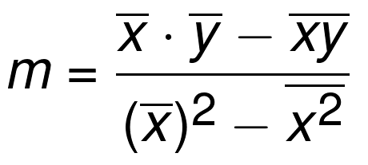

是的，我们会将其拆成片段。首先，进行一些导入：

```py
from statistics import mean
import numpy as np
```

我们从`statistics`导入`mean`，所以我们可以轻易获取列表的均值。下面，我们使`numpy as np`，所以我们可以其创建 NumPy 数组。我们可以对列表做很多事情，但是我们需要能够做一些简单的矩阵运算，它并不对简单列表提供，所以我们使用 NumPy。我们在这个阶段不会使用太复杂的 NumPy，但是之后 NumPy 就会成为你的最佳伙伴。下面，让我们定义一些起始点吧。

```py
xs = [1,2,3,4,5]
ys = [5,4,6,5,6]
```

所以这里有一些我们要使用的数据点，`xs`和`ys`。你可以认为`xs`就是特征，`ys`就是标签，或者他们都是特征，我们想要建立他们的联系。之前提到过，我们实际上把它们变成 NumPy 数组，以便执行矩阵运算。所以让我们修改这两行：

```py
xs = np.array([1,2,3,4,5], dtype=np.float64)
ys = np.array([5,4,6,5,6], dtype=np.float64)
```

现在他们都是 NumPy 数组了。我们也显式声明了数据类型。简单讲一下，数据类型有特性是属性，这些属性决定了数据本身如何储存和操作。现在它不是什么问题，但是如果我们执行大量运算，并希望他们跑在 GPU 而不是 CPU 上就是了。

将其画出来，他们是：

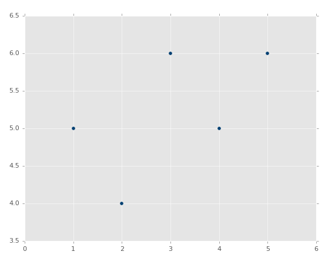

现在我们准备好构建函数来计算`m`，也就是我们的直线斜率：

```py
def best_fit_slope(xs,ys):
    return m

m = best_fit_slope(xs,ys)
```

好了。开个玩笑，所以这是我们的框架，现在我们要填充了。

我们的第一个逻辑就是计算`xs`的均值，再乘上`ys`的均值。继续填充我们的框架：

```py
def best_fit_slope(xs,ys):
    m = (mean(xs) * mean(ys))
    return m
```

目前为止还很简单。你可以对列表、元组或者数组使用`mean`函数。要注意我这里使用了括号。Python 的遵循运算符的数学优先级。所以如果你打算保证顺序，要显式使用括号。要记住你的[运算规则](https://www.mathsisfun.com/operation-order-pemdas.html)。

下面我们需要将其减去`x*y`的均值。这既是我们的矩阵运算`mean(xs*ys)`。现在的代码是：

```py
def best_fit_slope(xs,ys):
    m = ( (mean(xs)*mean(ys)) - mean(xs*ys) )
    return m
```

我们完成了公式的分子部分，现在我们继续处理的分母，以`x`的均值平方开始：`(mean(xs)*mean(xs))`。Python 支持`** 2`，能够处理我们的 NumPy 数组的`float64`类型。添加这些东西：

```py
def best_fit_slope(xs,ys):
    m = ( ((mean(xs)*mean(ys)) - mean(xs*ys)) /
           (mean(xs)**2))
    return m
```

虽然根据运算符优先级，向整个表达式添加括号是不必要的。我这里这样做，所以我可以在除法后面添加一行，使整个式子更加易读和易理解。不这样的话，我们会在新的一行得到语法错误。我们几乎完成了，现在我们只需要将`x`的均值平方和`x`的平方均值（`mean(xs*xs)`）相减。全部代码为：


```py
def best_fit_slope(xs,ys):
    m = (((mean(xs)*mean(ys)) - mean(xs*ys)) /
         ((mean(xs)**2) - mean(xs*xs)))
    return m
```

好的，现在我们的完整脚本为：

```py
from statistics import mean
import numpy as np

xs = np.array([1,2,3,4,5], dtype=np.float64)
ys = np.array([5,4,6,5,6], dtype=np.float64)

def best_fit_slope(xs,ys):
    m = (((mean(xs)*mean(ys)) - mean(xs*ys)) /
         ((mean(xs)**2) - mean(xs**2)))
    return m

m = best_fit_slope(xs,ys)
print(m)
# 0.3
```

下面干什么？我们需要计算纵截距`b`。我们会在下一个教程中处理它，并完成完整的最佳拟合直线计算。它比斜率更佳易于计算，尝试编写你自己的函数来计算它。如果你做到了，也不要跳过下一个教程，我们会做一些别的事情。


## 九、回归 - 计算纵截距

欢迎阅读第九篇教程。我们当前正在为给定的数据集，使用 Python 计算回归或者最佳拟合直线。之前，我们编写了一个函数来计算斜率，现在我们需要计算纵截距。我们目前的代码是：

```py
from statistics import mean
import numpy as np

xs = np.array([1,2,3,4,5], dtype=np.float64)
ys = np.array([5,4,6,5,6], dtype=np.float64)

def best_fit_slope(xs,ys):
    m = (((mean(xs)*mean(ys)) - mean(xs*ys)) /
         ((mean(xs)*mean(xs)) - mean(xs*xs)))
    return m

m = best_fit_slope(xs,ys)
print(m)
```

请回忆，最佳拟合直线的纵截距是：

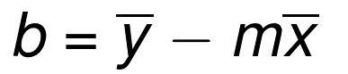

这个比斜率简单多了。我们可以将其写到同一个函数来节省几行代码。我们将函数重命名为`best_fit_slope_and_intercept`。

下面，我们可以填充`b = mean(ys) - (m*mean(xs))`，并返回`m, b`：

```py
def best_fit_slope_and_intercept(xs,ys):
    m = (((mean(xs)*mean(ys)) - mean(xs*ys)) /
         ((mean(xs)*mean(xs)) - mean(xs*xs)))
    
    b = mean(ys) - m*mean(xs)
    
    return m, b
```

现在我们可以调用它：

```py
best_fit_slope_and_intercept(xs,ys)
```

我们目前为止的代码：

```py
from statistics import mean
import numpy as np

xs = np.array([1,2,3,4,5], dtype=np.float64)
ys = np.array([5,4,6,5,6], dtype=np.float64)

def best_fit_slope_and_intercept(xs,ys):
    m = (((mean(xs)*mean(ys)) - mean(xs*ys)) /
         ((mean(xs)*mean(xs)) - mean(xs*xs)))
    
    b = mean(ys) - m*mean(xs)
    
    return m, b

m, b = best_fit_slope_and_intercept(xs,ys)

print(m,b)
# 0.3, 4.3
```

现在我们仅仅需要为数据创建一条直线：


要记住`y=mx+b`，我们能够为此编写一个函数，或者仅仅使用一行的`for`循环。

```py
regression_line = [(m*x)+b for x in xs]
```

上面的一行`for`循环和这个相同：

```py
regression_line = []
for x in xs:
    regression_line.append((m*x)+b)
```

好的，让我们收取我们的劳动果实吧。添加下面的导入：

```py
import matplotlib.pyplot as plt
from matplotlib import style
style.use('ggplot')
```

我们可以绘制图像，并且不会特备难看。现在：

```py
plt.scatter(xs,ys,color='#003F72')
plt.plot(xs, regression_line)
plt.show()
```

首先我们绘制了现有数据的散点图，之后我们绘制了我们的回归直线，之后展示它。如果你不熟悉，可以查看[ Matplotlib 教程集](../matplotlib/0.md)。

输出：

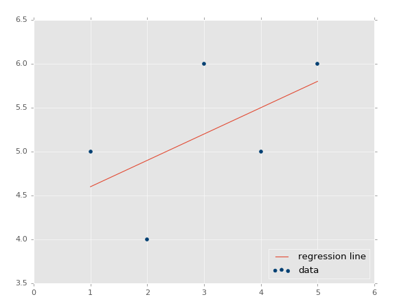

恭喜恭喜。所以，如何基础这个模型来做一些实际的预测呢？很简单，你拥有了模型，只要填充`x`就行了。例如，让我们预测一些点：

```py
predict_x = 7
```

我们输入了数据，也就是我们的特征。那么标签呢？

```py
predict_y = (m*predict_x)+b
print(predict_y)
# 6.4
```

我们也可以绘制它：

```py
predict_x = 7
predict_y = (m*predict_x)+b

plt.scatter(xs,ys,color='#003F72',label='data')
plt.plot(xs, regression_line, label='regression line')
plt.legend(loc=4)
plt.show()
```

输出：

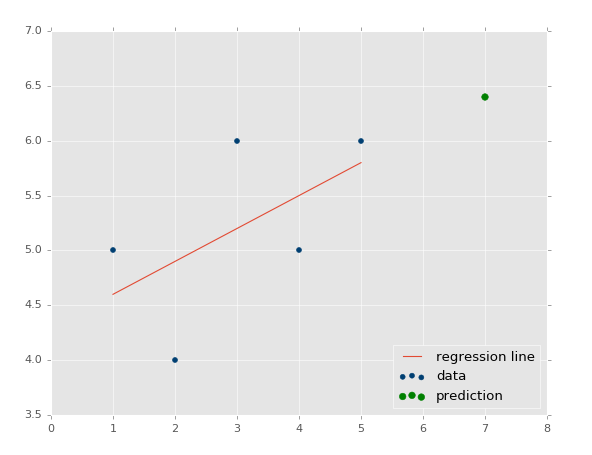

我们现在知道了如何创建自己的模型，这很好，但是我们仍旧缺少了一些东西，我们的模型有多精确？这就是下一个教程的话题了。


## 十、回归 - R 平方和判定系数原理

欢迎阅读第十篇教程。我们刚刚完成了线性模型的创建和处理，现在我们好奇接下来要干什么。现在，我们可以轻易观察数，并决定线性回归模型有多么准确。但是，如果你的线性回归模型是拿神经网络的 20 个层级做出来的呢？不仅仅是这样，你的模型以步骤或者窗口工作，也就是一共 5 百万个数据点，一次只显示 100 个，会怎么样？你需要一些自动化的方式来判断你的最佳拟合直线有多好。

回忆之前，我们展示几个绘图的时候，你已经看到，最佳拟合直线好还是不好。像这样：


与这个相比：

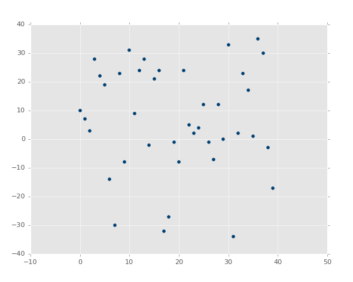

第二张图片中，的确有最佳拟合直线，但是没有人在意。即使是最佳拟合直线也是没有用的。并且，我们想在花费大量计算能力之前就知道它。

检查误差的标准方式就是使用平方误差。你可能之前听说过，这个方法叫做 R 平方或者判定系数。什么叫平方误差呢？

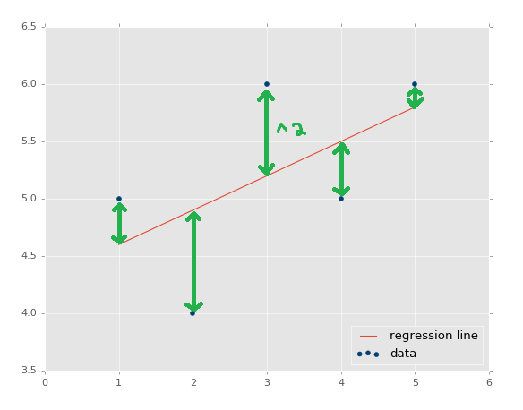

回归直线和数据的`y`值的距离，就叫做误差，我们将其平方。直线的平方误差是它们的平均或者和。我们简单求和吧。

我们实际上已经解除了平方误差假设。我们的最佳拟合直线方程，用于计算最佳拟合回归直线，就是证明结果。其中回归直线就是拥有最小平方误差的直线（所以它才叫做最小二乘法）。你可以搜索“回归证明”，或者“最佳拟合直线证明”来理解它。它很抑郁理解，但是需要代数变形能力来得出结果。

为啥是平方误差？为什么不仅仅将其加起来？首先，我们想要一种方式，将误差规范化为距离，所以误差可能是 -5，但是，平方之后，它就是正数了。另一个原因是要进一步惩罚离群点。进一步的意思是，它影响误差的程度更大。这就是人们所使用的标准方式。你也可以使用`4, 6, 8`的幂，或者其他。你也可以仅仅使用误差的绝对值。如果你只有一个挑战，也许就是存在一些离群点，但是你并不打算管它们，你就可以考虑使用绝对值。如果你比较在意离群点，你就可以使用更高阶的指数。我们会使用平方，因为这是大多数人所使用的。

好的，所以我们计算回归直线的平方误差，什么计算呢？这是什么意思？平方误差完全和数据集相关，所以我们不再需要别的东西了。这就是 R 平方引入的时候了，也叫作判定系数。方程是：

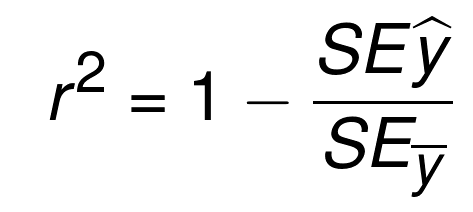

```py
y_hat = x * m + b
r_sq = 1 - np.sum((y - y_hat) ** 2) / np.sum((y - y.mean()) ** 2)
```

这个方程的的本质就是，1 减去回归直线的平方误差，比上 y 平均直线的平方误差。 y 平均直线就是数据集中所有 y 值的均值，如果你将其画出来，它是一个水平的直线。所以，我们计算 y 平均直线，和回归直线的平方误差。这里的目标是识别，与欠拟合的直线相比，数据特征的变化产生了多少误差。

所以判定系数就是上面那个方程，如何判定它是好是坏？我们看到了它是 1 减去一些东西。通常，在数学中，你看到他的时候，它返回了一个百分比，它是 0 ~ 1 之间的数值。你认为什么是好的 R 平方或者判定系数呢？让我们假设这里的 R 平方是 0.8，它是好是坏呢？它比 0.3 是好还是坏？对于 0.8 的 R 平方，这就意味着回归直线的平方误差，比上 y 均值的平方误差是 2 比 10。这就是说回归直线的误差非常小于 y 均值的误差。听起来不错。所以 0.8 非常好。

那么与判定系数的值 0.3 相比呢？这里，它意味着回归直线的平方误差，比上 y 均值的平方误差是 7 比 10。其中 7 比 10 要坏于 2 比 10，7 和 2 都是回归直线的平方误差。因此，目标是计算 R 平方值，或者叫做判定系数，使其尽量接近 1。


## 十一、回归 - 编程计算 R 平方

欢迎阅读第十一篇教程。既然我们知道了我们寻找的东西，让我们实际在 Python 中计算它吧。第一步就是计算平方误差。函数可能是这样：

```py
def squared_error(ys_orig,ys_line):
    return sum((ys_line - ys_orig) * (ys_line - ys_orig))
```

使用上面的函数，我们可以计算出任何实现到数据点的平方误差。所以我们可以将这个语法用于回归直线和 y 均值直线。也就是说，平方误差只是判定系数的一部分，所以让我们构建那个函数吧。由于平方误差函数只有一行，你可以选择将其嵌入到判定系数函数中，但是平方误差是你在这个函数之外计算的东西，所以我选择将其单独写成一个函数。对于 R 平方：

```py
def coefficient_of_determination(ys_orig,ys_line):
    y_mean_line = [mean(ys_orig) for y in ys_orig]
    squared_error_regr = squared_error(ys_orig, ys_line)
    squared_error_y_mean = squared_error(ys_orig, y_mean_line)
    return 1 - (squared_error_regr/squared_error_y_mean)
```

我们所做的是，计算 y 均值直线，使用单行的`for`循环（其实是不必要的）。之后我们计算了 y 均值的平方误差，以及回归直线的平方误差，使用上面的函数。现在，我们需要做的就是计算出 R 平方之，它仅仅是 1 减去回归直线的平方误差，除以 y 均值直线的平方误差。我们返回该值，然后就完成了。组合起来并跳过绘图部分，代码为：

```py
from statistics import mean
import numpy as np
import matplotlib.pyplot as plt
from matplotlib import style
style.use('ggplot')

xs = np.array([1,2,3,4,5], dtype=np.float64)
ys = np.array([5,4,6,5,6], dtype=np.float64)

def best_fit_slope_and_intercept(xs,ys):
    m = (((mean(xs)*mean(ys)) - mean(xs*ys)) /
         ((mean(xs)*mean(xs)) - mean(xs*xs)))
    b = mean(ys) - m*mean(xs)
    return m, b

def squared_error(ys_orig,ys_line):
    return sum((ys_line - ys_orig) * (ys_line - ys_orig))

def coefficient_of_determination(ys_orig,ys_line):
    y_mean_line = [mean(ys_orig) for y in ys_orig]
    squared_error_regr = squared_error(ys_orig, ys_line)
    squared_error_y_mean = squared_error(ys_orig, y_mean_line)
    return 1 - (squared_error_regr/squared_error_y_mean)
    
m, b = best_fit_slope_and_intercept(xs,ys)
regression_line = [(m*x)+b for x in xs]

r_squared = coefficient_of_determination(ys,regression_line)
print(r_squared)
# 0.321428571429

##plt.scatter(xs,ys,color='#003F72',label='data')
##plt.plot(xs, regression_line, label='regression line')
##plt.legend(loc=4)
##plt.show()
```

这是个很低的值，所以根据这个度量，我们的最佳拟合直线并不是很好。这里的 R 平方是个很好的度量手段吗？可能取决于我们的目标。多数情况下，如果我们关心准确预测未来的值，R 平方的确很有用。如果你对预测动机或者趋势感兴趣，我们的最佳拟合直线实际上已经很好了。R 平方不应该如此重要。看一看我们实际的数据集，我们被一个较低的数值卡住了。值与值之间的变化在某些点上是 20% ~ 50%，这已经非常高了。我们完全不应该感到意外，使用这个简单的数据集，我们的最佳拟合直线并不能描述真实数据。

但是，我们刚才说的是一个假设。虽然我们逻辑上统一这个假设，我们需要提出一个新的方法，来验证假设。到目前为止的算法非常基础，我们现在只能做很少的事情，所以没有什么空间来改进误差了，但是之后，你会在空间之上发现空间。不仅仅要考虑算法本身的层次空间，还有由很多算法层次组合而成的算法。其中，我们需要测试它们来确保我们的假设，关于算法是干什么用的，是正确的。考虑把操作组成成函数由多么简单，之后，从这里开始，将整个验证分解成数千行代码。

我们在下一篇教程所做的是，构建一个相对简单的数据集生成器，根据我们的参数来生成数据。我们可以使用它来按照意愿操作数据，之后对这些数据集测试我们的算法，根据我们的假设修改参数，应该会产生一些影响。我们之后可以将我们的假设和真实情况比较，并希望他们匹配。这里的例子中，假设是我们正确编写这些算法，并且判定系数低的原因是，y 值的方差太大了。我们会在下一个教程中验证这个假设。


## 十二、为测试创建样例数据集

欢迎阅读第十二篇教程。我们已经了解了回归，甚至编写了我们自己的简单线性回归算法。并且，我们也构建了判定系数算法来检查最佳拟合直线的准确度和可靠性。我们之前讨论和展示过，最佳拟合直线可能不是最好的拟合，也解释了为什么我们的示例方向上是正确的，即使并不准确。但是现在，我们使用两个顶级算法，它们由一些小型算法组成。随着我们继续构造这种算法层次，如果它们之中有个小错误，我们就会遇到麻烦，所以我们打算验证我们的假设。

在编程的世界中，系统化的程序测试通常叫做“单元测试”。这就是大型程序构建的方式，每个小型的子系统都不断检查。随着大型程序的升级和更新，可以轻易移除一些和之前系统冲突的工具。使用机器学习，这也是个问题，但是我们的主要关注点仅仅是测试我们的假设。最后，你应该足够聪明，可以为你的整个机器学习系统创建单元测试，但是目前为止，我们需要尽可能简单。

我们的假设是，我们创建了最贱he直线，之后使用判定系数法来测量。我们知道（数学上），R 平方的值越低，最佳拟合直线就越不好，并且越高（接近 1）就越好。我们的假设是，我们构建了一个这样工作的系统，我们的系统有许多部分，即使是一个小的操作错误都会产生很大的麻烦。我们如何测试算法的行为，保证任何东西都预期工作呢？

这里的理念是创建一个样例数据集，由我们定义，如果我们有一个正相关的数据集，相关性非常强，如果相关性很弱的话，点也不是很紧密。我们用眼睛很容易评测这个直线，但是机器应该做得更好。让我们构建一个系统，生成示例数据，我们可以调整这些参数。

最开始，我们构建一个框架函数，模拟我们的最终目标：

```py
def create_dataset(hm,variance,step=2,correlation=False):

    return np.array(xs, dtype=np.float64),np.array(ys,dtype=np.float64)
```

我们查看函数的开头，它接受下列参数：

+   `hm`（how much）：这是生成多少个数据点。例如我们可以选择 10，或者一千万。

+   `variance`：决定每个数据点和之前的数据点相比，有多大变化。变化越大，就越不紧密。

+   `step`：每个点距离均值有多远，默认为 2。

+   `correlation`：可以为`False`、`pos`或者`neg`，决定不相关、正相关和负相关。

要注意，我们也导入了`random`，这会帮助我们生成（伪）随机数据集。

现在我们要开始填充函数了。

```py
def create_dataset(hm,variance,step=2,correlation=False):
    val = 1
    ys = []
    for i in range(hm):
        y = val + random.randrange(-variance,variance)
        ys.append(y)
```

非常简单，我们仅仅使用`hm`变量，迭代我们所选的范围，将当前值加上一个负差值到证差值的随机范围。这会产生数据，但是如果我们想要的话，它没有相关性。让我们这样：

```py
def create_dataset(hm,variance,step=2,correlation=False):
    val = 1
    ys = []
    for i in range(hm):
        y = val + random.randrange(-variance,variance)
        ys.append(y)
        if correlation and correlation == 'pos':
            val+=step
        elif correlation and correlation == 'neg':
            val-=step
```

非常棒了，现在我们定义好了 y 值。下面，让我们创建 x，它更简单，只是返回所有东西。

```py
def create_dataset(hm,variance,step=2,correlation=False):
    val = 1
    ys = []
    for i in range(hm):
        y = val + random.randrange(-variance,variance)
        ys.append(y)
        if correlation and correlation == 'pos':
            val+=step
        elif correlation and correlation == 'neg':
            val-=step

    xs = [i for i in range(len(ys))]
    
    return np.array(xs, dtype=np.float64),np.array(ys,dtype=np.float64)
```

我们准备好了。为了创建样例数据集，我们所需的就是：

```py
xs, ys = create_dataset(40,40,2,correlation='pos')
```

让我们将之前线性回归教程的代码放到一起：

```py
from statistics import mean
import numpy as np
import random
import matplotlib.pyplot as plt
from matplotlib import style
style.use('ggplot')


def create_dataset(hm,variance,step=2,correlation=False):
    val = 1
    ys = []
    for i in range(hm):
        y = val + random.randrange(-variance,variance)
        ys.append(y)
        if correlation and correlation == 'pos':
            val+=step
        elif correlation and correlation == 'neg':
            val-=step

    xs = [i for i in range(len(ys))]
    
    return np.array(xs, dtype=np.float64),np.array(ys,dtype=np.float64)

def best_fit_slope_and_intercept(xs,ys):
    m = (((mean(xs)*mean(ys)) - mean(xs*ys)) /
         ((mean(xs)*mean(xs)) - mean(xs*xs)))
    
    b = mean(ys) - m*mean(xs)

    return m, b


def coefficient_of_determination(ys_orig,ys_line):
    y_mean_line = [mean(ys_orig) for y in ys_orig]

    squared_error_regr = sum((ys_line - ys_orig) * (ys_line - ys_orig))
    squared_error_y_mean = sum((y_mean_line - ys_orig) * (y_mean_line - ys_orig))

    print(squared_error_regr)
    print(squared_error_y_mean)

    r_squared = 1 - (squared_error_regr/squared_error_y_mean)

    return r_squared


xs, ys = create_dataset(40,40,2,correlation='pos')
m, b = best_fit_slope_and_intercept(xs,ys)
regression_line = [(m*x)+b for x in xs]
r_squared = coefficient_of_determination(ys,regression_line)
print(r_squared)

plt.scatter(xs,ys,color='#003F72', label = 'data')
plt.plot(xs, regression_line, label = 'regression line')
plt.legend(loc=4)
plt.show()
```

执行代码，你会看到：


判定系数是 0.516508576011（要注意你的结果不会相同，因为我们使用了随机数范围）。

不错，所以我们的假设是，如果我们生成一个更加紧密相关的数据集，我们的 R 平方或判定系数应该更好。如何实现它呢？很简单，把范围调低。

```py
xs, ys = create_dataset(40,10,2,correlation='pos')
```

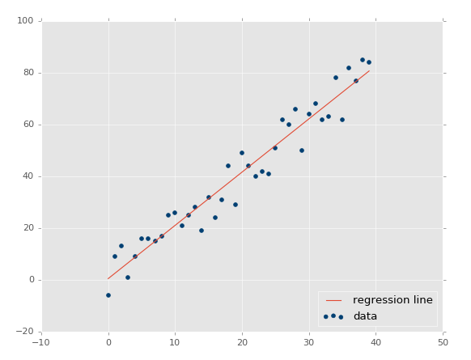

现在我们的 R 平方值为 0.939865240568，非常不错，就像预期一样。让我们测试负相关：

```py
xs, ys = create_dataset(40,10,2,correlation='neg')
```

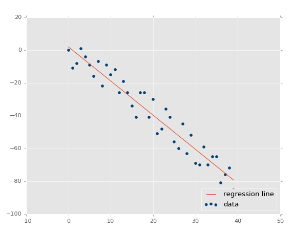

R 平方值是 0.930242442156，跟之前一样好，由于它们参数相同，只是方向不同。

这里，我们的假设证实了：变化越小 R 值和判定系数越高，变化越大 R 值越低。如果是不相关呢？应该很低，接近于 0，除非我们的随机数排列实际上有相关性。让我们测试：

```py
xs, ys = create_dataset(40,10,2,correlation=False)
```

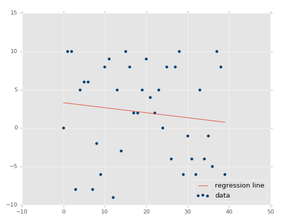

判定系数为 0.0152650900427。

现在为止，我觉得我们应该感到自信，因为事情都符合我们的预期。

既然我们已经对简单的线性回归很熟悉了，下个教程中我们开始讲解分类。
