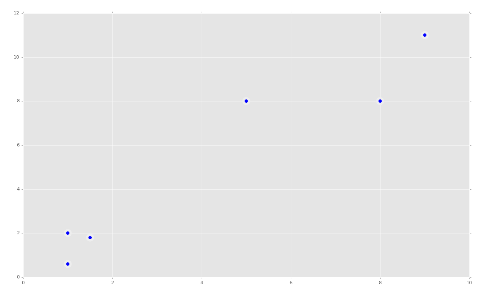
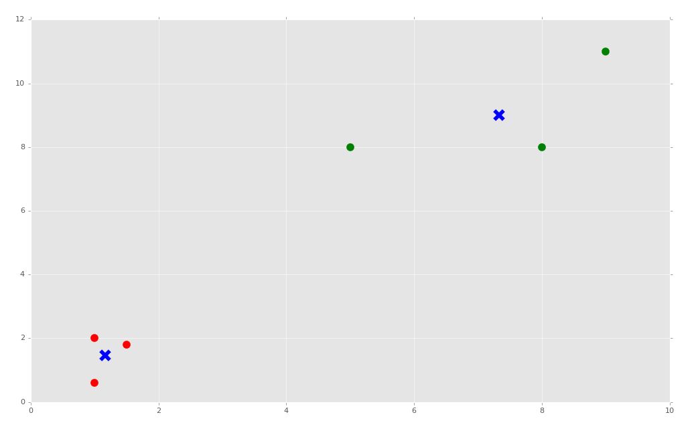
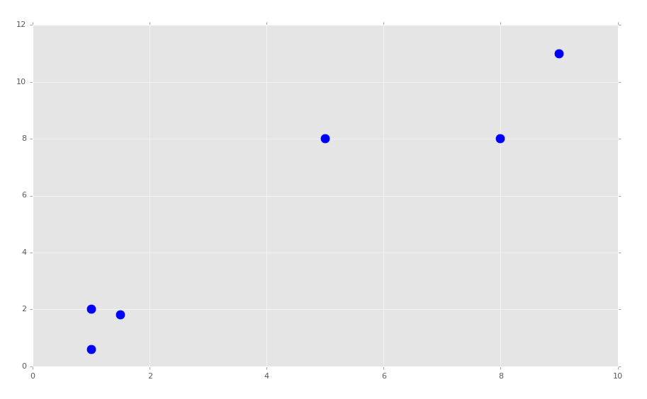
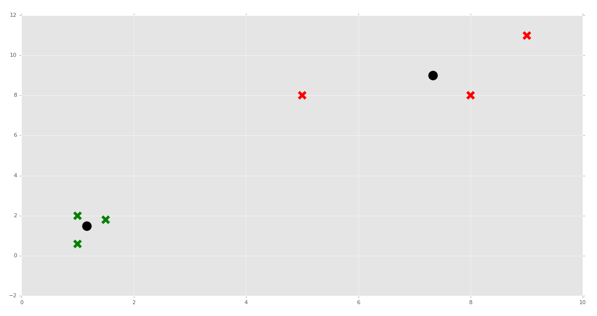
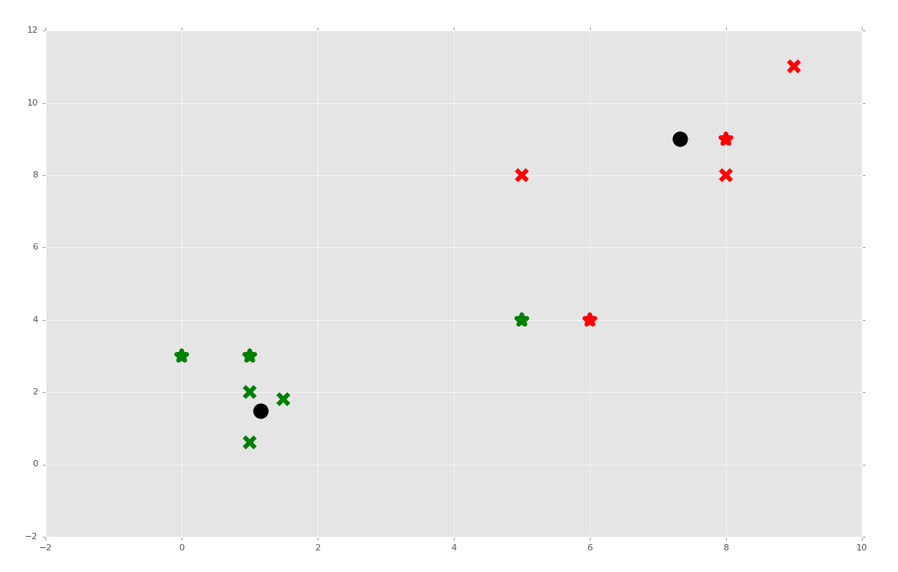
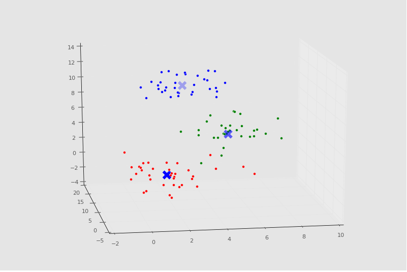
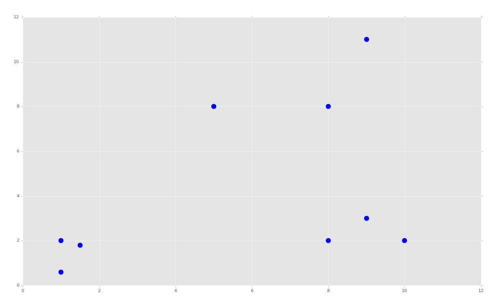
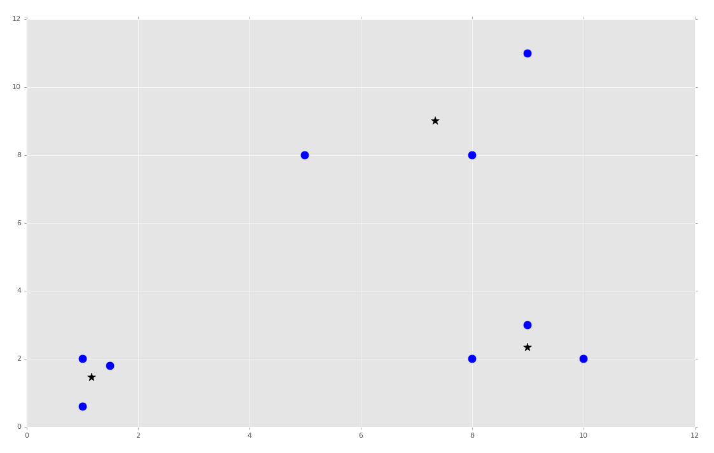

# 第三部分 聚类

## 三十四、聚类简介

欢迎阅读第三十四篇教程。这篇教程是聚类和非监督机器学习的开始。到现在为止，每个我们涉及到的东西都是“监督”机器学习，也就是说，我们科学家，告诉机器特征集有什么分类。但是在非监督机器学习下，科学家的角色就溢出了。首先，我们会涉及聚类，它有两种形式，扁平和层次化的。

对于这两种形式的聚类，机器的任务是，接受仅仅是特征集的数据集，之后搜索分组并分配标签。对于扁平化聚类，科学家告诉机器要寻找多少个分类或簇。对于层次化聚类，机器会自己寻找分组及其数量。

我们为什么要利用聚类呢？聚类的目标就是寻找数据中的关系和含义。多数情况下，我自己看到了，人们将聚类用于所谓的“半监督”机器学习。这里的想法是，你可以使用聚类来定义分类。另一个用途就是特征选取和验证。例如，考虑我们的乳腺肿瘤数据集。我们可能认为，我们选取的特征缺失是描述性并且有意义的。我们拥有的一个选项，就是将数据扔给 KMeans 算法，之后观察数据实际上是否描述了我们跟踪的两个分组，以我们预期的方式。

下面假设，你是个 Amazon 的树科学家。你的 CTO 收集了数据，并且认为可以用于预测顾客是不是买家。它们希望你使用 KMeans 来看看是否 KMeans 正确按照数据来组织用户，CTO 认为这个很有意义。

层次聚类是什么？假设你仍然是那个相同的数据科学家。这一次，你使用层次聚类算法处理看似有意义的数据，例如均值漂移，并且实际上获取了五个分组。在深入分析之后，你意识到访问者实际上不是买家或者非买家，它们实际上是个光谱。实际上有非买家、可能的非买家、低可能的买家、高可能的马甲，和确定的买家。

聚类也可以用于真正的未知数据，来尝试寻找结构。假设你是个探索北美人类文字的外星人。你可能收集了所有手写字符，将其编译为一个大型的特征列表。之后你可能将这个列表扔给层次聚类算法，来看看是否可以寻找特定的分组，以便通过字符解码语言。

“大数据分析”的领域通常是聚类的初始区域。这里有大量的数据，但是如何处理他们，或者如何获取他们的含义，多数公司完全没有概念。聚类可以帮助数据科学家，来分析大量数据集的结构，以及寻找它们的含义。

最后，聚类也可以用于典型的分类，你实际上并不需要将其扔给分类算法，但是如果你在多数主流的分类数据集上使用聚类，你应该能发现，它能够找到分组。

我们第一个算法是 KMeans。KMeans 的思路就是尝试将给定数据集聚类到 K 个簇中。它的工作方式令人印象深刻。并且我们足够幸运，他还非常简单。这个过程是：

1.  获取真个数据集，并随机设置 K 个形心。形心就是簇的“中心”。首先，我通常选取前 K 个值，并使用它们来开始，但是你也可以随机选取它们。这应该没关系，但是，如果你不为了一些原因做优化，可能就需要尝试打乱数据并再次尝试。

2.  计算每个数据集到形心的距离，1并按照形心的接近程度来分类每个数据集。形心的分类是任意的，你可能将第一个形心命名为 0，第二个为 1，以此类推。

3.  一旦已经分类好了数据，现在计算分组的均值，并将均值设为新的形心。

4.  重复第二和第三步直到最优。通常，你通过形心的移动来度量优化。有很多方式来这么做，我们仅仅使用百分数比例。

很简单，比 SVM 简单多了。让我们看看一个简短的代码示例。开始，我们拥有这样一些数据：

```py
import matplotlib.pyplot as plt
from matplotlib import style
import numpy as np
from sklearn.cluster import KMeans
style.use('ggplot')

#ORIGINAL:

X = np.array([[1, 2],
              [1.5, 1.8],
              [5, 8],
              [8, 8],
              [1, 0.6],
              [9, 11]])


plt.scatter(X[:, 0],X[:, 1], s=150, linewidths = 5, zorder = 10)
plt.show()
```

我们的数据是：



太棒了，看起来很简单，所以我们的 KMeans 算法更适于这个东西。首先我们会尝试拟合所有东西：

```py
clf = KMeans(n_clusters=2)
clf.fit(X)
```

就这么简单，但是我们可能希望看到它。我们之前在 SVM 中看到过，多数 Sklearn 分类器都拥有多种属性。使用 KMeans 算法，我们可以获取形心和标签。

```py
centroids = clf.cluster_centers_
labels = clf.labels_
```

现在绘制他们：

```py
colors = ["g.","r.","c.","y."]
for i in range(len(X)):
    plt.plot(X[i][0], X[i][1], colors[labels[i]], markersize = 10)
plt.scatter(centroids[:, 0],centroids[:, 1], marker = "x", s=150, linewidths = 5, zorder = 10)
plt.show()
```



下面，我们打算讲 KMeans 算法应用于真实的数据集，并且涉及，如果你的数据含有非数值的信息，会发生什么。


## 三十五、处理非数值数据

欢迎阅读第三十五篇教程。我们最近开始谈论聚类，但是这个教程中，我们打算涉及到处理非数值数据，它当然不是聚类特定的。

我们打算处理的数据是[泰坦尼克数据集](https://pythonprogramming.net/static/downloads/machine-learning-data/titanic.xls)。

简单看一下数据和值：

```
Pclass Passenger Class (1 = 1st; 2 = 2nd; 3 = 3rd)
survival Survival (0 = No; 1 = Yes)
name Name
sex Sex
age Age
sibsp Number of Siblings/Spouses Aboard
parch Number of Parents/Children Aboard
ticket Ticket Number
fare Passenger Fare (British pound)
cabin Cabin
embarked Port of Embarkation (C = Cherbourg; Q = Queenstown; S = Southampton)
boat Lifeboat
body Body Identification Number
home.dest Home/Destination
```

这个数据集的主要关注点就是`survival `一列。在使用监督式机器学习的时候，你要将这一列看做分类，对其训练数据。但是对于聚类，我们让机器生产分组，并自行贴标签。我的第一个兴趣点事，是否分组和任何列相关，尤其是`survival `一列。对于我们这个教程，我们现在执行扁平聚类，也就是我们告诉机器想要两个分组，但是之后我们也会让机器决定分组数量。

但是现在，我们要面对另一个问题。如果我们将这个数据加载进 Pandas，我们会看到这样一些东西：

```py
#https://pythonprogramming.net/static/downloads/machine-learning-data/titanic.xls
import matplotlib.pyplot as plt
from matplotlib import style
style.use('ggplot')
import numpy as np
from sklearn.cluster import KMeans
from sklearn import preprocessing, cross_validation
import pandas as pd

'''
Pclass Passenger Class (1 = 1st; 2 = 2nd; 3 = 3rd)
survival Survival (0 = No; 1 = Yes)
name Name
sex Sex
age Age
sibsp Number of Siblings/Spouses Aboard
parch Number of Parents/Children Aboard
ticket Ticket Number
fare Passenger Fare (British pound)
cabin Cabin
embarked Port of Embarkation (C = Cherbourg; Q = Queenstown; S = Southampton)
boat Lifeboat
body Body Identification Number
home.dest Home/Destination
'''

df = pd.read_excel('titanic.xls')
print(df.head())
```

```
   pclass  survived                                             name     sex  \
0       1         1                    Allen, Miss. Elisabeth Walton  female   
1       1         1                   Allison, Master. Hudson Trevor    male   
2       1         0                     Allison, Miss. Helen Loraine  female   
3       1         0             Allison, Mr. Hudson Joshua Creighton    male   
4       1         0  Allison, Mrs. Hudson J C (Bessie Waldo Daniels)  female   

       age  sibsp  parch  ticket      fare    cabin embarked boat   body  \
0  29.0000      0      0   24160  211.3375       B5        S    2    NaN   
1   0.9167      1      2  113781  151.5500  C22 C26        S   11    NaN   
2   2.0000      1      2  113781  151.5500  C22 C26        S  NaN    NaN   
3  30.0000      1      2  113781  151.5500  C22 C26        S  NaN  135.0   
4  25.0000      1      2  113781  151.5500  C22 C26        S  NaN    NaN   

                         home.dest  
0                     St Louis, MO  
1  Montreal, PQ / Chesterville, ON  
2  Montreal, PQ / Chesterville, ON  
3  Montreal, PQ / Chesterville, ON  
4  Montreal, PQ / Chesterville, ON  
   pclass  survived  name  sex      age  sibsp  parch  ticket      fare  \
0       1         1   110    0  29.0000      0      0     748  211.3375   
1       1         1   839    1   0.9167      1      2     504  151.5500   
2       1         0  1274    0   2.0000      1      2     504  151.5500   
3       1         0   284    1  30.0000      1      2     504  151.5500   
4       1         0   563    0  25.0000      1      2     504  151.5500   

   cabin  embarked  boat   body  home.dest  
0     52         1     1    NaN        173  
1     44         1     6    NaN        277  
2     44         1     0    NaN        277  
3     44         1     0  135.0        277  
4     44         1     0    NaN        277  
```

问题是，我们得到了非数值的数据。机器学习算法需要数值。我们可以丢弃`name`列，它对我们没有用。我们是否应该丢弃`sex`列呢？我不这么看，它看起来是特别重要的列，尤其是我们知道“女士和孩子是有限的”。那么`cabin`列又如何呢？可能它对于你在船上的位置很重要呢？我猜是这样。可能你从哪里乘船不是很重要，但是这个时候，我们已经知道了我们需要以任何方式处理非数值数据。

有很多方式处理非数值数据，这就是我自己使用的方式。首先，你打算遍历 Pandas 数据帧中的列。对于不是数值的列，你想要寻找它们的唯一元素。这可以简单通过获取列值的`set`来完成。这里，`set`中的索引也可以是新的“数值”值，或者文本数据的“id”。

开始：

```py
def handle_non_numerical_data(df):
    columns = df.columns.values
    for column in columns:
```

创建函数，获取列，迭代它们。继续：

```py
def handle_non_numerical_data(df):
    columns = df.columns.values
    for column in columns:
        text_digit_vals = {}
        def convert_to_int(val):
            return text_digit_vals[val]
            
        if df[column].dtype != np.int64 and df[column].dtype != np.float64:
            column_contents = df[column].values.tolist()
            unique_elements = set(column_contents)
```

这里，我们添加了嵌套函数，将参数值作为键，转换为这个元素在`text_digit_vals`中的值。我们现在还不使用它，但是也快了。下面，当我们迭代列的时候，我们打算确认是否这一列是`np.int64`或`np.float64`。如果不是，我们将这一列转换为值的列表，之后我们获取这一列的`set`来获取唯一的值。

```py
def handle_non_numerical_data(df):
    columns = df.columns.values
    for column in columns:
        text_digit_vals = {}
        def convert_to_int(val):
            return text_digit_vals[val]
            
        if df[column].dtype != np.int64 and df[column].dtype != np.float64:
            column_contents = df[column].values.tolist()
            unique_elements = set(column_contents)
            x = 0
            for unique in unique_elements:
                if unique not in text_digit_vals:
                    text_digit_vals[unique] = x
                    x+=1

            df[column] = list(map(convert_to_int, df[column]))

    return df
```

我们继续，对于每个找到的唯一元素，我们创建新的字典，键是唯一元素，值是新的数值。一旦我们迭代了所有的唯一元素，我们就将之前创建的函数映射到这一列上。不知道什么是映射嘛？查看[这里](https://pythonprogramming.net/rolling-apply-mapping-functions-data-analysis-python-pandas-tutorial/)。

现在我们添加一些代码：

```py
df = handle_non_numerical_data(df)
print(df.head())
```

完整代码：

```py
#https://pythonprogramming.net/static/downloads/machine-learning-data/titanic.xls
import matplotlib.pyplot as plt
from matplotlib import style
style.use('ggplot')
import numpy as np
from sklearn.cluster import KMeans
from sklearn import preprocessing, cross_validation
import pandas as pd

'''
Pclass Passenger Class (1 = 1st; 2 = 2nd; 3 = 3rd)
survival Survival (0 = No; 1 = Yes)
name Name
sex Sex
age Age
sibsp Number of Siblings/Spouses Aboard
parch Number of Parents/Children Aboard
ticket Ticket Number
fare Passenger Fare (British pound)
cabin Cabin
embarked Port of Embarkation (C = Cherbourg; Q = Queenstown; S = Southampton)
boat Lifeboat
body Body Identification Number
home.dest Home/Destination
'''

df = pd.read_excel('titanic.xls')
#print(df.head())
df.drop(['body','name'], 1, inplace=True)
df.convert_objects(convert_numeric=True)
df.fillna(0, inplace=True)
#print(df.head())

def handle_non_numerical_data(df):
    columns = df.columns.values
    for column in columns:
        text_digit_vals = {}
        def convert_to_int(val):
            return text_digit_vals[val]

        if df[column].dtype != np.int64 and df[column].dtype != np.float64:
            column_contents = df[column].values.tolist()
            unique_elements = set(column_contents)
            x = 0
            for unique in unique_elements:
                if unique not in text_digit_vals:
                    text_digit_vals[unique] = x
                    x+=1

            df[column] = list(map(convert_to_int, df[column]))

    return df

df = handle_non_numerical_data(df)
print(df.head())
```

输出：

```
   pclass  survived  sex      age  sibsp  parch  ticket      fare  cabin  \
0       1         1    1  29.0000      0      0     767  211.3375     80   
1       1         1    0   0.9167      1      2     531  151.5500    149   
2       1         0    1   2.0000      1      2     531  151.5500    149   
3       1         0    0  30.0000      1      2     531  151.5500    149   
4       1         0    1  25.0000      1      2     531  151.5500    149   

   embarked  boat  home.dest  
0         1     1        307  
1         1    27         43  
2         1     0         43  
3         1     0         43  
4         1     0         43 
```

如果`df.convert_objects(convert_numeric=True)`出现了废弃警告，或者错误，尽管将其注释掉吧。我通常为了清楚而保留它，但是数据帧应该把数值读作数值。出于一些原因，Pandas 会随机将列中的一些行读作字符串，尽管字符串实际上是数值。对我来说没有意义，所以我将将它们转为字符串来保证。

太好了，所以我们得到了数值，现在我们可以继续使用这个数据做扁平聚类了。


## 三十六、泰坦尼克数据集 KMeans

欢迎阅读第三十六篇教程，另一篇话题为聚类的教程。

之前的教程中，我们涉及了如何处理非数值的数据，这里我们打算实际对泰坦尼克数据集应用 KMeans 算法。KMeans 算法是个扁平聚类算法，也就是说我们需要告诉机器一件事情，应该有多少个簇。我们打算告诉算法有两个分组，之后我们让机器寻找幸存者和遇难者，基于它选取的这两个分组。

我们的代码为：

```py
#https://pythonprogramming.net/static/downloads/machine-learning-data/titanic.xls
import matplotlib.pyplot as plt
from matplotlib import style
style.use('ggplot')
import numpy as np
from sklearn.cluster import KMeans
from sklearn import preprocessing
import pandas as pd

'''
Pclass Passenger Class (1 = 1st; 2 = 2nd; 3 = 3rd)
survival Survival (0 = No; 1 = Yes)
name Name
sex Sex
age Age
sibsp Number of Siblings/Spouses Aboard
parch Number of Parents/Children Aboard
ticket Ticket Number
fare Passenger Fare (British pound)
cabin Cabin
embarked Port of Embarkation (C = Cherbourg; Q = Queenstown; S = Southampton)
boat Lifeboat
body Body Identification Number
home.dest Home/Destination
'''

df = pd.read_excel('titanic.xls')
#print(df.head())
df.drop(['body','name'], 1, inplace=True)
df.convert_objects(convert_numeric=True)
df.fillna(0, inplace=True)
#print(df.head())

def handle_non_numerical_data(df):
    columns = df.columns.values

    for column in columns:
        text_digit_vals = {}
        def convert_to_int(val):
            return text_digit_vals[val]

        if df[column].dtype != np.int64 and df[column].dtype != np.float64:
            column_contents = df[column].values.tolist()
            unique_elements = set(column_contents)
            x = 0
            for unique in unique_elements:
                if unique not in text_digit_vals:
                    text_digit_vals[unique] = x
                    x+=1

            df[column] = list(map(convert_to_int, df[column]))

    return df

df = handle_non_numerical_data(df)
```

这里，我们可以立即执行聚类：

```py
X = np.array(df.drop(['survived'], 1).astype(float))
y = np.array(df['survived'])

clf = KMeans(n_clusters=2)
clf.fit(X)
```

好的，现在让我们看看，是否分组互相匹配。你可以注意，这里，幸存者是 0，遇难者是 1。对于聚类算法，机器会寻找簇，但是会给簇分配任意标签，以便寻找它们。因此，幸存者的分组可能是 0 或者 1，取决于随机度。因此，如果你的一致性是 30% 或者 70%，那么你的模型准确度是 70%。让我们看看吧：

```py
correct = 0
for i in range(len(X)):
    predict_me = np.array(X[i].astype(float))
    predict_me = predict_me.reshape(-1, len(predict_me))
    prediction = clf.predict(predict_me)
    if prediction[0] == y[i]:
        correct += 1

print(correct/len(X))
# 0.4957983193277311
```

准确度是 49% ~ 51%，不是很好。还记得几篇教程之前，预处理的事情吗？当我们之前使用的时候，看起来不是很重要，但是这里呢？

```py
X = np.array(df.drop(['survived'], 1).astype(float))
X = preprocessing.scale(X)
y = np.array(df['survived'])

clf = KMeans(n_clusters=2)
clf.fit(X)

correct = 0
for i in range(len(X)):
    predict_me = np.array(X[i].astype(float))
    predict_me = predict_me.reshape(-1, len(predict_me))
    prediction = clf.predict(predict_me)
    if prediction[0] == y[i]:
        correct += 1

print(correct/len(X))
# 0.7081741787624141
```

预处理看起来很重要。预处理的目的是把你的数据放到 -1 ~ 1 的范围内，这可以使事情更好。我从来没有见过预处理产生很大的负面影响，它至少不会有什么影响，但是这里产生了非常大的正面影响。

好奇的是，我想知道上不上船对它影响多大。我看到机器将人们划分为上船和不上船的。我们可以看到，添加`df.drop(['boat'], 1, inplace=True)`是否会有很大影响。

```
0.6844919786096256
```

并不是很重要，但是有轻微的影响。那么性别呢？你知道这个数据实际上有两个分类：男性和女性。可能这就是它的主要发现？现在我们尝试`df.drop(['sex'], 1, inplace=True)`。

```
0.6982429335370511
```

也不是很重要。

目前的完整代码：

```py
#https://pythonprogramming.net/static/downloads/machine-learning-data/titanic.xls
import matplotlib.pyplot as plt
from matplotlib import style
style.use('ggplot')
import numpy as np
from sklearn.cluster import KMeans
from sklearn import preprocessing
import pandas as pd

'''
Pclass Passenger Class (1 = 1st; 2 = 2nd; 3 = 3rd)
survival Survival (0 = No; 1 = Yes)
name Name
sex Sex
age Age
sibsp Number of Siblings/Spouses Aboard
parch Number of Parents/Children Aboard
ticket Ticket Number
fare Passenger Fare (British pound)
cabin Cabin
embarked Port of Embarkation (C = Cherbourg; Q = Queenstown; S = Southampton)
boat Lifeboat
body Body Identification Number
home.dest Home/Destination
'''

df = pd.read_excel('titanic.xls')
#print(df.head())
df.drop(['body','name'], 1, inplace=True)
df.convert_objects(convert_numeric=True)
df.fillna(0, inplace=True)
#print(df.head())

def handle_non_numerical_data(df):
    columns = df.columns.values

    for column in columns:
        text_digit_vals = {}
        def convert_to_int(val):
            return text_digit_vals[val]

        if df[column].dtype != np.int64 and df[column].dtype != np.float64:
            column_contents = df[column].values.tolist()
            unique_elements = set(column_contents)
            x = 0
            for unique in unique_elements:
                if unique not in text_digit_vals:
                    text_digit_vals[unique] = x
                    x+=1

            df[column] = list(map(convert_to_int, df[column]))

    return df

df = handle_non_numerical_data(df)


df.drop(['sex','boat'], 1, inplace=True)
X = np.array(df.drop(['survived'], 1).astype(float))
X = preprocessing.scale(X)
y = np.array(df['survived'])

clf = KMeans(n_clusters=2)
clf.fit(X)

correct = 0
for i in range(len(X)):
    predict_me = np.array(X[i].astype(float))
    predict_me = predict_me.reshape(-1, len(predict_me))
    prediction = clf.predict(predict_me)
    if prediction[0] == y[i]:
        correct += 1

print(correct/len(X))
```

对我来说，这个聚类算法看似自动将这些人归类为幸存者和遇难者。真实有趣。我们没有过多判断，机器认为为什么选取这些分组，但是它们似乎和幸存者有很高的相关度。

下一篇教程中，我们打算进一步，从零创建我们自己的 KMeans 算法。


## 三十七、使用 Python 从零实现 KMeans

欢迎阅读第三十七篇教程，这是另一篇聚类的教程。

这个教程中，我们打算从零构建我们自己的 KMeans 算法。之前提到过 KMeans 算法的步骤。

1.  选择 K 值。
2.  随机选取 K 个特征作为形心。
3.  计算所有其它特征到形心的距离。
4.  将其它特征分类到最近的形心。
5.  计算每个分类的均值（分类中所有特征的均值），使均值为新的形心。
6.  重复步骤 3 ~ 5，直到最优（形心不再变化）。

最开始，我们：

```py
import matplotlib.pyplot as plt
from matplotlib import style
style.use('ggplot')
import numpy as np

X = np.array([[1, 2],
              [1.5, 1.8],
              [5, 8 ],
              [8, 8],
              [1, 0.6],
              [9,11]])

plt.scatter(X[:,0], X[:,1], s=150)
plt.show()
```



我们的簇应该很显然了。我们打算选取`K=2`。我们开始构建我们的 KMeans 分类：

```py
class K_Means:
    def __init__(self, k=2, tol=0.001, max_iter=300):
        self.k = k
        self.tol = tol
        self.max_iter = max_iter
```

我们刚刚配置了一些起始值，`k`就是簇的数量，`tol`就是容差，如果簇的形心移动没有超过这个值，就是最优的。`max_iter`值用于限制循环次数。

现在我们开始处理`fit`方法：

```py
    def fit(self,data):

        self.centroids = {}

        for i in range(self.k):
            self.centroids[i] = data[i]
```

最开始，我们知道我们仅仅需要传入拟合数据。之后我们以空字典开始，它之后会存放我们的形心。下面，我们开始循环，仅仅将我们的起始形心赋为数据中的前两个样例。如果你打算真正随机选取形心，你应该首先打乱数据，但是这样也不错。

继续构建我们的类：

```py
class K_Means:
    def __init__(self, k=2, tol=0.001, max_iter=300):
        self.k = k
        self.tol = tol
        self.max_iter = max_iter

    def fit(self,data):

        self.centroids = {}

        for i in range(self.k):
            self.centroids[i] = data[i]

        for i in range(self.max_iter):
            self.classifications = {}

            for i in range(self.k):
                self.classifications[i] = []
```
现在我们开始迭代我们的`max_iter`值。这里，我们以空分类开始，之后创建两个字典的键（通过遍历`self.k`的范围）。

下面，我们需要遍历我们的特征，计算当前形心个特征的距离，之后分类他们：

```py
class K_Means:
    def __init__(self, k=2, tol=0.001, max_iter=300):
        self.k = k
        self.tol = tol
        self.max_iter = max_iter

    def fit(self,data):

        self.centroids = {}

        for i in range(self.k):
            self.centroids[i] = data[i]

        for i in range(self.max_iter):
            self.classifications = {}

            for i in range(self.k):
                self.classifications[i] = []

            for featureset in data:
                distances = [np.linalg.norm(featureset-self.centroids[centroid]) for centroid in self.centroids]
                classification = distances.index(min(distances))
                self.classifications[classification].append(featureset)
```

下面，我们需要创建新的形心，并且度量形心的移动。如果移动小于我们的容差（`sel.tol`），我们就完成了。包括添加的代码，目前为止的代码为：

```py
import matplotlib.pyplot as plt
from matplotlib import style
style.use('ggplot')
import numpy as np

X = np.array([[1, 2],
              [1.5, 1.8],
              [5, 8 ],
              [8, 8],
              [1, 0.6],
              [9,11]])

plt.scatter(X[:,0], X[:,1], s=150)
plt.show()

colors = 10*["g","r","c","b","k"]


class K_Means:
    def __init__(self, k=2, tol=0.001, max_iter=300):
        self.k = k
        self.tol = tol
        self.max_iter = max_iter

    def fit(self,data):

        self.centroids = {}

        for i in range(self.k):
            self.centroids[i] = data[i]

        for i in range(self.max_iter):
            self.classifications = {}

            for i in range(self.k):
                self.classifications[i] = []

            for featureset in data:
                distances = [np.linalg.norm(featureset-self.centroids[centroid]) for centroid in self.centroids]
                classification = distances.index(min(distances))
                self.classifications[classification].append(featureset)

            prev_centroids = dict(self.centroids)

            for classification in self.classifications:
                self.centroids[classification] = np.average(self.classifications[classification],axis=0)
```

下一篇教程中，我们会完成我们的类，并看看它表现如何。


## 三十八、完成 KMeans 聚类

欢迎阅读第三十八篇教程，另一篇关于聚类的教程。

我们暂停的地方是，我们开始创建自己的 KMeans 聚类算法。我们会继续，从这里开始：

```py
import matplotlib.pyplot as plt
from matplotlib import style
style.use('ggplot')
import numpy as np

X = np.array([[1, 2],
              [1.5, 1.8],
              [5, 8 ],
              [8, 8],
              [1, 0.6],
              [9,11]])

##plt.scatter(X[:,0], X[:,1], s=150)
##plt.show()

colors = 10*["g","r","c","b","k"]


class K_Means:
    def __init__(self, k=2, tol=0.001, max_iter=300):
        self.k = k
        self.tol = tol
        self.max_iter = max_iter

    def fit(self,data):

        self.centroids = {}

        for i in range(self.k):
            self.centroids[i] = data[i]

        for i in range(self.max_iter):
            self.classifications = {}

            for i in range(self.k):
                self.classifications[i] = []

            for featureset in data:
                distances = [np.linalg.norm(featureset-self.centroids[centroid]) for centroid in self.centroids]
                classification = distances.index(min(distances))
                self.classifications[classification].append(featureset)

            prev_centroids = dict(self.centroids)

            for classification in self.classifications:
                self.centroids[classification] = np.average(self.classifications[classification],axis=0)
```

既然我们拥有了新的形心，以及之前形心的只是，我们关心是否是最优化的。非常简单，我们会向`fit`方法添加下面的代码：

```py
            optimized = True

            for c in self.centroids:
                original_centroid = prev_centroids[c]
                current_centroid = self.centroids[c]
                if np.sum((current_centroid-original_centroid)/original_centroid*100.0) > self.tol:
                    print(np.sum((current_centroid-original_centroid)/original_centroid*100.0))
                    optimized = False
```

我们开始假设是最优的，只有选取所有形心，并将它们与之前的形心比较。如果他们符合我们所需的容差，我们就开心了。如果没有，我们将`optimized`设为`False`，并继续我们的`for i in range(self.max_iter):`。我们是否是最优化的呢？

```py
            if optimized:
                break
```

我们就完成了`fit`方法：

```py
    def fit(self,data):

        self.centroids = {}

        for i in range(self.k):
            self.centroids[i] = data[i]

        for i in range(self.max_iter):
            self.classifications = {}

            for i in range(self.k):
                self.classifications[i] = []

            for featureset in data:
                distances = [np.linalg.norm(featureset-self.centroids[centroid]) for centroid in self.centroids]
                classification = distances.index(min(distances))
                self.classifications[classification].append(featureset)

            prev_centroids = dict(self.centroids)

            for classification in self.classifications:
                self.centroids[classification] = np.average(self.classifications[classification],axis=0)

            optimized = True

            for c in self.centroids:
                original_centroid = prev_centroids[c]
                current_centroid = self.centroids[c]
                if np.sum((current_centroid-original_centroid)/original_centroid*100.0) > self.tol:
                    print(np.sum((current_centroid-original_centroid)/original_centroid*100.0))
                    optimized = False

            if optimized:
                break
```

现在我们可以添加一些预测方法。这实际上已经完成了。还记得我们遍历特征集来分配簇的地方吗？

```py
            for featureset in data:
                distances = [np.linalg.norm(featureset-self.centroids[centroid]) for centroid in self.centroids]
                classification = distances.index(min(distances))
                self.classifications[classification].append(featureset)
```

这就是我们需要做的所有预测，除了最后一行。

```py
    def predict(self,data):
        distances = [np.linalg.norm(data-self.centroids[centroid]) for centroid in self.centroids]
        classification = distances.index(min(distances))
        return classification
```

现在我们就完成了整个 KMeans 类：

```py
class K_Means:
    def __init__(self, k=2, tol=0.001, max_iter=300):
        self.k = k
        self.tol = tol
        self.max_iter = max_iter

    def fit(self,data):

        self.centroids = {}

        for i in range(self.k):
            self.centroids[i] = data[i]

        for i in range(self.max_iter):
            self.classifications = {}

            for i in range(self.k):
                self.classifications[i] = []

            for featureset in data:
                distances = [np.linalg.norm(featureset-self.centroids[centroid]) for centroid in self.centroids]
                classification = distances.index(min(distances))
                self.classifications[classification].append(featureset)

            prev_centroids = dict(self.centroids)

            for classification in self.classifications:
                self.centroids[classification] = np.average(self.classifications[classification],axis=0)

            optimized = True

            for c in self.centroids:
                original_centroid = prev_centroids[c]
                current_centroid = self.centroids[c]
                if np.sum((current_centroid-original_centroid)/original_centroid*100.0) > self.tol:
                    print(np.sum((current_centroid-original_centroid)/original_centroid*100.0))
                    optimized = False

            if optimized:
                break

    def predict(self,data):
        distances = [np.linalg.norm(data-self.centroids[centroid]) for centroid in self.centroids]
        classification = distances.index(min(distances))
        return classification
```

现在我们可以这样做了：

```py
clf = K_Means()
clf.fit(X)

for centroid in clf.centroids:
    plt.scatter(clf.centroids[centroid][0], clf.centroids[centroid][1],
                marker="o", color="k", s=150, linewidths=5)

for classification in clf.classifications:
    color = colors[classification]
    for featureset in clf.classifications[classification]:
        plt.scatter(featureset[0], featureset[1], marker="x", color=color, s=150, linewidths=5)
        
plt.show()
```



我们测试下面的预测又如何呢？

```py
clf = K_Means()
clf.fit(X)

for centroid in clf.centroids:
    plt.scatter(clf.centroids[centroid][0], clf.centroids[centroid][1],
                marker="o", color="k", s=150, linewidths=5)

for classification in clf.classifications:
    color = colors[classification]
    for featureset in clf.classifications[classification]:
        plt.scatter(featureset[0], featureset[1], marker="x", color=color, s=150, linewidths=5)
        


unknowns = np.array([[1,3],
                     [8,9],
                     [0,3],
                     [5,4],
                     [6,4],])

for unknown in unknowns:
    classification = clf.predict(unknown)
    plt.scatter(unknown[0], unknown[1], marker="*", color=colors[classification], s=150, linewidths=5)


plt.show()
```




如果我们选取我们的预测并将其添加到原始数据集呢？这样会移动形心，并且会不会修改任何数据的新的分类？

```py
import matplotlib.pyplot as plt
from matplotlib import style
style.use('ggplot')
import numpy as np

X = np.array([[1, 2],
              [1.5, 1.8],
              [5, 8 ],
              [8, 8],
              [1, 0.6],
              [9,11],
              [1,3],
              [8,9],
              [0,3],
              [5,4],
              [6,4],])

##plt.scatter(X[:,0], X[:,1], s=150)
##plt.show()

colors = 10*["g","r","c","b","k"]


class K_Means:
    def __init__(self, k=2, tol=0.001, max_iter=300):
        self.k = k
        self.tol = tol
        self.max_iter = max_iter

    def fit(self,data):

        self.centroids = {}

        for i in range(self.k):
            self.centroids[i] = data[i]

        for i in range(self.max_iter):
            self.classifications = {}

            for i in range(self.k):
                self.classifications[i] = []

            for featureset in data:
                distances = [np.linalg.norm(featureset-self.centroids[centroid]) for centroid in self.centroids]
                classification = distances.index(min(distances))
                self.classifications[classification].append(featureset)

            prev_centroids = dict(self.centroids)

            for classification in self.classifications:
                self.centroids[classification] = np.average(self.classifications[classification],axis=0)

            optimized = True

            for c in self.centroids:
                original_centroid = prev_centroids[c]
                current_centroid = self.centroids[c]
                if np.sum((current_centroid-original_centroid)/original_centroid*100.0) > self.tol:
                    print(np.sum((current_centroid-original_centroid)/original_centroid*100.0))
                    optimized = False

            if optimized:
                break

    def predict(self,data):
        distances = [np.linalg.norm(data-self.centroids[centroid]) for centroid in self.centroids]
        classification = distances.index(min(distances))
        return classification


clf = K_Means()
clf.fit(X)

for centroid in clf.centroids:
    plt.scatter(clf.centroids[centroid][0], clf.centroids[centroid][1],
                marker="o", color="k", s=150, linewidths=5)

for classification in clf.classifications:
    color = colors[classification]
    for featureset in clf.classifications[classification]:
        plt.scatter(featureset[0], featureset[1], marker="x", color=color, s=150, linewidths=5)

##unknowns = np.array([[1,3],
##                     [8,9],
##                     [0,3],
##                     [5,4],
##                     [6,4],])
##
##for unknown in unknowns:
##    classification = clf.predict(unknown)
##    plt.scatter(unknown[0], unknown[1], marker="*", color=colors[classification], s=150, linewidths=5)
##

plt.show()
```


足够了，虽然多数特征集都保留了原来的簇，特征集`[5,4]`在用作训练集时修改了分组。

这就是 KMeans 了，如果你问我，KMeans 以及另一些扁平聚类算法可能很使用，但是程序员还是要决定 K 是什么。我们下一个话题就是层次聚类，其中机器会寻找多少个簇用于对特征集分组，它更加震撼一点。

我们也会对泰坦尼克数据集测试我们的 KMeans 算法，并将我们的结果与 Sklearn 的输出比较：

```py
import matplotlib.pyplot as plt
from matplotlib import style
import numpy as np
from sklearn import preprocessing, cross_validation
import pandas as pd

##X = np.array([[1, 2],
##              [1.5, 1.8],
##              [5, 8],
##              [8, 8],
##              [1, 0.6],
##              [9, 11]])
##
##
##colors = ['r','g','b','c','k','o','y']


class K_Means:
    def __init__(self, k=2, tol=0.001, max_iter=300):
        self.k = k
        self.tol = tol
        self.max_iter = max_iter

    def fit(self,data):

        self.centroids = {}

        for i in range(self.k):
            self.centroids[i] = data[i]

        for i in range(self.max_iter):
            self.classifications = {}

            for i in range(self.k):
                self.classifications[i] = []

            for featureset in X:
                distances = [np.linalg.norm(featureset-self.centroids[centroid]) for centroid in self.centroids]
                classification = distances.index(min(distances))
                self.classifications[classification].append(featureset)

            prev_centroids = dict(self.centroids)

            for classification in self.classifications:
                self.centroids[classification] = np.average(self.classifications[classification],axis=0)

            optimized = True

            for c in self.centroids:
                original_centroid = prev_centroids[c]
                current_centroid = self.centroids[c]
                if np.sum((current_centroid-original_centroid)/original_centroid*100.0) > self.tol:
                    print(np.sum((current_centroid-original_centroid)/original_centroid*100.0))
                    optimized = False

            if optimized:
                break

    def predict(self,data):
        distances = [np.linalg.norm(data-self.centroids[centroid]) for centroid in self.centroids]
        classification = distances.index(min(distances))
        return classification


# https://pythonprogramming.net/static/downloads/machine-learning-data/titanic.xls
df = pd.read_excel('titanic.xls')
df.drop(['body','name'], 1, inplace=True)
#df.convert_objects(convert_numeric=True)
print(df.head())
df.fillna(0,inplace=True)

def handle_non_numerical_data(df):
    
    # handling non-numerical data: must convert.
    columns = df.columns.values

    for column in columns:
        text_digit_vals = {}
        def convert_to_int(val):
            return text_digit_vals[val]

        #print(column,df[column].dtype)
        if df[column].dtype != np.int64 and df[column].dtype != np.float64:
            
            column_contents = df[column].values.tolist()
            #finding just the uniques
            unique_elements = set(column_contents)
            # great, found them. 
            x = 0
            for unique in unique_elements:
                if unique not in text_digit_vals:
                    # creating dict that contains new
                    # id per unique string
                    text_digit_vals[unique] = x
                    x+=1
            # now we map the new "id" vlaue
            # to replace the string. 
            df[column] = list(map(convert_to_int,df[column]))

    return df

df = handle_non_numerical_data(df)
print(df.head())

# add/remove features just to see impact they have.
df.drop(['ticket','home.dest'], 1, inplace=True)


X = np.array(df.drop(['survived'], 1).astype(float))
X = preprocessing.scale(X)
y = np.array(df['survived'])

#X_train, X_test, y_train, y_test = cross_validation.train_test_split(X, y, test_size=0.5)

clf = K_Means()
clf.fit(X)

correct = 0
for i in range(len(X)):

    predict_me = np.array(X[i].astype(float))
    predict_me = predict_me.reshape(-1, len(predict_me))
    prediction = clf.predict(predict_me)
    if prediction == y[i]:
        correct += 1


print(correct/len(X))
```

我们现在完成了机器学习教程的 KMeans 部分。下面，我们打算涉及均值漂移算法，它不像 KMeans，科学家不需要告诉算法有多少个簇。


## 三十九、均值漂移，层次聚类

欢迎阅读第三十九篇教程，另一片聚类的教程，我们使用均值漂移算法，继续探讨聚类和非监督机器学习的话题。

均值漂移非常类似于 KMeans 算法，除了一个很重要的因素，你不需要指定分组的数量。均质漂亮算法自己寻找簇。出于这个原因，它比起 KMeans，更加是一种“非监督”的机器学习的算法。

均值漂移的方式就是遍历每个特征集（图上的数据点），并且执行登山的操作。登山就像它的名字，思想是持续底层，或者向上走，直到到达了顶部。我们不确定只有一个局部最大值。我们可能拥有一个，也可能拥有是个。这里我们的“山”就是给定半径内的特征集或数据点数量。半径也叫作贷款，整个窗口就是你的核。窗口中的数据越多，就越好。一旦我们不再执行另一个步骤，来降低半径内的特征集或者数据点的数量时，我们就选取该区域内所有数据的均值，然后就有了簇的中心。我们从每个数据点开始这样做。许多数据点都会产生相同的簇中心，这应该是预料中的，但是其他数据点也可能有完全不同的簇中心。

但是，你应该开始认识到这个操作的主要弊端：规模。规模看似是一个永久的问题。所以我们从每个数据点开始运行这个优化算法，这很糟糕，我们可以使用一些方法来加速这个过程，但是无论怎么样，这个算法仍然开销很大。

虽然这个方法是层次聚类方法，你的核可以是扁平的，或者高斯核。要记住这个核就是你的窗口，在寻找均值时，我们可以让每个特征集拥有相同权重（扁平核），或者通过核中心的接近性来分配权重（高斯核）。

均值漂移用于什么呢？核之前提到的聚类相比，均值漂移在图像分析的跟踪和平滑中很热门。现在，我们打算仅仅专注于我们的特征集聚类。

现在为止，我们涉及了使用 Sklearn 和 Matplotlib 可视化的基础，以及分类器的属性。所以我直接贴出了代码：

```py
import numpy as np
from sklearn.cluster import MeanShift
from sklearn.datasets.samples_generator import make_blobs
import matplotlib.pyplot as plt
from mpl_toolkits.mplot3d import Axes3D
from matplotlib import style
style.use("ggplot")

centers = [[1,1,1],[5,5,5],[3,10,10]]

X, _ = make_blobs(n_samples = 100, centers = centers, cluster_std = 1.5)

ms = MeanShift()
ms.fit(X)
labels = ms.labels_
cluster_centers = ms.cluster_centers_

print(cluster_centers)
n_clusters_ = len(np.unique(labels))
print("Number of estimated clusters:", n_clusters_)

colors = 10*['r','g','b','c','k','y','m']
fig = plt.figure()
ax = fig.add_subplot(111, projection='3d')

for i in range(len(X)):
    ax.scatter(X[i][0], X[i][1], X[i][2], c=colors[labels[i]], marker='o')

ax.scatter(cluster_centers[:,0],cluster_centers[:,1],cluster_centers[:,2],
            marker="x",color='k', s=150, linewidths = 5, zorder=10)

plt.show()
```

控制台输出：

```
[[  1.26113946   1.24675516   1.04657994]
 [  4.87468691   4.88157787   5.15456168]
 [  2.77026724  10.3096062   10.40855045]]
Number of estimated clusters: 3
```

绘图：




## 四十、应用均值漂移的泰坦尼克数据集

欢迎阅读第四十篇机器学习教程，也是另一篇聚类的教程。我们使用均值漂移，继续聚类和非监督学习的话题，这次将其用于我们的泰坦尼克数据集。

这里有一些随机度，所以你的结果可能并不相同，然而你可以重新运行程序来获取相似结果，如果你没有得到相似结果的话。

我们打算通过均值漂移聚类来看一看泰坦尼克数据集。我们感兴趣的是，是否均值漂移能够自动将乘客分离为分组。如果能，检查它创建的分组就很有趣了。第一个明显的兴趣点就是，所发现分组的幸存率，但是，我们也会深入这些分组的属性，来观察我们是否能够理解，均值漂移为什么决定了特定的分组。

首先，我们使用已经看过的代码：

```py
import numpy as np
from sklearn.cluster import MeanShift, KMeans
from sklearn import preprocessing, cross_validation
import pandas as pd
import matplotlib.pyplot as plt


'''
Pclass Passenger Class (1 = 1st; 2 = 2nd; 3 = 3rd)
survival Survival (0 = No; 1 = Yes)
name Name
sex Sex
age Age
sibsp Number of Siblings/Spouses Aboard
parch Number of Parents/Children Aboard
ticket Ticket Number
fare Passenger Fare (British pound)
cabin Cabin
embarked Port of Embarkation (C = Cherbourg; Q = Queenstown; S = Southampton)
boat Lifeboat
body Body Identification Number
home.dest Home/Destination
'''


# https://pythonprogramming.net/static/downloads/machine-learning-data/titanic.xls
df = pd.read_excel('titanic.xls')

original_df = pd.DataFrame.copy(df)
df.drop(['body','name'], 1, inplace=True)
df.fillna(0,inplace=True)

def handle_non_numerical_data(df):
    
    # handling non-numerical data: must convert.
    columns = df.columns.values

    for column in columns:
        text_digit_vals = {}
        def convert_to_int(val):
            return text_digit_vals[val]

        #print(column,df[column].dtype)
        if df[column].dtype != np.int64 and df[column].dtype != np.float64:
            
            column_contents = df[column].values.tolist()
            #finding just the uniques
            unique_elements = set(column_contents)
            # great, found them. 
            x = 0
            for unique in unique_elements:
                if unique not in text_digit_vals:
                    # creating dict that contains new
                    # id per unique string
                    text_digit_vals[unique] = x
                    x+=1
            # now we map the new "id" vlaue
            # to replace the string. 
            df[column] = list(map(convert_to_int,df[column]))

    return df

df = handle_non_numerical_data(df)
df.drop(['ticket','home.dest'], 1, inplace=True)

X = np.array(df.drop(['survived'], 1).astype(float))
X = preprocessing.scale(X)
y = np.array(df['survived'])

clf = MeanShift()
clf.fit(X)
```

除了两个例外，一个是`original_df = pd.DataFrame.copy(df)`，在我们将`csv`文件读取到`df`对象之后。另一个是从`sklearn.cluster `导入`MeanShift`，并且用其作为我们的聚类器。我们生成了副本，以便之后引用原始非数值形式的数据。

既然我们创建了拟合，我们可以从`clf`对象获取一些属性。

```py
labels = clf.labels_
cluster_centers = clf.cluster_centers_
```

下面，我们打算向我们的原始数据帧添加新的一项。

```py
original_df['cluster_group']=np.nan
```

现在，我们可以迭代标签，并向空列添加新的标签。

```py
for i in range(len(X)):
    original_df['cluster_group'].iloc[i] = labels[i]
```

现在我们可以检查每个分组的幸存率：

```py
n_clusters_ = len(np.unique(labels))
survival_rates = {}
for i in range(n_clusters_):
    temp_df = original_df[ (original_df['cluster_group']==float(i)) ]
    #print(temp_df.head())

    survival_cluster = temp_df[  (temp_df['survived'] == 1) ]

    survival_rate = len(survival_cluster) / len(temp_df)
    #print(i,survival_rate)
    survival_rates[i] = survival_rate
    
print(survival_rates)
```

如果我们执行它，我们会得到：

```
{0: 0.3796583850931677, 1: 0.9090909090909091, 2: 0.1}
```

同样，你可能获得更多分组。我这里获得了三个，但是我在这个数据集上获得过六个分组。现在，我们看到分组 0 的幸存率是 38%，分组 1 是 91%，分组 2 是 10%。这就有些奇怪了，因为我们知道船上有三个真实的“乘客分类”。我想知道是不是 0 就是二等舱，1 就是头等舱， 2 是三等舱。船上的舱是，3 等舱在最底下，头等舱在最上面，底部首先淹没，然后顶部是救生船的地方。我可以深入看一看：

```py
print(original_df[ (original_df['cluster_group']==1) ])
```

我们获取`cluster_group`为 1 的`original_df `。

打印出来：

```py
     pclass  survived                                               name  \
17        1         1    Baxter, Mrs. James (Helene DeLaudeniere Chaput)   
49        1         1                 Cardeza, Mr. Thomas Drake Martinez   
50        1         1  Cardeza, Mrs. James Warburton Martinez (Charlo...   
66        1         1                        Chaudanson, Miss. Victorine   
97        1         1  Douglas, Mrs. Frederick Charles (Mary Helene B...   
116       1         1                Fortune, Mrs. Mark (Mary McDougald)   
183       1         1                             Lesurer, Mr. Gustave J   
251       1         1              Ryerson, Miss. Susan Parker "Suzette"   
252       1         0                         Ryerson, Mr. Arthur Larned   
253       1         1    Ryerson, Mrs. Arthur Larned (Emily Maria Borie)   
302       1         1                                   Ward, Miss. Anna   

        sex   age  sibsp  parch    ticket      fare            cabin embarked  \
17   female  50.0      0      1  PC 17558  247.5208          B58 B60        C   
49     male  36.0      0      1  PC 17755  512.3292      B51 B53 B55        C   
50   female  58.0      0      1  PC 17755  512.3292      B51 B53 B55        C   
66   female  36.0      0      0  PC 17608  262.3750              B61        C   
97   female  27.0      1      1  PC 17558  247.5208          B58 B60        C   
116  female  60.0      1      4     19950  263.0000      C23 C25 C27        S   
183    male  35.0      0      0  PC 17755  512.3292             B101        C   
251  female  21.0      2      2  PC 17608  262.3750  B57 B59 B63 B66        C   
252    male  61.0      1      3  PC 17608  262.3750  B57 B59 B63 B66        C   
253  female  48.0      1      3  PC 17608  262.3750  B57 B59 B63 B66        C   
302  female  35.0      0      0  PC 17755  512.3292              NaN        C   

    boat  body                                       home.dest  cluster_group  
17     6   NaN                                    Montreal, PQ            1.0  
49     3   NaN  Austria-Hungary / Germantown, Philadelphia, PA            1.0  
50     3   NaN                    Germantown, Philadelphia, PA            1.0  
66     4   NaN                                             NaN            1.0  
97     6   NaN                                    Montreal, PQ            1.0  
116   10   NaN                                    Winnipeg, MB            1.0  
183    3   NaN                                             NaN            1.0  
251    4   NaN                 Haverford, PA / Cooperstown, NY            1.0  
252  NaN   NaN                 Haverford, PA / Cooperstown, NY            1.0  
253    4   NaN                 Haverford, PA / Cooperstown, NY            1.0  
302    3   NaN                                             NaN            1.0 
```

很确定了，整个分组就是头等舱。也就是说，这里实际上只有 11 个人。让我们看看分组 0，它看起来有些不同。这一次，我们使用 Pandas 的`.describe()`方法。

```py
print(original_df[ (original_df['cluster_group']==0) ].describe())
```

```
            pclass     survived          age        sibsp        parch  \
count  1288.000000  1288.000000  1027.000000  1288.000000  1288.000000   
mean      2.300466     0.379658    29.668614     0.496118     0.332298   
std       0.833785     0.485490    14.395610     1.047430     0.686068   
min       1.000000     0.000000     0.166700     0.000000     0.000000   
25%       2.000000     0.000000    21.000000     0.000000     0.000000   
50%       3.000000     0.000000    28.000000     0.000000     0.000000   
75%       3.000000     1.000000    38.000000     1.000000     0.000000   
max       3.000000     1.000000    80.000000     8.000000     4.000000   

              fare        body  cluster_group  
count  1287.000000  119.000000         1288.0  
mean     30.510172  159.571429            0.0  
std      41.511032   97.302914            0.0  
min       0.000000    1.000000            0.0  
25%       7.895800   71.000000            0.0  
50%      14.108300  155.000000            0.0  
75%      30.070800  255.500000            0.0  
max     263.000000  328.000000            0.0  
```

这里有 1287 个人，我们可以看到平均等级是二等舱，但是这里从头等到三等都有。

让我们检查最后一个分组，2，它的预期是全都是三等舱：

```py
print(original_df[ (original_df['cluster_group']==2) ].describe())
```

```
       pclass   survived        age      sibsp      parch       fare  \
count    10.0  10.000000   8.000000  10.000000  10.000000  10.000000   
mean      3.0   0.100000  39.875000   0.800000   6.000000  42.703750   
std       0.0   0.316228   1.552648   0.421637   1.632993  15.590194   
min       3.0   0.000000  38.000000   0.000000   5.000000  29.125000   
25%       3.0   0.000000  39.000000   1.000000   5.000000  31.303125   
50%       3.0   0.000000  39.500000   1.000000   5.000000  35.537500   
75%       3.0   0.000000  40.250000   1.000000   6.000000  46.900000   
max       3.0   1.000000  43.000000   1.000000   9.000000  69.550000   

             body  cluster_group  
count    2.000000           10.0  
mean   234.500000            2.0  
std    130.814755            0.0  
min    142.000000            2.0  
25%    188.250000            2.0  
50%    234.500000            2.0  
75%    280.750000            2.0  
max    327.000000            2.0  
```

很确定了，我们是对的，这个分组全是三等舱，所以有最坏的幸存率。

足够有趣，在查看所有分组的时候，分组 2 的票价范围的确是最低的，从 29 到 69 磅。

在我们查看簇 0 的时候，票价最高为 263 磅。这是最大的组，幸存率为 38%。

当我们回顾簇 1 时，它全是头等舱，我们看到这里的票价范围是 247 ~ 512 磅，均值为 350。尽管簇 0 有一些头等舱的乘客，这个分组是最精英的分组。

出于好奇，分组 0 的头等舱的生存率，与整体生存率相比如何呢？

```py
>>> cluster_0 = (original_df[ (original_df['cluster_group']==0) ])
>>> cluster_0_fc = (cluster_0[ (cluster_0['pclass']==1) ])
>>> print(cluster_0_fc.describe())
       pclass    survived         age       sibsp       parch        fare  \
count   312.0  312.000000  273.000000  312.000000  312.000000  312.000000   
mean      1.0    0.608974   39.027167    0.432692    0.326923   78.232519   
std       0.0    0.488764   14.589592    0.606997    0.653100   60.300654   
min       1.0    0.000000    0.916700    0.000000    0.000000    0.000000   
25%       1.0    0.000000   28.000000    0.000000    0.000000   30.500000   
50%       1.0    1.000000   39.000000    0.000000    0.000000   58.689600   
75%       1.0    1.000000   49.000000    1.000000    0.000000   91.079200   
max       1.0    1.000000   80.000000    3.000000    4.000000  263.000000   

             body  cluster_group  
count   35.000000          312.0  
mean   162.828571            0.0  
std     82.652172            0.0  
min     16.000000            0.0  
25%    109.500000            0.0  
50%    166.000000            0.0  
75%    233.000000            0.0  
max    307.000000            0.0  
>>> 
```

很确定了，它们的幸存率更高，约为 61%，但是仍然低于精英分组（根据票价和幸存率）的 91%。花费一些时间来深入挖掘，看看你是否能发现一些东西。然后我们要到下一章，自己编写均值漂移算法。


## 四十一、从零编写均值漂移

> 原文：[Mean Shift algorithm from scratch in Python
](https://pythonprogramming.net/mean-shift-from-scratch-python-machine-learning-tutorial/)

欢迎阅读第四十一篇教程，这是另一篇聚类教程。

这篇教程中，我们从零开始构建我们自己的均值漂移算法。首先，我们会以一些 37 章中的代码开始，它就是我们开始构建 KMeans 算法的地方。我会向原始原始数据添加更多簇或者分组。你可以添加新的数据，或者保留原样。

```py
import matplotlib.pyplot as plt
from matplotlib import style
style.use('ggplot')
import numpy as np

X = np.array([[1, 2],
              [1.5, 1.8],
              [5, 8 ],
              [8, 8],
              [1, 0.6],
              [9,11],
              [8,2],
              [10,2],
              [9,3],])

plt.scatter(X[:,0], X[:,1], s=150)
plt.show()

colors = 10*["g","r","c","b","k"]
```

运行之后，代码会生成：



就像 KMeans 那部分，这会创建明显的分组。对于 KMeans，我们告诉机器我们想要 K（2）个簇。对于均值漂移，我们希望机器自己识别出来，并且对于我们来说，我们希望有三个分组。

我们开始我们的`MeanShift`类：

```py
class Mean_Shift:
    def __init__(self, radius=4):
        self.radius = radius
```

我们会以半径 4 开始，因为我们可以估计出，半径 4 是有意义的。这就是我们在初始化方法中需要的所有东西。我们来看看`fit`方法：

```py
    def fit(self, data):
        centroids = {}

        for i in range(len(data)):
            centroids[i] = data[i]
```

这里，我们开始创建起始形心。均值漂移的方法是：

1.  让所有数据点都是形心。
2.  计算形心半径内的所有数据集，将均值设置为新的形心。
3.  重复步骤 2 直至收敛。

目前为止，我们完成了步骤 1，现在需要重复步骤 2 直到收敛。

```py
        while True:
            new_centroids = []
            for i in centroids:
                in_bandwidth = []
                centroid = centroids[i]
                for featureset in data:
                    if np.linalg.norm(featureset-centroid) < self.radius:
                        in_bandwidth.append(featureset)

                new_centroid = np.average(in_bandwidth,axis=0)
                new_centroids.append(tuple(new_centroid))

            uniques = sorted(list(set(new_centroids)))
```

这里，我们开始迭代每个形心，并且找到范围内的所有特征集。这里，我们计算了均值，并将均值设置为新的形心。最后，我们创建`unique`变量，它跟踪了所有已知形心的排序后的列表。我们这里使用`set`，因为它们可能重复，重复的形心也就是同一个形心。

我们来完成`fit`方法：

```py
            prev_centroids = dict(centroids)

            centroids = {}
            for i in range(len(uniques)):
                centroids[i] = np.array(uniques[i])

            optimized = True

            for i in centroids:
                if not np.array_equal(centroids[i], prev_centroids[i]):
                    optimized = False
                if not optimized:
                    break
                
            if optimized:
                break

        self.centroids = centroids
```

这里我们注意到之前的形心，之后，我们重置“当前”或者“新的”形心，通过将其去重。最后，我们比较了之前的形心和新的形心，并度量了移动。如果任何形心发生了移动，就不是完全收敛和最优化，我们就需要继续执行另一个循环。如果它是最优化的，我们就终端，之后将`centroids`属性设置为我们生成的最后一个形心。

我们现在可以将这个第一个部分，以及类包装起来，添加下面这些东西：

```py
clf = Mean_Shift()
clf.fit(X)

centroids = clf.centroids

plt.scatter(X[:,0], X[:,1], s=150)

for c in centroids:
    plt.scatter(centroids[c][0], centroids[c][1], color='k', marker='*', s=150)

plt.show()
```



目前为止的完整代码：

```py
import matplotlib.pyplot as plt
from matplotlib import style
style.use('ggplot')
import numpy as np

X = np.array([[1, 2],
              [1.5, 1.8],
              [5, 8 ],
              [8, 8],
              [1, 0.6],
              [9,11],
              [8,2],
              [10,2],
              [9,3],])

##plt.scatter(X[:,0], X[:,1], s=150)
##plt.show()

colors = 10*["g","r","c","b","k"]

class Mean_Shift:
    def __init__(self, radius=4):
        self.radius = radius

    def fit(self, data):
        centroids = {}

        for i in range(len(data)):
            centroids[i] = data[i]
        
        while True:
            new_centroids = []
            for i in centroids:
                in_bandwidth = []
                centroid = centroids[i]
                for featureset in data:
                    if np.linalg.norm(featureset-centroid) < self.radius:
                        in_bandwidth.append(featureset)

                new_centroid = np.average(in_bandwidth,axis=0)
                new_centroids.append(tuple(new_centroid))

            uniques = sorted(list(set(new_centroids)))

            prev_centroids = dict(centroids)

            centroids = {}
            for i in range(len(uniques)):
                centroids[i] = np.array(uniques[i])

            optimized = True

            for i in centroids:
                if not np.array_equal(centroids[i], prev_centroids[i]):
                    optimized = False
                if not optimized:
                    break
                
            if optimized:
                break

        self.centroids = centroids


clf = Mean_Shift()
clf.fit(X)

centroids = clf.centroids

plt.scatter(X[:,0], X[:,1], s=150)

for c in centroids:
    plt.scatter(centroids[c][0], centroids[c][1], color='k', marker='*', s=150)

plt.show()
```

到这里，我们获取了所需的形心，并且我们觉得十分聪明。从此，所有我们所需的就是计算欧氏距离，并且我们拥有了形心和分类。预测就变得简单了。现在只有一个问题：半径。

我们基本上硬编码了半径。我看了数据集之后才决定 4 是个好的数值。这一点也不动态，并且它不像是非监督机器学习。假设如果我们有 50 个维度呢？就不会很简单了。机器能够观察数据集并得出合理的值吗？我们会在下一个教程中涉及它。


## 四十二、均值漂移的动态权重带宽

欢迎阅读第四十二篇教程，另一篇聚类的教程。我们打算继续处理我们自己的均值漂移算法。

目前为止的代码：

```py
import matplotlib.pyplot as plt
from matplotlib import style
style.use('ggplot')
import numpy as np

X = np.array([[1, 2],
              [1.5, 1.8],
              [5, 8 ],
              [8, 8],
              [1, 0.6],
              [9,11],
              [8,2],
              [10,2],
              [9,3],])

##plt.scatter(X[:,0], X[:,1], s=150)
##plt.show()

colors = 10*["g","r","c","b","k"]

class Mean_Shift:
    def __init__(self, radius=4):
        self.radius = radius

    def fit(self, data):
        centroids = {}

        for i in range(len(data)):
            centroids[i] = data[i]
        
        while True:
            new_centroids = []
            for i in centroids:
                in_bandwidth = []
                centroid = centroids[i]
                for featureset in data:
                    if np.linalg.norm(featureset-centroid) < self.radius:
                        in_bandwidth.append(featureset)

                new_centroid = np.average(in_bandwidth,axis=0)
                new_centroids.append(tuple(new_centroid))

            uniques = sorted(list(set(new_centroids)))

            prev_centroids = dict(centroids)

            centroids = {}
            for i in range(len(uniques)):
                centroids[i] = np.array(uniques[i])

            optimized = True

            for i in centroids:
                if not np.array_equal(centroids[i], prev_centroids[i]):
                    optimized = False
                if not optimized:
                    break
                
            if optimized:
                break

        self.centroids = centroids


clf = Mean_Shift()
clf.fit(X)

centroids = clf.centroids

plt.scatter(X[:,0], X[:,1], s=150)

for c in centroids:
    plt.scatter(centroids[c][0], centroids[c][1], color='k', marker='*', s=150)

plt.show()
```

这个代码能够工作，但是我们决定硬编码的半径不好。我们希望做一些更好的事情。首先，我们会修改我们的`__init__`方法：

```py
    def __init__(self, radius=None, radius_norm_step = 100):
        self.radius = radius
        self.radius_norm_step = radius_norm_step
```

所以这里的计划时创建大量的半径，但是逐步处理这个半径，就像带宽一样，或者一些不同长度的半径，我们将其称为步骤。如果特征集靠近半径，它就比远离的点有更大的“权重”。唯一的问题就是，这些步骤应该是什么。现在，开始实现我们的方法：

```py
    def fit(self, data):

        if self.radius == None:
            all_data_centroid = np.average(data, axis=0)
            all_data_norm = np.linalg.norm(all_data_centroid)
            self.radius = all_data_norm / self.radius_norm_step

        centroids = {}

        for i in range(len(data)):
            centroids[i] = data[i]
```

这里，如果用户没有硬编码半径，我们就打算寻找所有数据的“中心”。之后，我们会计算数据的模，之后假设每个`self.radius`中的半径都是整个数据长度，再除以我们希望的步骤数量。这里，形心的定义和上面的代码相同。现在我们开始`while`循环的优化：

```py
        weights = [i for i in range(self.radius_norm_step)][::-1]    
        while True:
            new_centroids = []
            for i in centroids:
                in_bandwidth = []
                centroid = centroids[i]
                
                for featureset in data:
                    #if np.linalg.norm(featureset-centroid) < self.radius:
                    #    in_bandwidth.append(featureset)
                    distance = np.linalg.norm(featureset-centroid)
                    if distance == 0:
                        distance = 0.00000000001
                    weight_index = int(distance/self.radius)
                    if weight_index > self.radius_norm_step-1:
                        weight_index = self.radius_norm_step-1

                    to_add = (weights[weight_index]**2)*[featureset]
                    in_bandwidth +=to_add
                    

                new_centroid = np.average(in_bandwidth,axis=0)
                new_centroids.append(tuple(new_centroid))

            uniques = sorted(list(set(new_centroids)))
```

要注意权重的定义，之后是数据中特征集的改变。