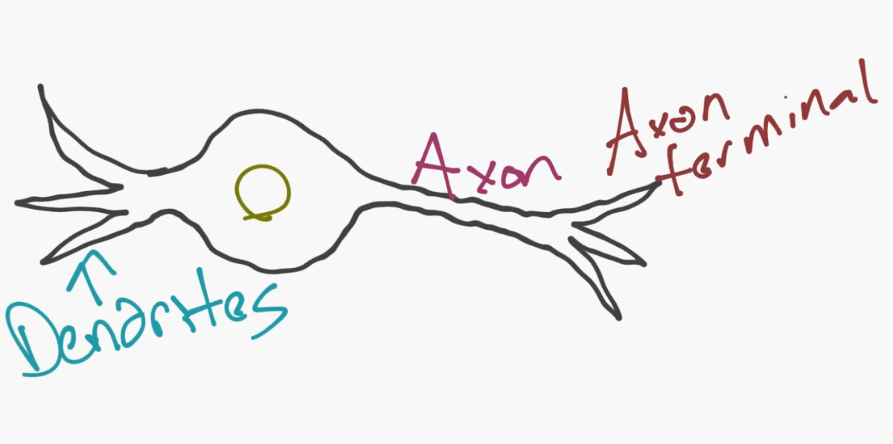
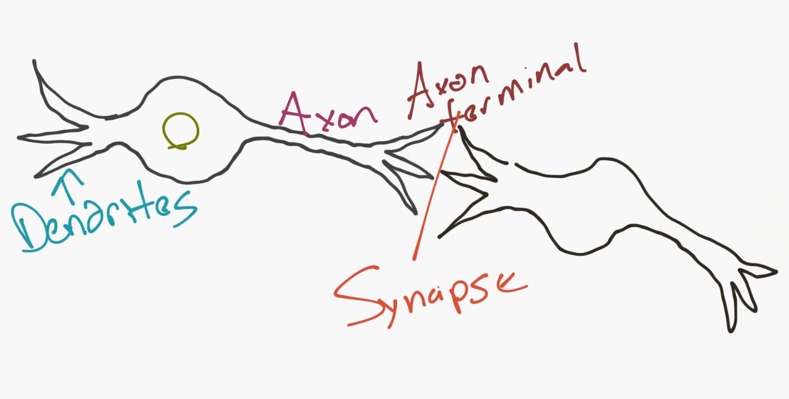
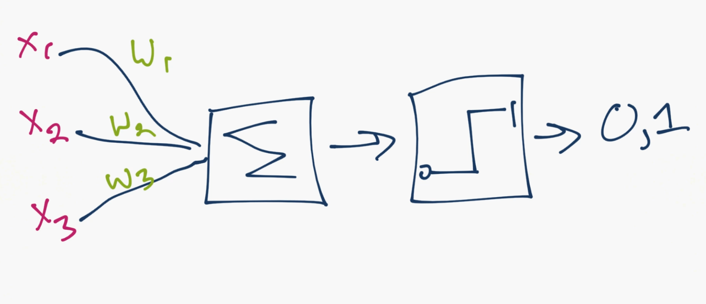
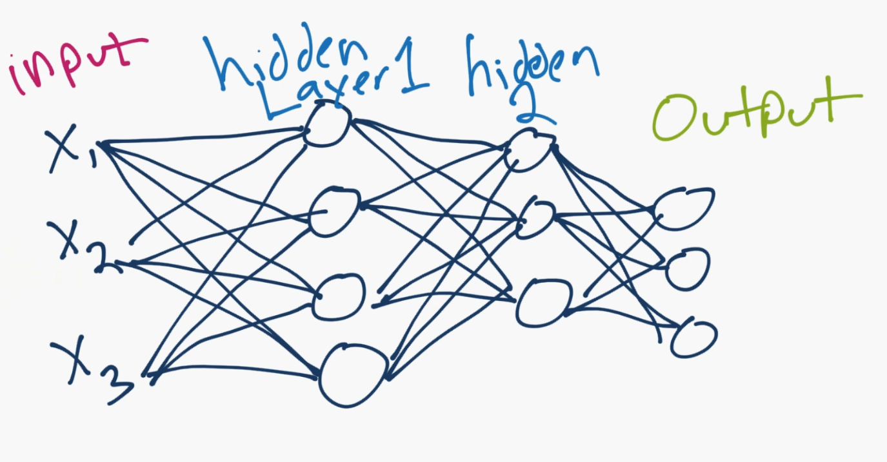
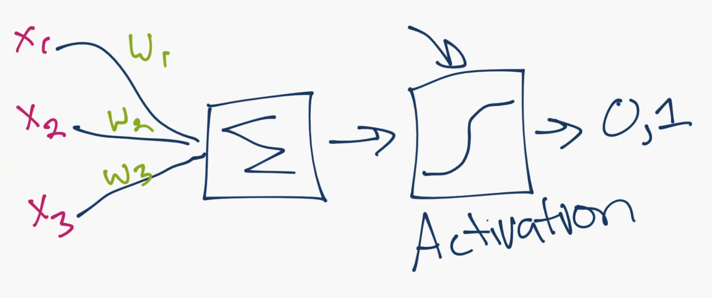

# 第四部分 神经网络

## 四十三、神经网络简介

欢迎阅读机器学习系列教程的一个新部分：深度学习和神经网络、以及 TensorFlow。人造的神经网络受生物学启发，用于指导机器学习，刻意模拟你的大脑（生物神经网络）。

人造神经网络是个新的概念，我现在将其用神经网络来指代。这个概念刻意追溯到 20 世纪 40 年代，并且有数次波动，尤其是跟支持向量机来比较。例如，神经网络直到 90 年代中期才流行，同时 SVM 使用一种新公开的技术（技术在应用之前经过了很长时间），“核的技巧”，适用于非线性分隔的数据集。有了它，SVM 再次流行起来，将神经网络和很多有趣的东西遗留在了后面，直到 2011 年。由于大量的可用数据集，以及更加强大的计算机，这个时候神经网络使用新的技巧，开始优于 SVM。

这就是为什么，如果你打算致力于机器学习领域，理解其它模型也是很重要的，因为趋势可以或者的确改变了。既然我们有了一些机器，它们能够实际执行神经网络，我们就有了一个有些有趣的情况，因为人们一直坐着，一直琢磨这个话题已经有十年了。这并不是说，发表神经研究的论文的人很少见，并且有些具体话题的论文在十年前就写完了。

神经网络的模型实际上是个非常简单的概念。这个概念就是模拟神经元（neuron），并且对于一个基本的神经元，它有树突（dendrites）、细胞核、轴突（axon）和轴突末梢（axon terminal）。



然后，对于一个网络，你需要两个神经元。神经元通过树突和轴突末梢之间的突触（synapse）来传递信息。



好的，所以这就是神经元的工作方式。现在计算机科学家认为我们可以用这个。所以我们提出了一个人造神经元的模型：



就是这样。所以你和你的神经元很像了。虽然，我们进一步简化了事情，并且如果你搜索神经网络的图片，你可能看到这个：



那个圆圈就是神经元或者节点，它们带有数据上的函数，并且互相连接的线是所传递的权重或者信息。每一列都是一个层。你的数据的第一层是输入层。之后，除非你的输出就是你的输入，你拥有至少一个隐藏层。如果你只有一个隐藏层，你就有了一个常规的人造神经网络。如果你拥有多个隐藏层，你就有了深度神经网络，是不是很简单呢？至少是概念上。

所以对于这个模型，你拥有输入数据，对其加权，并且将其传给神经元中的函数。神经元中的函数是个阈值函数，也叫作激活函数。基本上，它是使用一个高于或者低于特定值加权之后的总合。如果它是，你就可以得到一个信号（1），或者什么都没有（0）。然后它加权并且转给下一个神经元，并且执行同样的函数。

这就是一个神经网络模型。所以，什么是权重和阈值函数呢？首先，多亏了 1974 的 Paul Werbos，我们去掉了阈值“变量”。我们不将这些阈值处理为另一个要优化的变量，而是选取然后阈值的值，将其权重为 -1，阈值总是为0,。无论阈值有多大，它都会自行消除，并且始终为 0。我们仍然有一个丑陋的步骤函数，因为神经元产生 0 还是 1 的决策是非常混乱的。我们决定使用某种类型的 sigmoid 函数（S 形）来代替。



对于权重，它们只是随机启动，并且它们对于每个输入到节点/神经元是唯一的。 然后，在典型的“前馈”（最基本的类型）神经网络中，你的信息通过你创建的网络直接传递，并使用你的样本数据，将输出与期望输出进行比较。 从这里，你需要调整权重，来帮助你获得与预期输出匹配的输出。 直接通过神经网络发送数据的行为称为前馈神经网络。 我们的数据从输入层到隐藏层，然后是输出层。 当我们向后退，开始调整权重来最小化损失/成本时，这称为反向传播。

这是一个新的优化问题。 回忆一下，几个教程之前的支持向量机优化问题，我们如何解释这是一个很好的凸优化问题。 即使我们有两个变量，我们的优化问题是一个完美的碗形，所以我们可以知道什么时候达到了最优化，同时沿着路径执行了大量的步骤，使处理便宜。 使用神经网络，情况并非如此。 在实际中，你寻找更多成千上万个变量，甚至数百万或更多的变量。这里的原始解决方案是使用随机梯度下降，但还有其他选项，如 AdaGrad 和 Adam Optimizer。无论如何，这是一项巨大的计算任务。

现在你可以看到为什么神经网络几乎已经搁置了半个多世纪。 只是最近，我们才拥有了这种能力和架构的机器，以便执行这些操作，以及用于匹配的适当大小的数据集。 好消息是，我们已经有花个世纪来就这个话题进行哲学思考，而且大量的基础工作已经完成了，只需要实施和测试。

有意思的是，正如我们不完全了解人类大脑一样，我们并不完全理解神经网络为什么或如何实现这样有趣的结果。 通过大量的挖掘和分析，我们可以揭开一些事情，但是由于许多变量和维度，我们实际上并不太了解发生了什么，我们只是看到了很好的结果，并且很开心。 即使是我们的第一个例子，原则上也是非常基本的，但是他做的事情也有惊人的结果。

对于简单的分类任务，神经网络在性能上与其他简单算法相对接近，甚至像 KNN 那样。 神经网络中的真正美丽带来了更大的数据，更复杂的问题，这两个都使其他机器学习模型变得无力。 例如，当前的神经网络可以做出如下回答：

> Jack 12 岁，Jane 10 岁，Kate 比 Jane 年长，比 Jack 年轻，Kate 多少岁？

答案是11，一个深度学习模型可以解释出来，无需你在某种程度上教会如何实际完成逻辑部分。 你只需简单地传递原始数据，它是单词，甚至是字符，而神经网络则完成其余部分。 哦，你需要数百万个样例！ 以数百万计，我的意思是为了理想的准确度需要约 5 亿。

你在哪里得到数以百万计的样品？你有一些选择。图像数据的一个选择是 [ImageNet](https://image-net.org/)，它在事物的组织中非常类似于 wordnet。如果你不熟悉，你可以提出一个想法。这里的一切都是免费的。接下来，对于文本数据，第一个站点应该是像[维基百科数据转储](https://dumps.wikimedia.org/backup-index.html)。这对于更多的深度学习的任务非常有用，而不是标签数据。接下来，对于更多的文本数据，为什么不去已经被爬去和解析的大部分网站呢？如果这听起来很有趣，请查看 [CommonCrawl](https://commoncrawl.org/)。这个数据集不是一个笑话，但是它的数据是 PB 级的。对于演讲，我并没有很多思路。一个选项是像 [Tatoeba](https://tatoeba.org/eng/)，它有标签和一些翻译，这是非常有用的。当一切都失败时，你可以尝试创建自己的数据集，但是大小要求相当有挑战性。另外，你可以随时寻求帮助。根据我的经验，存在任何东西的数据集，你只需要找到它。很多时候，Google 在尝试查找数据集时会失败，但是人们可以帮助你。目前，你可以在[机器学习 subreddit](https://www.reddit.com/r/machinelearning/) 中尝试询问，大概 90% 的内容与神经网络相关，每个人都需要了解大量的数据集。

现在应该比较明显的是，像 Facebook 和 Google 这样的公司，对于 AI 和神经网络的投入如此之大。 他们实际上拥有所需的数据量来做一些非常有趣的事情。

现在我们有这样的方式，我们如何在神经网络上工作？ 我们将使用 TensorFlow，这是 Google 的一个相对较新的软件包，在撰写本文时仍然是测试版。 还有其他用于机器学习的包，如 Theano 或 Torch，但它们都以类似的方式工作。 我们真的只需要选一个，我选择 Tensorflow。 在下一个教程中，我们将安装 TensorFlow。 如果你已经安装了 TensorFlow，可以跳过下一个教程（使用侧面导航栏，或者单击下一步，滚动到底部，然后再次单击）。


## 四十四、为神经网络安装 TensorFlow（可选）

> 原文：[Installing TensorFlow for Deep Learning - OPTIONAL
](https://pythonprogramming.net/installing-tensorflow-machine-learning-tutorial/)

这是一个可选的教程，用于安装 TensorFlow。 如果你有 Mac 或者 Linux，你不需要这个教程，只需访问`TensorFlow.org > get started > pip installation`。 你只需要运行几个命令，然后就设置好了。 对于 Windows 用户，你需要使用 Docker 或虚拟机来安装 TensorFlow。 我选择虚拟机，因为它很容易，后来可能需要使用双引导。

对于启动，TensorFlow 由 Mac 和 Linux 支持，但 Windows 不支持。 如果需要，可以在 Windows 上使用它们的 Docker 发行包。

你可以随意使用任何你想要的设置，但我个人将在 Windows 机器上的虚拟机上使用 Ubuntu 16.04。 目前，人们要在哪个平台执行机器学习模型，还是比较不清楚的，所以谁也不知道哪个操作系数最终会成为这个领域的王者。 随意使用任何你想要使用的方法，这一点不重要，但我仍然简单通过虚拟机来运行。

首先，下载 [Virtualbox](https://www.virtualbox.org/wiki/Downloads)。 这将允许你虚拟化各种组件，如一些 CPU，GPU 和磁盘空间。 接下来，你需要一个操作系统。 我选择 [Ubuntu 16.04 64bit](https://www.ubuntu.com/download/alternative-downloads)。 如果你有 64 位处理器，那么你可以运行 64 位的映像，但是你可能需要在 BIOS 设置中启用硬件虚拟化，这在 BIOS 设置的 CPU 部分显示。 每个主板是不同的，所以我不能更具体了。 只需在设置和高级设置中查找 CPU 设置选项。

一旦你安装了 VirtualBox 软件，以及要使用的操作系统映像，请在 VirtualBox 中单击“新建”，为新机器命名，选择操作系统的类型和版本，然后转到下一个选项。

如果你想看到我的实时选项，你可以观看视频。 然而，设置非常简单。 选择一个固定大小的硬盘，至少要有 20 GB 的硬盘。 我选择了 50.VDI。 选择适配内存的东西。 你仍然需要一些内存留给你的主机，所以不要全部都占了。

一旦你完成了，你可以双击虚拟机来尝试启动它，你应该得到一个消息，没有什么可以引导，也没有任何启动驱动器。 从这里可以选择你最近下载的 Ubuntu 安装映像，并开始安装过程。 安装时，你将了解到是否要擦除硬盘驱动器的内容，并替换为 Ubuntu。 可能感觉不舒服，答案是肯定的，那就是你想做的。 这将清除虚拟硬盘上的安装，而不是实际的硬盘驱动器。

安装完成后，系统将提示你重启虚拟机。 重新启动提示似乎对我没有太大意义，所以你可以关闭窗口来关闭电源，或者从 GUI 右键单击你的虚拟机，并选择关闭。

当你关闭虚拟机时，你可以右键单击它，然后进入设置。 在那里，进入系统，并分配多于 cpus(1) 的默认数量。 这些只会在启动时分配给你的虚拟机，而不是所有时间。 你可能还想为视频，给自己一些更多的内存。

现在开机，你可能已经注意到你没有得到很好的解决方案。 你可以运行以下操作来启用可调整大小的屏幕：

```
sudo apt-get install virtualbox-guest-utils virtualbox-guest-x11 virtualbox-guest-dkms
```

现在，我们准备好在我们的机器上安装 TensorFlow。 你还需要 Python3，但这是 Ubuntu 16.04 自带的。 前往 TensorFlow.org，点击开始，然后在侧栏上的`pip installation`。 如果你稍后查看本教程，可能会有所不同。 但是，随着事情的变化，我会尽力更新这个文本的版本。 所以，在`pip installation`页面上，指南首先让我们运行：


```
$ sudo apt-get install python3-pip python3-dev
```

以上在你的终端中运行。 在 Ubuntu 上，你可以按`ctrl + alt + t`使其在 GUI 桌面上出现。 由于我运行的是 64 位版本的 Linux（Ubuntu），有了 Python 3.5，而且想要 CPU 版本，我选择：

```
# Ubuntu/Linux 64-bit, CPU only, Python 3.5
$ export TF_BINARY_URL=https://storage.googleapis.com/tensorflow/linux/cpu/tensorflow-0.9.0-cp35-cp35m-linux_x86_64.whl
```

之后执行：

```
$ sudo pip3 install --upgrade $TF_BINARY_URL
```

我们完成了。为了测试，我们可以在控制台中输入`python3`，并尝试导入`tensorflow`。 如果工作正常，我们就都设置好了！

我使用 Sublime Text 来编辑 Python 文件。 使用任何你喜欢的 编辑器。在 Ubuntu 上，一旦下载了`.deb`文件，你需要运行：`sudo dpkg -i /path/to/deb/file`，然后`sudo apt-get install -f`。

下一篇教程中，我们打算涉及使用 TensorFlow 的基础。


## 四十五、深度学习和 TensorFlow 简介

欢迎阅读深度学习与神经网络和 TensorFlow 的第二部分，以及机器学习教程系列的第 44 部分。 在本教程中，我们将介绍一些关于 TensorFlow 的基础知识，以及如何开始使用它。

像 TensorFlow 和 Theano 这样的库不仅仅是深入学习库，它们是**用于**深入学习的库。 他们实际上只是数值处理库，就像 Numpy 一样。 然而，不同的是，像 TensorFlow 这样的软件包使我们能够以高效率执行特定的机器学习数值处理操作，如巨大的矩阵上的求导。 我们也可以轻松地在 CPU 内核，GPU 内核或甚至多个 GPU 等多个设备上分布式处理。 但这不是全部！ 我们甚至可以在具有 TensorFlow 的分布式计算机网络上分发计算。 所以，虽然 TensorFlow 主要是与机器学习一起使用，但它实际上在其他领域也有使用，因为它真的只是一个庞大的数组操作库。

什么是张量（tensor）？ 到目前为止，在机器学习系列中，我们主要使用向量（numpy 数组），张量可以是一个向量。 最简单的说，一个张量是一个类似数组的对象，正如你所看到的，一个数组可以容纳你的矩阵，你的向量，甚至一个标量。

在这一点上，我们只需要将机器学习问题转化为张量函数，这可以用每一个 ML 算法来实现。 考虑神经网络。 神经网络能够分解成什么？

我们有数据（`X`），权重（`w`）和阈值（`t`）。 所有这些都是张量嘛？ `X`是数据集（一个数组），所以这是一个张量。 权重也是一组权重值，所以它们也是张量。阈值？ 与权重相同。 因此，我们的神经网络确实是`X`，`w`和``t或`f(Xwt)`的函数，所以我们准备完全了，当然可以使用 TensorFlow，但是如何呢？

TensorFlow 的工作方式是，首先定义和描述我们的抽象模型，然后在我们准备好的时候，在会话（session）中成为现实。 在 TensorFlow 术语中，该模型的描述是所谓的“计算图形”。 我们来玩一个简单的例子。 首先，我们来构建图：

```py
import tensorflow as tf

# creates nodes in a graph
# "construction phase"
x1 = tf.constant(5)
x2 = tf.constant(6)
```

所以我们有了一些值。现在，我们可以用这些值做一些事情，例如相乘：

```py
result = tf.mul(x1,x2)
print(result)
```

要注意输出仍然是个抽象的张量。没有运行实际计算，只能创建操作。我们的计算图中的每个操作或“op”都是图中的“节点”。

要真正看到结果，我们需要运行会话。 一般来说，你首先构建图形，然后“启动”图形：

```py
# defines our session and launches graph
sess = tf.Session()
# runs result
print(sess.run(result))
```

我们也可以将会话的输出赋给变量：

```py
output = sess.run(result)
print(output)
```

当你完成了一个会话是，你需要关闭它，来释放所使用的资源。

```py
sess.close()
```

关闭之后，你仍然可以引用`output`变量，但是你不能这样做了：

```py
sess.run(result)
```

这会返回错误另一个选项就是利用 Python 的`with`语句：

```py
with tf.Session() as sess:
    output = sess.run(result)
    print(output)
```

如果你不熟悉这些操作，它在这些语句所在的代码块中使用会话，然后在完成后自动关闭会话，和使用`with`语句打开文件的方法相同。

你还可以在多个设备上使用 TensorFlow，甚至可以使用多台分布式机器。 在特定 GPU 上运行某些计算的示例是：

```py
with tf.Session() as sess:
  with tf.device("/gpu:1"):
    matrix1 = tf.constant([[3., 3.]])
    matrix2 = tf.constant([[2.],[2.]])
    product = tf.matmul(matrix1, matrix2)
```

代码来自：[TensorFlow 文档](https://www.tensorflow.org/versions/r0.9/get_started/basic_usage.html#overview)。`tf.matmul`是矩阵乘法函数。

上述代码将在第二个系统 GPU 上运行计算。 如果你安装了 CPU 版本，那么这不是一个选项，但是你仍然应该意识到这个可能性。 TensorFlow 的 GPU 版本要求正确设置 CUDA（以及需要支持 CUDA 的 GPU）。 我有几个支持 CUDA 的 GPU，并希望最终能够充分使用它们，但这要等到以后了！

现在我们已经有了 TensorFlow 的基础知识了，下一个教程中我会邀请你，创建一个深度神经网络的“兔子洞”。 如果你需要安装 TensorFlow，如果你在 Mac 或 Linux 上，安装过程非常简单。 在 Windows 上，也不是很麻烦。 下一个教程是可选的，它只是用于在 Windows 机器上安装 TensorFlow。


## 四十六、深度学习和 TensorFlow - 创建神经网络模型

欢迎阅读深度学习与神经网络和 TensorFlow 的第三部分，以及机器学习教程系列的第 45 部分。 在本教程中，我们将通过创建我们自己的深度神经网络（TensorFlow），来进入（下落）的兔子洞。

我们首先使用 MNIST 数据集，该数据集包含 6 万个手写和标记数字训练样本和 10,000 个的测试样本，0 到 9，因此共有 10 个“分类”。 我会注意到，这是一个非常小的数据集，就你在任何现实环境中的工作而言，它也应该足够小到在每个人的电脑上工作。

MNIST 数据集具有图像，我们将使用纯粹的黑色和白色，阈值，图像，总共 28×28 或 784 像素。 我们的特征是每个像素的像素值，阈值。 像素是“空白”（没有什么，0），或有东西（1）。 这些是我们的特征。 我们尝试使用这个非常基本的数据，并预测我们正在查看的数字（0 ~ 9）。 我们希望我们的神经网络，将以某种方式创建像素之间的关系的内在模型，并且能够查看数字的新样例，并且高准确度预测。

虽然这里的代码不会那么长，但如果你不完全了解应该发生的事情，那么我们可以尝试凝结我们迄今为止所学到的知识，以及我们在这里会做什么。

首先，我们传入输入数据，并将其发送到隐藏层1。因此，我们对输入数据加权，并将其发送到层1。在那里将经历激活函数，因此神经元可以决定是否触发，并将一些数据输出到输出层或另一个隐藏层。在这个例子中，我们有三个隐藏层，使之成为深度神经网络。从我们得到的输出中，我们将该输出与预期输出进行比较。我们使用成本函数（或称为损失函数）来确定我们的正确率。最后，我们将使用优化器函数，Adam Optimizer。在这种情况下，最小化损失（我们有多错误）。成本最小化的方法是通过修改权重，目的是希望降低损失。我们要降低损失的速度由学习率决定。学习率越低，我们学习的速度越慢，我们越有可能获得更好的结果。学习率越高，我们学习越快，训练时间更短，也可能会受到影响。当然，这里的收益递减，你不能只是继续降低学习率，并且总是做得更好。

通过我们的网络直接发送数据的行为，意味着我们正在运行前馈神经网络。 向后调整权重是我们的反向传播。

我们这样做是向前和向后传播，但我们想要多次。 这个周期被称为一个迭代（epoch）。 我们可以选择任何数量的迭代，但你可能想要避免太多，这会导致过拟合。

在每个时代之后，我们希望进一步调整我们的权重，降低损失和提高准确性。 当我们完成所有的迭代，我们可以使用测试集进行测试。

清楚了吗？准备开始了！

```py
import tensorflow as tf
from tensorflow.examples.tutorials.mnist import input_data
mnist = input_data.read_data_sets("/tmp/data/", one_hot = True)
```

我们导入 TensorFlow 和我们将要使用的样本数据。 请注意`one_hot`参数。 这个术语来自只有一个元素的点子，在其余元素当中，字面上是“热”的，或者开启的。 这对于我们这里的多类分类任务是有用的（0 ~ 9）。 因此，不是简单的 0 或者 1，我们拥有：

```
0 = [1,0,0,0,0,0,0,0,0]
1 = [0,1,0,0,0,0,0,0,0]
2 = [0,0,1,0,0,0,0,0,0]
3 = [0,0,0,1,0,0,0,0,0]
...
```

好的，所以我们有了数据。 我选择使用 MNIST 数据集，因为它是一个合适的起始数据集，实际上，收集原始数据并将其转换为可以使用的东西，比创建机器学习模型本身需要更多的时间，我认为这里大多数人都想学习 神经网络，而不是网页抓取和正则表达式。

现在我们要开始构建模型：

```py
n_nodes_hl1 = 500
n_nodes_hl2 = 500
n_nodes_hl3 = 500
n_classes = 10
batch_size = 100
```

我们首先指定每个隐藏层将有多少个节点，我们的数据集有多少份额里，以及我们的批量大小。 虽然你理论上**可以**一次训练整个网络，这是不切实际的。 你们中的许多人可能有可以完全处理 MNIST 数据集的计算机，但是大多数人都没有或可以访问这种计算机，它们可以一次完成实际大小的数据集。 因此，我们进行批量优化。 在这种情况下，我们进行 100 个批次。

```py
x = tf.placeholder('float', [None, 784])
y = tf.placeholder('float')
```

这些是我们图中某些值的占位符。 回想一下，你只需在 TensorFlow 图中构建模型即可。 在这里，TensorFlow 操纵一切，而你不会。 一旦完成，这将更加明显，你尝试寻找在哪里修改重量！ 请注意，我已经使用`[None,784]`作为第一个占位符中的第二个参数。 这是一个可选参数，然而这样显式指定非常有用。 如果你不显式指定，TensorFlow 会在那里填充任何东西。 如果你的形状是显式的，并且一些不同形状的东西尝试放进这个变量的地方，TensorFlow 将抛出一个错误。

我们现在完成了我们的常量以及其实值。现在我们可以实际构建神经网络模型了：

```py
def neural_network_model(data):
    hidden_1_layer = {'weights':tf.Variable(tf.random_normal([784, n_nodes_hl1])),
                      'biases':tf.Variable(tf.random_normal([n_nodes_hl1]))}

    hidden_2_layer = {'weights':tf.Variable(tf.random_normal([n_nodes_hl1, n_nodes_hl2])),
                      'biases':tf.Variable(tf.random_normal([n_nodes_hl2]))}

    hidden_3_layer = {'weights':tf.Variable(tf.random_normal([n_nodes_hl2, n_nodes_hl3])),
                      'biases':tf.Variable(tf.random_normal([n_nodes_hl3]))}

    output_layer = {'weights':tf.Variable(tf.random_normal([n_nodes_hl3, n_classes])),
                    'biases':tf.Variable(tf.random_normal([n_classes]))}
```


这里，我们开始定义我们的权重和我们的...等等，这些偏差是什么？ 偏差是在通过激活函数之前，与我们的相加的值，不要与偏差节点混淆，偏差节点只是一个总是存在的节点。 这里的偏差的目的主要是，处理所有神经元生成 0 的情况。 偏差使得神经元仍然能够从该层中触发。 偏差与权重一样独特，也需要优化。

我们迄今所做的一切都是为我们的权重和偏差创建一个起始定义。 对于层的矩阵的应有形状，这些定义只是随机值（这是`tf.random_normal`为我们做的事情，它为我们输出符合形状的随机值）。 还没有发生任何事情，没有发生流动（前馈）。我们开始流程：

```py
    l1 = tf.add(tf.matmul(data,hidden_1_layer['weights']), hidden_1_layer['biases'])
    l1 = tf.nn.relu(l1)

    l2 = tf.add(tf.matmul(l1,hidden_2_layer['weights']), hidden_2_layer['biases'])
    l2 = tf.nn.relu(l2)

    l3 = tf.add(tf.matmul(l2,hidden_3_layer['weights']), hidden_3_layer['biases'])
    l3 = tf.nn.relu(l3)

    output = tf.matmul(l3,output_layer['weights']) + output_layer['biases']

    return output
```

在这里，我们将值传入第一层。 这些值是什么？ 它们是原始输入数据乘以其唯一权重（从随机开始，但将被优化）：`tf.matmul(l1,hidden_2_layer['weights'])`。 然后，我们添加了`tf.add`的偏差。 我们对每个隐藏层重复这个过程，直到我们的输出，我们的最终值仍然是输入和权重的乘积，加上输出层的偏差值。

完成后，我们只需返回该输出层。 所以现在，我们已经构建了网络，几乎完成了整个计算图形。 在下一个教程中，我们将构建一个函数，使用 TensorFlow 实际运行并训练网络。

# 第四十七章 深度学习和 TensorFlow - 神经网络如何运行

> 原文：[Deep Learning with TensorFlow - Creating the Neural Network Model](https://pythonprogramming.net/tensorflow-neural-network-session-machine-learning-tutorial/)

> 译者：[飞龙](https://github.com/wizardforcel)

> 协议：[CC BY-NC-SA 4.0](http://creativecommons.org/licenses/by-nc-sa/4.0/)

欢迎阅读深度学习与神经网络和 TensorFlow 的第四部分，以及机器学习教程系列的第 46 部分。 在本教程中，我们将在 TensorFlow 中编写会话期间发生的代码。

这里的代码已经更新，以便支持TensorFlow 1.0，但视频有两行需要稍微更新。

在前面的教程中，我们构建了人工神经网络的模型，并用 TensorFlow 建立了计算图表。 现在我们需要实际建立训练过程，这将在 TensorFlow 会话中运行。 继续处理我们的代码：

```py
def train_neural_network(x):
    prediction = neural_network_model(x)
    cost = tf.reduce_mean( tf.nn.softmax_cross_entropy_with_logits(logits=prediction, labels=y) )
```

在新的函数`train_neural_network`下，我们传入数据。 然后，我们通过我们的`neural_network_model`产生一个基于该数据输出的预测。 接下来，我们创建一个开销变量，衡量我们有多少错误，而且我们希望通过操纵我们的权重来最小化这个变量。 开销函数是损失函数的代名词。 为了优化我们的成本，我们将使用`AdamOptimizer`，它是一个流行的优化器，以及其他类似的随机梯度下降和`AdaGrad`。

```py
    optimizer = tf.train.AdamOptimizer().minimize(cost)
```

在`AdamOptimizer()`中，您可以选择将`learning_rate`指定为参数。默认值为 0.001，这在大多数情况下都不错。 现在我们定义了这些东西，我们将启动会话。

```py
    hm_epochs = 10
    with tf.Session() as sess:
        sess.run(tf.global_variables_initializer())
```

首先，我们有一个简单的`hm_epochs`变量，它将确定有多少个迭代（前馈和后退循环）。 接下来，我们使用上一个教程中讨论的会话开启和关闭的语法。 首先，我们初始化所有的变量。这是主要步骤：

```py
        for epoch in range(hm_epochs):
            epoch_loss = 0
            for _ in range(int(mnist.train.num_examples/batch_size)):
                epoch_x, epoch_y = mnist.train.next_batch(batch_size)
                _, c = sess.run([optimizer, cost], feed_dict={x: epoch_x, y: epoch_y})
                epoch_loss += c

            print('Epoch', epoch, 'completed out of',hm_epochs,'loss:',epoch_loss)
```

对于每个迭代，对于我们的数据中的每个批次，我们将针对我们数据批次运行优化器和开销。 为了跟踪我们每一步的损失或开销，我们要添加每个迭代的总开销。 对于每个迭代，我们输出损失，每次都应该下降。 这可以用于跟踪，所以随着时间的推移，你可以看到收益递减。 前几个迭代应该有很大的改进，但是在大约 10 或 20 之间，你会看到很小的变化，或者可能会变得更糟。

现在，在循环之外：

```py
        correct = tf.equal(tf.argmax(prediction, 1), tf.argmax(y, 1))
```

这会告诉我们，我们做了多少个预测，它完美匹配它们的标签。

```py
        accuracy = tf.reduce_mean(tf.cast(correct, 'float'))
        print('Accuracy:',accuracy.eval({x:mnist.test.images, y:mnist.test.labels}))
```

现在我们拥有了测试集上的最终准确率。现在我们需要：

```py
train_neural_network(x)
```

在 10 到 20 个迭代的某个地方应该有 95% 的准确度。 95% 的准确度，听起来不错，但比起更主流的方法，实际上被认为非常糟糕。 我实际上认为 95% 的准确性，这个模型是没有什么意外的。 考虑到我们给网络的唯一信息是像素值，就是这样。 我们没有告诉它如何寻找模式，或者说如何从 9 中得到一个4 ，或者从 8 中得到一个 1。网络只是用一个内在的模型来计算出来，纯粹是基于像素值来开始，并且达到了 95% 准确性。 对我来说这是惊人的，虽然最先进的技术超过 99%。

目前为止的完整代码：

```py
import tensorflow as tf
from tensorflow.examples.tutorials.mnist import input_data
mnist = input_data.read_data_sets("/tmp/data/", one_hot = True)

n_nodes_hl1 = 500
n_nodes_hl2 = 500
n_nodes_hl3 = 500

n_classes = 10
batch_size = 100

x = tf.placeholder('float', [None, 784])
y = tf.placeholder('float')

def neural_network_model(data):
    hidden_1_layer = {'weights':tf.Variable(tf.random_normal([784, n_nodes_hl1])),
                      'biases':tf.Variable(tf.random_normal([n_nodes_hl1]))}

    hidden_2_layer = {'weights':tf.Variable(tf.random_normal([n_nodes_hl1, n_nodes_hl2])),
                      'biases':tf.Variable(tf.random_normal([n_nodes_hl2]))}

    hidden_3_layer = {'weights':tf.Variable(tf.random_normal([n_nodes_hl2, n_nodes_hl3])),
                      'biases':tf.Variable(tf.random_normal([n_nodes_hl3]))}

    output_layer = {'weights':tf.Variable(tf.random_normal([n_nodes_hl3, n_classes])),
                    'biases':tf.Variable(tf.random_normal([n_classes])),}


    l1 = tf.add(tf.matmul(data,hidden_1_layer['weights']), hidden_1_layer['biases'])
    l1 = tf.nn.relu(l1)

    l2 = tf.add(tf.matmul(l1,hidden_2_layer['weights']), hidden_2_layer['biases'])
    l2 = tf.nn.relu(l2)

    l3 = tf.add(tf.matmul(l2,hidden_3_layer['weights']), hidden_3_layer['biases'])
    l3 = tf.nn.relu(l3)

    output = tf.matmul(l3,output_layer['weights']) + output_layer['biases']

    return output

def train_neural_network(x):
    prediction = neural_network_model(x)
    # OLD VERSION:
    #cost = tf.reduce_mean( tf.nn.softmax_cross_entropy_with_logits(prediction,y) )
    # NEW:
    cost = tf.reduce_mean( tf.nn.softmax_cross_entropy_with_logits(logits=prediction, labels=y) )
    optimizer = tf.train.AdamOptimizer().minimize(cost)
    
    hm_epochs = 10
    with tf.Session() as sess:
        # OLD:
        #sess.run(tf.initialize_all_variables())
        # NEW:
        sess.run(tf.global_variables_initializer())

        for epoch in range(hm_epochs):
            epoch_loss = 0
            for _ in range(int(mnist.train.num_examples/batch_size)):
                epoch_x, epoch_y = mnist.train.next_batch(batch_size)
                _, c = sess.run([optimizer, cost], feed_dict={x: epoch_x, y: epoch_y})
                epoch_loss += c

            print('Epoch', epoch, 'completed out of',hm_epochs,'loss:',epoch_loss)

        correct = tf.equal(tf.argmax(prediction, 1), tf.argmax(y, 1))

        accuracy = tf.reduce_mean(tf.cast(correct, 'float'))
        print('Accuracy:',accuracy.eval({x:mnist.test.images, y:mnist.test.labels}))

train_neural_network(x)
```

下一篇教程中，我们尝试使用这个准确的模型，并将其应用到一个新的数据集，这对我们来说并没有准备好。
