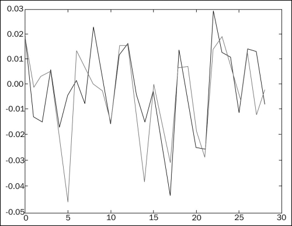
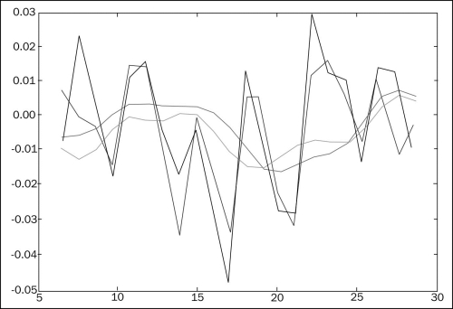

# 四、NumPy 便利的函数

```py
# 来源：NumPy Beginner's Guide 2e ch4
```

## 交易相关偶对

```py
import numpy as np
from matplotlib.pyplot import plot
from matplotlib.pyplot import show

# 读入 BHP 的收盘价
bhp = np.loadtxt('BHP.csv', delimiter=',', usecols=(6,), unpack=True)

# 计算 BHP 的简单收益
bhp_returns = np.diff(bhp) / bhp[ : -1]

# 读入 VALE 的收盘价
vale = np.loadtxt('VALE.csv', delimiter=',', usecols=(6,), unpack=True)

# 计算 VALE 的简单收益
vale_returns = np.diff(vale) / vale[ : -1]

# 计算协方差
# cov_x_y = ((x - x.mean()) * (y - y.mean())).mean()
# cov 函数返回协方差矩阵
# [[ var_x, cov_x_y],
#  [ cov_y_x, var_y]]
covariance = np.cov(bhp_returns, vale_returns) 
print "Covariance", covariance
'''
Covariance [[ 0.00028179  0.00019766]
           [ 0.00019766  0.00030123]]
'''

# diagonal 获取对角线上的元素
print "Covariance diagonal", covariance.diagonal()
# Covariance diagonal [ 0.00028179  0.00030123]
# trace 计算矩阵的迹（对角线元素和）
print "Covariance trace", covariance.trace()
# Covariance trace 0.00058302354992

print covariance/ (bhp_returns.std() * vale_returns.std())

# corrcoef 计算相关系数
# rho_x_y = cov_x_y / (std_x * std_y)
print "Correlation coefficient", np.corrcoef(bhp_returns, vale_returns)
'''
[[ 1.00173366  0.70264666]
[ 0.70264666  1.0708476 ]]
'''

# 检查两个股票是否同步
# 如果差值最后一项，距离均值大于两个标准差，就认为是不同步的
difference = bhp - vale
avg = np.mean(difference)
dev = np.std(difference)

print "Out of sync", np.abs(difference[-1] - avg) > 2 * dev
# Out of sync False

# 绘制两个股票的收益
t = np.arange(len(bhp_returns))
plot(t, bhp_returns, lw=1)
plot(t, vale_returns, lw=2)
show()
```



## 多项式拟合

```py
import numpy as np
import sys
from matplotlib.pyplot import plot
from matplotlib.pyplot import show

# 导入 BHP 和 VALE 的收盘价
bhp=np.loadtxt('BHP.csv', delimiter=',', usecols=(6,), unpack=True)

vale=np.loadtxt('VALE.csv', delimiter=',', usecols=(6,), unpack=True)

# polyfit 用于多项式拟合
# 参数为训练集x，训练集y，最高项次数
# 返回方程的系数数组，高次在前
t = np.arange(len(bhp))
poly = np.polyfit(t, bhp - vale, int(sys.argv[1]))
print "Polynomial fit", poly
# 假设最高项次数为 3：
# Polynomial fit [  1.11655581e-03  -5.28581762e-02   5.80684638e-01   5.79791202e+01]

# polyval 使用拟合结果来预测新的值
# p[0] * x**n + p[1] * x**(n-1) + ... + p[n-1]*x + p[n]
print "Next value", np.polyval(poly, t[-1] + 1)
# Next value 57.9743076081

# 返回多项式的根
print "Roots", np.roots(poly)
# Roots [ 35.48624287+30.62717062j  35.48624287-30.62717062j -23.63210575 +0.j        ]

# 多项式求导
# (x ** n)' = n * x ** (n - 1)
# (a * u(x) + b * v(x))' = a * u'(x) + b * v'(x)
der = np.polyder(poly)
print "Derivative", der
# Derivative [ 0.00334967 -0.10571635  0.58068464]

# 导数的根（可能）是极值
print "Extremas", np.roots(der)
# Extremas [ 24.47820054   7.08205278]

# 拟合函数的最大值和最小值点
vals = np.polyval(poly, t)
print np.argmax(vals)
# 7
print np.argmin(vals)
# 24

# 绘制原始函数和拟合函数
plot(t, bhp - vale)
plot(t, vals)
show()
```

## 平衡成交量

```py
import numpy as np

# 读入收盘价和成交量
c, v=np.loadtxt('BHP.csv', delimiter=',', usecols=(6, 7), unpack=True)

# 获取绝对收益
change = np.diff(c)
print "Change", change
'''
Change [ 1.92 -1.08 -1.26  0.63 -1.54 -0.28  0.25 -0.6   2.15 0.69 -1.33  1.16
  1.59 -0.26 -1.29 -0.13 -2.12 -3.91  1.28 -0.57 -2.07 -2.07 2.5   1.18
-0.88  1.31  1.24 -0.59]
'''

# 计算状态
signs = np.sign(change)
print "Signs", signs
'''
Signs [ 1. -1. -1.  1. -1. -1.  1. -1.  1.  1. -1.  1.  1. -1. -1. -1. -1. -1.
-1. -1. -1.  1.  1.  1. -1.  1.  1. -1.]
'''

# 状态也可以用 piecewise 来计算
# 参数为输入数组 arr、状态数组 condlist 和结果数组 reslist
# 如果满足 condlist[i]，将 arr[i] 变为 reslist[i]
pieces = np.piecewise(change, [change < 0, change > 0], [-1, 1])
print "Pieces", pieces

print "Arrays equal?", np.array_equal(signs, pieces)
# Arrays equal? True

# 平衡成交量是状态乘以成交量
print "On balance volume", v[1:] * signs
'''
[ 2620800. -2461300. -3270900.  2650200. -4667300. -5359800. 7768400.
 -4799100.  3448300.  4719800. -3898900.  3727700.  3379400. -2463900.
 -3590900. -3805000. -3271700. -5507800.  2996800. -3434800. -5008300.
 -7809799.  3947100.  3809700.  3098200. -3500200.  4285600. 3918800.
 -3632200.]
'''
```

## 使用向量化来避免循环

```py
# 向量化就是逐元素调用函数

import numpy as np
import sys

# 获取开盘价、最高价、最低价和收盘价
o, h, l, c = np.loadtxt('BHP.csv', delimiter=',', usecols=(3, 4, 5, 6), unpack=True)

# calc_profit 用于计算利润
def calc_profit(open, high, low, close):
   # 以稍低于开盘价的价格买入
   buy = open * float(sys.argv[1])

   if low <  buy < high:
      # 如果这个价格在当天的区间之内
      # 就以收盘价卖掉
      return (close - buy)/buy
   else:
      # 否则就没有收益，返回 0
      return 0

# 创建向量化的 calc_profit
# 也可以使用装饰器 @np.vectorize
func = np.vectorize(calc_profit)
profits = func(o, h, l, c)
print "Profits", profits

# 获取不为零的收益
real_trades = profits[profits != 0]
# 打印概率和平均利润率
print "Number of trades", len(real_trades), round(100.0 * len(real_trades)/len(c), 2), "%"
# Number of trades 28 93.33 %
print "Average profit/loss %", round(np.mean(real_trades) * 100, 2)
# Average profit/loss % 0.02

# 选择获利的交易，计算概率和平均利润率
winning_trades = profits[profits > 0]
print "Number of winning trades", len(winning_trades), round(100.0 * len(winning_trades)/len(c), 2), "%"
Number of winning trades 16 53.33 %
print "Average profit %", round(np.mean(winning_trades) * 100, 2)
# Average profit/loss % 0.72

# 选择亏损的交易，计算概率和平均利润率
losing_trades = profits[profits < 0]
print "Number of losing trades", len(losing_trades), round(100.0 * len(losing_trades)/len(c), 2), "%"
# Number of losing trades 12 40.0 %
print "Average loss %", round(np.mean(losing_trades) * 100, 2)
# Average loss % -0.92
```

## 使用海宁函数实现平滑


```py
import numpy as np
import sys
from matplotlib.pyplot import plot
from matplotlib.pyplot import show

# 读取长度 N
N = int(sys.argv[1])

# 使用 hanning 来生成权重
weights = np.hanning(N)
print "Weights", weights
'''
Weights [ 0.          0.1882551   0.61126047  0.95048443  0.95048443  0.61126047
  0.1882551   0.        ]
'''

# 读取 BHP 收盘价
bhp = np.loadtxt('BHP.csv', delimiter=',', usecols=(6,), unpack=True)
# 计算简单收益
bhp_returns = np.diff(bhp) / bhp[ : -1]
# 使用 convolve 函数来使之平滑
smooth_bhp = np.convolve(weights/weights.sum(), bhp_returns)[N-1:-N+1]

# 读取 VALE 收盘价
vale = np.loadtxt('VALE.csv', delimiter=',', usecols=(6,), unpack=True)
# 计算简单收益
vale_returns = np.diff(vale) / vale[ : -1]
# 使用 convolve 函数来使之平滑
smooth_vale = np.convolve(weights/weights.sum(), vale_returns)[N-1:-N+1]

# 读取最高项系数
K = int(sys.argv[1])
# 多项式拟合 BHP 和 VALE 的平滑收益
t = np.arange(N - 1, len(bhp_returns))
poly_bhp = np.polyfit(t, smooth_bhp, K)
poly_vale = np.polyfit(t, smooth_vale, K)

# np.polysub 用于求多项式的差
poly_sub = np.polysub(poly_bhp, poly_vale)
# 差值为 0 的点就是多项式的交点
xpoints = np.roots(poly_sub)
print "Intersection points", xpoints
'''
Intersection points [ 27.73321597+0.j          27.51284094+0.j          24.32064343+0.j
  18.86423973+0.j          12.43797190+1.73218179j  12.43797190-1.73218179j
   6.34613053+0.62519463j   6.34613053-0.62519463j]
'''

# 检查是否是实数值
reals = np.isreal(xpoints)
print "Real number?", reals
# Real number? [ True  True  True  True False False False False]

# 过滤实数值，转成实数
# 其实可以直接使用 xpoints[np.isreal(xpoints)].real
xpoints = np.select([reals], [xpoints])
xpoints = xpoints.real
print "Real intersection points", xpoints
# Real intersection points [ 27.73321597  27.51284094 24.32064343  18.86423973   0.           0.   0.  0.]
# trim_zeros 去除首尾的零元素
print "Sans 0s", np.trim_zeros(xpoints)
# Sans 0s [ 27.73321597  27.51284094  24.32064343  18.86423973]

# 绘制简单收益，以及 N 天的平滑收益
plot(t, bhp_returns[N-1:], lw=1.0)
plot(t, smooth_bhp, lw=2.0)

plot(t, vale_returns[N-1:], lw=1.0)
plot(t, smooth_vale, lw=2.0)
show()
```


