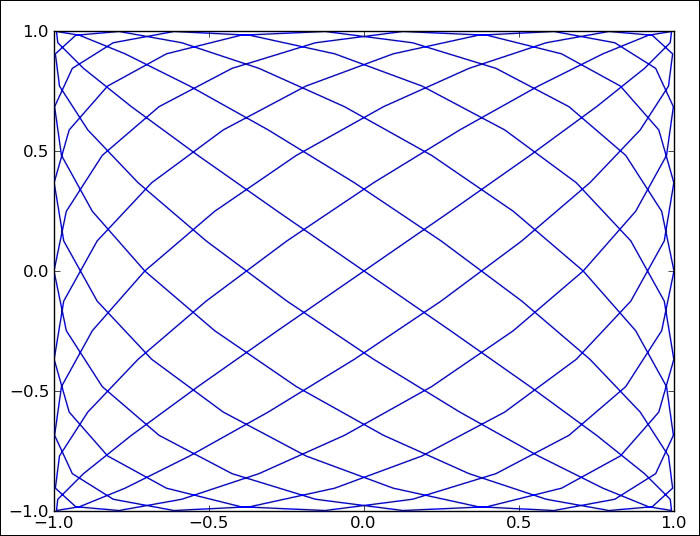
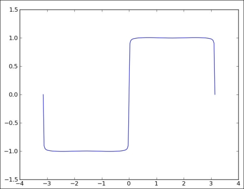
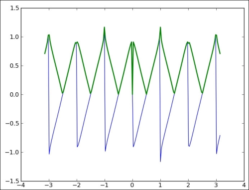

# 五、处理 NumPy 矩阵和 ufunc

```py
# 来源：NumPy Biginner's Guide 2e ch5
```

## 创建矩阵

```py
import numpy as np

# mat 函数创建矩阵
# 空格分割行，分号分隔列
A = np.mat('1 2 3; 4 5 6; 7 8 9')
print "Creation from string", A
'''
Creation from string [[1 2 3]
 [4 5 6]
 [7 8 9]]
'''

# 矩阵转置
print "transpose A", A.T
'''
transpose A [[1 4 7]
 [2 5 8]
 [3 6 9]]
'''

# 求逆（O(n^3)复杂度）
print "Inverse A", A.I
'''
Inverse A [[ -4.50359963e+15   9.00719925e+15  -4.50359963e+15]
 [  9.00719925e+15  -1.80143985e+16   9.00719925e+15]
 [ -4.50359963e+15   9.00719925e+15  -4.50359963e+15]]
'''

print "Check Inverse", A * A.I 

# 从 ndarray 创建矩阵
print "Creation from array", np.mat(np.arange(9).reshape(3, 3))
'''
Creation from array [[0 1 2]
 [3 4 5]
 [6 7 8]]
'''
```

## 从其它矩阵创建矩阵

```py
import numpy as np

# eye 创建单位矩阵
A = np.eye(2)
print "A", A
'''
A [[ 1.  0.]
 [ 0.  1.]]
'''

# 数乘是乘每个元素
B = 2 * A
print "B", B
'''
B [[ 2.  0.]
 [ 0.  2.]]
'''

# 复合矩阵
print "Compound matrix\n", np.bmat("A B; A B")
'''
Compound matrix
[[ 1.  0.  2.  0.]
 [ 0.  1.  0.  2.]
 [ 1.  0.  2.  0.]
 [ 0.  1.  0.  2.]]
'''
```

## 通用函数（ufunc）

```py
import numpy as np

def ultimate_answer(a):
   # 创建与 a 形状相同的零数组
   result = np.zeros_like(a)
   # 每个值都赋为 42
   result.flat = 42
   return result

# 创建 ultimate_answer 的通用函数
ufunc = np.frompyfunc(ultimate_answer, 1, 1) 
print "The answer", ufunc(np.arange(4))
# The answer [42 42 42 42]

print "The answer", ufunc(np.arange(4).reshape(2, 2))
'''
The answer [[42 42]
           [[42 42]
            [42 42]]
'''
```

## 通用函数的方法

```py
import numpy as np

a = np.arange(9)

# a[0] op a[1] op ... op a[n]
print "Reduce", np.add.reduce(a)
# Reduce 36

# s[i] = a[0] + ... + a[i]
print "Accumulate", np.add.accumulate(a)
# Accumulate [ 0  1  3  6 10 15 21 28 36]

print "Reduceat", np.add.reduceat(a, [0, 5, 2, 7])
# Reduceat [10  5 20 15]
print "Reduceat step I", np.add.reduce(a[0:5])
# Reduceat step I 10
print "Reduceat step II", a[5]
# Reduceat step II 5
print "Reduceat step III", np.add.reduce(a[2:7])
# Reduceat step III 20
print "Reduceat step IV", np.add.reduce(a[7:])
# Reduceat step IV 15

# 返回 a[i] op b[j] 的矩阵
print "Outer", np.add.outer(np.arange(3), a)
'''
Outer [[ 0  1  2  3  4  5  6  7  8]
       [ 1  2  3  4  5  6  7  8  9]
       [ 2  3  4  5  6  7  8  9 10]]
'''
```

## 数组除法

```py
# 导入 Py3 的除法特性
# 除法运算符变为真除法
# 整数除以整数产生浮点
from __future__ import division
import numpy as np

a = np.array([2, 6, 5])
b = np.array([1, 2, 3])

# divide 经典除法
# divide(1, 2): 0, divide(1.0, 2): 0.5
print "Divide", np.divide(a, b), np.divide(b, a)
# Divide [2 3 1] [0 0 0]

# true_divide 真除法
# true_divide(1, 2): 0.5, true_divide(1.0, 2): 0.5
print "True Divide", np.true_divide(a, b), np.true_divide(b, a)
# True Divide [ 2.          3.          1.66666667] [ 0.5        0.33333333  0.6       ]

# floor_divide 地板除法
# floor_divide(1, 2): 0, floor_divide(1.0, 2): 0.0
print "Floor Divide", np.floor_divide(a, b), np.floor_divide(b, a)
# Floor Divide [2 3 1] [0 0 0]

c = 3.14 * b
print "Floor Divide 2", np.floor_divide(c, b), np.floor_divide(b, c)
# Floor Divide 2 [ 3.  3.  3.] [ 0.  0.  0.]

# 除法运算符已变成真除法
print "/ operator", a/b, b/a
# / operator [ 2.          3.          1.66666667] [ 0.5         0.33333333  0.6       ]

# 地板除法
print "// operator", a//b, b//a
# // operator [2 3 1] [0 0 0]

# 地板除法
print "// operator 2", c//b, b//c
# // operator 2 [ 3.  3.  3.] [ 0.  0.  0.]
```

## 求余数

```py
import numpy as np

# 余数的符号由除数决定
# 3 除以 2 商 1 余 1
# -3 除以 2 商 -2 余 1
# 3 除以 -2 商 -2 余 -1
# -3 除以 -2 商 1 余 -1

a = np.arange(-4, 4)

print "Remainder", np.remainder(a, 2)
# Remainder [0 1 0 1 0 1 0 1]

print "Mod", np.mod(a, 2)
# Mod [0 1 0 1 0 1 0 1]

print "% operator", a % 2
# % operator [0 1 0 1 0 1 0 1]

# fmod 会将被除数和除数的符号交换
# 根据被除数来决定余数符号
print "Fmod", np.fmod(a, 2)
# Fmod [ 0 -1  0 -1  0  1  0  1]
```

## 斐波那契数

```py
import numpy as np

F = np.matrix([[1, 1], [1, 0]])
print "F", F
'''
F [[1 1]
  [1 0]]
'''

print "8th Fibonacci", (F ** 7)[0, 0]
# 8th Fibonacci 21

n = np.arange(1, 9)

# 计算黄金比例数
sqrt5 = np.sqrt(5)
phi = (1 + sqrt5)/2

# 斐波那契数的通项公式
# rint 对浮点数取整，但不改变浮点类型
fibonacci = np.rint((phi**n - (-1/phi)**n)/sqrt5)
print "Fibonacci", fibonacci
# Fibonacci [  1.   1.   2.   3.   5.   8.  13.  21.]
```

## 利萨茹曲线

```py
# x 和 y 都是 t 的正弦函数
# 但是频率和初相不同

import numpy as np
from matplotlib.pyplot import plot
from matplotlib.pyplot import show
import sys

a = float(sys.argv[1])
b = float(sys.argv[2])
t = np.linspace(-np.pi, np.pi, 201)
x = np.sin(a * t + np.pi/2)
y = np.sin(b * t)
plot(x, y)
show()
```



（a 为 9，b 为 8）

## 方波

```py
import numpy as np
from matplotlib.pyplot import plot
from matplotlib.pyplot import show
import sys

t = np.linspace(-np.pi, np.pi, 201)
'''
array([-3.14159265, -3.11017673, -3.0787608 , ... ,
        3.11017673,  3.14159265])
'''
k = np.arange(1, float(sys.argv[1]))
k = 2 * k - 1
# 假设传入 99：
# array([1, 3, ..., 195])

f = np.zeros_like(t)
# array([0] * 201)

for i in range(len(t)):
   f[i] = np.sum(np.sin(k * t[i])/k)

f = (4 / np.pi) * f
plot(t, f)
show()
```



## 三角波

```py
import numpy as np
from matplotlib.pyplot import plot
from matplotlib.pyplot import show
import sys

t = np.linspace(-np.pi, np.pi, 201)
k = np.arange(1, float(sys.argv[1]))
f = np.zeros_like(t)

for i in range(len(t)):
   f[i] = np.sum(np.sin(2 * np.pi * k * t[i])/k)

f = (-2 / np.pi) * f
plot(t, f, lw=1.0)
plot(t, np.abs(f), lw=2.0)
show()
```



## 位操作

```py
import numpy as np

# 对于一个非零的数，取反之后符号位会发生变化
# 异或之后符号位为 1，一定小于 0
x = np.arange(-9, 9)
y = -x
print "Sign different?", (x ^ y) < 0
print "Sign different?", np.less(np.bitwise_xor(x, y), 0)
'''
Sign different? [ True  True  True  True  True  True  True  True  True False  True  True
  True  True  True  True  True  True]
Sign different? [ True  True  True  True  True  True  True  True  True False  True  True
  True  True  True  True  True  True]
'''

# 检查是否是 2 的幂
# 2 的幂只有一位是 1，其它都是 0
# 减一之后，右边都是 1，其它都是 0
# 位与操作之后得 0
# 但是这里并没有排除 0
print "Power of 2?\n", x, "\n", (x & (x - 1)) == 0
print "Power of 2?\n", x, "\n", np.equal(np.bitwise_and(x,  (x - 1)), 0)
'''
Power of 2?
[-9 -8 -7 -6 -5 -4 -3 -2 -1  0  1  2  3  4  5  6  7  8] 
[False False False False False False False False False  True  True  True
 False  True False False False  True]
Power of 2?
[-9 -8 -7 -6 -5 -4 -3 -2 -1  0  1  2  3  4  5  6  7  8] 
[False False False False False False False False False  True  True  True
 False  True False False False  True]
'''

# m % 4 相当于 m & 0b11，只保留后两位
print "Modulus 4\n", x, "\n", x & ((1 << 2) - 1)
print "Modulus 4\n", x, "\n", np.bitwise_and(x, np.left_shift(1, 2) - 1)
'''
Modulus 4
[-9 -8 -7 -6 -5 -4 -3 -2 -1  0  1  2  3  4  5  6  7  8] 
[3 0 1 2 3 0 1 2 3 0 1 2 3 0 1 2 3 0]
Modulus 4
[-9 -8 -7 -6 -5 -4 -3 -2 -1  0  1  2  3  4  5  6  7  8] 
[3 0 1 2 3 0 1 2 3 0 1 2 3 0 1 2 3 0]
'''
```