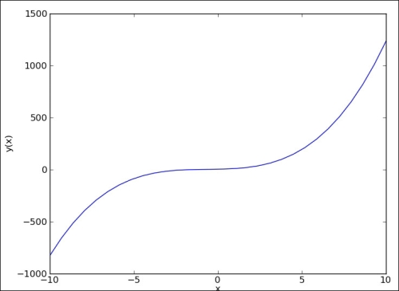
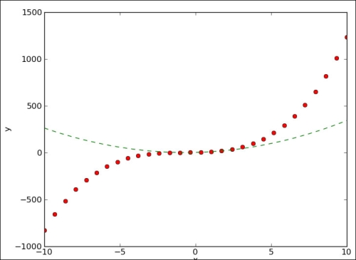
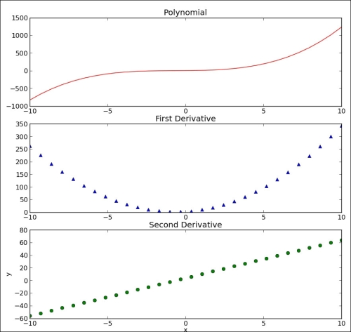
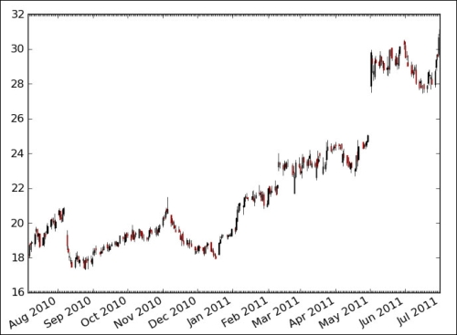
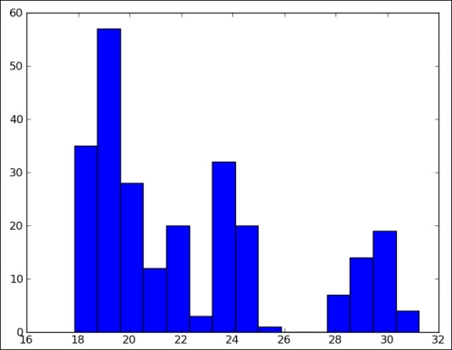
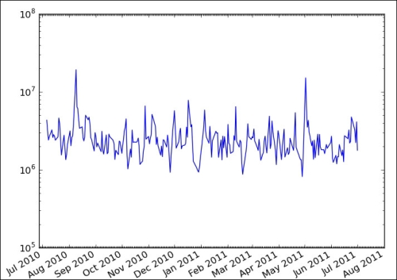
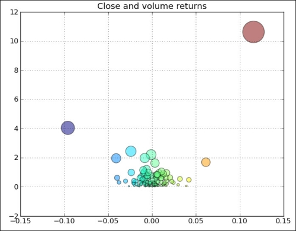
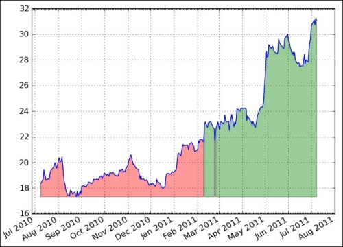
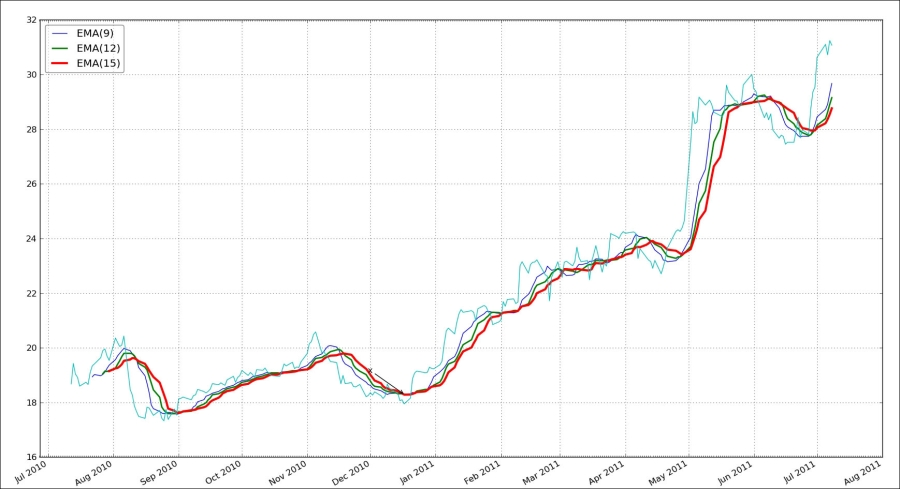
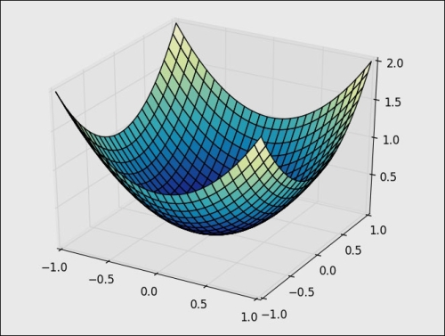

# 九、使用 Matplotlib 绘图

```py
# 来源：NumPy Biginner's Guide 2e ch9
```

# 绘制多项式函数

```py
import numpy as np
import matplotlib.pyplot as plt

# 创建函数 func = x ** 3 + 2 * x ** 2 + 3 * x + 4
# poly1d 根据系数数组创建函数，高项系数在前
func = np.poly1d(np.array([1, 2, 3, 4]).astype(float))
# x 值是 -10 ~ 10 取 30 个点
x = np.linspace(-10, 10, 30)
# 计算相应的 y 值
y = func(x)

# 绘制函数，plot 并不会立即显示
plt.plot(x, y)
# 设置两个轴的标签
plt.xlabel('x')
plt.ylabel('y(x)')
# 显示图像
plt.show()
```



## 绘制多项式函数及其导函数

```py
import numpy as np
import matplotlib.pyplot as plt

# func = x ** 3 + 2 * x ** 2 + 3 * x + 4
# func1 是它的导数，func' = 3 * x ** 2 + 4 * x + 3
func = np.poly1d(np.array([1, 2, 3, 4]).astype(float))
func1 = func.deriv(m=1)
x = np.linspace(-10, 10, 30)
y = func(x)
y1 = func1(x)

# 将原函数绘制为红色的散点
# 导函数绘制为绿色的虚线
plt.plot(x, y, 'ro', x, y1, 'g--')
plt.xlabel('x')
plt.ylabel('y')
plt.show()
# 可以看到这里导函数的零点是原函数的驻点
```



## 分别绘制多项式函数及其导数

```py
import numpy as np
import matplotlib.pyplot as plt

# func = x ** 3 + 2 * x ** 2 + 3 * x + 4
func = np.poly1d(np.array([1, 2, 3, 4]).astype(float))
x = np.linspace(-10, 10, 30)
y = func(x)
# func1 是它的导数，func' = 3 * x ** 2 + 4 * x + 3
func1 = func.deriv(m=1)
y1 = func1(x)
# func2 是二阶导数，func'' = 6 * x + 4
func2 = func.deriv(m=2)
y2 = func2(x)

# 三行一列的第一个位置
plt.subplot(311)
# 将原函数绘制为红色曲线
plt.plot(x, y, 'r-')
plt.title("Polynomial")

# 三行一列的第二个位置
plt.subplot(312)
# 将一阶导函数绘制为蓝色三角
plt.plot(x, y1, 'b^')
plt.title("First Derivative")

# 三行一列的第三个位置
plt.subplot(313)
# 将一阶导函数绘制为绿色散点
plt.plot(x, y2, 'go')
plt.title("Second Derivative")
plt.xlabel('x')
plt.ylabel('y')
plt.show()
```



## K 线图

```py
from matplotlib.dates import DateFormatter
from matplotlib.dates import DayLocator
from matplotlib.dates import MonthLocator
from matplotlib.finance import quotes_historical_yahoo
from matplotlib.finance import candlestick
import sys
from datetime import date
import matplotlib.pyplot as plt

today = date.today()
start = (today.year - 1, today.month, today.day)

alldays = DayLocator()              
months = MonthLocator()
month_formatter = DateFormatter("%b %Y")

symbol = 'DISH'

if len(sys.argv) == 2:
   symbol = sys.argv[1]

# 导入 DISH 一年的股票数据
quotes = quotes_historical_yahoo(symbol, start, today)

# 获取 Figure 和 Axes 实例
fig = plt.figure()
ax = fig.add_subplot(111)
# 设置 Locator 和 Formatter
ax.xaxis.set_major_locator(months)
ax.xaxis.set_minor_locator(alldays)
ax.xaxis.set_major_formatter(month_formatter)

# candlestick 用于绘制 K 线图
# ax 是 Axes 实例
# quotes 是股票数据，行是记录，列是属性
candlestick(ax, quotes)
fig.autofmt_xdate()
plt.show()
```



## 绘制收盘价分布图

```py
from matplotlib.finance import quotes_historical_yahoo
import sys
from datetime import date
import matplotlib.pyplot as plt
import numpy as np

today = date.today()
start = (today.year - 1, today.month, today.day)

symbol = 'DISH'

if len(sys.argv) == 2:
   symbol = sys.argv[1]

# 导入 DISH 一年的股票数据
# 行为记录，列为属性
# 分别为日期、开盘价、最高价、最低价、收盘价、成交量
quotes = quotes_historical_yahoo(symbol, start, today)
# 获取收盘价
quotes = np.array(quotes)
close = quotes.T[4]

# 绘制直方图，横轴是数据分布，纵轴是频数
# 第一个参数是数据，第二个参数是分组数量，默认为 10
plt.hist(close, np.sqrt(len(close)))
plt.show()
```



## 绘制对数刻度

```py
from matplotlib.finance import quotes_historical_yahoo
from matplotlib.dates import DateFormatter
from matplotlib.dates import DayLocator
from matplotlib.dates import MonthLocator
import sys
from datetime import date
import matplotlib.pyplot as plt
import numpy as np

today = date.today()
start = (today.year - 1, today.month, today.day)

symbol = 'DISH'

if len(sys.argv) == 2:
   symbol = sys.argv[1]

# 获取 DASH 一年的日期和成交量
quotes = quotes_historical_yahoo(symbol, start, today)
quotes = np.array(quotes)
dates = quotes.T[0]
volume = quotes.T[5]


alldays = DayLocator()              
months = MonthLocator()
month_formatter = DateFormatter("%b %Y")

fig = plt.figure()
ax = fig.add_subplot(111)
# semilogy 将 y 轴绘制为对数刻度
# 也就是绘制 date 与 log10(volume) 的图像
# 但是刻度标签是 volume，也就是 10 ** 1, 10 ** 2, ....
plt.semilogy(dates, volume)
ax.xaxis.set_major_locator(months)
ax.xaxis.set_minor_locator(alldays)
ax.xaxis.set_major_formatter(month_formatter)
fig.autofmt_xdate()
plt.show
```



## 绘制收益和成交量差值的散点图

```py
from matplotlib.finance import quotes_historical_yahoo
import sys
from datetime import date
import matplotlib.pyplot as plt
import numpy as np

today = date.today()
start = (today.year - 1, today.month, today.day)

symbol = 'DISH'

if len(sys.argv) == 2:
   symbol = sys.argv[1]

# 获取 DISH 一年的收盘价和成交量
quotes = quotes_historical_yahoo(symbol, start, today)
quotes = np.array(quotes)
close = quotes.T[4]
volume = quotes.T[5]
# 计算收益和成交量差值
ret = np.diff(close)/close[:-1]
volchange = np.diff(volume)/volume[:-1]

fig = plt.figure()
ax = fig.add_subplot(111)
# 绘制散点图，参数分别为横轴、纵轴、颜色、大小、透明度
# 横轴为收益，纵轴为成交量差值
# 颜色随收益变化，大小随成交量变化
ax.scatter(ret, volchange, c=ret * 100, s=volchange * 100, alpha=0.5)
ax.set_title('Close and volume returns')
ax.grid(True)

plt.show()
```



## 基于条件填充区域

```py
from matplotlib.finance import quotes_historical_yahoo
from matplotlib.dates import DateFormatter 
from matplotlib.dates import DayLocator 
from matplotlib.dates import MonthLocator
import sys
from datetime import date
import matplotlib.pyplot as plt
import numpy as np

today = date.today()
start = (today.year - 1, today.month, today.day)

symbol = 'DISH'

if len(sys.argv) == 2:
   symbol = sys.argv[1]

quotes = quotes_historical_yahoo(symbol, start, today)
quotes = np.array(quotes)
dates = quotes.T[0]
close = quotes.T[4]


alldays = DayLocator()              
months = MonthLocator()
month_formatter = DateFormatter("%b %Y")

fig = plt.figure()
ax = fig.add_subplot(111)
# 绘制收盘价
ax.plot(dates, close)
# fill_between 用于填充区域
# 参数依次为 x 值，y 值下界，y 值上界，
# 需要填充的位置（布尔索引），填充色，不透明度
# 如果收盘价高于均值，将收盘价和最小值之间填充为绿色
plt.fill_between(dates, close.min(), close, where=close>close.mean(), facecolor="green", alpha=0.4)
# 如果收盘价低于均值，将收盘价和最小值之间填充为红色
plt.fill_between(dates, close.min(), close, where=close<close.mean(), facecolor="red", alpha=0.4)
ax.xaxis.set_major_locator(months)
ax.xaxis.set_minor_locator(alldays)
ax.xaxis.set_major_formatter(month_formatter)
ax.grid(True)
fig.autofmt_xdate()
plt.show()
```




## 使用图例和标注

```py
from matplotlib.finance import quotes_historical_yahoo
from matplotlib.dates import DateFormatter
from matplotlib.dates import DayLocator
from matplotlib.dates import MonthLocator
import sys
from datetime import date
import matplotlib.pyplot as plt
import numpy as np

today = date.today()
start = (today.year - 1, today.month, today.day)

symbol = 'DISH'

if len(sys.argv) == 2:
   symbol = sys.argv[1]

# 读取 DISH 的日期和收盘价
quotes = quotes_historical_yahoo(symbol, start, today)
quotes = np.array(quotes)
dates = quotes.T[0]
close = quotes.T[4]

# 获取 Figure 和 Axes 对象
fig = plt.figure()
ax = fig.add_subplot(111)

emas = []

# 计算窗口为 9、12、15 的指数滑动平均
for i in range(9, 18, 3):
   # 计算权重
   weights = np.exp(np.linspace(-1., 0., i))
   weights /= weights.sum()

   # 计算滑动平均
   ema = np.convolve(weights, close)[i-1:-i+1]
   idx = (i - 6)/3
   # 绘制滑动平均
   # 我们使用 label 关键字参数来添加标签
   ax.plot(dates[i-1:], ema, lw=idx, label="EMA(%s)" % (i))
   data = np.column_stack((dates[i-1:], ema))
   emas.append(np.rec.fromrecords(data, names=["dates", "ema"]))   

# 寻找前两个滑动平均的交点
first = emas[0]["ema"].flatten()
second = emas[1]["ema"].flatten()
bools = np.abs(first[-len(second):] - second)/second < 0.0001
xpoints = np.compress(bools, emas[1])

# 使用箭头来标注
for xpoint in xpoints:
   # annotate 函数用于标注
   # 第一个参数：标注文本
   # xy：被标注位置（箭头指向的点）
   # xytext：文本位置（箭头起始的点）
   # xycoords：xy 的坐标类型
   # textcoords：xytext 的坐标类型
   # arrowprops：箭头样式
   ax.annotate('x', xy=xpoint, textcoords='offset points',
                xytext=(-50, 30),
                arrowprops=dict(arrowstyle="->"))
   
# 设置图例，loc='best' 让 Matplotlib 决定放在哪里
leg = ax.legend(loc='best', fancybox=True)
# 设置不透明度为 0.5
leg.get_frame().set_alpha(0.5)

# 设置日期 Locator 和 Formatter
alldays = DayLocator()              
months = MonthLocator()
month_formatter = DateFormatter("%b %Y")
# 绘制原始收盘价
ax.plot(dates, close, lw=1.0, label="Close")
ax.xaxis.set_major_locator(months)
ax.xaxis.set_minor_locator(alldays)
ax.xaxis.set_major_formatter(month_formatter)
ax.grid(True)
fig.autofmt_xdate()
plt.show()
```



## 三维绘图

```py
# 绘制 z = x ** 2 + y ** 2
from mpl_toolkits.mplot3d import Axes3D
import matplotlib.pyplot as plt
import numpy as np
from matplotlib import cm

# 获取 Figure 实例
fig = plt.figure()
# 获取 Axes 实例，projection='3d' 表示三维绘图
ax = fig.add_subplot(111, projection='3d')

# x 和 y 从 -1 到 1 取 100 个点
u = np.linspace(-1, 1, 100)

# meshgrid 创建二维的网格
# 接受一维数组 x，长为 m，数组y，长为 n
# 生成 nxm 矩阵 A 和 B，A[i, j] == x[j]
# B[i, j] == y[i]
x, y = np.meshgrid(u, u)
z = x ** 2 + y ** 2
# plot_surface 用于绘制曲面
# rstride 和 cstride 是行和列步长
# 从输入数组中每四个点取一个点
# cmap 是颜色映射表
ax.plot_surface(x, y, z,  rstride=4, cstride=4, cmap=cm.YlGnBu_r)

plt.show()
```



## 热力图

```py
# 绘制 z = x ** 2 + y ** 2 的热力图
# 热力图的横轴是 x，纵轴是 y，颜色是 z
import matplotlib.pyplot as plt
import numpy as np
from matplotlib import cm

fig = plt.figure()
ax = fig.add_subplot(111)

u = np.linspace(-1, 1, 100)

x, y = np.meshgrid(u, u)
z = x ** 2 + y ** 2
# contourf 用于绘制热力图
ax.contourf(x, y, z)

plt.show()
```

## 绘制动画

```py
import numpy as np
import matplotlib.pyplot as plt
import matplotlib.animation as animation

fig = plt.figure()
ax = fig.add_subplot(111)
# x, y, z 都是 10 个 0 ~ 1 的随机值
N = 10
x = np.random.rand(N)
y = np.random.rand(N)
z = np.random.rand(N)
# 绘制 x, y, z，并获取 Axes 实例
circles, triangles, dots = ax.plot(x, 'ro', y, 'g^', z, 'b.')
ax.set_ylim(0, 1)
# 去掉坐标轴
plt.axis('off')

# 动画需要有帧函数，定期执行
# 这个函数将 data 的第一行作为圆圈的 y 值
# 第二行作为三角的 y 值
def update(data):
    circles.set_ydata(data[0])
    triangles.set_ydata(data[1])
    return circles, triangles

# 动画需要一个数据序列（可迭代对象）
# 这是一个长度无限的生成器，每次迭代都返回 2xN 的随机值数组
def generate():
    while True: yield np.random.rand(2, N)

# FuncAnimation 用于绘制对象
# 参数一次是 Figure 实例，帧函数，数据序列，以及刷新间隔
# 每次刷新时，都会用数据序列的当前值调用帧函数
anim = animation.FuncAnimation(fig, update, generate, interval=150)
plt.show()
```


