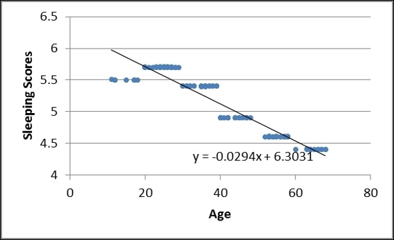
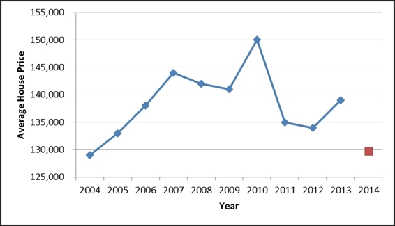

# 五、NumPy 中的线性代数

```py
# 来源：NumPy Essentials ch5
```

## 矩阵

```py
import numpy as np 
ndArray = np.arange(9).reshape(3,3) 
# matrix 可以从 ndarray 直接构建
x = np.matrix(ndArray) 
# identity 用于构建单位矩阵
y = np.mat(np.identity(3)) 
x 
'''
matrix([[0, 1, 2], 
        [3, 4, 5], 
        [6, 7, 8]]) 
'''
y 
''' 
matrix([[1., 0., 0.], 
        [0., 1., 0.], 
        [0., 0., 1.]]) 
'''

# 矩阵的相加是逐元素的
x + y
'''
matrix([[ 1.,  1.,  2.], 
        [ 3.,  5.,  5.], 
        [ 6.,  7.,  9.]]) 
'''

# 矩阵乘法是一行乘一列
x * x 
'''
matrix([[ 15,  18,  21], 
        [ 42,  54,  66], 
        [ 69,  90, 111]]) 
'''
# np.dot 效果相同
np.dot(ndArray, ndArray) 
'''
array([[ 15,  18,  21], 
       [ 42,  54,  66], 
       [ 69,  90, 111]]) 
'''

# 矩阵的乘方
x ** 3 
'''
matrix([[ 180,  234,  288], 
        [ 558,  720,  882], 
        [ 936, 1206, 1476]])
'''

z = np.matrix(np.random.random_integers(1, 50, 9).reshape(3,3)) 
z
'''
matrix([[32, 21, 28], 
        [ 2, 24, 22], 
        [32, 20, 22]]) 
'''

# I 属性求矩阵的逆，不可逆时报错
z.I 
'''
matrix( [[-0.0237 -0.0264  0.0566] 
         [-0.178   0.0518  0.1748] 
         [ 0.1963 -0.0086 -0.1958]]) 
'''

# H 属性求共轭转置
z.H
'''
matrix([[32  2 32] 
        [21 24 20] 
        [28 22 22]]) 
'''

# 求解线性方程组
# Ax = b => x = A.I b
# 可以从这种字符串创建矩阵
# 空格分隔行，分号分隔列
A = np.mat('3 1 4; 1 5 9; 2 6 5') 
b = np.mat([[1],[2],[3]]) 
x = A.I * b
x 
'''
matrix([[ 0.2667], 
        [ 0.4667], 
        [-0.0667]]) 
'''

# allclose 验证是否等价
np.allclose(A * x, b) 
# True 

# matrix 使用矩阵的方法来计算转置
x = np.arange(25000000).reshape(5000,5000) 
y = np.mat(x) 
'''
%timeit x.T 
10000000 loops, best of 3: 176 ns per loop 

%timeit y.T 
1000000 loops, best of 3: 1.36 µs per loop
'''

# A 属性返回等价的 ndarray
# A1 属性返回展开的等价 ndarray
A.A 
'''
array([[3, 1, 4], 
       [1, 5, 9], 
       [2, 6, 5]]) 
'''
A.A1 
# array([3, 1, 4, 1, 5, 9, 2, 6, 5]) 
```

## 线性代数

```py
x = np.array([[1, 2], [3, 4]]) 
y = np.array([[10, 20], [30, 40]]) 
# dot 对一维数组计算内积
# 对二维数组计算矩阵乘法
np.dot(x, y) 
'''
[[1*10+2*30, 1*20+2*40],
 [3*10+4*30, 3*20+4*40]]

=>

[[ 70, 100],
 [150, 220]] 
'''

# vdot 将数组展开计算内积
# 等价于 np.dot(x.ravel(), y.ravel())
np.vdot(x, y) 
# 1*10+2*20+3*30+4*40=300

# outer计算外积
# 返回一个二维数组，每个元素是 x[i]*y[j]
np.outer(x,y) 
'''
[[1*10, 1*20, 1*30, 1*40],
 [2*10, 2*20, 2*30, 2*40],
 [3*10, 3*20, 3*30, 3*40],
 [4*10, 4*20, 4*30, 4*40]]

=>
 
[[ 10,  20,  30,  40], 
 [ 20,  40,  60,  80], 
 [ 30,  60,  90, 120], 
 [ 40,  80, 120, 160]]
'''

# cross 计算叉积
# 接受一维二元或三元向量

a = np.array([1,0,0]) 
b = np.array([0,1,0]) 
np.cross(a,b) 
'''
det([[i, j, k],
     [1, 0, 0],
     [0, 1, 0]])
     
=> 

[0, 0, 1]
'''
np.cross(b,a) 
# array([ 0,  0, -1]) 

# linalg.det 计算行列式
# 对于二阶方阵来说
# det = m[0,0]*m[1,1] - m[0,1]*m[1,0]
x = np.array([[4,8],[7,9]]) 
np.linalg.det(x) 
# -20.000000000000007 

# linalg.inv 求逆
np.linalg.inv(x) 
'''
array([[-0.45,  0.4 ], 
       [ 0.35, -0.2 ]]) 
'''
np.mat(x).I 
'''
matrix([[-0.45,  0.4 ], 
        [ 0.35, -0.2 ]]) 
'''

# linalg.solve 解方程组
# 原理是 dot(inv(A), b)
# 不可逆时会报错
x = np.linalg.solve(A,b) 
x 
'''
matrix([[ 0.2667], 
        [ 0.4667], 
        [-0.0667]]) 
'''
```

## 分解

```py

x = np.random.randint(0, 10, 9).reshape(3,3) 
x
'''
array([[ 1,  5,  0] 
       [ 7,  4,  0] 
       [ 2,  9,  8]]) 
'''

# 特征值分解
# https://en.wikipedia.org/wiki/Eigenvalues_and_eigenvectors
# w 为特征值，v 的列向量为特征向量
w, v = np.linalg.eig(x) 
w
# array([ 8.,  8.6033,  -3.6033]) 
v
'''
array([[ 0.,  0.0384,  0.6834] 
       [ 0.,  0.0583, -0.6292] 
       [ 1.,  0.9976,  0.3702]] 
) 
'''

# 复矩阵的分解
y = np.array([[1, 2j],[-3j, 4]]) 
np.linalg.eig(y) 
'''
(array([ -0.3723+0.j,  5.3723+0.j]), 
 array([[0.8246+0.j    ,  0.0000+0.416j     ], 
        [-0.0000+0.5658j,  0.9094+0.j    ]])) 
'''

# 可能存在舍入错误
# 这里的特征值应该是 1 +/- 1e-10
z = np.array([[1 + 1e-10, -1e-10],[1e-10, 1 - 1e-10]]) 
np.linalg.eig(z) 
'''
(array([ 1.,  1.]), array([[0.70710678,  0.707106], 
        [0.70710678,  0.70710757]])) 
'''

# 奇异值分解可以看做特征值分解的扩展
# 可用于非方阵
# 如果 A 是 mxn 矩阵，可分解为 A = u * sigma * v
# u 是 mxmin(m,n) 矩阵，列向量为左奇异向量，也就是 A A^T 的特征向量
# sigma 是 min(m,n) 阶奇异值的对角阵，奇异值是 A A^T 和 A^T A 的特征值平方根
# v 是 min(m,n)xn 矩阵，列向量为右奇异向量，也就是 A^T A 的特征向量
np.set_printoptions(precision = 4) 
A = np.array([3,1,4,1,5,9,2,6,5]).reshape(3,3) 
# 这里没有设置 full_matrices=False
# u 是 mxm 阶，v 是 nxn 阶
u, sigma, vh = np.linalg.svd(A) 
u 
'''
array([[-0.3246,  0.799 ,  0.5062], 
       [-0.7531,  0.1055, -0.6494], 
       [-0.5723, -0.592 ,  0.5675]]) 
'''
vh 
'''
array([[-0.2114, -0.5539, -0.8053], 
       [ 0.4633, -0.7822,  0.4164], 
       [ 0.8606,  0.2851, -0.422 ]]) 
'''
sigma 
# array([ 13.5824,   2.8455,   2.3287]) 

# 如果设置了 full_matrices=False
# 就能将其乘起来
u, sigma, v = np.linalg.svd(A, full_matrices=False) 
u * np.diag(s) * v
'''
array([[3, 1, 4],
       [1, 5, 9],
       [2, 6, 5]])
'''

# QR 分解
# Ax = b, x = A^(-1) b
# A = QR
# x = R^(-1) Q^(-1) b
#   = R^(-1) Q.T b
b = np.array([1,2,3]).reshape(3,1) 
q, r = np.linalg.qr(A) 
x = np.dot(np.linalg.inv(r), np.dot(q.T, b)) 
x 
'''
array([[ 0.2667], 
       [ 0.4667], 
       [-0.0667]]) 
'''
```

## 多项式

```py
# root 表示多项式的根为 1,2,3,4
root = np.array([1,2,3,4]) 
# poly 把根转化成系数数组
# 高次项在前
np.poly(root) 
# array([  1, -10,  35, -50,  24]) 
# 也就是 x ** 4 - 10 * x ** 3 + 35 * x ** 2 - 50 * x + 24

# roots 求多项式的根
np.roots([1,-10,35,-50,24]) 
# array([ 4.,  3.,  2.,  1.]) 

# polyval 计算多项式的值
# 接受多项式系数和 x 值
np.polyval([1,-10,35,-50,24], 5) 
# 24 

coef = np.array([1,-10,35,-50,24])
# polyint 求多项式函数的不定积分
# ∫(x ** n)dx = x ** (n + 1) / (n + 1) + C
# ∫(u + v)dx = ∫udx + ∫vdx
# 这里的常数项 C 一律为 0
integral = np.polyint(coef)  
integral
# array([  0.2 ,  -2.5 ,  11.6667, -25.  ,  24.  ,  0.  ]) 

# polyder 对多项式求导
# (x ** n)' = n * x ** (n - 1)
# (u + v)' + u' + v'
np.polyder(integral) == coef
# array([ True,  True,  True,  True,  True], dtype=bool) 
# 还可以直接算五阶导数
np.polyder(coef, 5)
# array([], dtype=int32) 

# 构造 Polynomial 对象
from numpy.polynomial import polynomial 
p = polynomial.Polynomial(coef) 
p 
# Polynomial([  1., -10.,  35., -50.,  24.], [-1,  1], [-1,  1]) 
# 取系数
p.coef 
# array([  1., -10.,  35., -50.,  24.]) 
# 取根
p.roots() 
# array([ 0.25  ,  0.3333,  0.5   ,  1.    ]) 
# 求函数值
polynomial.polyval(p, 5) 
# Polynomial([ 5.], [-1.,  1.], [-1.,  1.]) 
# 积分
p.integ() 
Polynomial([  0.    ,   1.    ,  -5.    ,  11.6667, -12.5   ,   4.8   ], [-1.,  1.], [-1.,  1.]) 
# 微分
p.integ().deriv() == p 
# True 
```

## 曲线拟合

```py
# 我们的分组为
# <20: x7
# 21 ~ 30: x24
# 31 ~ 40: x21
# 41 ~ 50: x19
# 51 ~ 60: x17
# >60: x12
groups = [7, 24, 21, 19, 17, 12] 

# 我们模拟生成样本年龄，并将其连接起来
# concatenate 沿轴 0 连接数组
age = np.concatenate([np.random.randint((ind + 1)*10, (ind + 2)*10, group) for ind, group in enumerate(groups)]) 

age
'''
array( 
[11, 15, 12, 17, 17, 18, 12, 26, 29, 24, 28, 25, 27, 25, 26, 24, 23,  27, 26, 24, 27, 20, 28, 20, 22, 21, 23, 25, 27, 24, 25, 35, 39, 33, 35, 30, 32, 32, 36, 38, 31, 35, 38, 31, 37, 36, 39, 30, 36, 33, 36, 37, 45, 41, 44, 48, 45, 40, 44, 42, 47, 46, 47, 42, 42, 42, 44, 40, 40, 47, 47, 57, 56, 53, 53, 57, 54, 55, 53, 52, 54, 57, 53, 58, 58, 54, 57, 55, 64, 67, 60, 63, 68, 65, 66, 63, 67, 64, 68, 66] 
) 
'''

# 生成样本的分数
scores = [5.5, 5.7, 5.4, 4.9, 4.6, 4.4] 
sim_scores = np.concatenate([.01 * np.random.rand(group) + scores[ind] for ind, group in enumerate(groups)] ) 

sim_scores 
'''
array([ 
5.5089,  5.5015,  5.5024,  5.5   ,  5.5033,  5.5019,  5.5012, 
5.7068,  5.703 ,  5.702 ,  5.7002,  5.7084,  5.7004,  5.7036, 
5.7055,  5.7024,  5.7099,  5.7009,  5.7013,  5.7093,  5.7076, 
5.7029,  5.702 ,  5.7067,  5.7007,  5.7004,  5.7   ,  5.7017, 
5.702 ,  5.7031,  5.7087,  5.4079,  5.4082,  5.4083,  5.4025, 
5.4008,  5.4069,  5.402 ,  5.4071,  5.4059,  5.4037,  5.4004, 
5.4024,  5.4058,  5.403 ,  5.4041,  5.4075,  5.4062,  5.4014, 
5.4089,  5.4003,  5.4058,  4.909 ,  4.9062,  4.9097,  4.9014, 
4.9097,  4.9023,  4.9   ,  4.9002,  4.903 ,  4.9062,  4.9026, 
4.9094,  4.9099,  4.9071,  4.9058,  4.9067,  4.9005,  4.9016, 
4.9093,  4.6041,  4.6031,  4.6016,  4.6021,  4.6079,  4.6046, 
4.6055,  4.609 ,  4.6052,  4.6005,  4.6017,  4.6091,  4.6073, 
4.6029,  4.6012,  4.6062,  4.6098,  4.4014,  4.4043,  4.4013, 
4.4091,  4.4087,  4.4087,  4.4027,  4.4017,  4.4067,  4.4003, 
4.4021,  4.4061]) 
'''

# 现在我们需要构造数据集
# 行为记录，列为属性
# 第一个属性是年龄，第二个属性恒为 1
# 因为 y = k0 * x0 + k1 * x1
# 我们如果想得到常数项，就需要让 x0 恒为 1
AGE = np.vstack([age, np.ones(len(age))]).T 

# linalg.lstsq 使用最小二乘法做多元线性回归
# 原理是 x = (A.T * A).I * A.T * b
# 其中 x 是系数数组，A 是自变量数据集，b 是因变量数组
# 结果为属性对应的系数，score ~= m * age + c
m, c = np.linalg.lstsq(AGE, sim_scores)[0] 
m 
# -0.029435313781 
c 
# 6.30307651938 
```



```py
year = np.arange(1,11) 
price = np.array([129000, 133000, 138000, 144000, 142000, 150000, 135000, 134000, 139000]). 
year 
# array([ 1,  2,  3,  4,  5,  6,  7,  8,  9, 10]) 

# polyfit 执行一元多项式回归
# 参数为自变量、因变量和最高项次数
# 原理是转换为多元线性回归
# 特征为 1, x, x ** 2, ..., x ** n
# 结果为系数数组，高次在前
# year ~= a * price ** 2 + b * price + ca*11**2 + b*11 + c 
a, b, c = np.polyfit(year, price, 2) 
a 
# -549.242424242 
b 
# 6641.66666667 
c 
# 123116.666667 
a*11**2 + b*11 + c 
# 129716.66666666642 
```


