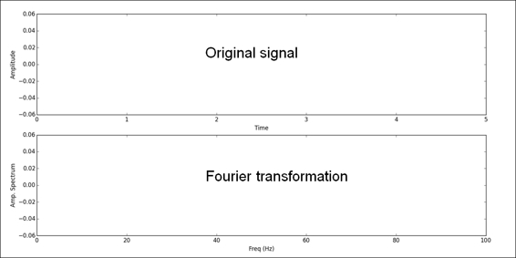
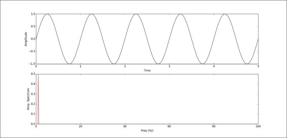
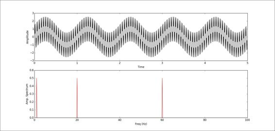
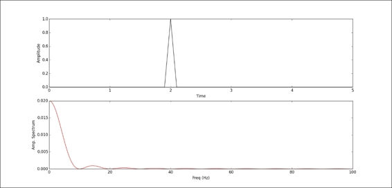
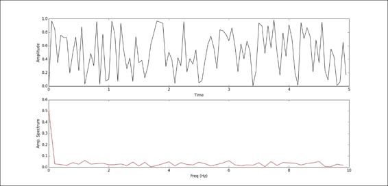
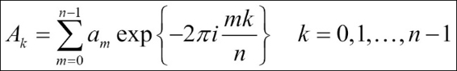
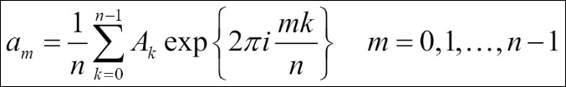
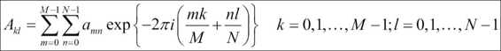
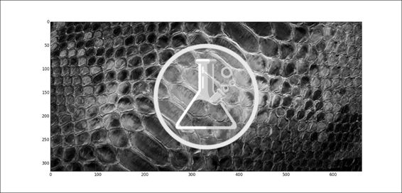
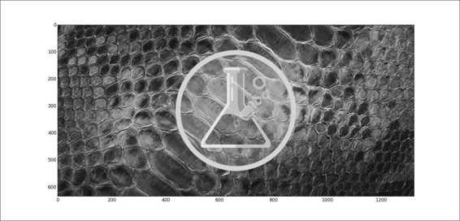

# 六、NumPy 中的傅里叶分析

```py
# 来源：NumPy Essentials ch6
```

## 绘图函数

```py
import matplotlib.pyplot as plt 
import numpy as np 
def show(ori_func, ft, sampling_period = 5): 
    n = len(ori_func) 
    interval = sampling_period / n 
    # 绘制原始函数
    plt.subplot(2, 1, 1) 
    plt.plot(np.arange(0, sampling_period, interval), ori_func, 'black') 
    plt.xlabel('Time'), plt.ylabel('Amplitude') 
    # 绘制变换后的函数
    plt.subplot(2,1,2) 
    frequency = np.arange(n / 2) / (n * interval) 
    nfft = abs(ft[range(int(n / 2))] / n ) 
    plt.plot(frequency, nfft, 'red') 
    plt.xlabel('Freq (Hz)'), plt.ylabel('Amp. Spectrum') 
    plt.show() 
```



## 信号处理


```py
# 生成频率为 1（角速度为 2 * pi）的正弦波
time = np.arange(0, 5, .005) 
x = np.sin(2 * np.pi * 1 * time) 
y = np.fft.fft(x) 
show(x, y) 
```



```py
# 将其与频率为 20 和 60 的波叠加起来
x2 = np.sin(2 * np.pi * 20 * time) 
x3 = np.sin(2 * np.pi * 60 * time) 
x += x2 + x3 
y = np.fft.fft(x) 
show(x, y) 
```



```py
# 生成方波，振幅是 1，频率为 10Hz
# 我们的间隔是 0.05s，每秒有 200 个点
# 所以需要每隔 20 个点设为 1
x = np.zeros(len(time)) 
x[::20] = 1 
y = np.fft.fft(x) 
show(x, y) 
```


```py
# 生成脉冲波
x = np.zeros(len(time)) 
x[380:400] = np.arange(0, 1, .05) 
x[400:420] = np.arange(1, 0, -.05) 
y = np.fft.fft(x) 
show(x, y) 
```



```py
# 生成随机数
x = np.random.random(100) 
y = np.fft.fft(x) 
show(x, y) 
```



## 原理



```py
x = np.random.random(500) 
n = len(x) 
m = np.arange(n) 
k = m.reshape((n, 1)) 
M = np.exp(-2j * np.pi * k * m / n) 
y = np.dot(M, x) 

np.allclose(y, np.fft.fft(x)) 
# True 

'''
%timeit np.dot(np.exp(-2j * np.pi * np.arange(n).reshape((n, 1)) * np.arange(n) / n), x) 
10 loops, best of 3: 18.5 ms per loop 
%timeit np.fft.fft(x) 
100000 loops, best of 3: 10.9 µs per loop 
'''
```



```
# 傅里叶逆变换
M2 = np.exp(2j * np.pi * k * m / n) 
x2 = np.dot(y, M2) / n 
np.allclose(x, x2) 
# True 
np.allclose(x, np.fft.ifft(y)) 
# True 
```



```
# 创建 10 个 0~9 随机整数的信号
a = np.random.randint(10, size = 10) 
a 
# array([7, 4, 9, 9, 6, 9, 2, 6, 8, 3]) 
a.mean() 
# 6.2999999999999998 
# 进行傅里叶变换
A = np.fft.fft(a) 
A 
'''
array([ 63.00000000 +0.00000000e+00j,   
        -2.19098301 -6.74315233e+00j, 
        -5.25328890 +4.02874005e+00j, 
        -3.30901699 -2.40414157e+00j, 
        13.75328890 -1.38757276e-01j,    
      1.00000000 -2.44249065e-15j, 
        13.75328890 +1.38757276e-01j, 
     -3.30901699 +2.40414157e+00j, 
        -5.25328890 -4.02874005e+00j, 
     -2.19098301 +6.74315233e+00j])
'''
A[0] / 10 
# (6.2999999999999998+0j) 
A[int(10 / 2)] 
# (1-2.4424906541753444e-15j) 

# A[0] 是 0 频率的项
# A[1:n/2] 是正频率项
# A[n/2 + 1: n] 是负频率项
# 如果我们要把 0 频率项调整到中间
# 可以调用 fft.fftshift
np.fft.fftshift(A) 
'''
array([  1.00000000 -2.44249065e-15j,   
     13.75328890 +1.38757276e-01j, 
        -3.30901699 +2.40414157e+00j, 
        -5.25328890 -4.02874005e+00j, 
        -2.19098301 +6.74315233e+00j, 
        63.00000000 +0.00000000e+00j, 
        -2.19098301 -6.74315233e+00j, 
     -5.25328890 +4.02874005e+00j, 
        -3.30901699 -2.40414157e+00j,   
     13.75328890 -1.38757276e-01j]) 
'''

# fft2 用于二维，fftn 用于多维
x = np.random.random(24) 
x.shape = 2,12 
y2 = np.fft.fft2(x) 
x.shape = 1,2,12 
y3 = np.fft.fftn(x, axes = (1, 2)) 
np.allclose(y2, y3) 
# True 
```

## 应用


```py
from matplotlib import image 
# 将上面的图片保存为 scientist.png
# 并读入
img = image.imread('./scientist.png') 
# 将图片转换为灰度图
# 每个像素是 0.21R + 0.72G + 0.07B
gray_img = np.dot(img[:,:,:3], [.21, .72, .07]) 
gray_img.shape 
# (317L, 661L) 
plt.imshow(gray_img, cmap = plt.get_cmap('gray')) 
# <matplotlib.image.AxesImage at 0xa6165c0> 
plt.show() 
```



```
# fft2 是二维数组的傅里叶变换
# 将空域转换为频域
fft = np.fft.fft2(gray_img) 
amp_spectrum = np.abs(fft) 
plt.imshow(np.log(amp_spectrum)) 
# <matplotlib.image.AxesImage at 0xcdeff60> 
plt.show() 
```


```
fft_shift = np.fft.fftshift(fft) 
plt.imshow(np.log(np.abs(fft_shift))) 
# <matplotlib.image.AxesImage at 0xd201dd8> 
plt.show() 
```


```
# 放大图像
# 我们向 fft_shift 插入零频率，将其尺寸扩大两倍
m, n = fft_shift.shape 
b = np.zeros((int(m / 2), n)) 
c = np.zeros((2 * m - 1, int(n / 2))) 
fft_shift = np.concatenate((b, fft_shift, b), axis = 0) 
fft_shift = np.concatenate((c, fft_shift, c), axis = 1) 
# 然后再转换回去
ifft = np.fft.ifft2(np.fft.ifftshift(fft_shift)) 
ifft.shape 
# (633L, 1321L) 
ifft = np.real(ifft) 
plt.imshow(ifft, cmap = plt.get_cmap('gray')) 
# <matplotlib.image.AxesImage at 0xf9a0f98> 
plt.show() 
```

