# 学习 Pandas

英文原文: [Learn Pandas](https://bitbucket.org/hrojas/learn-pandas/)

来源：[学习Pandas 系列教程](http://www.datarx.cn/index.php/archives/35.html)

译者：[派兰数据](http://www.datarx.cn)

## 学习Pandas，第 1 课

> 英文原文: [01 - Lesson](http://nbviewer.ipython.org/urls/bitbucket.org/hrojas/learn-pandas/raw/master/lessons/01%20-%20Lesson.ipynb)

**创建数据** - 我们从创建自己的数据开始。 这避免了阅读这个教程的用户需要去下载任何文件来重现结果。我们将会把这些数据导出到一个文本文件中这样你就可以试着从这个文件中去读取数据。  
**获取数据** - 我们将学习如何从文本文件中读取数据。 这些数据包含了1880年出生的婴儿数以及他们使用的名字。  
**准备数据** - 这里我们将简单看一下数据并确保数据是干净的，就是说我们将看一下文件中的数据并寻找一些可能异常的数据。 这可能包括了数据缺失(missing data)，数据不一致(inconsistant)，或者在正常范围之外(out of place)。 如果有这样的数据，我们将决定如何处置这些数据。  
**分析数据** - 我们将简单地找出一个给定年份中最热门的名字。  
**表现数据** - 通过表格和图形，向用户清晰地展示在一个给定的年份中最热门的名字。  


> 除了数据展现的一小部分，***pandas*** 库在数据分析的全过程中将被使用。 ***matplotlib*** 只在数据展现部分使用到。 课程的第一步则导入所需要的库。


```python
# 导入所有需要的库

# 导入一个库中制定函数的一般做法: 
##from (library) import (specific library function)
from pandas import DataFrame, read_csv

# 导入一个库的一般做法: 
##import (library) as (give the library a nickname/alias)
import matplotlib.pyplot as plt
import pandas as pd #导入pandas的常规做法
import sys #导入sys库只是为了确认一下Python的版本
import matplotlib #这样导入matplotlib只是为了显示一下其版本号

# 初始化matplotlib，用inline方式显示图形
%matplotlib inline
```


```python
print('Python version ' + sys.version)
print('Pandas version ' + pd.__version__)
print('Matplotlib version ' + matplotlib.__version__)
```

    Python version 3.6.1 | packaged by conda-forge | (default, Mar 23 2017, 21:57:00) 
    [GCC 4.2.1 Compatible Apple LLVM 6.1.0 (clang-602.0.53)]
    Pandas version 0.19.2
    Matplotlib version 2.0.2
    

### 创建数据 

这个简单的数据集包括了：1880年出生的，5个常用的婴儿的名字，以及对应的婴儿数量。


```python
# 初始数据集: 婴儿名字和出生率
names = ['Bob','Jessica','Mary','John','Mel']
births = [968, 155, 77, 578, 973]
```

用 ***zip*** 函数将这两个列表合并在一起。


```python
# 查看一下zip函数的帮助
zip?
```


```python
BabyDataSet = list(zip(names, births))
BabyDataSet
```


    [('Bob', 968), ('Jessica', 155), ('Mary', 77), ('John', 578), ('Mel', 973)]


我们已经完成了一个基本的数据集的创建。 我们现在用 ***pandas*** 将这些数据导出到一个 csv 文件中。

***df*** 是一个 ***DataFrame***对象。 你可以把这个对象理解为包含了 `BabyDataset` 的内容而格式非常象一个 sql 表格或者 Excel 的数据表。 让我们看看 ***df*** 中的内容。


```python
df = pd.DataFrame(data = BabyDataSet, columns=['Names', 'Births'])
df
```


<div>
<table border="1" class="dataframe">
  <thead>
    <tr style="text-align: right;">
      <th></th>
      <th>Names</th>
      <th>Births</th>
    </tr>
  </thead>
  <tbody>
    <tr>
      <th>0</th>
      <td>Bob</td>
      <td>968</td>
    </tr>
    <tr>
      <th>1</th>
      <td>Jessica</td>
      <td>155</td>
    </tr>
    <tr>
      <th>2</th>
      <td>Mary</td>
      <td>77</td>
    </tr>
    <tr>
      <th>3</th>
      <td>John</td>
      <td>578</td>
    </tr>
    <tr>
      <th>4</th>
      <td>Mel</td>
      <td>973</td>
    </tr>
  </tbody>
</table>
</div>


将 dataframe 导出到一个 ***csv*** 文件中。 我们将导出文件命名为 ***births1880.csv***。 导出 csv 文件的函数是 ***to_csv***。 除非你指定了其他的文件目录，否则导出的文件将保存在和 notebook 文件相同的位置。


```python
# 查看一下 to_csv 的帮助
df.to_csv?
```

我们会使用的参数是 ***index*** 和 ***header***。 将这两个参数设置为 `False` 将会防止索引(index)和列名(header names)被导出到文件中。 你可以试着改变这两个参数值来更好的理解这两个参数的作用。


```python
df.to_csv('births1880.csv', index=False, header=False)
```

### 获取数据

我们将使用 pandas 的 ***read_csv*** 函数从 csv 文件中获取数据。 我们先看看这个函数的帮助以及它需要什么参数。


```python
read_csv?
```

这个函数有很多的参数，但我们目前只需要文件的位置。

***注意:*** 取决于你把 notebook 保存在什么位置，你也许需要修改一下文件的位置。


```python
Location = r'./births1880.csv' #从 notebook 当前的位置读取 csv 文件
df = pd.read_csv(Location)
```

注意字符串之前的 ***r*** 。 因为斜线(slash)是一个特殊字符，在字符串之前放置前导的 ***r*** 将会把整个字符串进行转义(escape)。


```python
df
```


<div>
<table border="1" class="dataframe">
  <thead>
    <tr style="text-align: right;">
      <th></th>
      <th>Bob</th>
      <th>968</th>
    </tr>
  </thead>
  <tbody>
    <tr>
      <th>0</th>
      <td>Jessica</td>
      <td>155</td>
    </tr>
    <tr>
      <th>1</th>
      <td>Mary</td>
      <td>77</td>
    </tr>
    <tr>
      <th>2</th>
      <td>John</td>
      <td>578</td>
    </tr>
    <tr>
      <th>3</th>
      <td>Mel</td>
      <td>973</td>
    </tr>
  </tbody>
</table>
</div>


这里出现了一个问题。 ***read_csv*** 函数将 csv 文件中的第一行作为了每列的列名(head names)。 这明显不对，因为数据文件没有提供列名。

要修正这个错误，我们需要给 ***read_csv*** 函数传入 ***header*** 这个参数，并设置为 ***None*** (Python中 null 的意思)。


```python
df = pd.read_csv(Location, header=None)
df
```


<div>
<table border="1" class="dataframe">
  <thead>
    <tr style="text-align: right;">
      <th></th>
      <th>0</th>
      <th>1</th>
    </tr>
  </thead>
  <tbody>
    <tr>
      <th>0</th>
      <td>Bob</td>
      <td>968</td>
    </tr>
    <tr>
      <th>1</th>
      <td>Jessica</td>
      <td>155</td>
    </tr>
    <tr>
      <th>2</th>
      <td>Mary</td>
      <td>77</td>
    </tr>
    <tr>
      <th>3</th>
      <td>John</td>
      <td>578</td>
    </tr>
    <tr>
      <th>4</th>
      <td>Mel</td>
      <td>973</td>
    </tr>
  </tbody>
</table>
</div>


如果我们需要为每一列指定一个名字，我们可以传入另外一个参数 ***names***，同时去掉 ***header*** 这个参数。


```python
df = pd.read_csv(Location, names=['Names', 'Births'])
df
```


<div>
<table border="1" class="dataframe">
  <thead>
    <tr style="text-align: right;">
      <th></th>
      <th>Names</th>
      <th>Births</th>
    </tr>
  </thead>
  <tbody>
    <tr>
      <th>0</th>
      <td>Bob</td>
      <td>968</td>
    </tr>
    <tr>
      <th>1</th>
      <td>Jessica</td>
      <td>155</td>
    </tr>
    <tr>
      <th>2</th>
      <td>Mary</td>
      <td>77</td>
    </tr>
    <tr>
      <th>3</th>
      <td>John</td>
      <td>578</td>
    </tr>
    <tr>
      <th>4</th>
      <td>Mel</td>
      <td>973</td>
    </tr>
  </tbody>
</table>
</div>


你可以把数字 [0,1,2,3,4] 设想为 Excel 文件中的行标 (row number)。 在 pandas 中，这些是 ***索引 (index)*** 的一部分。 你可以把索引(index)理解为一个sql表中的主键(primary key)，但是索引(index)是可以重复的。

***[Names, Births]*** 是列名，和sql表或者Excel数据表中的列名(column header)是类似的。

> 现在可以把这个 csv 文件删除了。


```python
import os
os.remove(Location)
```

### 准备数据

我们的数据包含了1880年出生的婴儿及其数量。 我们已经知道我们有5条记录而且没有缺失值(所有值都是非空 non-null 的)。

***Names*** 列是由字母和数字串组成的婴儿名字。 这一列也许会出现一些脏数据但我们现在不需要有太多顾虑。 ***Births*** 列应该是通过整型数字(integers)表示一个指定年份指定婴儿名字的出生率。 我们可以检查一下是否这一列的数字都是整型。这一列出现浮点型(float)是没有意义的。但我们不需要担心这一列出现任何可能的离群值(outlier)。

请注意在目前这个阶段，简单地看一下dataframe中的数据来检查"Names"列已经足够了。 在之后我们做数据分析的过程中，我们还有很多机会来发现数据中的问题。


```python
# 查看每一列的数据类型
df.dtypes
```


    Names     object
    Births     int64
    dtype: object


```python
# 查看 Births 列的数据类型
df.Births.dtype
```


    dtype('int64')


你看到 ***Births*** 列的数据类型是 ***inter64***，这意味着不会有浮点型(小数)或者字符串型出现在这列中。

### 分析数据

要找到最高出生率的婴儿名或者是最热门的婴儿名字，我们可以这么做。

* 将 dataframe 排序并且找到第一行
* 使用 ***max()*** 属性找到最大值


```python
# 方法 1:
Sorted = df.sort_values(['Births'], ascending=False)
Sorted.head(1)
```


<div>
<table border="1" class="dataframe">
  <thead>
    <tr style="text-align: right;">
      <th></th>
      <th>Names</th>
      <th>Births</th>
    </tr>
  </thead>
  <tbody>
    <tr>
      <th>4</th>
      <td>Mel</td>
      <td>973</td>
    </tr>
  </tbody>
</table>
</div>


```python
# 方法 2:
df['Births'].max()
```


    973


### 表现数据

我们可以将 ***Births*** 这一列标记在图形上向用户展示数值最大的点。 对照数据表，用户就会有一个非常直观的画面 ***Mel*** 是这组数据中最热门的婴儿名字。

pandas 使用非常方便的 ***plot()*** 让你用 dataframe 中的数据来轻松制图。 刚才我们在 Births 列找到了最大值，现在我们要找到 973 这个值对应的婴儿名字。

**每一部分的解释:**  
*df['Names']* - 这是完整的婴儿名字的列表，完整的 Names 列  
*df['Births']* - 这是1880年的出生率，完整的 Births 列  
*df['Births'].max()* - 这是 Births 列中的最大值  

`[df['Births'] == df['Births'].max()]` **的意思是** [在 Births 列中找到值是 973 的所有记录]  
`df['Names'][df['Births'] == df['Births'].max()]` **的意思是** 在 Names 列中挑选出 [Births 列的值等于 973]  (Select all of the records in the Names column **WHERE** [The Births column is equal to 973])


一个另外的方法是我们用过 ***排序过的*** dataframe: `Sorted['Names'].head(1).value`  

***str()*** 可以将一个对象转换为字符串。 


```python
# 绘图
# df['Births'].plot()
df['Births'].plot.bar()  #这里改用的条形图更直观

# Births 中的最大值
MaxValue = df['Births'].max()

# 找到对应的 Names 值
MaxName = df['Names'][df['Births'] == df['Births'].max()].values

# 准备要显示的文本
Text = str(MaxValue) + " - " + MaxName

# 将文本显示在图形中
plt.annotate(Text, xy=(1, MaxValue), xytext=(8, 0), 
                 xycoords=('axes fraction', 'data'), textcoords='offset points')

print("The most popular name")
df[df['Births'] == df['Births'].max()]
#Sorted.head(1) can also be used
```

    The most popular name
    


<div>
<table border="1" class="dataframe">
  <thead>
    <tr style="text-align: right;">
      <th></th>
      <th>Names</th>
      <th>Births</th>
    </tr>
  </thead>
  <tbody>
    <tr>
      <th>4</th>
      <td>Mel</td>
      <td>973</td>
    </tr>
  </tbody>
</table>
</div>


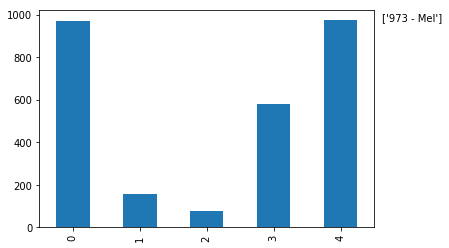


<p class="text-muted">This tutorial was created by <a href="http://www.hedaro.com" target="_blank"><strong>HEDARO</strong></a></p>

<p class="text-muted">本教程由<a href="http://datarx.cn" target="_blank"><strong>派兰数据</strong></a>翻译</p>

<!-- Pandas Tutorial -->  
<strong>These tutorials are also available through an email course, please visit </strong><a href="http://www.hedaro.com/pandas-tutorial" target="_blank"><strong>http://www.hedaro.com/pandas-tutorial</strong></a> <strong>to sign up today.</strong>
<!-- Pandas Tutorial -->


```python

```

## 学习Pandas，第 10 课

> 英文原文: [10 - Lesson](http://nbviewer.ipython.org/urls/bitbucket.org/hrojas/learn-pandas/raw/master/lessons/10%20-%20Lesson.ipynb)

* 从 DataFrame 到 Excel  
* 从 Excel 到 DataFrame  
* 从 DataFrame 到 JSON  
* 从 JSON 到 DataFrame  


```python
import pandas as pd
import sys
```


```python
print('Python version ' + sys.version)
print('Pandas version ' + pd.__version__)
```

    Python version 3.6.1 | packaged by conda-forge | (default, Mar 23 2017, 21:57:00) 
    [GCC 4.2.1 Compatible Apple LLVM 6.1.0 (clang-602.0.53)]
    Pandas version 0.19.2
    

# 从 DataFrame 到 Excel


```python
# 创建一个 DataFrame
d = [1,2,3,4,5,6,7,8,9]
df = pd.DataFrame(d, columns = ['Number'])
df
```


<div>
<table border="1" class="dataframe">
  <thead>
    <tr style="text-align: right;">
      <th></th>
      <th>Number</th>
    </tr>
  </thead>
  <tbody>
    <tr>
      <th>0</th>
      <td>1</td>
    </tr>
    <tr>
      <th>1</th>
      <td>2</td>
    </tr>
    <tr>
      <th>2</th>
      <td>3</td>
    </tr>
    <tr>
      <th>3</th>
      <td>4</td>
    </tr>
    <tr>
      <th>4</th>
      <td>5</td>
    </tr>
    <tr>
      <th>5</th>
      <td>6</td>
    </tr>
    <tr>
      <th>6</th>
      <td>7</td>
    </tr>
    <tr>
      <th>7</th>
      <td>8</td>
    </tr>
    <tr>
      <th>8</th>
      <td>9</td>
    </tr>
  </tbody>
</table>
</div>


```python
# 导出到 Excel
df.to_excel('./Lesson10.xlsx', sheet_name = 'testing', index = False)
print('Done')
```

    Done
    

# 从 Excel 到 DataFrame


```python
# Excel 文件的路径
# 按照你的要求修改文件路径
location = r'./Lesson10.xlsx'

# 读入 Excel 文件
df = pd.read_excel(location, 0)
df.head()
```


<div>
<table border="1" class="dataframe">
  <thead>
    <tr style="text-align: right;">
      <th></th>
      <th>Number</th>
    </tr>
  </thead>
  <tbody>
    <tr>
      <th>0</th>
      <td>1</td>
    </tr>
    <tr>
      <th>1</th>
      <td>2</td>
    </tr>
    <tr>
      <th>2</th>
      <td>3</td>
    </tr>
    <tr>
      <th>3</th>
      <td>4</td>
    </tr>
    <tr>
      <th>4</th>
      <td>5</td>
    </tr>
  </tbody>
</table>
</div>


```python
df.dtypes
```


    Number    int64
    dtype: object


```python
df.tail()
```


<div>
<table border="1" class="dataframe">
  <thead>
    <tr style="text-align: right;">
      <th></th>
      <th>Number</th>
    </tr>
  </thead>
  <tbody>
    <tr>
      <th>4</th>
      <td>5</td>
    </tr>
    <tr>
      <th>5</th>
      <td>6</td>
    </tr>
    <tr>
      <th>6</th>
      <td>7</td>
    </tr>
    <tr>
      <th>7</th>
      <td>8</td>
    </tr>
    <tr>
      <th>8</th>
      <td>9</td>
    </tr>
  </tbody>
</table>
</div>


# 从 DataFrame 到 JSON


```python
df.to_json('Lesson10.json')
print('Done')
```

    Done
    

# 从 JSON 到 DataFrame


```python
# 按照你的要求修改文件路径
jsonloc = r'./Lesson10.json'

# read json file
df2 = pd.read_json(jsonloc)
```


```python
df2
```


<div>
<table border="1" class="dataframe">
  <thead>
    <tr style="text-align: right;">
      <th></th>
      <th>Number</th>
    </tr>
  </thead>
  <tbody>
    <tr>
      <th>0</th>
      <td>1</td>
    </tr>
    <tr>
      <th>1</th>
      <td>2</td>
    </tr>
    <tr>
      <th>2</th>
      <td>3</td>
    </tr>
    <tr>
      <th>3</th>
      <td>4</td>
    </tr>
    <tr>
      <th>4</th>
      <td>5</td>
    </tr>
    <tr>
      <th>5</th>
      <td>6</td>
    </tr>
    <tr>
      <th>6</th>
      <td>7</td>
    </tr>
    <tr>
      <th>7</th>
      <td>8</td>
    </tr>
    <tr>
      <th>8</th>
      <td>9</td>
    </tr>
  </tbody>
</table>
</div>


```python
df2.dtypes
```


    Number    int64
    dtype: object


<p class="text-muted">This tutorial was created by <a href="http://www.hedaro.com" target="_blank"><strong>HEDARO</strong></a></p>
<p class="text-muted">本教程由<a href="http://datarx.cn" target="_blank"><strong>派兰数据</strong></a>翻译</p>

<!-- Pandas Tutorial -->  
<strong>These tutorials are also available through an email course, please visit </strong><a href="http://www.hedaro.com/pandas-tutorial" target="_blank"><strong>http://www.hedaro.com/pandas-tutorial</strong></a> <strong>to sign up today.</strong>
<!-- Pandas Tutorial -->	


```python

```

## 学习Pandas，第 11 课

> 英文原文: [11 - Lesson](http://nbviewer.ipython.org/urls/bitbucket.org/hrojas/learn-pandas/raw/master/lessons/11%20-%20Lesson.ipynb)

从多个 Excel 文件中读取数据并且在一个 dataframe 将这些数据合并在一起。


```python
import pandas as pd
import matplotlib
import os
import sys
%matplotlib inline
```


```python
print('Python version ' + sys.version)
print('Pandas version ' + pd.__version__)
print('Matplotlib version ' + matplotlib.__version__)
```

    Python version 3.6.1 | packaged by conda-forge | (default, Mar 23 2017, 21:57:00) 
    [GCC 4.2.1 Compatible Apple LLVM 6.1.0 (clang-602.0.53)]
    Pandas version 0.19.2
    Matplotlib version 2.0.2
    

# 创建 3 个 Excel 文件


```python
# 创建 DataFrame
d = {'Channel':[1], 'Number':[255]}
df = pd.DataFrame(d)
df
```


<div>
<table border="1" class="dataframe">
  <thead>
    <tr style="text-align: right;">
      <th></th>
      <th>Channel</th>
      <th>Number</th>
    </tr>
  </thead>
  <tbody>
    <tr>
      <th>0</th>
      <td>1</td>
      <td>255</td>
    </tr>
  </tbody>
</table>
</div>


```python
# 导出到 Excel 文件中

df.to_excel('test1.xlsx', sheet_name = 'test1', index = False)
df.to_excel('test2.xlsx', sheet_name = 'test2', index = False)
df.to_excel('test3.xlsx', sheet_name = 'test3', index = False)
print('Done')
```

    Done
    

# 把 3 个 Excel  文件数据读入一个 DataFrame

把 Excel 文件名读入到一个 list 中，并确保目录下没有其他 Excel 文件。


```python
# 放文件名的 list
FileNames = []

# 你存放Excel文件的路径可能不一样，需要修改。
os.chdir(r"./")

# 找到所有文件扩展名是 .xlsx 的文件
for files in os.listdir("."):
    if files.endswith(".xlsx"):
        FileNames.append(files)
        
FileNames
```


    ['test1.xlsx', 'test2.xlsx', 'test3.xlsx']


创建一个函数来处理所有的 Excel 文件。


```python
def GetFile(fnombre):

    # Excel 文件的路径
    # 你存放Excel文件的路径可能不一样，需要修改。
    location = r'./' + fnombre
    
    # 读入 Excel 文件的数据
    # 0 = 第一个页签
    df = pd.read_excel(location, 0)
    
    # 标记一下数据是从哪个文件来的
    df['File'] = fnombre
    
    # 把 'File' 列作为索引
    return df.set_index(['File'])
```

对每一个文件创建一个 dataframe，把所有的 dataframe 放到一个 list 中。

即,
```df_list = [df, df, df]```


```python
# 创建一个 dataframe 的 list
df_list = [GetFile(fname) for fname in FileNames]
df_list
```


    [            Channel  Number
     File                       
     test1.xlsx        1     255,             Channel  Number
     File                       
     test2.xlsx        1     255,             Channel  Number
     File                       
     test3.xlsx        1     255]


```python
# 把 list 中所有的 dataframe 合并成一个
big_df = pd.concat(df_list)
big_df
```


<div>
<table border="1" class="dataframe">
  <thead>
    <tr style="text-align: right;">
      <th></th>
      <th>Channel</th>
      <th>Number</th>
    </tr>
    <tr>
      <th>File</th>
      <th></th>
      <th></th>
    </tr>
  </thead>
  <tbody>
    <tr>
      <th>test1.xlsx</th>
      <td>1</td>
      <td>255</td>
    </tr>
    <tr>
      <th>test2.xlsx</th>
      <td>1</td>
      <td>255</td>
    </tr>
    <tr>
      <th>test3.xlsx</th>
      <td>1</td>
      <td>255</td>
    </tr>
  </tbody>
</table>
</div>


```python
big_df.dtypes
```


    Channel    int64
    Number     int64
    dtype: object


```python
# 画一张图
big_df['Channel'].plot.bar();
```


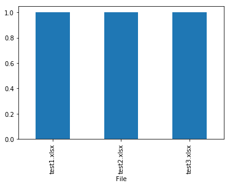


<p class="text-muted">This tutorial was created by <a href="http://www.hedaro.com" target="_blank"><strong>HEDARO</strong></a></p>
<p class="text-muted">本教程由<a href="http://datarx.cn" target="_blank"><strong>派兰数据</strong></a>翻译</p>

<!-- Pandas Tutorial -->  
<strong>These tutorials are also available through an email course, please visit </strong><a href="http://www.hedaro.com/pandas-tutorial" target="_blank"><strong>http://www.hedaro.com/pandas-tutorial</strong></a> <strong>to sign up today.</strong>
<!-- Pandas Tutorial -->	


```python

```

## 学习Pandas，第 2 课

> 英文原文: [02 - Lesson](http://nbviewer.ipython.org/urls/bitbucket.org/hrojas/learn-pandas/raw/master/lessons/02%20-%20Lesson.ipynb)

**创建数据** - 我们从创建自己的数据开始做数据分析。 这避免了阅读这个教程的用户需要去下载任何文件来重现结果。我们将会把这些数据导出到一个文本文件中这样你就可以试着从这个文件中去读取数据。  
**获取数据** - 我们将学习如何从文本文件中读取数据。 这些数据包含了1880年出生的婴儿数以及他们使用的名字。  
**准备数据** - 这里我们将简单看一下数据并确保数据是干净的，就是说我们将看一下文件中的数据并寻找一些可能异常的数据。 这可能包括了数据缺失(missing data)，数据不一致(inconsistant)，或者在正常范围之外(out of place)。 如果有这样的数据，我们将决定如何处置这些数据。  
**分析数据** - 我们将简单地找出一个给定年份中最热门的名字。  
**表现数据** - 通过表格和图形，向用户清晰地展示在一个给定的年份中最热门的名字。  


***注意:  确保你已经看过了之前的课程，这里的一些练习会需要你在之前课程学到的那些知识。***  
    

> ***Numpy*** 将被用来生成一些样例数据。 我们开始课程的第一步是导入这些库。


```python
# 导入所有需要的库
import pandas as pd
from numpy import random
import matplotlib.pyplot as plt
import sys #导入sys库只是为了确认一下Python的版本
import matplotlib #这样导入matplotlib只是为了显示一下其版本号

# 初始化matplotlib，用inline方式显示图形
%matplotlib inline
```


```python
print('Python version ' + sys.version)
print('Pandas version ' + pd.__version__)
print('Matplotlib version ' + matplotlib.__version__)
```

    Python version 3.6.1 | packaged by conda-forge | (default, Mar 23 2017, 21:57:00) 
    [GCC 4.2.1 Compatible Apple LLVM 6.1.0 (clang-602.0.53)]
    Pandas version 0.19.2
    Matplotlib version 2.0.2
    

# 创建数据

我们用到的数据集将包括在1880年出生的，1,000个婴儿姓名以及对应的出生数量。 我们将会增加一些重复值因此你会看到相同的婴儿名字重复了多次。你可以设想同一个婴儿名字重复多次是因为不同的医院针对同一个婴儿名字上报的不同的出生数量。 因此，如果两家医院对“Bob”这个名字上报出生数量，就会有两个数值。 我们先开始创建一组随机的数值。


```python
# 婴儿名字的初始值
names = ['Bob','Jessica','Mary','John','Mel']
```

使用上面的5个名字来创建一个有1,000个婴儿名字的随机列表，我们要做如下一些操作:

* 生成一个 0 到 4 之间的随机数  

我们会用到 ***seed***，***randint***, ***len***, ***range*** 和 ***zip*** 这几个函数。 


```python
# 这将确保随机样本是可以被重复生成的。
# 这也意味着生成的随机样本总是一样的。

random.seed?
```


```python
random.randint?
```


```python
len?
```


```python
range?
```


```python
zip?
```

**seed(500)** - 创建一个种子

**randint(low=0, high=len(names))** - 生成一个随机整数，介于 0 和 "names" 列表的长度之间。  

**names[n]** - 从 "names" 列表中选择索引值(index)为 n 的名字。

**for i in range(n)** - 循环直到 i 等于 n，即: 1,2,3,....n。  

**random_names** = 从 names 列表中选在一个随机名字并执行 n 次 (Select a random name from the name list and do this n times.)  


```python
random.seed(500)
random_names = [names[random.randint(low=0,high=len(names))] for i in range(1000)]

# 显示前10个名字
random_names[:10]
```


    ['Mary',
     'Jessica',
     'Jessica',
     'Bob',
     'Jessica',
     'Jessica',
     'Jessica',
     'Mary',
     'Mary',
     'Mary']


生成介于 0 和 1000 之间的随机数


```python
# 1880年，不同婴儿名字对应的出生数量
births = [random.randint(low=0,high=1000) for i in range(1000)]
births[:10]
```


    [968, 155, 77, 578, 973, 124, 155, 403, 199, 191]


用 ***zip*** 函数把 ***names*** 和 ***births*** 这两个数据集合并在一起。


```python
BabyDataSet = list(zip(random_names,births))
BabyDataSet[:10]
```


    [('Mary', 968),
     ('Jessica', 155),
     ('Jessica', 77),
     ('Bob', 578),
     ('Jessica', 973),
     ('Jessica', 124),
     ('Jessica', 155),
     ('Mary', 403),
     ('Mary', 199),
     ('Mary', 191)]


我们基本上完成了数据集的创建工作。 现在我们要用 ***pandas*** 库将这个数据集导出到一个 csv 文件中。

***df*** 是一个 ***DataFrame***对象。 你可以把这个对象理解为包含了 `BabyDataset` 的内容而格式非常象一个 sql 表格或者 Excel 的数据表。 让我们看看 ***df*** 中的内容。


```python
df = pd.DataFrame(data = BabyDataSet, columns=['Names', 'Births'])
df[:10]
```


<div>
<table border="1" class="dataframe">
  <thead>
    <tr style="text-align: right;">
      <th></th>
      <th>Names</th>
      <th>Births</th>
    </tr>
  </thead>
  <tbody>
    <tr>
      <th>0</th>
      <td>Mary</td>
      <td>968</td>
    </tr>
    <tr>
      <th>1</th>
      <td>Jessica</td>
      <td>155</td>
    </tr>
    <tr>
      <th>2</th>
      <td>Jessica</td>
      <td>77</td>
    </tr>
    <tr>
      <th>3</th>
      <td>Bob</td>
      <td>578</td>
    </tr>
    <tr>
      <th>4</th>
      <td>Jessica</td>
      <td>973</td>
    </tr>
    <tr>
      <th>5</th>
      <td>Jessica</td>
      <td>124</td>
    </tr>
    <tr>
      <th>6</th>
      <td>Jessica</td>
      <td>155</td>
    </tr>
    <tr>
      <th>7</th>
      <td>Mary</td>
      <td>403</td>
    </tr>
    <tr>
      <th>8</th>
      <td>Mary</td>
      <td>199</td>
    </tr>
    <tr>
      <th>9</th>
      <td>Mary</td>
      <td>191</td>
    </tr>
  </tbody>
</table>
</div>


将 dataframe 导出到一个 ***csv*** 文件中。 我们将导出文件命名为 ***births1880.csv***。 导出 csv 文件的函数是 ***to_csv***。 除非你指定了其他的文件目录，否则导出的文件将保存在和 notebook 文件相同的位置。


```python
df.to_csv?
```

我们会使用的参数是 ***index*** 和 ***header***。 将这两个参数设置为 `False` 将会防止索引(index)和列名(header names)被导出到文件中。 你可以试着改变这两个参数值来更好的理解这两个参数的作用。


```python
df.to_csv('births1880.txt', index=False, header=False)
```

### 获取数据

我们将使用 pandas 的 ***read_csv*** 函数从 csv 文件中获取数据。 我们先看看这个函数的帮助以及它需要什么参数。


```python
pd.read_csv?
```

这个函数有很多的参数，但我们目前只需要文件的位置。

***注意:*** 取决于你把 notebook 保存在什么位置，你也许需要修改一下文件的位置。


```python
Location = r'./births1880.txt'
df = pd.read_csv(Location)
```

注意字符串之前的 ***r*** 。 因为斜线(slash)是一个特殊字符，在字符串之前放置前导的 ***r*** 将会把整个字符串进行转义(escape)。


```python
df.info()
```

    <class 'pandas.core.frame.DataFrame'>
    RangeIndex: 999 entries, 0 to 998
    Data columns (total 2 columns):
    Mary    999 non-null object
    968     999 non-null int64
    dtypes: int64(1), object(1)
    memory usage: 15.7+ KB
    

汇总信息:  

* 数据集里有 ***999*** 条记录
* 有一列 ***Mary*** 有 999 个值
* 有一列 ***968*** 有 999 个值
* 这***两***列, 一个是***numeric***(数字型), 另外一个是***non numeric***(非数字型)  

我们可以使用 ***head()*** 这个函数查看一下dataframe中的前 5 条记录。 你也可以传入一个数字 n 来查看 dataframe 中的前 n 条记录。


```python
df.head()
```


<div>
<table border="1" class="dataframe">
  <thead>
    <tr style="text-align: right;">
      <th></th>
      <th>Mary</th>
      <th>968</th>
    </tr>
  </thead>
  <tbody>
    <tr>
      <th>0</th>
      <td>Jessica</td>
      <td>155</td>
    </tr>
    <tr>
      <th>1</th>
      <td>Jessica</td>
      <td>77</td>
    </tr>
    <tr>
      <th>2</th>
      <td>Bob</td>
      <td>578</td>
    </tr>
    <tr>
      <th>3</th>
      <td>Jessica</td>
      <td>973</td>
    </tr>
    <tr>
      <th>4</th>
      <td>Jessica</td>
      <td>124</td>
    </tr>
  </tbody>
</table>
</div>


这里出现了一个问题。 ***read_csv*** 函数将 csv 文件中的第一行作为了每列的列名(head names)。 这明显不对，因为数据文件没有提供列名。

要修正这个错误，我们需要给 ***read_csv*** 函数传入 ***header*** 这个参数，并设置为 ***None*** (Python中 null 的意思)。


```python
df = pd.read_csv(Location, header=None)
df.info()
```

    <class 'pandas.core.frame.DataFrame'>
    RangeIndex: 1000 entries, 0 to 999
    Data columns (total 2 columns):
    0    1000 non-null object
    1    1000 non-null int64
    dtypes: int64(1), object(1)
    memory usage: 15.7+ KB
    

汇总信息:  

* 数据集里有 ***1000*** 条记录
* 有一列 ***0*** 有 1000 个值
* 有一列 ***1*** 有 1000 个值
* 这***两***列, 一个是***numeric***(数字型), 另外一个是***non numeric***(非数字型)  

让我们看一下这个 dataframe 的最后 5 条记录。


```python
df.tail()
```


<div>
<table border="1" class="dataframe">
  <thead>
    <tr style="text-align: right;">
      <th></th>
      <th>0</th>
      <th>1</th>
    </tr>
  </thead>
  <tbody>
    <tr>
      <th>995</th>
      <td>John</td>
      <td>151</td>
    </tr>
    <tr>
      <th>996</th>
      <td>Jessica</td>
      <td>511</td>
    </tr>
    <tr>
      <th>997</th>
      <td>John</td>
      <td>756</td>
    </tr>
    <tr>
      <th>998</th>
      <td>Jessica</td>
      <td>294</td>
    </tr>
    <tr>
      <th>999</th>
      <td>John</td>
      <td>152</td>
    </tr>
  </tbody>
</table>
</div>


如果我们需要为每一列指定一个名字，我们可以传入另外一个参数 ***names***，同时去掉 ***header*** 这个参数。


```python
df = pd.read_csv(Location, names=['Names','Births'])
df.head(5)
```


<div>
<table border="1" class="dataframe">
  <thead>
    <tr style="text-align: right;">
      <th></th>
      <th>Names</th>
      <th>Births</th>
    </tr>
  </thead>
  <tbody>
    <tr>
      <th>0</th>
      <td>Mary</td>
      <td>968</td>
    </tr>
    <tr>
      <th>1</th>
      <td>Jessica</td>
      <td>155</td>
    </tr>
    <tr>
      <th>2</th>
      <td>Jessica</td>
      <td>77</td>
    </tr>
    <tr>
      <th>3</th>
      <td>Bob</td>
      <td>578</td>
    </tr>
    <tr>
      <th>4</th>
      <td>Jessica</td>
      <td>973</td>
    </tr>
  </tbody>
</table>
</div>


你可以把数字 [0,1,2,3,4] 设想为 Excel 文件中的行标 (row number)。 在 pandas 中，这些是 ***索引 (index)*** 的一部分。 你可以把索引(index)理解为一个sql表中的主键(primary key)，但是索引(index)是可以重复的。

***[Names, Births]*** 是列名，和sql表或者Excel数据表中的列名(column header)是类似的。

> 现在可以把这个 csv 文件删除了。


```python
import os
os.remove(Location)
```

### 准备数据

我们的数据包含了1880年出生的婴儿及其数量。 我们已经知道我们有1,000条记录而且没有缺失值(所有值都是非空 non-null 的)。 我们还可以验证一下 "Names" 列仅包含了5个唯一的名字。

我们可以使用 dataframe 的 ***unique*** 属性找出 "Names" 列的所有唯一的(unique)的记录。


```python
# 方法 1:
df['Names'].unique()
```


    array(['Mary', 'Jessica', 'Bob', 'John', 'Mel'], dtype=object)


```python
# 如果你想把这些值打印出来:
for x in df['Names'].unique():
    print(x)
```

    Mary
    Jessica
    Bob
    John
    Mel
    


```python
# 方法 2:
print(df['Names'].describe())
```

    count     1000
    unique       5
    top        Bob
    freq       206
    Name: Names, dtype: object
    

因为每一个婴儿名字对应有多个值，我们需要把这几个值汇总起来这样一个婴儿名字就只出现一次了。 这意味着 1,000 行将变成只有 5 行。 我们使用 ***groupby*** 函数来完成这个动作。


```python
df.groupby?
```


```python
# 创建一个 groupby 的对象
name = df.groupby('Names')

# 在 groupby 对象上执行求和(sum)的功能
df = name.sum()
df
```


<div>
<table border="1" class="dataframe">
  <thead>
    <tr style="text-align: right;">
      <th></th>
      <th>Births</th>
    </tr>
    <tr>
      <th>Names</th>
      <th></th>
    </tr>
  </thead>
  <tbody>
    <tr>
      <th>Bob</th>
      <td>106817</td>
    </tr>
    <tr>
      <th>Jessica</th>
      <td>97826</td>
    </tr>
    <tr>
      <th>John</th>
      <td>90705</td>
    </tr>
    <tr>
      <th>Mary</th>
      <td>99438</td>
    </tr>
    <tr>
      <th>Mel</th>
      <td>102319</td>
    </tr>
  </tbody>
</table>
</div>


### 分析数据

要找到最高出生率的婴儿名或者是最热门的婴儿名字，我们可以这么做。

* 将 dataframe 排序并且找到第一行
* 使用 ***max()*** 属性找到最大值


```python
# 方法 1:
Sorted = df.sort_values(['Births'], ascending=False)
Sorted.head(1)
```


<div>
<table border="1" class="dataframe">
  <thead>
    <tr style="text-align: right;">
      <th></th>
      <th>Births</th>
    </tr>
    <tr>
      <th>Names</th>
      <th></th>
    </tr>
  </thead>
  <tbody>
    <tr>
      <th>Bob</th>
      <td>106817</td>
    </tr>
  </tbody>
</table>
</div>


```python
# 方法 2:
df['Births'].max()
```


    106817


### 表现数据

我们可以将 ***Births*** 这一列标记在图形上向用户展示数值最大的点。 对照数据表，用户就会有一个非常直观的画面 ***Bob*** 是这组数据中最热门的婴儿名字。


```python
# Create graph
df['Births'].plot.bar()

print("The most popular name")
df.sort_values(by='Births', ascending=False)
```

    The most popular name
    


<div>
<table border="1" class="dataframe">
  <thead>
    <tr style="text-align: right;">
      <th></th>
      <th>Births</th>
    </tr>
    <tr>
      <th>Names</th>
      <th></th>
    </tr>
  </thead>
  <tbody>
    <tr>
      <th>Bob</th>
      <td>106817</td>
    </tr>
    <tr>
      <th>Mel</th>
      <td>102319</td>
    </tr>
    <tr>
      <th>Mary</th>
      <td>99438</td>
    </tr>
    <tr>
      <th>Jessica</th>
      <td>97826</td>
    </tr>
    <tr>
      <th>John</th>
      <td>90705</td>
    </tr>
  </tbody>
</table>
</div>


<p class="text-muted">This tutorial was created by <a href="http://www.hedaro.com" target="_blank"><strong>HEDARO</strong></a></p>
<p class="text-muted">本教程由<a href="http://datarx.cn" target="_blank"><strong>派兰数据</strong></a>翻译</p>

<!-- Pandas Tutorial -->  
<strong>These tutorials are also available through an email course, please visit </strong><a href="http://www.hedaro.com/pandas-tutorial" target="_blank"><strong>http://www.hedaro.com/pandas-tutorial</strong></a> <strong>to sign up today.</strong>
<!-- Pandas Tutorial -->


```python

```

## 学习Pandas，第 3 课

> 英文原文: [03 - Lesson](http://nbviewer.ipython.org/urls/bitbucket.org/hrojas/learn-pandas/raw/master/lessons/03%20-%20Lesson.ipynb)


**获取数据** - 我们的数据在一个 Excel 文件中，包含了每一个日期的客户数量。 我们将学习如何读取 Excel 文件的内容并处理其中的数据。  
**准备数据** - 这组时间序列的数据并不规整而且有重复。 我们的挑战是整理这些数据并且预测下一个年度的客户数。  
**分析数据** - 我们将使用图形来查看趋势情况和离群点。我们会使用一些内置的计算工具来预测下一年度的客户数。  
**表现数据** - 结果将会被绘制成图形。 


***注意:  确保你已经看过了之前的课程，这里的一些练习会需要你在之前课程学到的那些知识。***  


```python
# 导入所需要的库
import pandas as pd
import matplotlib.pyplot as plt
import numpy.random as np
import sys
import matplotlib

%matplotlib inline
```


```python
print('Python version ' + sys.version)
print('Pandas version: ' + pd.__version__)
print('Matplotlib version ' + matplotlib.__version__)
```

    Python version 3.6.1 | packaged by conda-forge | (default, Mar 23 2017, 21:57:00) 
    [GCC 4.2.1 Compatible Apple LLVM 6.1.0 (clang-602.0.53)]
    Pandas version: 0.19.2
    Matplotlib version 2.0.2
    

> 我们将创建一些测试数据用来分析


```python
# 设置种子
np.seed(111)

# 生成测试数据的函数
def CreateDataSet(Number=1):
    
    Output = []
    
    for i in range(Number):
        
        # 创建一个按周计算的日期范围(每周一起始)
        rng = pd.date_range(start='1/1/2009', end='12/31/2012', freq='W-MON')
        
        # 创建一些随机数
        data = np.randint(low=25, high=1000, size=len(rng))
        
        # 状态池
        status = [1, 2, 3]
        
        # 创建一个随机的状态列表
        random_status = [status[np.randint(low=0, high=len(status))] for i in range(len(rng))]
        
        # 行政州(state)的列表
        states = ['GA','FL','fl','NY','NJ','TX']
        
        # 创建一个行政周的随机列表
        random_states = [states[np.randint(low=0, high=len(states))] for i in range(len(rng))]
    
        Output.extend(zip(random_states, random_status, data, rng))
        
    return Output
```

现在我们有了一个生成测试数据的函数，我们来创建一些数据并放到一个 dataframe 中。


```python
dataset = CreateDataSet(4)
df = pd.DataFrame(data=dataset, columns=['State','Status','CustomerCount','StatusDate'])
df.info()
```

    <class 'pandas.core.frame.DataFrame'>
    RangeIndex: 836 entries, 0 to 835
    Data columns (total 4 columns):
    State            836 non-null object
    Status           836 non-null int64
    CustomerCount    836 non-null int64
    StatusDate       836 non-null datetime64[ns]
    dtypes: datetime64[ns](1), int64(2), object(1)
    memory usage: 26.2+ KB
    


```python
df.head()
```


<div>
<table border="1" class="dataframe">
  <thead>
    <tr style="text-align: right;">
      <th></th>
      <th>State</th>
      <th>Status</th>
      <th>CustomerCount</th>
      <th>StatusDate</th>
    </tr>
  </thead>
  <tbody>
    <tr>
      <th>0</th>
      <td>GA</td>
      <td>1</td>
      <td>877</td>
      <td>2009-01-05</td>
    </tr>
    <tr>
      <th>1</th>
      <td>FL</td>
      <td>1</td>
      <td>901</td>
      <td>2009-01-12</td>
    </tr>
    <tr>
      <th>2</th>
      <td>fl</td>
      <td>3</td>
      <td>749</td>
      <td>2009-01-19</td>
    </tr>
    <tr>
      <th>3</th>
      <td>FL</td>
      <td>3</td>
      <td>111</td>
      <td>2009-01-26</td>
    </tr>
    <tr>
      <th>4</th>
      <td>GA</td>
      <td>1</td>
      <td>300</td>
      <td>2009-02-02</td>
    </tr>
  </tbody>
</table>
</div>


现在我们将这个 dataframe 保存到 Excel 文件中，然后再读取出来放回到 dataframe 中。 我们简单地展示一下如何读写 Excel 文件。

我们不会把索引值(index)写到 Excel 文件中，这些索引值不是我们的测试数据的一部分。


```python
# 结果保存到 Excel 中。 译者注: 需要 openpyxl 包
df.to_excel('Lesson3.xlsx', index=False) #不保存索引，但是保存列名(column header)
print('Done')
```

    Done
    

# 从 Excel 中获取数据

我们用 ***read_excel*** 这个函数从 Excel 文件读取数据。 这个函数允许按照页签的名字或者位置来选择特定的页签(译者注: 即Excel中的sheet)。


```python
pd.read_excel?
```

**注意: 除非指定目录，Excel 文件从与 notebook 相同的目录读取。***


```python
# 文件的位置
Location = r'./Lesson3.xlsx'

# 读取第一个页签(sheet)，并指定索引列是 StatusDate
df = pd.read_excel(Location, sheetname=0, index_col='StatusDate')  #译者注: 需要 xlrd 包
df.dtypes
```


    State            object
    Status            int64
    CustomerCount     int64
    dtype: object


```python
df.index
```


    DatetimeIndex(['2009-01-05', '2009-01-12', '2009-01-19', '2009-01-26',
                   '2009-02-02', '2009-02-09', '2009-02-16', '2009-02-23',
                   '2009-03-02', '2009-03-09',
                   ...
                   '2012-10-29', '2012-11-05', '2012-11-12', '2012-11-19',
                   '2012-11-26', '2012-12-03', '2012-12-10', '2012-12-17',
                   '2012-12-24', '2012-12-31'],
                  dtype='datetime64[ns]', name='StatusDate', length=836, freq=None)


```python
df.head()
```


<div>
<table border="1" class="dataframe">
  <thead>
    <tr style="text-align: right;">
      <th></th>
      <th>State</th>
      <th>Status</th>
      <th>CustomerCount</th>
    </tr>
    <tr>
      <th>StatusDate</th>
      <th></th>
      <th></th>
      <th></th>
    </tr>
  </thead>
  <tbody>
    <tr>
      <th>2009-01-05</th>
      <td>GA</td>
      <td>1</td>
      <td>877</td>
    </tr>
    <tr>
      <th>2009-01-12</th>
      <td>FL</td>
      <td>1</td>
      <td>901</td>
    </tr>
    <tr>
      <th>2009-01-19</th>
      <td>fl</td>
      <td>3</td>
      <td>749</td>
    </tr>
    <tr>
      <th>2009-01-26</th>
      <td>FL</td>
      <td>3</td>
      <td>111</td>
    </tr>
    <tr>
      <th>2009-02-02</th>
      <td>GA</td>
      <td>1</td>
      <td>300</td>
    </tr>
  </tbody>
</table>
</div>


# 准备数据

这一部分，我们尝试将数据进行清洗以备分析:

1. 确保 state 列都是大写  
2. 只选择 Status = 1 的那些记录  
3. 对 State 列中的 NJ 和 NY，都合并为 NY
4. 去除一些离群中 (数据集中一些特别奇异的结果)

让我们先快速看一下 *State* 列中的大小写情况。


```python
df['State'].unique()
```


    array(['GA', 'FL', 'fl', 'TX', 'NY', 'NJ'], dtype=object)


我们用 ***upper()*** 函数和 dataframe 的 ***apply*** 属性将 State 的值都转换为大写。 ***lambda*** 函数简单地将`upper()`函数应用到 *State* 列中的每一个值上。


```python
# 清洗 State 列，全部转换为大写
df['State'] = df.State.apply(lambda x: x.upper())
```


```python
df['State'].unique()
```


    array(['GA', 'FL', 'TX', 'NY', 'NJ'], dtype=object)


```python
# 只保留 Status == 1
mask = df['Status'] == 1
df = df[mask]
```

将 ***NJ*** 转换为 ***NY***，仅需简单地:

***[df.State == 'NJ']*** - 找出 ***State*** 列是 *NJ* 的所有记录。   
***df.State[df.State == 'NJ'] = 'NY'*** - 对 ***State*** 列是 *NJ* 的所有记录，将其替换为 *NY*。  


```python
# 将 NJ 转换为 NY
mask = df.State == 'NJ'
df['State'][mask] = 'NY'
```

现在我们看一下，我们有了一个更加干净的数据集了。


```python
df['State'].unique()
```


    array(['GA', 'FL', 'NY', 'TX'], dtype=object)


这是也许我们可以将数据绘制成图形查看一下数据中是否有任何离群值(outliers)或者不一致(inconsistencies)。 我们使用 dataframe 中的 ***plot()*** 函数。

从下图你可以看到图形没有说明什么，这也许是一个信号我们需要做更多的数据处理。


```python
df['CustomerCount'].plot(figsize=(15,5));
```


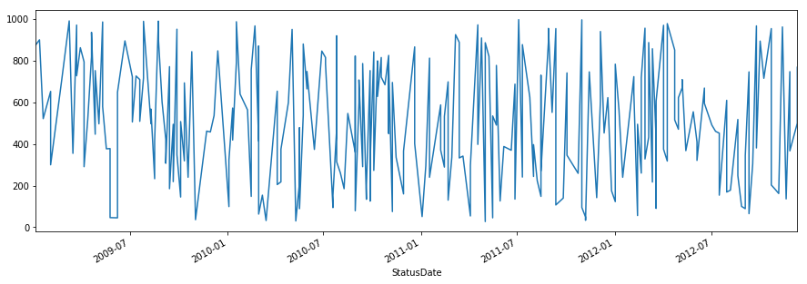


如果我们看这些数据，我们会意识到同一个 State, StatusDate 和 Status 的组合会有多个值。 这可能意味着我们在处理的数据是脏数据/坏数据/不精确的数据(dirty/bad/inaccurate)，但我们不这样假设。 我们假设这个数据集是一个更大更大数据集的一个子集(subset)，并且如果我们简单的将 State, StatusDate 和 Status 组合下的 ***CustomerCount*** 累加起来, 我们将得到每一天的 ***全部客户数量*** (Total Customer Count)。


```python
sortdf = df[df['State']=='NY'].sort_index(axis=0)
sortdf.head(10)
```


<div>
<table border="1" class="dataframe">
  <thead>
    <tr style="text-align: right;">
      <th></th>
      <th>State</th>
      <th>Status</th>
      <th>CustomerCount</th>
    </tr>
    <tr>
      <th>StatusDate</th>
      <th></th>
      <th></th>
      <th></th>
    </tr>
  </thead>
  <tbody>
    <tr>
      <th>2009-01-19</th>
      <td>NY</td>
      <td>1</td>
      <td>522</td>
    </tr>
    <tr>
      <th>2009-02-23</th>
      <td>NY</td>
      <td>1</td>
      <td>710</td>
    </tr>
    <tr>
      <th>2009-03-09</th>
      <td>NY</td>
      <td>1</td>
      <td>992</td>
    </tr>
    <tr>
      <th>2009-03-16</th>
      <td>NY</td>
      <td>1</td>
      <td>355</td>
    </tr>
    <tr>
      <th>2009-03-23</th>
      <td>NY</td>
      <td>1</td>
      <td>728</td>
    </tr>
    <tr>
      <th>2009-03-30</th>
      <td>NY</td>
      <td>1</td>
      <td>863</td>
    </tr>
    <tr>
      <th>2009-04-13</th>
      <td>NY</td>
      <td>1</td>
      <td>520</td>
    </tr>
    <tr>
      <th>2009-04-20</th>
      <td>NY</td>
      <td>1</td>
      <td>820</td>
    </tr>
    <tr>
      <th>2009-04-20</th>
      <td>NY</td>
      <td>1</td>
      <td>937</td>
    </tr>
    <tr>
      <th>2009-04-27</th>
      <td>NY</td>
      <td>1</td>
      <td>447</td>
    </tr>
  </tbody>
</table>
</div>


我们的任务是创建一个新的 dataframe，然后对数据进行压缩处理，是的每一个 State 和 StatusDate 组合代表一天的客户数量。 我们可以忽略 Status 列因为这一列我们之前处理过只有 *1* 这个值了。 要完成这个操作，我们使用 dataframe 的 ***groupyby()*** 和 ***sum()*** 这两个函数。

注意，我们要使用 ***reset_index***。 如果我们不这么做，我们将无法同时用 State 和 StatusDate 这两列来做分组，因为 groupby 函数需要列(columns)来做为输入(译者注: StatusDate 目前是 index，不是 column)。 **reset_index** 函数将把 dataframen 中作为索引(index)的 ***StatusDate*** 变回普通的列。


```python
# 先 reset_index，然后按照 State 和 StatusDate 来做分组 (groupby)
Daily = df.reset_index().groupby(['State','StatusDate']).sum()
Daily.head()
```


<div>
<table border="1" class="dataframe">
  <thead>
    <tr style="text-align: right;">
      <th></th>
      <th></th>
      <th>Status</th>
      <th>CustomerCount</th>
    </tr>
    <tr>
      <th>State</th>
      <th>StatusDate</th>
      <th></th>
      <th></th>
    </tr>
  </thead>
  <tbody>
    <tr>
      <th rowspan="5" valign="top">FL</th>
      <th>2009-01-12</th>
      <td>1</td>
      <td>901</td>
    </tr>
    <tr>
      <th>2009-02-02</th>
      <td>1</td>
      <td>653</td>
    </tr>
    <tr>
      <th>2009-03-23</th>
      <td>1</td>
      <td>752</td>
    </tr>
    <tr>
      <th>2009-04-06</th>
      <td>2</td>
      <td>1086</td>
    </tr>
    <tr>
      <th>2009-06-08</th>
      <td>1</td>
      <td>649</td>
    </tr>
  </tbody>
</table>
</div>


在 ***Daily*** 这个 dataframe 中，***State*** 和 ***StatusDate*** 这两列被自动设置为了索引(index)。 你可以将 ***index*** 设想为数据库表中的逐渐(primary key)，只不过没有唯一性(unique)的限制。 索引中的这些列让我们更容易的可以选择，绘图和执行一些计算。

接下去我们将 ***Status*** 删掉，它的值就是 *1*，没有多少用途了。


```python
del Daily['Status']
Daily.head()
```


<div>
<table border="1" class="dataframe">
  <thead>
    <tr style="text-align: right;">
      <th></th>
      <th></th>
      <th>CustomerCount</th>
    </tr>
    <tr>
      <th>State</th>
      <th>StatusDate</th>
      <th></th>
    </tr>
  </thead>
  <tbody>
    <tr>
      <th rowspan="5" valign="top">FL</th>
      <th>2009-01-12</th>
      <td>901</td>
    </tr>
    <tr>
      <th>2009-02-02</th>
      <td>653</td>
    </tr>
    <tr>
      <th>2009-03-23</th>
      <td>752</td>
    </tr>
    <tr>
      <th>2009-04-06</th>
      <td>1086</td>
    </tr>
    <tr>
      <th>2009-06-08</th>
      <td>649</td>
    </tr>
  </tbody>
</table>
</div>


```python
# 看一下 dataframe 中的索引(index)
Daily.index
```


    MultiIndex(levels=[['FL', 'GA', 'NY', 'TX'], [2009-01-05 00:00:00, 2009-01-12 00:00:00, 2009-01-19 00:00:00, 2009-02-02 00:00:00, 2009-02-23 00:00:00, 2009-03-09 00:00:00, 2009-03-16 00:00:00, 2009-03-23 00:00:00, 2009-03-30 00:00:00, 2009-04-06 00:00:00, 2009-04-13 00:00:00, 2009-04-20 00:00:00, 2009-04-27 00:00:00, 2009-05-04 00:00:00, 2009-05-11 00:00:00, 2009-05-18 00:00:00, 2009-05-25 00:00:00, 2009-06-08 00:00:00, 2009-06-22 00:00:00, 2009-07-06 00:00:00, 2009-07-13 00:00:00, 2009-07-20 00:00:00, 2009-07-27 00:00:00, 2009-08-10 00:00:00, 2009-08-17 00:00:00, 2009-08-24 00:00:00, 2009-08-31 00:00:00, 2009-09-07 00:00:00, 2009-09-14 00:00:00, 2009-09-21 00:00:00, 2009-09-28 00:00:00, 2009-10-05 00:00:00, 2009-10-12 00:00:00, 2009-10-19 00:00:00, 2009-10-26 00:00:00, 2009-11-02 00:00:00, 2009-11-23 00:00:00, 2009-11-30 00:00:00, 2009-12-07 00:00:00, 2009-12-14 00:00:00, 2010-01-04 00:00:00, 2010-01-11 00:00:00, 2010-01-18 00:00:00, 2010-01-25 00:00:00, 2010-02-08 00:00:00, 2010-02-15 00:00:00, 2010-02-22 00:00:00, 2010-03-01 00:00:00, 2010-03-08 00:00:00, 2010-03-15 00:00:00, 2010-04-05 00:00:00, 2010-04-12 00:00:00, 2010-04-26 00:00:00, 2010-05-03 00:00:00, 2010-05-10 00:00:00, 2010-05-17 00:00:00, 2010-05-24 00:00:00, 2010-05-31 00:00:00, 2010-06-14 00:00:00, 2010-06-28 00:00:00, 2010-07-05 00:00:00, 2010-07-19 00:00:00, 2010-07-26 00:00:00, 2010-08-02 00:00:00, 2010-08-09 00:00:00, 2010-08-16 00:00:00, 2010-08-30 00:00:00, 2010-09-06 00:00:00, 2010-09-13 00:00:00, 2010-09-20 00:00:00, 2010-09-27 00:00:00, 2010-10-04 00:00:00, 2010-10-11 00:00:00, 2010-10-18 00:00:00, 2010-10-25 00:00:00, 2010-11-01 00:00:00, 2010-11-08 00:00:00, 2010-11-15 00:00:00, 2010-11-29 00:00:00, 2010-12-20 00:00:00, 2011-01-03 00:00:00, 2011-01-10 00:00:00, 2011-01-17 00:00:00, 2011-02-07 00:00:00, 2011-02-14 00:00:00, 2011-02-21 00:00:00, 2011-02-28 00:00:00, 2011-03-07 00:00:00, 2011-03-14 00:00:00, 2011-03-21 00:00:00, 2011-03-28 00:00:00, 2011-04-04 00:00:00, 2011-04-18 00:00:00, 2011-04-25 00:00:00, 2011-05-02 00:00:00, 2011-05-09 00:00:00, 2011-05-16 00:00:00, 2011-05-23 00:00:00, 2011-05-30 00:00:00, 2011-06-06 00:00:00, 2011-06-20 00:00:00, 2011-06-27 00:00:00, 2011-07-04 00:00:00, 2011-07-11 00:00:00, 2011-07-25 00:00:00, 2011-08-01 00:00:00, 2011-08-08 00:00:00, 2011-08-15 00:00:00, 2011-08-29 00:00:00, 2011-09-05 00:00:00, 2011-09-12 00:00:00, 2011-09-26 00:00:00, 2011-10-03 00:00:00, 2011-10-24 00:00:00, 2011-10-31 00:00:00, 2011-11-07 00:00:00, 2011-11-14 00:00:00, 2011-11-28 00:00:00, 2011-12-05 00:00:00, 2011-12-12 00:00:00, 2011-12-19 00:00:00, 2011-12-26 00:00:00, 2012-01-02 00:00:00, 2012-01-09 00:00:00, 2012-01-16 00:00:00, 2012-02-06 00:00:00, 2012-02-13 00:00:00, 2012-02-20 00:00:00, 2012-02-27 00:00:00, 2012-03-05 00:00:00, 2012-03-12 00:00:00, 2012-03-19 00:00:00, 2012-04-02 00:00:00, 2012-04-09 00:00:00, 2012-04-23 00:00:00, 2012-04-30 00:00:00, 2012-05-07 00:00:00, 2012-05-14 00:00:00, 2012-05-28 00:00:00, 2012-06-04 00:00:00, 2012-06-18 00:00:00, 2012-07-02 00:00:00, 2012-07-09 00:00:00, 2012-07-16 00:00:00, 2012-07-30 00:00:00, 2012-08-06 00:00:00, 2012-08-20 00:00:00, 2012-08-27 00:00:00, 2012-09-03 00:00:00, 2012-09-10 00:00:00, 2012-09-17 00:00:00, 2012-09-24 00:00:00, 2012-10-01 00:00:00, 2012-10-08 00:00:00, 2012-10-22 00:00:00, 2012-10-29 00:00:00, 2012-11-05 00:00:00, 2012-11-12 00:00:00, 2012-11-19 00:00:00, 2012-11-26 00:00:00, 2012-12-10 00:00:00]],
               labels=[[0, 0, 0, 0, 0, 0, 0, 0, 0, 0, 0, 0, 0, 0, 0, 0, 0, 0, 0, 0, 0, 0, 0, 0, 0, 0, 0, 0, 0, 0, 0, 0, 0, 0, 0, 0, 0, 0, 0, 0, 0, 0, 0, 0, 0, 0, 0, 0, 0, 0, 0, 0, 0, 0, 0, 0, 0, 0, 0, 0, 0, 0, 0, 0, 0, 0, 0, 0, 0, 0, 0, 0, 0, 0, 0, 0, 0, 0, 0, 0, 0, 0, 1, 1, 1, 1, 1, 1, 1, 1, 1, 1, 1, 1, 1, 1, 1, 1, 1, 1, 1, 1, 1, 1, 1, 1, 1, 1, 1, 1, 1, 1, 1, 1, 1, 1, 1, 1, 1, 1, 1, 1, 1, 1, 1, 1, 1, 2, 2, 2, 2, 2, 2, 2, 2, 2, 2, 2, 2, 2, 2, 2, 2, 2, 2, 2, 2, 2, 2, 2, 2, 2, 2, 2, 2, 2, 2, 2, 2, 2, 2, 2, 2, 2, 2, 2, 2, 2, 2, 2, 2, 2, 2, 2, 2, 2, 2, 2, 2, 2, 2, 2, 2, 2, 2, 2, 2, 2, 2, 2, 2, 2, 2, 2, 2, 2, 2, 2, 2, 2, 2, 2, 2, 2, 2, 2, 3, 3, 3, 3, 3, 3, 3, 3, 3, 3, 3, 3, 3, 3, 3, 3, 3, 3, 3, 3, 3, 3, 3, 3, 3, 3, 3, 3, 3, 3, 3, 3, 3], [1, 3, 7, 9, 17, 19, 20, 21, 23, 25, 27, 28, 29, 30, 31, 35, 38, 40, 41, 44, 45, 46, 47, 48, 49, 52, 54, 56, 57, 59, 60, 62, 66, 68, 69, 70, 71, 72, 75, 76, 77, 78, 79, 85, 88, 89, 92, 96, 97, 99, 100, 101, 103, 104, 105, 108, 109, 110, 112, 114, 115, 117, 118, 119, 125, 126, 127, 128, 129, 131, 133, 134, 135, 136, 137, 140, 146, 150, 151, 152, 153, 157, 0, 3, 7, 22, 23, 24, 27, 28, 34, 37, 42, 47, 50, 55, 58, 66, 67, 69, 71, 73, 74, 75, 79, 82, 83, 84, 85, 91, 93, 95, 97, 106, 110, 120, 124, 125, 126, 127, 132, 133, 139, 143, 158, 159, 160, 2, 4, 5, 6, 7, 8, 10, 11, 12, 13, 14, 16, 19, 21, 22, 24, 26, 28, 29, 30, 31, 32, 33, 36, 39, 40, 42, 43, 51, 56, 61, 62, 63, 66, 67, 70, 71, 72, 73, 75, 78, 80, 81, 82, 83, 86, 87, 90, 91, 92, 94, 101, 102, 103, 105, 107, 108, 111, 113, 116, 118, 122, 125, 129, 130, 131, 132, 138, 139, 141, 142, 143, 144, 148, 149, 154, 156, 159, 160, 15, 16, 17, 18, 45, 47, 50, 53, 57, 61, 64, 65, 68, 84, 88, 94, 98, 107, 110, 112, 115, 121, 122, 123, 128, 130, 134, 135, 145, 146, 147, 148, 155]],
               names=['State', 'StatusDate'])


```python
# 选择 State 这个索引
Daily.index.levels[0]
```


    Index(['FL', 'GA', 'NY', 'TX'], dtype='object', name='State')


```python
# 选择 StatusDate 这个索引
Daily.index.levels[1]
```


    DatetimeIndex(['2009-01-05', '2009-01-12', '2009-01-19', '2009-02-02',
                   '2009-02-23', '2009-03-09', '2009-03-16', '2009-03-23',
                   '2009-03-30', '2009-04-06',
                   ...
                   '2012-09-24', '2012-10-01', '2012-10-08', '2012-10-22',
                   '2012-10-29', '2012-11-05', '2012-11-12', '2012-11-19',
                   '2012-11-26', '2012-12-10'],
                  dtype='datetime64[ns]', name='StatusDate', length=161, freq=None)


我们按照每一个州来绘制一下图表。

正如你所看到的，将图表按照不同的 ***State*** 区分开，我们能看到更清晰的数据。 你能看到任何离群值(outlier)吗?


```python
Daily.loc['FL'].plot()
Daily.loc['GA'].plot()
Daily.loc['NY'].plot()
Daily.loc['TX'].plot();
```


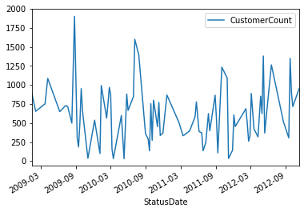


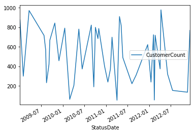


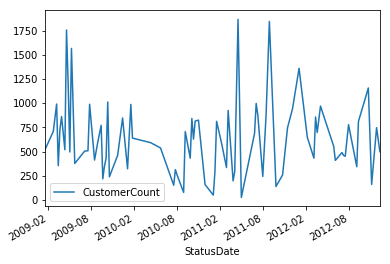


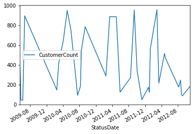


我们也可以指定一个日期，比如 ***2012***，来绘制图表。 
We can also just plot the data on a specific date, like ***2012***.  我们能够清晰地看到这些州的数据分布很广。 因为这些数据包含了每周的客户数量，数据的变化情况看上去是可以预测的。 在这个教程里面，我们假设没有坏数据并继续往下。


```python
Daily.loc['FL']['2012':].plot()
Daily.loc['GA']['2012':].plot()
Daily.loc['NY']['2012':].plot()
Daily.loc['TX']['2012':].plot();
```


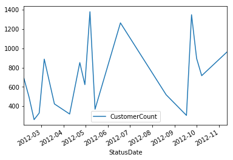


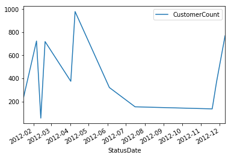


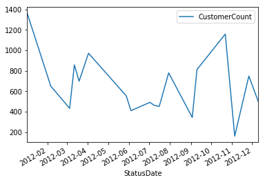


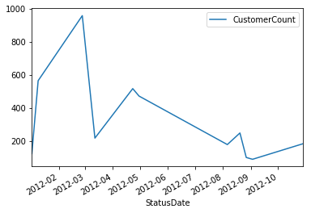


我们假设每个月的客户数量应该是保持相对稳定的。 在一个月内任何在这个特定范围之外的数据都可以从数据集中移除。 最终的结果应该更加的平滑并且图形不会有尖刺。


***StateYearMonth*** - 这里我们通过 State, StatusDate 中的年份(year)和月份(Month) 来分组。    
***Daily['Outlier']*** - 一个布尔(boolean)变量值 (True 或者 False)，从而我们会知道 CustomerCount 值是否在一个可接受的范围之内。

我们将会用到 ***transform*** 而不是 ***apply***。 原因是， transform 将会保持 dataframe 矩阵的形状(shape)(就是行列数不变)而 apply 会改变矩阵的形状。 看过前面的图形我们意识到这些图形不是高斯分布的(gaussian distribution)，这意味着我们不能使用均值(mean)和标准差(stDev)这些统计量。 我们将使用百分位数(percentile)。 请注意这里也会有把好数据消除掉的风险。


```python
# 计算离群值
StateYearMonth = Daily.groupby([Daily.index.get_level_values(0), Daily.index.get_level_values(1).year, Daily.index.get_level_values(1).month])
Daily['Lower'] = StateYearMonth['CustomerCount'].transform( lambda x: x.quantile(q=.25) - (1.5*x.quantile(q=.75)-x.quantile(q=.25)) )
Daily['Upper'] = StateYearMonth['CustomerCount'].transform( lambda x: x.quantile(q=.75) + (1.5*x.quantile(q=.75)-x.quantile(q=.25)) )
Daily['Outlier'] = (Daily['CustomerCount'] < Daily['Lower']) | (Daily['CustomerCount'] > Daily['Upper']) 

# 移除离群值
Daily = Daily[Daily['Outlier'] == False]
```

***Daily*** 这个 dataframe 按照每天来汇总了客户数量。 而原始的数据则可能每一天会有多个记录。 我们现在保留下一个用 State 和 StatusDate 来做索引的数据集。 Outlier 列如果是 ***False*** 的化代表这条记录不是一个离群值。


```python
Daily.head()
```


<div>
<table border="1" class="dataframe">
  <thead>
    <tr style="text-align: right;">
      <th></th>
      <th></th>
      <th>CustomerCount</th>
      <th>Lower</th>
      <th>Upper</th>
      <th>Outlier</th>
    </tr>
    <tr>
      <th>State</th>
      <th>StatusDate</th>
      <th></th>
      <th></th>
      <th></th>
      <th></th>
    </tr>
  </thead>
  <tbody>
    <tr>
      <th rowspan="5" valign="top">FL</th>
      <th>2009-01-12</th>
      <td>901</td>
      <td>450.5</td>
      <td>1351.5</td>
      <td>False</td>
    </tr>
    <tr>
      <th>2009-02-02</th>
      <td>653</td>
      <td>326.5</td>
      <td>979.5</td>
      <td>False</td>
    </tr>
    <tr>
      <th>2009-03-23</th>
      <td>752</td>
      <td>376.0</td>
      <td>1128.0</td>
      <td>False</td>
    </tr>
    <tr>
      <th>2009-04-06</th>
      <td>1086</td>
      <td>543.0</td>
      <td>1629.0</td>
      <td>False</td>
    </tr>
    <tr>
      <th>2009-06-08</th>
      <td>649</td>
      <td>324.5</td>
      <td>973.5</td>
      <td>False</td>
    </tr>
  </tbody>
</table>
</div>


我们创建一个单独的 dataframe，叫 ***ALL***，仅用 StatusDate 来为 Daily 数据集做索引。 我们简单地去掉 ***State*** 这一列。 ***Max*** 列则代表了每一个月最大的客户数量。 ***Max*** 列是用来是的图形更顺滑的。


```python
# 合并所有市场的

# 按日期计算出最大的客户数
ALL = pd.DataFrame(Daily['CustomerCount'].groupby(Daily.index.get_level_values(1)).sum())
ALL.columns = ['CustomerCount'] # rename column

# 按照年和月来分组
YearMonth = ALL.groupby([lambda x: x.year, lambda x: x.month])

# 找出每一个年和月的组合中最大的客户数
ALL['Max'] = YearMonth['CustomerCount'].transform(lambda x: x.max())
ALL.head()
```


<div>
<table border="1" class="dataframe">
  <thead>
    <tr style="text-align: right;">
      <th></th>
      <th>CustomerCount</th>
      <th>Max</th>
    </tr>
    <tr>
      <th>StatusDate</th>
      <th></th>
      <th></th>
    </tr>
  </thead>
  <tbody>
    <tr>
      <th>2009-01-05</th>
      <td>877</td>
      <td>901</td>
    </tr>
    <tr>
      <th>2009-01-12</th>
      <td>901</td>
      <td>901</td>
    </tr>
    <tr>
      <th>2009-01-19</th>
      <td>522</td>
      <td>901</td>
    </tr>
    <tr>
      <th>2009-02-02</th>
      <td>953</td>
      <td>953</td>
    </tr>
    <tr>
      <th>2009-02-23</th>
      <td>710</td>
      <td>953</td>
    </tr>
  </tbody>
</table>
</div>


从上面的 ***ALL*** dataframe 中可以看到，在 2009年1月的这个月份，最大的客户数是 901。 如果我们使用 ***apply*** 的方式，我们将会得到一个以 (年 和 月）组合作为索引的 dataframe ，只有 *Max* 这一列有901这个值。

----------------------------------
如果当前的客户数达到了公司制定的一定的目标值，这也会是一个很有趣的度量值。 现在的任务是可视化的展示当前的客户数是否达到了下面列出的目标值。 我们把这些目标叫做 ***BHAG*** (Big Hairy Annual Goal，年度战略目标)。

* 12/31/2011 - 1,000 客户  
* 12/31/2012 - 2,000 客户  
* 12/31/2013 - 3,000 客户  

我们将用 ***date_range*** 函数来创建日期。


***定义:*** date_range(start=None, end=None, periods=None, freq='D', tz=None, normalize=False, name=None, closed=None)  
***文档(Docstring):*** 返回一个固定频率的日期时间索引，用日历天作为默认的频率

把频率设定为 ***A*** 或者是“年度” 我们将等到上述三个年份。


```python
pd.date_range?
```


```python
# 创建 BHAG 数据
data = [1000, 2000, 3000]
idx = pd.date_range(start='12/31/2011', end='12/31/2013', freq='A')
BHAG = pd.DataFrame(data, index=idx, columns=['BHAG'])
BHAG
```


<div>
<table border="1" class="dataframe">
  <thead>
    <tr style="text-align: right;">
      <th></th>
      <th>BHAG</th>
    </tr>
  </thead>
  <tbody>
    <tr>
      <th>2011-12-31</th>
      <td>1000</td>
    </tr>
    <tr>
      <th>2012-12-31</th>
      <td>2000</td>
    </tr>
    <tr>
      <th>2013-12-31</th>
      <td>3000</td>
    </tr>
  </tbody>
</table>
</div>


我们之前学过用 ***concat*** 把 dataframe 合并。 记住，当我们设置 ***axis = 0*** 时我们按列合并 (row wise, 译者注: 即直接把列合并进去，行方向数据缺失用NaN来填充）。


```python
# 把 BHAG 和 ALL 两个数据集合并在一起
combined = pd.concat([ALL,BHAG], axis=0)
combined = combined.sort_index(axis=0)
combined.tail()
```


<div>
<table border="1" class="dataframe">
  <thead>
    <tr style="text-align: right;">
      <th></th>
      <th>BHAG</th>
      <th>CustomerCount</th>
      <th>Max</th>
    </tr>
  </thead>
  <tbody>
    <tr>
      <th>2012-11-19</th>
      <td>NaN</td>
      <td>136.0</td>
      <td>1115.0</td>
    </tr>
    <tr>
      <th>2012-11-26</th>
      <td>NaN</td>
      <td>1115.0</td>
      <td>1115.0</td>
    </tr>
    <tr>
      <th>2012-12-10</th>
      <td>NaN</td>
      <td>1269.0</td>
      <td>1269.0</td>
    </tr>
    <tr>
      <th>2012-12-31</th>
      <td>2000.0</td>
      <td>NaN</td>
      <td>NaN</td>
    </tr>
    <tr>
      <th>2013-12-31</th>
      <td>3000.0</td>
      <td>NaN</td>
      <td>NaN</td>
    </tr>
  </tbody>
</table>
</div>


```python
fig, axes = plt.subplots(figsize=(12, 7))

combined['BHAG'].fillna(method='pad').plot(color='green', label='BHAG')
combined['Max'].plot(color='blue', label='All Markets')
plt.legend(loc='best');
```


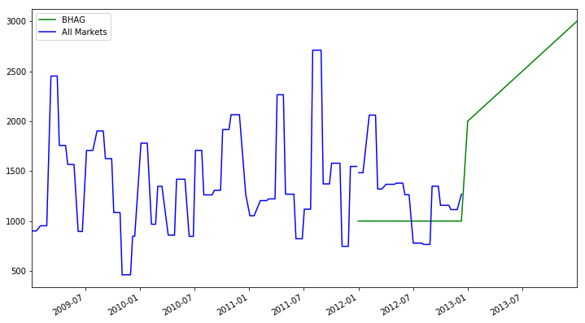


这里还有一个需求是预测下一个年度的客户数，我们之后会通过几个简单的步骤完成。 我们想把已经***合并***的 dataframe 按照 ***Year*** 来分组，并且计算出年度的最大客户数。 这样每一行就是一个年度的数据。


```python
# Group by Year and then get the max value per year
Year = combined.groupby(lambda x: x.year).max()
Year
```


<div>
<table border="1" class="dataframe">
  <thead>
    <tr style="text-align: right;">
      <th></th>
      <th>BHAG</th>
      <th>CustomerCount</th>
      <th>Max</th>
    </tr>
  </thead>
  <tbody>
    <tr>
      <th>2009</th>
      <td>NaN</td>
      <td>2452.0</td>
      <td>2452.0</td>
    </tr>
    <tr>
      <th>2010</th>
      <td>NaN</td>
      <td>2065.0</td>
      <td>2065.0</td>
    </tr>
    <tr>
      <th>2011</th>
      <td>1000.0</td>
      <td>2711.0</td>
      <td>2711.0</td>
    </tr>
    <tr>
      <th>2012</th>
      <td>2000.0</td>
      <td>2061.0</td>
      <td>2061.0</td>
    </tr>
    <tr>
      <th>2013</th>
      <td>3000.0</td>
      <td>NaN</td>
      <td>NaN</td>
    </tr>
  </tbody>
</table>
</div>


```python
# 增加一列，表示为每一年比上一年变化的百分比
Year['YR_PCT_Change'] = Year['Max'].pct_change(periods=1)
Year
```


<div>
<table border="1" class="dataframe">
  <thead>
    <tr style="text-align: right;">
      <th></th>
      <th>BHAG</th>
      <th>CustomerCount</th>
      <th>Max</th>
      <th>YR_PCT_Change</th>
    </tr>
  </thead>
  <tbody>
    <tr>
      <th>2009</th>
      <td>NaN</td>
      <td>2452.0</td>
      <td>2452.0</td>
      <td>NaN</td>
    </tr>
    <tr>
      <th>2010</th>
      <td>NaN</td>
      <td>2065.0</td>
      <td>2065.0</td>
      <td>-0.157830</td>
    </tr>
    <tr>
      <th>2011</th>
      <td>1000.0</td>
      <td>2711.0</td>
      <td>2711.0</td>
      <td>0.312833</td>
    </tr>
    <tr>
      <th>2012</th>
      <td>2000.0</td>
      <td>2061.0</td>
      <td>2061.0</td>
      <td>-0.239764</td>
    </tr>
    <tr>
      <th>2013</th>
      <td>3000.0</td>
      <td>NaN</td>
      <td>NaN</td>
      <td>NaN</td>
    </tr>
  </tbody>
</table>
</div>


要得到下一个年度末的客户数，我们假定当前的增长速率是维持恒定的。 我们按照这个增长速率来预测下一个年度的客户数量。 


```python
(1 + Year.ix[2012,'YR_PCT_Change']) * Year.ix[2012,'Max']
```


    1566.8465510881595


# 表示数据

为每一个州绘制单独的图表。


```python
# 第一张图是整个市场的
ALL['Max'].plot(figsize=(10, 5));plt.title('ALL Markets')

# 后面四张
fig, axes = plt.subplots(nrows=2, ncols=2, figsize=(20, 10))
fig.subplots_adjust(hspace=1.0) ## Create space between plots

Daily.loc['FL']['CustomerCount']['2012':].fillna(method='pad').plot(ax=axes[0,0])
Daily.loc['GA']['CustomerCount']['2012':].fillna(method='pad').plot(ax=axes[0,1]) 
Daily.loc['TX']['CustomerCount']['2012':].fillna(method='pad').plot(ax=axes[1,0]) 
Daily.loc['NY']['CustomerCount']['2012':].fillna(method='pad').plot(ax=axes[1,1]) 

# 增加图表的抬头
axes[0,0].set_title('Florida')
axes[0,1].set_title('Georgia')
axes[1,0].set_title('Texas')
axes[1,1].set_title('North East');
```


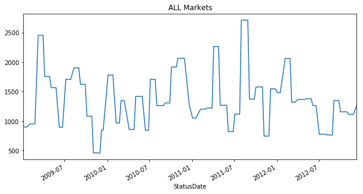


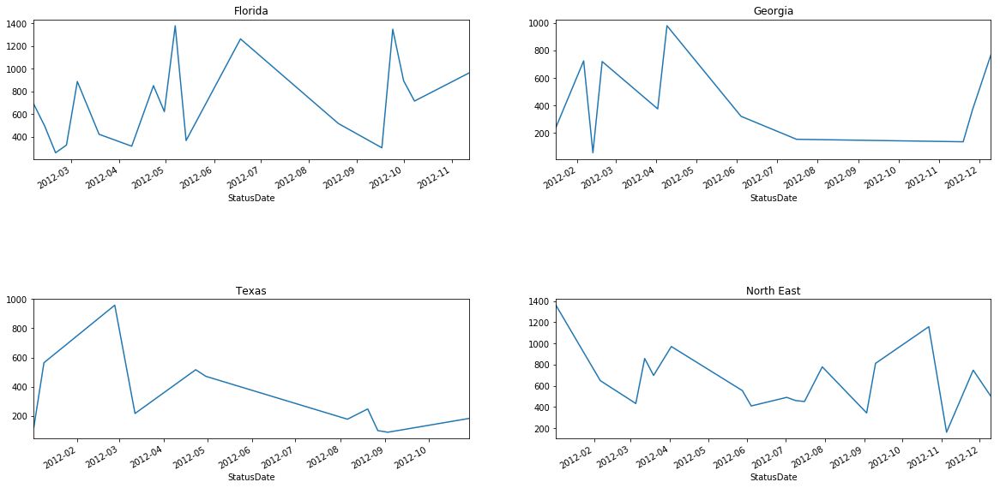


<p class="text-muted">This tutorial was created by <a href="http://www.hedaro.com" target="_blank"><strong>HEDARO</strong></a></p>
<p class="text-muted">本教程由<a href="http://datarx.cn" target="_blank"><strong>派兰数据</strong></a>翻译</p>

<!-- Pandas Tutorial -->  
<strong>These tutorials are also available through an email course, please visit </strong><a href="http://www.hedaro.com/pandas-tutorial" target="_blank"><strong>http://www.hedaro.com/pandas-tutorial</strong></a> <strong>to sign up today.</strong>
<!-- Pandas Tutorial -->


```python

```

## 学习Pandas，第 4 课

> 英文原文: [04 - Lesson](http://nbviewer.ipython.org/urls/bitbucket.org/hrojas/learn-pandas/raw/master/lessons/04%20-%20Lesson.ipynb)

在这一课，我们将回归一些基本概念。 我们将使用一个比较小的数据集这样你就可以非常容易理解我尝试解释的概念。 我们将添加列，删除列，并且使用不同的方式对数据进行切片(slicing)操作。 Enjoy!


```python
# 导入需要的库
import pandas as pd
import sys
```


```python
print('Python version ' + sys.version)
print('Pandas version: ' + pd.__version__)
```

    Python version 3.6.1 | packaged by conda-forge | (default, Mar 23 2017, 21:57:00) 
    [GCC 4.2.1 Compatible Apple LLVM 6.1.0 (clang-602.0.53)]
    Pandas version: 0.19.2
    


```python
# 我们的小数据集
d = [0,1,2,3,4,5,6,7,8,9]

# 创建一个 dataframe
df = pd.DataFrame(d)
df
```


<div>
<table border="1" class="dataframe">
  <thead>
    <tr style="text-align: right;">
      <th></th>
      <th>0</th>
    </tr>
  </thead>
  <tbody>
    <tr>
      <th>0</th>
      <td>0</td>
    </tr>
    <tr>
      <th>1</th>
      <td>1</td>
    </tr>
    <tr>
      <th>2</th>
      <td>2</td>
    </tr>
    <tr>
      <th>3</th>
      <td>3</td>
    </tr>
    <tr>
      <th>4</th>
      <td>4</td>
    </tr>
    <tr>
      <th>5</th>
      <td>5</td>
    </tr>
    <tr>
      <th>6</th>
      <td>6</td>
    </tr>
    <tr>
      <th>7</th>
      <td>7</td>
    </tr>
    <tr>
      <th>8</th>
      <td>8</td>
    </tr>
    <tr>
      <th>9</th>
      <td>9</td>
    </tr>
  </tbody>
</table>
</div>


```python
# 我们把列名修改一下
df.columns = ['Rev']
df
```


<div>
<table border="1" class="dataframe">
  <thead>
    <tr style="text-align: right;">
      <th></th>
      <th>Rev</th>
    </tr>
  </thead>
  <tbody>
    <tr>
      <th>0</th>
      <td>0</td>
    </tr>
    <tr>
      <th>1</th>
      <td>1</td>
    </tr>
    <tr>
      <th>2</th>
      <td>2</td>
    </tr>
    <tr>
      <th>3</th>
      <td>3</td>
    </tr>
    <tr>
      <th>4</th>
      <td>4</td>
    </tr>
    <tr>
      <th>5</th>
      <td>5</td>
    </tr>
    <tr>
      <th>6</th>
      <td>6</td>
    </tr>
    <tr>
      <th>7</th>
      <td>7</td>
    </tr>
    <tr>
      <th>8</th>
      <td>8</td>
    </tr>
    <tr>
      <th>9</th>
      <td>9</td>
    </tr>
  </tbody>
</table>
</div>


```python
# 我们增加一列
df['NewCol'] = 5
df
```


<div>
<table border="1" class="dataframe">
  <thead>
    <tr style="text-align: right;">
      <th></th>
      <th>Rev</th>
      <th>NewCol</th>
    </tr>
  </thead>
  <tbody>
    <tr>
      <th>0</th>
      <td>0</td>
      <td>5</td>
    </tr>
    <tr>
      <th>1</th>
      <td>1</td>
      <td>5</td>
    </tr>
    <tr>
      <th>2</th>
      <td>2</td>
      <td>5</td>
    </tr>
    <tr>
      <th>3</th>
      <td>3</td>
      <td>5</td>
    </tr>
    <tr>
      <th>4</th>
      <td>4</td>
      <td>5</td>
    </tr>
    <tr>
      <th>5</th>
      <td>5</td>
      <td>5</td>
    </tr>
    <tr>
      <th>6</th>
      <td>6</td>
      <td>5</td>
    </tr>
    <tr>
      <th>7</th>
      <td>7</td>
      <td>5</td>
    </tr>
    <tr>
      <th>8</th>
      <td>8</td>
      <td>5</td>
    </tr>
    <tr>
      <th>9</th>
      <td>9</td>
      <td>5</td>
    </tr>
  </tbody>
</table>
</div>


```python
# 修改一下新增加的这一列的值
df['NewCol'] = df['NewCol'] + 1
df
```


<div>
<table border="1" class="dataframe">
  <thead>
    <tr style="text-align: right;">
      <th></th>
      <th>Rev</th>
      <th>NewCol</th>
    </tr>
  </thead>
  <tbody>
    <tr>
      <th>0</th>
      <td>0</td>
      <td>6</td>
    </tr>
    <tr>
      <th>1</th>
      <td>1</td>
      <td>6</td>
    </tr>
    <tr>
      <th>2</th>
      <td>2</td>
      <td>6</td>
    </tr>
    <tr>
      <th>3</th>
      <td>3</td>
      <td>6</td>
    </tr>
    <tr>
      <th>4</th>
      <td>4</td>
      <td>6</td>
    </tr>
    <tr>
      <th>5</th>
      <td>5</td>
      <td>6</td>
    </tr>
    <tr>
      <th>6</th>
      <td>6</td>
      <td>6</td>
    </tr>
    <tr>
      <th>7</th>
      <td>7</td>
      <td>6</td>
    </tr>
    <tr>
      <th>8</th>
      <td>8</td>
      <td>6</td>
    </tr>
    <tr>
      <th>9</th>
      <td>9</td>
      <td>6</td>
    </tr>
  </tbody>
</table>
</div>


```python
# 我们可以删除列
del df['NewCol']
df
```


<div>
<table border="1" class="dataframe">
  <thead>
    <tr style="text-align: right;">
      <th></th>
      <th>Rev</th>
    </tr>
  </thead>
  <tbody>
    <tr>
      <th>0</th>
      <td>0</td>
    </tr>
    <tr>
      <th>1</th>
      <td>1</td>
    </tr>
    <tr>
      <th>2</th>
      <td>2</td>
    </tr>
    <tr>
      <th>3</th>
      <td>3</td>
    </tr>
    <tr>
      <th>4</th>
      <td>4</td>
    </tr>
    <tr>
      <th>5</th>
      <td>5</td>
    </tr>
    <tr>
      <th>6</th>
      <td>6</td>
    </tr>
    <tr>
      <th>7</th>
      <td>7</td>
    </tr>
    <tr>
      <th>8</th>
      <td>8</td>
    </tr>
    <tr>
      <th>9</th>
      <td>9</td>
    </tr>
  </tbody>
</table>
</div>


```python
# 让我们增加几列。 译者注: 当使用 dataframe 没有的列时，dataframe 自动增加这个新列
df['test'] = 3
df['col'] = df['Rev']
df
```


<div>
<table border="1" class="dataframe">
  <thead>
    <tr style="text-align: right;">
      <th></th>
      <th>Rev</th>
      <th>test</th>
      <th>col</th>
    </tr>
  </thead>
  <tbody>
    <tr>
      <th>0</th>
      <td>0</td>
      <td>3</td>
      <td>0</td>
    </tr>
    <tr>
      <th>1</th>
      <td>1</td>
      <td>3</td>
      <td>1</td>
    </tr>
    <tr>
      <th>2</th>
      <td>2</td>
      <td>3</td>
      <td>2</td>
    </tr>
    <tr>
      <th>3</th>
      <td>3</td>
      <td>3</td>
      <td>3</td>
    </tr>
    <tr>
      <th>4</th>
      <td>4</td>
      <td>3</td>
      <td>4</td>
    </tr>
    <tr>
      <th>5</th>
      <td>5</td>
      <td>3</td>
      <td>5</td>
    </tr>
    <tr>
      <th>6</th>
      <td>6</td>
      <td>3</td>
      <td>6</td>
    </tr>
    <tr>
      <th>7</th>
      <td>7</td>
      <td>3</td>
      <td>7</td>
    </tr>
    <tr>
      <th>8</th>
      <td>8</td>
      <td>3</td>
      <td>8</td>
    </tr>
    <tr>
      <th>9</th>
      <td>9</td>
      <td>3</td>
      <td>9</td>
    </tr>
  </tbody>
</table>
</div>


```python
# 如果有需要，可以改变索引(index)的名字
i = ['a','b','c','d','e','f','g','h','i','j']
df.index = i
df
```


<div>
<table border="1" class="dataframe">
  <thead>
    <tr style="text-align: right;">
      <th></th>
      <th>Rev</th>
      <th>test</th>
      <th>col</th>
    </tr>
  </thead>
  <tbody>
    <tr>
      <th>a</th>
      <td>0</td>
      <td>3</td>
      <td>0</td>
    </tr>
    <tr>
      <th>b</th>
      <td>1</td>
      <td>3</td>
      <td>1</td>
    </tr>
    <tr>
      <th>c</th>
      <td>2</td>
      <td>3</td>
      <td>2</td>
    </tr>
    <tr>
      <th>d</th>
      <td>3</td>
      <td>3</td>
      <td>3</td>
    </tr>
    <tr>
      <th>e</th>
      <td>4</td>
      <td>3</td>
      <td>4</td>
    </tr>
    <tr>
      <th>f</th>
      <td>5</td>
      <td>3</td>
      <td>5</td>
    </tr>
    <tr>
      <th>g</th>
      <td>6</td>
      <td>3</td>
      <td>6</td>
    </tr>
    <tr>
      <th>h</th>
      <td>7</td>
      <td>3</td>
      <td>7</td>
    </tr>
    <tr>
      <th>i</th>
      <td>8</td>
      <td>3</td>
      <td>8</td>
    </tr>
    <tr>
      <th>j</th>
      <td>9</td>
      <td>3</td>
      <td>9</td>
    </tr>
  </tbody>
</table>
</div>


通过使用 ***loc**，我们可以选择 dataframe 中的部分数据。


```python
df.loc['a']
```


    Rev     0
    test    3
    col     0
    Name: a, dtype: int64


```python
# df.loc[起始索引(包含):终止索引(包含)]
df.loc['a':'d']
```


<div>
<table border="1" class="dataframe">
  <thead>
    <tr style="text-align: right;">
      <th></th>
      <th>Rev</th>
      <th>test</th>
      <th>col</th>
    </tr>
  </thead>
  <tbody>
    <tr>
      <th>a</th>
      <td>0</td>
      <td>3</td>
      <td>0</td>
    </tr>
    <tr>
      <th>b</th>
      <td>1</td>
      <td>3</td>
      <td>1</td>
    </tr>
    <tr>
      <th>c</th>
      <td>2</td>
      <td>3</td>
      <td>2</td>
    </tr>
    <tr>
      <th>d</th>
      <td>3</td>
      <td>3</td>
      <td>3</td>
    </tr>
  </tbody>
</table>
</div>


```python
# df.iloc[起始索引(包含):终止索引(不包含)]
# 注意: .iloc 非常严格限制在整形的索引上. 从 [version 0.11.0] (http://pandas.pydata.org/pandas-docs/stable/whatsnew.html#v0-11-0-april-22-2013) 开始有这个操作。
df.iloc[0:3]
```


<div>
<table border="1" class="dataframe">
  <thead>
    <tr style="text-align: right;">
      <th></th>
      <th>Rev</th>
      <th>test</th>
      <th>col</th>
    </tr>
  </thead>
  <tbody>
    <tr>
      <th>a</th>
      <td>0</td>
      <td>3</td>
      <td>0</td>
    </tr>
    <tr>
      <th>b</th>
      <td>1</td>
      <td>3</td>
      <td>1</td>
    </tr>
    <tr>
      <th>c</th>
      <td>2</td>
      <td>3</td>
      <td>2</td>
    </tr>
  </tbody>
</table>
</div>


也可以通过列名选择一列的值。


```python
df['Rev']
```


    a    0
    b    1
    c    2
    d    3
    e    4
    f    5
    g    6
    h    7
    i    8
    j    9
    Name: Rev, dtype: int64


```python
df[['Rev', 'test']]
```


<div>
<table border="1" class="dataframe">
  <thead>
    <tr style="text-align: right;">
      <th></th>
      <th>Rev</th>
      <th>test</th>
    </tr>
  </thead>
  <tbody>
    <tr>
      <th>a</th>
      <td>0</td>
      <td>3</td>
    </tr>
    <tr>
      <th>b</th>
      <td>1</td>
      <td>3</td>
    </tr>
    <tr>
      <th>c</th>
      <td>2</td>
      <td>3</td>
    </tr>
    <tr>
      <th>d</th>
      <td>3</td>
      <td>3</td>
    </tr>
    <tr>
      <th>e</th>
      <td>4</td>
      <td>3</td>
    </tr>
    <tr>
      <th>f</th>
      <td>5</td>
      <td>3</td>
    </tr>
    <tr>
      <th>g</th>
      <td>6</td>
      <td>3</td>
    </tr>
    <tr>
      <th>h</th>
      <td>7</td>
      <td>3</td>
    </tr>
    <tr>
      <th>i</th>
      <td>8</td>
      <td>3</td>
    </tr>
    <tr>
      <th>j</th>
      <td>9</td>
      <td>3</td>
    </tr>
  </tbody>
</table>
</div>


```python
# df.ix[行范围, 列范围]
df.ix[0:3,'Rev']
```


    a    0
    b    1
    c    2
    Name: Rev, dtype: int64


```python
df.ix[5:,'col']
```


    f    5
    g    6
    h    7
    i    8
    j    9
    Name: col, dtype: int64


```python
df.ix[:3,['col', 'test']] #译者注: 用一个列的list来选择多个列
```


<div>
<table border="1" class="dataframe">
  <thead>
    <tr style="text-align: right;">
      <th></th>
      <th>col</th>
      <th>test</th>
    </tr>
  </thead>
  <tbody>
    <tr>
      <th>a</th>
      <td>0</td>
      <td>3</td>
    </tr>
    <tr>
      <th>b</th>
      <td>1</td>
      <td>3</td>
    </tr>
    <tr>
      <th>c</th>
      <td>2</td>
      <td>3</td>
    </tr>
  </tbody>
</table>
</div>


还有一些方便的方法来选择最前或者最后的一些记录。


```python
# 选择 top-N 个记录 (默认是 5 个)
df.head()
```


<div>
<table border="1" class="dataframe">
  <thead>
    <tr style="text-align: right;">
      <th></th>
      <th>Rev</th>
      <th>test</th>
      <th>col</th>
    </tr>
  </thead>
  <tbody>
    <tr>
      <th>a</th>
      <td>0</td>
      <td>3</td>
      <td>0</td>
    </tr>
    <tr>
      <th>b</th>
      <td>1</td>
      <td>3</td>
      <td>1</td>
    </tr>
    <tr>
      <th>c</th>
      <td>2</td>
      <td>3</td>
      <td>2</td>
    </tr>
    <tr>
      <th>d</th>
      <td>3</td>
      <td>3</td>
      <td>3</td>
    </tr>
    <tr>
      <th>e</th>
      <td>4</td>
      <td>3</td>
      <td>4</td>
    </tr>
  </tbody>
</table>
</div>


```python
# 选择 bottom-N 个记录 (默认是 5 个)
df.tail()
```


<div>
<table border="1" class="dataframe">
  <thead>
    <tr style="text-align: right;">
      <th></th>
      <th>Rev</th>
      <th>test</th>
      <th>col</th>
    </tr>
  </thead>
  <tbody>
    <tr>
      <th>f</th>
      <td>5</td>
      <td>3</td>
      <td>5</td>
    </tr>
    <tr>
      <th>g</th>
      <td>6</td>
      <td>3</td>
      <td>6</td>
    </tr>
    <tr>
      <th>h</th>
      <td>7</td>
      <td>3</td>
      <td>7</td>
    </tr>
    <tr>
      <th>i</th>
      <td>8</td>
      <td>3</td>
      <td>8</td>
    </tr>
    <tr>
      <th>j</th>
      <td>9</td>
      <td>3</td>
      <td>9</td>
    </tr>
  </tbody>
</table>
</div>


<p class="text-muted">This tutorial was created by <a href="http://www.hedaro.com" target="_blank"><strong>HEDARO</strong></a></p>
<p class="text-muted">本教程由<a href="http://datarx.cn" target="_blank"><strong>派兰数据</strong></a>翻译</p>

<!-- Pandas Tutorial -->  
<strong>These tutorials are also available through an email course, please visit </strong><a href="http://www.hedaro.com/pandas-tutorial" target="_blank"><strong>http://www.hedaro.com/pandas-tutorial</strong></a> <strong>to sign up today.</strong>
<!-- Pandas Tutorial -->	

## 学习Pandas，第 5 课

> 英文原文: [05 - Lesson](http://nbviewer.ipython.org/urls/bitbucket.org/hrojas/learn-pandas/raw/master/lessons/05%20-%20Lesson.ipynb)

我们将快速地看一下 ***stack*** 和 ***unstack*** 这两个函数。


```python
# 导入库
import pandas as pd
import sys
```


```python
print('Python version ' + sys.version)
print('Pandas version: ' + pd.__version__)
```

    Python version 3.6.1 | packaged by conda-forge | (default, Mar 23 2017, 21:57:00) 
    [GCC 4.2.1 Compatible Apple LLVM 6.1.0 (clang-602.0.53)]
    Pandas version: 0.19.2
    


```python
# 我们的小数聚集
d = {'one':[1,1],'two':[2,2]}
i = ['a','b']

# 创建一个 dataframe
df = pd.DataFrame(data = d, index = i)
df
```


<div>
<table border="1" class="dataframe">
  <thead>
    <tr style="text-align: right;">
      <th></th>
      <th>one</th>
      <th>two</th>
    </tr>
  </thead>
  <tbody>
    <tr>
      <th>a</th>
      <td>1</td>
      <td>2</td>
    </tr>
    <tr>
      <th>b</th>
      <td>1</td>
      <td>2</td>
    </tr>
  </tbody>
</table>
</div>


```python
df.index
```


    Index(['a', 'b'], dtype='object')


```python
# 把列(column)放置到索引位置
stack = df.stack()
stack
```


    a  one    1
       two    2
    b  one    1
       two    2
    dtype: int64


```python
# 现在索引包含了原来的列名字
stack.index
```


    MultiIndex(levels=[['a', 'b'], ['one', 'two']],
               labels=[[0, 0, 1, 1], [0, 1, 0, 1]])


```python
unstack = df.unstack()
unstack
```


    one  a    1
         b    1
    two  a    2
         b    2
    dtype: int64


```python
unstack.index
```


    MultiIndex(levels=[['one', 'two'], ['a', 'b']],
               labels=[[0, 0, 1, 1], [0, 1, 0, 1]])


用 **T** (转置)，我们可以把列和索引交换位置。


```python
transpose = df.T
transpose
```


<div>
<table border="1" class="dataframe">
  <thead>
    <tr style="text-align: right;">
      <th></th>
      <th>a</th>
      <th>b</th>
    </tr>
  </thead>
  <tbody>
    <tr>
      <th>one</th>
      <td>1</td>
      <td>1</td>
    </tr>
    <tr>
      <th>two</th>
      <td>2</td>
      <td>2</td>
    </tr>
  </tbody>
</table>
</div>


```python
transpose.index
```


    Index(['one', 'two'], dtype='object')


<p class="text-muted">This tutorial was created by <a href="http://www.hedaro.com" target="_blank"><strong>HEDARO</strong></a></p>
<p class="text-muted">本教程由<a href="http://datarx.cn" target="_blank"><strong>派兰数据</strong></a>翻译</p>

<!-- Pandas Tutorial -->  
<strong>These tutorials are also available through an email course, please visit </strong><a href="http://www.hedaro.com/pandas-tutorial" target="_blank"><strong>http://www.hedaro.com/pandas-tutorial</strong></a> <strong>to sign up today.</strong>
<!-- Pandas Tutorial -->	


```python

```

## 学习Pandas，第 6 课

> 英文原文: [06 - Lesson](http://nbviewer.ipython.org/urls/bitbucket.org/hrojas/learn-pandas/raw/master/lessons/06%20-%20Lesson.ipynb)

我们看一下 ***groupby*** 这个函数。


```python
# 导入库
import pandas as pd
import sys
```


```python
print('Python version ' + sys.version)
print('Pandas version ' + pd.__version__)
```

    Python version 3.6.1 | packaged by conda-forge | (default, Mar 23 2017, 21:57:00) 
    [GCC 4.2.1 Compatible Apple LLVM 6.1.0 (clang-602.0.53)]
    Pandas version 0.19.2
    


```python
# 我们的小数聚集
d = {'one':[1,1,1,1,1],
     'two':[2,2,2,2,2],
     'letter':['a','a','b','b','c']}

# 创建一个 dataframe
df = pd.DataFrame(d)
df
```


<div>
<table border="1" class="dataframe">
  <thead>
    <tr style="text-align: right;">
      <th></th>
      <th>letter</th>
      <th>one</th>
      <th>two</th>
    </tr>
  </thead>
  <tbody>
    <tr>
      <th>0</th>
      <td>a</td>
      <td>1</td>
      <td>2</td>
    </tr>
    <tr>
      <th>1</th>
      <td>a</td>
      <td>1</td>
      <td>2</td>
    </tr>
    <tr>
      <th>2</th>
      <td>b</td>
      <td>1</td>
      <td>2</td>
    </tr>
    <tr>
      <th>3</th>
      <td>b</td>
      <td>1</td>
      <td>2</td>
    </tr>
    <tr>
      <th>4</th>
      <td>c</td>
      <td>1</td>
      <td>2</td>
    </tr>
  </tbody>
</table>
</div>


```python
# 创建一个 groupby 对象
one = df.groupby('letter')

# 在分组上应用 sum() 函数
one.sum()
```


<div>
<table border="1" class="dataframe">
  <thead>
    <tr style="text-align: right;">
      <th></th>
      <th>one</th>
      <th>two</th>
    </tr>
    <tr>
      <th>letter</th>
      <th></th>
      <th></th>
    </tr>
  </thead>
  <tbody>
    <tr>
      <th>a</th>
      <td>2</td>
      <td>4</td>
    </tr>
    <tr>
      <th>b</th>
      <td>2</td>
      <td>4</td>
    </tr>
    <tr>
      <th>c</th>
      <td>1</td>
      <td>2</td>
    </tr>
  </tbody>
</table>
</div>


```python
letterone = df.groupby(['letter','one']).sum()
letterone
```


<div>
<table border="1" class="dataframe">
  <thead>
    <tr style="text-align: right;">
      <th></th>
      <th></th>
      <th>two</th>
    </tr>
    <tr>
      <th>letter</th>
      <th>one</th>
      <th></th>
    </tr>
  </thead>
  <tbody>
    <tr>
      <th>a</th>
      <th>1</th>
      <td>4</td>
    </tr>
    <tr>
      <th>b</th>
      <th>1</th>
      <td>4</td>
    </tr>
    <tr>
      <th>c</th>
      <th>1</th>
      <td>2</td>
    </tr>
  </tbody>
</table>
</div>


```python
letterone.index
```


    MultiIndex(levels=[['a', 'b', 'c'], [1]],
               labels=[[0, 1, 2], [0, 0, 0]],
               names=['letter', 'one'])


你可能不想把用来分组的列名字作为索引，像下面的做法很容易实现。


```python
letterone = df.groupby(['letter','one'], as_index=False).sum()
letterone
```


<div>
<table border="1" class="dataframe">
  <thead>
    <tr style="text-align: right;">
      <th></th>
      <th>letter</th>
      <th>one</th>
      <th>two</th>
    </tr>
  </thead>
  <tbody>
    <tr>
      <th>0</th>
      <td>a</td>
      <td>1</td>
      <td>4</td>
    </tr>
    <tr>
      <th>1</th>
      <td>b</td>
      <td>1</td>
      <td>4</td>
    </tr>
    <tr>
      <th>2</th>
      <td>c</td>
      <td>1</td>
      <td>2</td>
    </tr>
  </tbody>
</table>
</div>


```python
letterone.index
```


    Int64Index([0, 1, 2], dtype='int64')


<p class="text-muted">This tutorial was created by <a href="http://www.hedaro.com" target="_blank"><strong>HEDARO</strong></a></p>
<p class="text-muted">本教程由<a href="http://datarx.cn" target="_blank"><strong>派兰数据</strong></a>翻译</p>

<!-- Pandas Tutorial -->  
<strong>These tutorials are also available through an email course, please visit </strong><a href="http://www.hedaro.com/pandas-tutorial" target="_blank"><strong>http://www.hedaro.com/pandas-tutorial</strong></a> <strong>to sign up today.</strong>
<!-- Pandas Tutorial -->	


```python

```

## 学习Pandas，第 7 课

> 英文原文: [07 - Lesson](http://nbviewer.ipython.org/urls/bitbucket.org/hrojas/learn-pandas/raw/master/lessons/07%20-%20Lesson.ipynb)

### 离群值 (Outlier)


```python
import pandas as pd
import sys
```


```python
print('Python version ' + sys.version)
print('Pandas version ' + pd.__version__)
```

    Python version 3.6.1 | packaged by conda-forge | (default, Mar 23 2017, 21:57:00) 
    [GCC 4.2.1 Compatible Apple LLVM 6.1.0 (clang-602.0.53)]
    Pandas version 0.19.2
    


```python
# 创建一个 dataframe，用日期作为索引
States = ['NY', 'NY', 'NY', 'NY', 'FL', 'FL', 'GA', 'GA', 'FL', 'FL'] 
data = [1.0, 2, 3, 4, 5, 6, 7, 8, 9, 10]
idx = pd.date_range('1/1/2012', periods=10, freq='MS')
df1 = pd.DataFrame(data, index=idx, columns=['Revenue'])
df1['State'] = States

# 创建第二个 dataframe
data2 = [10.0, 10.0, 9, 9, 8, 8, 7, 7, 6, 6]
idx2 = pd.date_range('1/1/2013', periods=10, freq='MS')
df2 = pd.DataFrame(data2, index=idx2, columns=['Revenue'])
df2['State'] = States
```


```python
# 把两个 dataframe 合并起来
df = pd.concat([df1,df2])
df
```


<div>
<table border="1" class="dataframe">
  <thead>
    <tr style="text-align: right;">
      <th></th>
      <th>Revenue</th>
      <th>State</th>
    </tr>
  </thead>
  <tbody>
    <tr>
      <th>2012-01-01</th>
      <td>1.0</td>
      <td>NY</td>
    </tr>
    <tr>
      <th>2012-02-01</th>
      <td>2.0</td>
      <td>NY</td>
    </tr>
    <tr>
      <th>2012-03-01</th>
      <td>3.0</td>
      <td>NY</td>
    </tr>
    <tr>
      <th>2012-04-01</th>
      <td>4.0</td>
      <td>NY</td>
    </tr>
    <tr>
      <th>2012-05-01</th>
      <td>5.0</td>
      <td>FL</td>
    </tr>
    <tr>
      <th>2012-06-01</th>
      <td>6.0</td>
      <td>FL</td>
    </tr>
    <tr>
      <th>2012-07-01</th>
      <td>7.0</td>
      <td>GA</td>
    </tr>
    <tr>
      <th>2012-08-01</th>
      <td>8.0</td>
      <td>GA</td>
    </tr>
    <tr>
      <th>2012-09-01</th>
      <td>9.0</td>
      <td>FL</td>
    </tr>
    <tr>
      <th>2012-10-01</th>
      <td>10.0</td>
      <td>FL</td>
    </tr>
    <tr>
      <th>2013-01-01</th>
      <td>10.0</td>
      <td>NY</td>
    </tr>
    <tr>
      <th>2013-02-01</th>
      <td>10.0</td>
      <td>NY</td>
    </tr>
    <tr>
      <th>2013-03-01</th>
      <td>9.0</td>
      <td>NY</td>
    </tr>
    <tr>
      <th>2013-04-01</th>
      <td>9.0</td>
      <td>NY</td>
    </tr>
    <tr>
      <th>2013-05-01</th>
      <td>8.0</td>
      <td>FL</td>
    </tr>
    <tr>
      <th>2013-06-01</th>
      <td>8.0</td>
      <td>FL</td>
    </tr>
    <tr>
      <th>2013-07-01</th>
      <td>7.0</td>
      <td>GA</td>
    </tr>
    <tr>
      <th>2013-08-01</th>
      <td>7.0</td>
      <td>GA</td>
    </tr>
    <tr>
      <th>2013-09-01</th>
      <td>6.0</td>
      <td>FL</td>
    </tr>
    <tr>
      <th>2013-10-01</th>
      <td>6.0</td>
      <td>FL</td>
    </tr>
  </tbody>
</table>
</div>


# 计算离群值的方法

注意: 均值(average)和标准差(Standard Deviation)只对高斯分布(gaussian distribution)有意义。


```python
# 方法 1

# 原始的 df 拷贝一份
newdf = df.copy()

newdf['x-Mean'] = abs(newdf['Revenue'] - newdf['Revenue'].mean())
newdf['1.96*std'] = 1.96*newdf['Revenue'].std()  
newdf['Outlier'] = abs(newdf['Revenue'] - newdf['Revenue'].mean()) > 1.96*newdf['Revenue'].std()
newdf
```


<div>
<table border="1" class="dataframe">
  <thead>
    <tr style="text-align: right;">
      <th></th>
      <th>Revenue</th>
      <th>State</th>
      <th>x-Mean</th>
      <th>1.96*std</th>
      <th>Outlier</th>
    </tr>
  </thead>
  <tbody>
    <tr>
      <th>2012-01-01</th>
      <td>1.0</td>
      <td>NY</td>
      <td>5.75</td>
      <td>5.200273</td>
      <td>True</td>
    </tr>
    <tr>
      <th>2012-02-01</th>
      <td>2.0</td>
      <td>NY</td>
      <td>4.75</td>
      <td>5.200273</td>
      <td>False</td>
    </tr>
    <tr>
      <th>2012-03-01</th>
      <td>3.0</td>
      <td>NY</td>
      <td>3.75</td>
      <td>5.200273</td>
      <td>False</td>
    </tr>
    <tr>
      <th>2012-04-01</th>
      <td>4.0</td>
      <td>NY</td>
      <td>2.75</td>
      <td>5.200273</td>
      <td>False</td>
    </tr>
    <tr>
      <th>2012-05-01</th>
      <td>5.0</td>
      <td>FL</td>
      <td>1.75</td>
      <td>5.200273</td>
      <td>False</td>
    </tr>
    <tr>
      <th>2012-06-01</th>
      <td>6.0</td>
      <td>FL</td>
      <td>0.75</td>
      <td>5.200273</td>
      <td>False</td>
    </tr>
    <tr>
      <th>2012-07-01</th>
      <td>7.0</td>
      <td>GA</td>
      <td>0.25</td>
      <td>5.200273</td>
      <td>False</td>
    </tr>
    <tr>
      <th>2012-08-01</th>
      <td>8.0</td>
      <td>GA</td>
      <td>1.25</td>
      <td>5.200273</td>
      <td>False</td>
    </tr>
    <tr>
      <th>2012-09-01</th>
      <td>9.0</td>
      <td>FL</td>
      <td>2.25</td>
      <td>5.200273</td>
      <td>False</td>
    </tr>
    <tr>
      <th>2012-10-01</th>
      <td>10.0</td>
      <td>FL</td>
      <td>3.25</td>
      <td>5.200273</td>
      <td>False</td>
    </tr>
    <tr>
      <th>2013-01-01</th>
      <td>10.0</td>
      <td>NY</td>
      <td>3.25</td>
      <td>5.200273</td>
      <td>False</td>
    </tr>
    <tr>
      <th>2013-02-01</th>
      <td>10.0</td>
      <td>NY</td>
      <td>3.25</td>
      <td>5.200273</td>
      <td>False</td>
    </tr>
    <tr>
      <th>2013-03-01</th>
      <td>9.0</td>
      <td>NY</td>
      <td>2.25</td>
      <td>5.200273</td>
      <td>False</td>
    </tr>
    <tr>
      <th>2013-04-01</th>
      <td>9.0</td>
      <td>NY</td>
      <td>2.25</td>
      <td>5.200273</td>
      <td>False</td>
    </tr>
    <tr>
      <th>2013-05-01</th>
      <td>8.0</td>
      <td>FL</td>
      <td>1.25</td>
      <td>5.200273</td>
      <td>False</td>
    </tr>
    <tr>
      <th>2013-06-01</th>
      <td>8.0</td>
      <td>FL</td>
      <td>1.25</td>
      <td>5.200273</td>
      <td>False</td>
    </tr>
    <tr>
      <th>2013-07-01</th>
      <td>7.0</td>
      <td>GA</td>
      <td>0.25</td>
      <td>5.200273</td>
      <td>False</td>
    </tr>
    <tr>
      <th>2013-08-01</th>
      <td>7.0</td>
      <td>GA</td>
      <td>0.25</td>
      <td>5.200273</td>
      <td>False</td>
    </tr>
    <tr>
      <th>2013-09-01</th>
      <td>6.0</td>
      <td>FL</td>
      <td>0.75</td>
      <td>5.200273</td>
      <td>False</td>
    </tr>
    <tr>
      <th>2013-10-01</th>
      <td>6.0</td>
      <td>FL</td>
      <td>0.75</td>
      <td>5.200273</td>
      <td>False</td>
    </tr>
  </tbody>
</table>
</div>


```python
# 方法 2
# 分组的方法

# 原始的 df 拷贝一份
newdf = df.copy()

State = newdf.groupby('State')

newdf['Outlier'] = State.transform( lambda x: abs(x-x.mean()) > 1.96*x.std() )
newdf['x-Mean'] = State.transform( lambda x: abs(x-x.mean()) )
newdf['1.96*std'] = State.transform( lambda x: 1.96*x.std() )
newdf
```


<div>
<table border="1" class="dataframe">
  <thead>
    <tr style="text-align: right;">
      <th></th>
      <th>Revenue</th>
      <th>State</th>
      <th>Outlier</th>
      <th>x-Mean</th>
      <th>1.96*std</th>
    </tr>
  </thead>
  <tbody>
    <tr>
      <th>2012-01-01</th>
      <td>1.0</td>
      <td>NY</td>
      <td>False</td>
      <td>5.00</td>
      <td>7.554813</td>
    </tr>
    <tr>
      <th>2012-02-01</th>
      <td>2.0</td>
      <td>NY</td>
      <td>False</td>
      <td>4.00</td>
      <td>7.554813</td>
    </tr>
    <tr>
      <th>2012-03-01</th>
      <td>3.0</td>
      <td>NY</td>
      <td>False</td>
      <td>3.00</td>
      <td>7.554813</td>
    </tr>
    <tr>
      <th>2012-04-01</th>
      <td>4.0</td>
      <td>NY</td>
      <td>False</td>
      <td>2.00</td>
      <td>7.554813</td>
    </tr>
    <tr>
      <th>2012-05-01</th>
      <td>5.0</td>
      <td>FL</td>
      <td>False</td>
      <td>2.25</td>
      <td>3.434996</td>
    </tr>
    <tr>
      <th>2012-06-01</th>
      <td>6.0</td>
      <td>FL</td>
      <td>False</td>
      <td>1.25</td>
      <td>3.434996</td>
    </tr>
    <tr>
      <th>2012-07-01</th>
      <td>7.0</td>
      <td>GA</td>
      <td>False</td>
      <td>0.25</td>
      <td>0.980000</td>
    </tr>
    <tr>
      <th>2012-08-01</th>
      <td>8.0</td>
      <td>GA</td>
      <td>False</td>
      <td>0.75</td>
      <td>0.980000</td>
    </tr>
    <tr>
      <th>2012-09-01</th>
      <td>9.0</td>
      <td>FL</td>
      <td>False</td>
      <td>1.75</td>
      <td>3.434996</td>
    </tr>
    <tr>
      <th>2012-10-01</th>
      <td>10.0</td>
      <td>FL</td>
      <td>False</td>
      <td>2.75</td>
      <td>3.434996</td>
    </tr>
    <tr>
      <th>2013-01-01</th>
      <td>10.0</td>
      <td>NY</td>
      <td>False</td>
      <td>4.00</td>
      <td>7.554813</td>
    </tr>
    <tr>
      <th>2013-02-01</th>
      <td>10.0</td>
      <td>NY</td>
      <td>False</td>
      <td>4.00</td>
      <td>7.554813</td>
    </tr>
    <tr>
      <th>2013-03-01</th>
      <td>9.0</td>
      <td>NY</td>
      <td>False</td>
      <td>3.00</td>
      <td>7.554813</td>
    </tr>
    <tr>
      <th>2013-04-01</th>
      <td>9.0</td>
      <td>NY</td>
      <td>False</td>
      <td>3.00</td>
      <td>7.554813</td>
    </tr>
    <tr>
      <th>2013-05-01</th>
      <td>8.0</td>
      <td>FL</td>
      <td>False</td>
      <td>0.75</td>
      <td>3.434996</td>
    </tr>
    <tr>
      <th>2013-06-01</th>
      <td>8.0</td>
      <td>FL</td>
      <td>False</td>
      <td>0.75</td>
      <td>3.434996</td>
    </tr>
    <tr>
      <th>2013-07-01</th>
      <td>7.0</td>
      <td>GA</td>
      <td>False</td>
      <td>0.25</td>
      <td>0.980000</td>
    </tr>
    <tr>
      <th>2013-08-01</th>
      <td>7.0</td>
      <td>GA</td>
      <td>False</td>
      <td>0.25</td>
      <td>0.980000</td>
    </tr>
    <tr>
      <th>2013-09-01</th>
      <td>6.0</td>
      <td>FL</td>
      <td>False</td>
      <td>1.25</td>
      <td>3.434996</td>
    </tr>
    <tr>
      <th>2013-10-01</th>
      <td>6.0</td>
      <td>FL</td>
      <td>False</td>
      <td>1.25</td>
      <td>3.434996</td>
    </tr>
  </tbody>
</table>
</div>


```python
# 方法 2
# 多个条件分组

# 原始 df 拷贝一份
newdf = df.copy()

StateMonth = newdf.groupby(['State', lambda x: x.month])

newdf['Outlier'] = StateMonth.transform( lambda x: abs(x-x.mean()) > 1.96*x.std() )
newdf['x-Mean'] = StateMonth.transform( lambda x: abs(x-x.mean()) )
newdf['1.96*std'] = StateMonth.transform( lambda x: 1.96*x.std() )
newdf
```


<div>
<table border="1" class="dataframe">
  <thead>
    <tr style="text-align: right;">
      <th></th>
      <th>Revenue</th>
      <th>State</th>
      <th>Outlier</th>
      <th>x-Mean</th>
      <th>1.96*std</th>
    </tr>
  </thead>
  <tbody>
    <tr>
      <th>2012-01-01</th>
      <td>1.0</td>
      <td>NY</td>
      <td>False</td>
      <td>4.5</td>
      <td>12.473364</td>
    </tr>
    <tr>
      <th>2012-02-01</th>
      <td>2.0</td>
      <td>NY</td>
      <td>False</td>
      <td>4.0</td>
      <td>11.087434</td>
    </tr>
    <tr>
      <th>2012-03-01</th>
      <td>3.0</td>
      <td>NY</td>
      <td>False</td>
      <td>3.0</td>
      <td>8.315576</td>
    </tr>
    <tr>
      <th>2012-04-01</th>
      <td>4.0</td>
      <td>NY</td>
      <td>False</td>
      <td>2.5</td>
      <td>6.929646</td>
    </tr>
    <tr>
      <th>2012-05-01</th>
      <td>5.0</td>
      <td>FL</td>
      <td>False</td>
      <td>1.5</td>
      <td>4.157788</td>
    </tr>
    <tr>
      <th>2012-06-01</th>
      <td>6.0</td>
      <td>FL</td>
      <td>False</td>
      <td>1.0</td>
      <td>2.771859</td>
    </tr>
    <tr>
      <th>2012-07-01</th>
      <td>7.0</td>
      <td>GA</td>
      <td>False</td>
      <td>0.0</td>
      <td>0.000000</td>
    </tr>
    <tr>
      <th>2012-08-01</th>
      <td>8.0</td>
      <td>GA</td>
      <td>False</td>
      <td>0.5</td>
      <td>1.385929</td>
    </tr>
    <tr>
      <th>2012-09-01</th>
      <td>9.0</td>
      <td>FL</td>
      <td>False</td>
      <td>1.5</td>
      <td>4.157788</td>
    </tr>
    <tr>
      <th>2012-10-01</th>
      <td>10.0</td>
      <td>FL</td>
      <td>False</td>
      <td>2.0</td>
      <td>5.543717</td>
    </tr>
    <tr>
      <th>2013-01-01</th>
      <td>10.0</td>
      <td>NY</td>
      <td>False</td>
      <td>4.5</td>
      <td>12.473364</td>
    </tr>
    <tr>
      <th>2013-02-01</th>
      <td>10.0</td>
      <td>NY</td>
      <td>False</td>
      <td>4.0</td>
      <td>11.087434</td>
    </tr>
    <tr>
      <th>2013-03-01</th>
      <td>9.0</td>
      <td>NY</td>
      <td>False</td>
      <td>3.0</td>
      <td>8.315576</td>
    </tr>
    <tr>
      <th>2013-04-01</th>
      <td>9.0</td>
      <td>NY</td>
      <td>False</td>
      <td>2.5</td>
      <td>6.929646</td>
    </tr>
    <tr>
      <th>2013-05-01</th>
      <td>8.0</td>
      <td>FL</td>
      <td>False</td>
      <td>1.5</td>
      <td>4.157788</td>
    </tr>
    <tr>
      <th>2013-06-01</th>
      <td>8.0</td>
      <td>FL</td>
      <td>False</td>
      <td>1.0</td>
      <td>2.771859</td>
    </tr>
    <tr>
      <th>2013-07-01</th>
      <td>7.0</td>
      <td>GA</td>
      <td>False</td>
      <td>0.0</td>
      <td>0.000000</td>
    </tr>
    <tr>
      <th>2013-08-01</th>
      <td>7.0</td>
      <td>GA</td>
      <td>False</td>
      <td>0.5</td>
      <td>1.385929</td>
    </tr>
    <tr>
      <th>2013-09-01</th>
      <td>6.0</td>
      <td>FL</td>
      <td>False</td>
      <td>1.5</td>
      <td>4.157788</td>
    </tr>
    <tr>
      <th>2013-10-01</th>
      <td>6.0</td>
      <td>FL</td>
      <td>False</td>
      <td>2.0</td>
      <td>5.543717</td>
    </tr>
  </tbody>
</table>
</div>


```python
# 方法 3
# 分组的方法

# 原始 df 拷贝一份
newdf = df.copy()

State = newdf.groupby('State')

def s(group):
    group['x-Mean'] = abs(group['Revenue'] - group['Revenue'].mean())
    group['1.96*std'] = 1.96*group['Revenue'].std()  
    group['Outlier'] = abs(group['Revenue'] - group['Revenue'].mean()) > 1.96*group['Revenue'].std()
    return group

Newdf2 = State.apply(s)
Newdf2
```


<div>
<table border="1" class="dataframe">
  <thead>
    <tr style="text-align: right;">
      <th></th>
      <th>Revenue</th>
      <th>State</th>
      <th>x-Mean</th>
      <th>1.96*std</th>
      <th>Outlier</th>
    </tr>
  </thead>
  <tbody>
    <tr>
      <th>2012-01-01</th>
      <td>1.0</td>
      <td>NY</td>
      <td>5.00</td>
      <td>7.554813</td>
      <td>False</td>
    </tr>
    <tr>
      <th>2012-02-01</th>
      <td>2.0</td>
      <td>NY</td>
      <td>4.00</td>
      <td>7.554813</td>
      <td>False</td>
    </tr>
    <tr>
      <th>2012-03-01</th>
      <td>3.0</td>
      <td>NY</td>
      <td>3.00</td>
      <td>7.554813</td>
      <td>False</td>
    </tr>
    <tr>
      <th>2012-04-01</th>
      <td>4.0</td>
      <td>NY</td>
      <td>2.00</td>
      <td>7.554813</td>
      <td>False</td>
    </tr>
    <tr>
      <th>2012-05-01</th>
      <td>5.0</td>
      <td>FL</td>
      <td>2.25</td>
      <td>3.434996</td>
      <td>False</td>
    </tr>
    <tr>
      <th>2012-06-01</th>
      <td>6.0</td>
      <td>FL</td>
      <td>1.25</td>
      <td>3.434996</td>
      <td>False</td>
    </tr>
    <tr>
      <th>2012-07-01</th>
      <td>7.0</td>
      <td>GA</td>
      <td>0.25</td>
      <td>0.980000</td>
      <td>False</td>
    </tr>
    <tr>
      <th>2012-08-01</th>
      <td>8.0</td>
      <td>GA</td>
      <td>0.75</td>
      <td>0.980000</td>
      <td>False</td>
    </tr>
    <tr>
      <th>2012-09-01</th>
      <td>9.0</td>
      <td>FL</td>
      <td>1.75</td>
      <td>3.434996</td>
      <td>False</td>
    </tr>
    <tr>
      <th>2012-10-01</th>
      <td>10.0</td>
      <td>FL</td>
      <td>2.75</td>
      <td>3.434996</td>
      <td>False</td>
    </tr>
    <tr>
      <th>2013-01-01</th>
      <td>10.0</td>
      <td>NY</td>
      <td>4.00</td>
      <td>7.554813</td>
      <td>False</td>
    </tr>
    <tr>
      <th>2013-02-01</th>
      <td>10.0</td>
      <td>NY</td>
      <td>4.00</td>
      <td>7.554813</td>
      <td>False</td>
    </tr>
    <tr>
      <th>2013-03-01</th>
      <td>9.0</td>
      <td>NY</td>
      <td>3.00</td>
      <td>7.554813</td>
      <td>False</td>
    </tr>
    <tr>
      <th>2013-04-01</th>
      <td>9.0</td>
      <td>NY</td>
      <td>3.00</td>
      <td>7.554813</td>
      <td>False</td>
    </tr>
    <tr>
      <th>2013-05-01</th>
      <td>8.0</td>
      <td>FL</td>
      <td>0.75</td>
      <td>3.434996</td>
      <td>False</td>
    </tr>
    <tr>
      <th>2013-06-01</th>
      <td>8.0</td>
      <td>FL</td>
      <td>0.75</td>
      <td>3.434996</td>
      <td>False</td>
    </tr>
    <tr>
      <th>2013-07-01</th>
      <td>7.0</td>
      <td>GA</td>
      <td>0.25</td>
      <td>0.980000</td>
      <td>False</td>
    </tr>
    <tr>
      <th>2013-08-01</th>
      <td>7.0</td>
      <td>GA</td>
      <td>0.25</td>
      <td>0.980000</td>
      <td>False</td>
    </tr>
    <tr>
      <th>2013-09-01</th>
      <td>6.0</td>
      <td>FL</td>
      <td>1.25</td>
      <td>3.434996</td>
      <td>False</td>
    </tr>
    <tr>
      <th>2013-10-01</th>
      <td>6.0</td>
      <td>FL</td>
      <td>1.25</td>
      <td>3.434996</td>
      <td>False</td>
    </tr>
  </tbody>
</table>
</div>


```python
# 方法 3
# 多个条件分组

# 原始 df 拷贝一份
newdf = df.copy()

StateMonth = newdf.groupby(['State', lambda x: x.month])

def s(group):
    group['x-Mean'] = abs(group['Revenue'] - group['Revenue'].mean())
    group['1.96*std'] = 1.96*group['Revenue'].std()  
    group['Outlier'] = abs(group['Revenue'] - group['Revenue'].mean()) > 1.96*group['Revenue'].std()
    return group

Newdf2 = StateMonth.apply(s)
Newdf2
```


<div>
<table border="1" class="dataframe">
  <thead>
    <tr style="text-align: right;">
      <th></th>
      <th>Revenue</th>
      <th>State</th>
      <th>x-Mean</th>
      <th>1.96*std</th>
      <th>Outlier</th>
    </tr>
  </thead>
  <tbody>
    <tr>
      <th>2012-01-01</th>
      <td>1.0</td>
      <td>NY</td>
      <td>4.5</td>
      <td>12.473364</td>
      <td>False</td>
    </tr>
    <tr>
      <th>2012-02-01</th>
      <td>2.0</td>
      <td>NY</td>
      <td>4.0</td>
      <td>11.087434</td>
      <td>False</td>
    </tr>
    <tr>
      <th>2012-03-01</th>
      <td>3.0</td>
      <td>NY</td>
      <td>3.0</td>
      <td>8.315576</td>
      <td>False</td>
    </tr>
    <tr>
      <th>2012-04-01</th>
      <td>4.0</td>
      <td>NY</td>
      <td>2.5</td>
      <td>6.929646</td>
      <td>False</td>
    </tr>
    <tr>
      <th>2012-05-01</th>
      <td>5.0</td>
      <td>FL</td>
      <td>1.5</td>
      <td>4.157788</td>
      <td>False</td>
    </tr>
    <tr>
      <th>2012-06-01</th>
      <td>6.0</td>
      <td>FL</td>
      <td>1.0</td>
      <td>2.771859</td>
      <td>False</td>
    </tr>
    <tr>
      <th>2012-07-01</th>
      <td>7.0</td>
      <td>GA</td>
      <td>0.0</td>
      <td>0.000000</td>
      <td>False</td>
    </tr>
    <tr>
      <th>2012-08-01</th>
      <td>8.0</td>
      <td>GA</td>
      <td>0.5</td>
      <td>1.385929</td>
      <td>False</td>
    </tr>
    <tr>
      <th>2012-09-01</th>
      <td>9.0</td>
      <td>FL</td>
      <td>1.5</td>
      <td>4.157788</td>
      <td>False</td>
    </tr>
    <tr>
      <th>2012-10-01</th>
      <td>10.0</td>
      <td>FL</td>
      <td>2.0</td>
      <td>5.543717</td>
      <td>False</td>
    </tr>
    <tr>
      <th>2013-01-01</th>
      <td>10.0</td>
      <td>NY</td>
      <td>4.5</td>
      <td>12.473364</td>
      <td>False</td>
    </tr>
    <tr>
      <th>2013-02-01</th>
      <td>10.0</td>
      <td>NY</td>
      <td>4.0</td>
      <td>11.087434</td>
      <td>False</td>
    </tr>
    <tr>
      <th>2013-03-01</th>
      <td>9.0</td>
      <td>NY</td>
      <td>3.0</td>
      <td>8.315576</td>
      <td>False</td>
    </tr>
    <tr>
      <th>2013-04-01</th>
      <td>9.0</td>
      <td>NY</td>
      <td>2.5</td>
      <td>6.929646</td>
      <td>False</td>
    </tr>
    <tr>
      <th>2013-05-01</th>
      <td>8.0</td>
      <td>FL</td>
      <td>1.5</td>
      <td>4.157788</td>
      <td>False</td>
    </tr>
    <tr>
      <th>2013-06-01</th>
      <td>8.0</td>
      <td>FL</td>
      <td>1.0</td>
      <td>2.771859</td>
      <td>False</td>
    </tr>
    <tr>
      <th>2013-07-01</th>
      <td>7.0</td>
      <td>GA</td>
      <td>0.0</td>
      <td>0.000000</td>
      <td>False</td>
    </tr>
    <tr>
      <th>2013-08-01</th>
      <td>7.0</td>
      <td>GA</td>
      <td>0.5</td>
      <td>1.385929</td>
      <td>False</td>
    </tr>
    <tr>
      <th>2013-09-01</th>
      <td>6.0</td>
      <td>FL</td>
      <td>1.5</td>
      <td>4.157788</td>
      <td>False</td>
    </tr>
    <tr>
      <th>2013-10-01</th>
      <td>6.0</td>
      <td>FL</td>
      <td>2.0</td>
      <td>5.543717</td>
      <td>False</td>
    </tr>
  </tbody>
</table>
</div>


假设是一个非高斯分布 (如果你绘制出图形，看上去不像是一个正态分布)


```python
# 原始的 df 拷贝一份
newdf = df.copy()

State = newdf.groupby('State')

newdf['Lower'] = State['Revenue'].transform( lambda x: x.quantile(q=.25) - (1.5*(x.quantile(q=.75)-x.quantile(q=.25))) )
newdf['Upper'] = State['Revenue'].transform( lambda x: x.quantile(q=.75) + (1.5*(x.quantile(q=.75)-x.quantile(q=.25))) )
newdf['Outlier'] = (newdf['Revenue'] < newdf['Lower']) | (newdf['Revenue'] > newdf['Upper']) 
newdf
```


<div>
<table border="1" class="dataframe">
  <thead>
    <tr style="text-align: right;">
      <th></th>
      <th>Revenue</th>
      <th>State</th>
      <th>Lower</th>
      <th>Upper</th>
      <th>Outlier</th>
    </tr>
  </thead>
  <tbody>
    <tr>
      <th>2012-01-01</th>
      <td>1.0</td>
      <td>NY</td>
      <td>-7.000</td>
      <td>19.000</td>
      <td>False</td>
    </tr>
    <tr>
      <th>2012-02-01</th>
      <td>2.0</td>
      <td>NY</td>
      <td>-7.000</td>
      <td>19.000</td>
      <td>False</td>
    </tr>
    <tr>
      <th>2012-03-01</th>
      <td>3.0</td>
      <td>NY</td>
      <td>-7.000</td>
      <td>19.000</td>
      <td>False</td>
    </tr>
    <tr>
      <th>2012-04-01</th>
      <td>4.0</td>
      <td>NY</td>
      <td>-7.000</td>
      <td>19.000</td>
      <td>False</td>
    </tr>
    <tr>
      <th>2012-05-01</th>
      <td>5.0</td>
      <td>FL</td>
      <td>2.625</td>
      <td>11.625</td>
      <td>False</td>
    </tr>
    <tr>
      <th>2012-06-01</th>
      <td>6.0</td>
      <td>FL</td>
      <td>2.625</td>
      <td>11.625</td>
      <td>False</td>
    </tr>
    <tr>
      <th>2012-07-01</th>
      <td>7.0</td>
      <td>GA</td>
      <td>6.625</td>
      <td>7.625</td>
      <td>False</td>
    </tr>
    <tr>
      <th>2012-08-01</th>
      <td>8.0</td>
      <td>GA</td>
      <td>6.625</td>
      <td>7.625</td>
      <td>True</td>
    </tr>
    <tr>
      <th>2012-09-01</th>
      <td>9.0</td>
      <td>FL</td>
      <td>2.625</td>
      <td>11.625</td>
      <td>False</td>
    </tr>
    <tr>
      <th>2012-10-01</th>
      <td>10.0</td>
      <td>FL</td>
      <td>2.625</td>
      <td>11.625</td>
      <td>False</td>
    </tr>
    <tr>
      <th>2013-01-01</th>
      <td>10.0</td>
      <td>NY</td>
      <td>-7.000</td>
      <td>19.000</td>
      <td>False</td>
    </tr>
    <tr>
      <th>2013-02-01</th>
      <td>10.0</td>
      <td>NY</td>
      <td>-7.000</td>
      <td>19.000</td>
      <td>False</td>
    </tr>
    <tr>
      <th>2013-03-01</th>
      <td>9.0</td>
      <td>NY</td>
      <td>-7.000</td>
      <td>19.000</td>
      <td>False</td>
    </tr>
    <tr>
      <th>2013-04-01</th>
      <td>9.0</td>
      <td>NY</td>
      <td>-7.000</td>
      <td>19.000</td>
      <td>False</td>
    </tr>
    <tr>
      <th>2013-05-01</th>
      <td>8.0</td>
      <td>FL</td>
      <td>2.625</td>
      <td>11.625</td>
      <td>False</td>
    </tr>
    <tr>
      <th>2013-06-01</th>
      <td>8.0</td>
      <td>FL</td>
      <td>2.625</td>
      <td>11.625</td>
      <td>False</td>
    </tr>
    <tr>
      <th>2013-07-01</th>
      <td>7.0</td>
      <td>GA</td>
      <td>6.625</td>
      <td>7.625</td>
      <td>False</td>
    </tr>
    <tr>
      <th>2013-08-01</th>
      <td>7.0</td>
      <td>GA</td>
      <td>6.625</td>
      <td>7.625</td>
      <td>False</td>
    </tr>
    <tr>
      <th>2013-09-01</th>
      <td>6.0</td>
      <td>FL</td>
      <td>2.625</td>
      <td>11.625</td>
      <td>False</td>
    </tr>
    <tr>
      <th>2013-10-01</th>
      <td>6.0</td>
      <td>FL</td>
      <td>2.625</td>
      <td>11.625</td>
      <td>False</td>
    </tr>
  </tbody>
</table>
</div>


<p class="text-muted">This tutorial was created by <a href="http://www.hedaro.com" target="_blank"><strong>HEDARO</strong></a></p>
<p class="text-muted">本教程由<a href="http://datarx.cn" target="_blank"><strong>派兰数据</strong></a>翻译</p>

<!-- Pandas Tutorial -->  
<strong>These tutorials are also available through an email course, please visit </strong><a href="http://www.hedaro.com/pandas-tutorial" target="_blank"><strong>http://www.hedaro.com/pandas-tutorial</strong></a> <strong>to sign up today.</strong>
<!-- Pandas Tutorial -->	


```python

```

## 学习Pandas，第 8 课

> 英文原文: [08 - Lesson](http://nbviewer.ipython.org/urls/bitbucket.org/hrojas/learn-pandas/raw/master/lessons/08%20-%20Lesson.ipynb)

如何从微软的 SQL 数据库中抓取数据。


```python
# 导入库
import pandas as pd
import sys
from sqlalchemy import create_engine, MetaData, Table, select, engine
```


```python
print('Python version ' + sys.version)
print('Pandas version ' + pd.__version__)
```

    Python version 3.6.1 | packaged by conda-forge | (default, Mar 23 2017, 21:57:00) 
    [GCC 4.2.1 Compatible Apple LLVM 6.1.0 (clang-602.0.53)]
    Pandas version 0.19.2
    

# 版本 1  

这一部分，我们使用 ***sqlalchemy*** 库从 sql 数据库中抓取数据。 确保使用你自己的 ***ServerName***, ***Database***, ***TableName*** （服务器名，数据库和表名）。


```python
# Parameters
TableName = "data"

DB = {
    'drivername': 'mssql+pyodbc',
    'servername': 'DAVID-THINK',
    #'port': '5432',
    #'username': 'lynn',
    #'password': '',
    'database': 'BizIntel',
    'driver': 'SQL Server Native Client 11.0',
    'trusted_connection': 'yes',  
    'legacy_schema_aliasing': False
}

# 建立数据库连接
engine = create_engine(DB['drivername'] + '://' + DB['servername'] + '/' + DB['database'] + '?' + 'driver=' + DB['driver'] + ';' + 'trusted_connection=' + DB['trusted_connection'], legacy_schema_aliasing=DB['legacy_schema_aliasing'])
conn = engine.connect()

# 查询数据库表所需要的设置
metadata = MetaData(conn)

# 需要查询的表
tbl = Table(TableName, metadata, autoload=True, schema="dbo")
#tbl.create(checkfirst=True)

# Select all
sql = tbl.select()

# 执行 sql 代码
result = conn.execute(sql)

# 数据放到一个 dataframe 中
df = pd.DataFrame(data=list(result), columns=result.keys())

# 关闭数据库连接
conn.close()

print('Done')
```

    Done
    

查看一下 dataframen 中的内容。


```python
df.head()
```


<div>
<table border="1" class="dataframe">
  <thead>
    <tr style="text-align: right;">
      <th></th>
      <th>Date</th>
      <th>Symbol</th>
      <th>Volume</th>
    </tr>
  </thead>
  <tbody>
    <tr>
      <th>0</th>
      <td>2013-01-01</td>
      <td>A</td>
      <td>0.00</td>
    </tr>
    <tr>
      <th>1</th>
      <td>2013-01-02</td>
      <td>A</td>
      <td>200.00</td>
    </tr>
    <tr>
      <th>2</th>
      <td>2013-01-03</td>
      <td>A</td>
      <td>1200.00</td>
    </tr>
    <tr>
      <th>3</th>
      <td>2013-01-04</td>
      <td>A</td>
      <td>1001.00</td>
    </tr>
    <tr>
      <th>4</th>
      <td>2013-01-05</td>
      <td>A</td>
      <td>1300.00</td>
    </tr>
  </tbody>
</table>
</div>


```python
df.dtypes
```


    Date      datetime64[ns]
    Symbol            object
    Volume            object
    dtype: object


转变成特殊的数据类型。以下的代码，你需要比配你自己的表名并修改代码。

# 版本 2


```python
import pandas.io.sql
import pyodbc
```


```python
# 参数，你需要修改成你自己的服务器和数据库
server = 'DAVID-THINK'
db = 'BizIntel'

# 创建数据库连接
conn = pyodbc.connect('DRIVER={SQL Server};SERVER=' + DB['servername'] + ';DATABASE=' + DB['database'] + ';Trusted_Connection=yes')

# 查询数据库，这里的 data 需要修改成你自己的表名
sql = """

SELECT top 5 *
FROM data

"""
df = pandas.io.sql.read_sql(sql, conn)
df.head()
```


<div>
<table border="1" class="dataframe">
  <thead>
    <tr style="text-align: right;">
      <th></th>
      <th>Date</th>
      <th>Symbol</th>
      <th>Volume</th>
    </tr>
  </thead>
  <tbody>
    <tr>
      <th>0</th>
      <td>2013-01-01</td>
      <td>A</td>
      <td>0.0</td>
    </tr>
    <tr>
      <th>1</th>
      <td>2013-01-02</td>
      <td>A</td>
      <td>200.0</td>
    </tr>
    <tr>
      <th>2</th>
      <td>2013-01-03</td>
      <td>A</td>
      <td>1200.0</td>
    </tr>
    <tr>
      <th>3</th>
      <td>2013-01-04</td>
      <td>A</td>
      <td>1001.0</td>
    </tr>
    <tr>
      <th>4</th>
      <td>2013-01-05</td>
      <td>A</td>
      <td>1300.0</td>
    </tr>
  </tbody>
</table>
</div>


# 版本 3


```python
from sqlalchemy import create_engine
```


```python
# 参数，你需要修改成你自己的服务器和数据库
ServerName = "DAVID-THINK"
Database = "BizIntel"
Driver = "driver=SQL Server Native Client 11.0"

# 创建数据库连接
engine = create_engine('mssql+pyodbc://' + ServerName + '/' + Database + "?" + Driver)

df = pd.read_sql_query("SELECT top 5 * FROM data", engine)
df
```


<div>
<table border="1" class="dataframe">
  <thead>
    <tr style="text-align: right;">
      <th></th>
      <th>Date</th>
      <th>Symbol</th>
      <th>Volume</th>
    </tr>
  </thead>
  <tbody>
    <tr>
      <th>0</th>
      <td>2013-01-01</td>
      <td>A</td>
      <td>0.0</td>
    </tr>
    <tr>
      <th>1</th>
      <td>2013-01-02</td>
      <td>A</td>
      <td>200.0</td>
    </tr>
    <tr>
      <th>2</th>
      <td>2013-01-03</td>
      <td>A</td>
      <td>1200.0</td>
    </tr>
    <tr>
      <th>3</th>
      <td>2013-01-04</td>
      <td>A</td>
      <td>1001.0</td>
    </tr>
    <tr>
      <th>4</th>
      <td>2013-01-05</td>
      <td>A</td>
      <td>1300.0</td>
    </tr>
  </tbody>
</table>
</div>


<p class="text-muted">This tutorial was created by <a href="http://www.hedaro.com" target="_blank"><strong>HEDARO</strong></a></p>
<p class="text-muted">本教程由<a href="http://datarx.cn" target="_blank"><strong>派兰数据</strong></a>翻译</p>

<!-- Pandas Tutorial -->  
<strong>These tutorials are also available through an email course, please visit </strong><a href="http://www.hedaro.com/pandas-tutorial" target="_blank"><strong>http://www.hedaro.com/pandas-tutorial</strong></a> <strong>to sign up today.</strong>
<!-- Pandas Tutorial -->	


```python

```

## 学习Pandas，第 9 课

> 英文原文: [09 - Lesson](http://nbviewer.ipython.org/urls/bitbucket.org/hrojas/learn-pandas/raw/master/lessons/09%20-%20Lesson.ipynb)

从微软的 sql 数据库将数据导出到 csv, excel 或者文本文件中。


```python
# 导入库
import pandas as pd
import sys
from sqlalchemy import create_engine, MetaData, Table, select
```


```python
print('Python version ' + sys.version)
print('Pandas version ' + pd.__version__)
```

    Python version 3.6.1 | packaged by conda-forge | (default, Mar 23 2017, 21:57:00) 
    [GCC 4.2.1 Compatible Apple LLVM 6.1.0 (clang-602.0.53)]
    Pandas version 0.19.2
    

# 从SQL数据库抓取数据

这一部分我们使用 ***sqlalchemy*** 从 sql 数据库中抓取数据。 请注意，数据库参数你需要自己来修改。


```python
# 参数，修改成你自己的数据库，服务器和表
TableName = "data"

DB = {
    'drivername': 'mssql+pyodbc',
    'servername': 'DAVID-THINK',
    #'port': '5432',
    #'username': 'lynn',
    #'password': '',
    'database': 'BizIntel',
    'driver': 'SQL Server Native Client 11.0',
    'trusted_connection': 'yes',  
    'legacy_schema_aliasing': False
}

# 创建数据库连接
engine = create_engine(DB['drivername'] + '://' + DB['servername'] + '/' + DB['database'] + '?' + 'driver=' + DB['driver'] + ';' + 'trusted_connection=' + DB['trusted_connection'], legacy_schema_aliasing=DB['legacy_schema_aliasing'])
conn = engine.connect()

# 查询表所需要的配置
metadata = MetaData(conn)

# 需要查询的表
tbl = Table(TableName, metadata, autoload=True, schema="dbo")
#tbl.create(checkfirst=True)

# Select all
sql = tbl.select()

# 执行 sql 代码
result = conn.execute(sql)

# 数据放到一个 dataframe 中
df = pd.DataFrame(data=list(result), columns=result.keys())

# 关闭连接
conn.close()

print('Done')
```

    Done
    

所有导出的文件都会被存到 notebook 相同的目录下。

# 导出到 CSV 文件


```python
df.to_csv('DimDate.csv', index=False)
print('Done')
```

    Done
    

# 导出到 Excel 文件


```python
df.to_excel('DimDate.xls', index=False)
print('Done')
```

    Done
    

# 导出到 TXT 文本文件


```python
df.to_csv('DimDate.txt', index=False)
print('Done')
```

    Done
    

<p class="text-muted">This tutorial was created by <a href="http://www.hedaro.com" target="_blank"><strong>HEDARO</strong></a></p>
<p class="text-muted">本教程由<a href="http://datarx.cn" target="_blank"><strong>派兰数据</strong></a>翻译</p>

<!-- Pandas Tutorial -->  
<strong>These tutorials are also available through an email course, please visit </strong><a href="http://www.hedaro.com/pandas-tutorial" target="_blank"><strong>http://www.hedaro.com/pandas-tutorial</strong></a> <strong>to sign up today.</strong>
<!-- Pandas Tutorial -->	


```python

```
