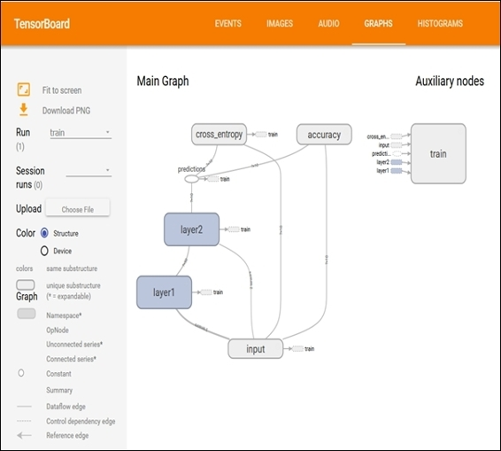

# 一、TensorFlow 基本概念

## 在 Mac 或 Linux 上安装

```sh
# 如果没有安装 pip 和 virtualenv，首先安装他们
# 对于 Ubuntu/Linux 64 位
$ sudo apt-get install python-pip python-dev python-virtualenv
# 对于 MacOS
$ sudo easy_install pip
$ sudo pip install --upgrade virtualenv

# 然后，你可以创建虚拟环境 virtualenv
# 以下命令在 ~/ tensorflow 目录中创建虚拟环境 virtualenv
$ virtualenv --system-site-packages ~/tensorflow

# 下一步是像这样激活 virtualenv
$ source ~/tensorflow/bin/activate.csh
(tensorflow)$

# 从此以后，我们正在使用的环境名称在命令行之前
# 激活后，Pip 用于在其中安装 TensorFlow
# 对于 Ubuntu/Linux 64 位
(tensorflow)$ pip install --upgrade https://storage.googleapis.com/tensorflow/linux/cpu/tensorflow-0.5.0-cp27-none-linux_x86_64.whl
# 对于 MacOS
(tensorflow)$ pip install --upgrade https://storage.googleapis.com/tensorflow/mac/tensorflow-0.5.0-py2-none-any.whl

# 最后，完成后，必须禁用虚拟环境
(tensorflow)$ deactivate
```

## 在 Windows 上安装

```sh
# 克隆 TensorFlow 存储库
git clone --recurse-submodules 
https://github.com/tensorflow/tensorflow

# 按照以下说明安装 Bazel（依赖项和安装程序）
# http://bazel.io/docs/install.html

# 运行 Bazel 安装器
chmod +x bazel-version-installer-os.sh
./bazel-version-installer-os.sh --user

# 安装 Python 依赖
sudo apt-get install python-numpy swig python-dev

# 在 TensorFlow 下载的存储库中
# 配置（GPU 或无 GPU？）你的安装：
./configure

# 使用 bazel 创建自己的 TensorFlow Pip 包
bazel build -c opt //tensorflow/tools/pip_package:build_pip_package

# 要使用支持 GPU 的构建，请使用
bazel build -c opt --config=cuda
# 后接
//tensorflow/tools/pip_package:build_pip_package

# 最后，安装 TensorBoard
# 其中 .whl 文件的名称取决于你的平台
pip install /tmp/tensorflow_pkg/tensorflow-0.7.1-py2-none- linux_x86_64.whl
```

## 第一个工作会话

```py
# 如果要使用 TensorFlow 库
# 则永远不应丢失以下语句 
# 它告诉我们我们正在导入库
# 并将其命名为 tf
import tensorflow as tf 

# 我们创建一个名为 x 的常量值
# 其值等于 1
x = tf.constant(1,name='x')

# 当我们创建一个名为 y 的变量
# 该变量用简单方程 y = x + 9 定义
y = tf.Variable(x+9,name='y')

# 最后打印结果
print(y)
# <tensorflow.python.ops.variables.Variable object at    0x7f30ccbf9190>

# 我们这样初始化模型
model = tf.initialize_all_variables()

# 大多数情况下，我们已经创建了一个计算值的会话
# 在下一步中，我们运行先前创建的模型
# 最后只运行变量 y 并打印出其当前值
with tf.Session() as session:
    session.run(model)
    print(session.run(y))
    # 10
```

## TensorFlow 编程模型

```py
# 定义并初始化变量
# 每个变量都应该定义当前执行的状态
# 在 Python 中导入 TensorFlow 模块后
import tensorflow as tf

# 我们定义计算中涉及的变量 a 和 b 
# 这些是通过一个更基本的结构定义的
# 称为占位符
# 占位符允许我们创建操作并构建计算图
# 而无需数据
a = tf.placeholder("int32")
b = tf.placeholder("int32")

# 然后我们使用这些变量
# 作为 TensorFlow 函数 mul 的输入
# 此函数将返回输入整数 a 和 b 的乘法结果
y = tf.mul(a,b)

# 管理执行流程
# 这意味着我们必须构建一个会话
sess = tf.Session()

# 展示结果
# 我们在变量 a 和 b 上运行我们的模型
# 通过先前定义的占位符
# 将数据提供给数据流图
print sess.run(y , feed_dict={a: 2, b: 5})
```

## 如何使用 TensorBoard

```py
import tensorflow as tf
a = tf.constant(10,name="a")
b = tf.constant(90,name="b")
y = tf.Variable(a+b*2, name="y")
model = tf.initialize_all_variables()
with tf.Session() as session:
    # 让我们看看会话管理
    # 要考虑的第一条指令如下
    # 此指令必须合并默认图表中收集的所有摘要
    merged = tf.merge_all_summaries()
    
    # 然后我们创建 SummaryWriter
    # 它会将从代码执行中获得的所有摘要（在本例中为执行图）
    # 写入 /tmp/tensorflowlogs 目录
    writer = tf.train.SummaryWriter\
        ("/tmp/tensorflowlogs",session.graph)   
        
    # 最后，我们运行模型
    # 从而构建数据流图
    session.run(model)
    print(session.run(y))
    # 190
```

```sh
# TensorBoard 的使用非常简单
# 让我们打开一个终端并输入以下内容
$tensorboard --logdir=/tmp/tensorflowlogs

# 应出现如下消息
# startig tensorboard on port 6006
```



