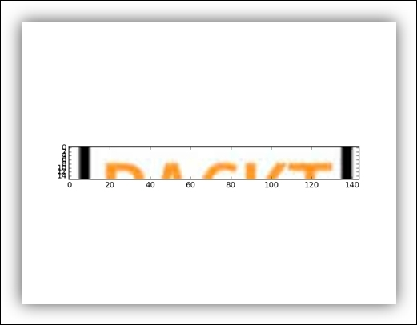
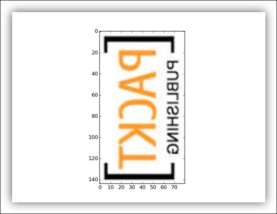
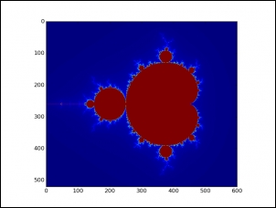
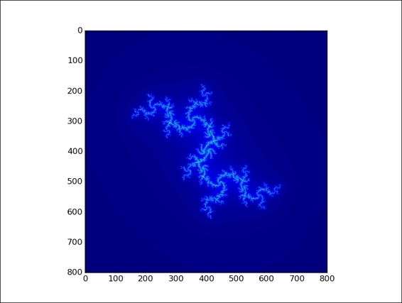
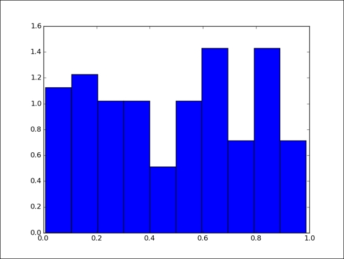
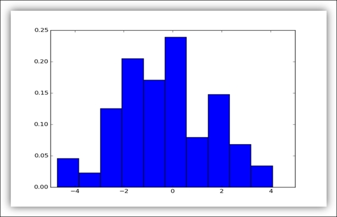
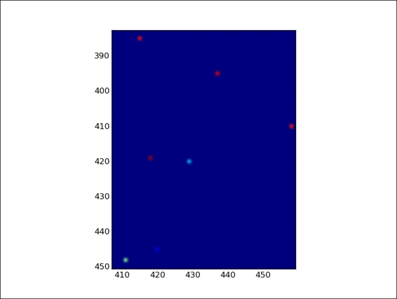
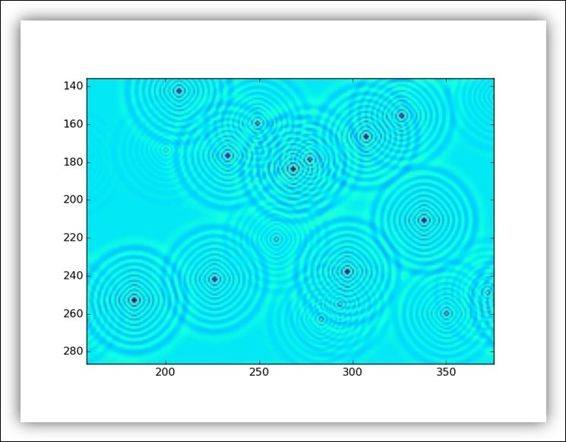

# 二、用 TF 做算术

## 一维张量

```py
# 要构建一维张量，我们使用 Numpy array(s) 命令
# 其中 s 是 Python 列表
>>> import numpy as np 
>>> tensor_1d = np.array([1.3, 1, 4.0, 23.99])

# 与 Python 列表不同
# 元素之间的逗号未显示
>> print tensor_1d 
# [  1.3    1.     4.    23.99] 

# 索引与 Python 列表相同
# 第一个元素的位置为 0
# 第三个元素的位置为 2，依此类推
>>> print tensor_1d[0] 
# 1.3 
>>> print tensor_1d[2] 
# 4.0

# 最后，你可以查看张量的基本属性
# 张量的秩
>>> tensor_1d.ndim 
# 1

# 张量维数的元组如下
# 张量的形状连续只有四个值
>>> tensor_1d.shape 
# (4L,) 

# 张量中的数据类型
>>> tensor_1d.dtype 
# dtype('float64')


# 现在，让我们看看
# 如何将 NumPy 数组转换为 TensorFlow 张量
import TensorFlow as tf

# TensorFlow 函数 tf_convert_to_tensor
# 将各种类型的 Python 对象转换为张量对象
# 它接受张量对象，Numpy 数组
# Python 列表和 Python 标量
tf_tensor=tf.convert_to_tensor(tensor_1d,dtype=tf.float64)

# 运行会话，我们可以将张量及其元素展示如下
with tf.Session() as sess: 
    print sess.run(tf_tensor)
    # [  1.3    1.     4.    23.99] 
    print sess.run(tf_tensor[0]) 
    # 1.3
    print sess.run(tf_tensor[2])
    # 4.0
```

## 二维张量

```py
# 要创建二维张量或矩阵
# 我们再次使用数组，但 s 将是一个数组序列
>>> import numpy as np 
 
>>> tensor_2d=np.array([(1,2,3,4),(4,5,6,7),(8,9,10,11),(12,13,14,15)]) 
 
>>> print tensor_2d 
'''
[[ 1  2  3  4] 
 [ 4  5  6  7] 
 [ 8  9 10 11] 
 [12 13 14 15]] 
'''

# tensor_2d 中的值由表达式 tensor_2d [row，col]标识
# 其中 row 是行位置，col 是列位置
>>> tensor_2d[3][3] 
# 15

# 你还可以使用切片运算符提取子矩阵
>>> tensor_2d[0:2,0:2] 
'''
array([[1, 2], 
       [4, 5]])
'''
```

## 张量处理

```py
# 导入库
import TensorFlow as tf 
import numpy as np

# 让我们构建两个整数数组
# 这代表两个 3×3 矩阵
matrix1 = np.array([(2,2,2),(2,2,2),(2,2,2)],dtype='int32') 
matrix2 = np.array([(1,1,1),(1,1,1),(1,1,1)],dtype='int32') 

# 展示他们
print "matrix1  =" 
print matrix1 
'''
[[2 2 2]
 [2 2 2]
 [2 2 2]]
'''

print "matrix2 =" 
print matrix2
'''
[[1 1 1]
 [1 1 1]
 [1 1 1]]
'''

# 要在 TensorFlow 环境中使用这些矩阵
# 必须将它们转换为张量数据结构
matrix1 = tf.constant(matrix1) 
matrix2 = tf.constant(matrix2) 

# 我们使用 TensorFlow 常量运算符来执行转换
# 矩阵已准备好使用 TensorFlow 运算符进行操作
# 在这种情况下，我们计算矩阵乘法和矩阵和
matrix_product = tf.matmul(matrix1, matrix2) 
matrix_sum = tf.add(matrix1,matrix2) 

# 以下矩阵将用于计算矩阵行列式
matrix_3 = np.array([(2,7,2),(1,4,2),(9,0,2)],dtype='float32') 

print "matrix3 =" 
print matrix_3 
'''
[[2. 7. 2.]
 [1. 4. 2.]
 [9. 0. 2.]]
'''

matrix_det = tf.matrix_determinant(matrix_3)

# 现在是时候创建我们的图表并运行会话
# 并创建张量和运算符
with tf.Session() as sess: 
    result1 = sess.run(matrix_product) 
    result2 = sess.run(matrix_sum) 
    result3 = sess.run(matrix_det) 
    
    # 通过运行以下命令打印出结果
    print "matrix1*matrix2 =" 
    print result1 
    '''
    [[6 6 6]
     [6 6 6]
     [6 6 6]]
    '''

    print "matrix1 + matrix2 =" 
    print result2
    '''
    [[3 3 3]
     [3 3 3]
     [3 3 3]]
    '''
    
    print "matrix3 determinant result =" 
    print result3
    # 56.0
```

## 三维张量

```py
# 以下命令构建三维张量
>>> import numpy as np 
>>> tensor_3d = np.array([[[1,2],[3,4]],[[5,6],[7,8]]]) 
>>> print tensor_3d 
'''
[[[1 2] 
  [3 4]] 
 
 [[5 6] 
  [7 8]]] 
'''

# 创建的三维张量是 2x2x2 矩阵
>>> tensor_3d.shape 
# (2L, 2L, 2L)

# 要从三维张量中检索元素，我们使用以下形式的表达式
# tensor_3d[plane,row,col]

# 因此，由变量平面的值标识的
# 第一个平面中的所有四个元素都等于零
>>> tensor_3d[0,0,0] 
# 1 
>>> tensor_3d[0,0,1] 
# 2 
>>> tensor_3d[0,1,0] 
# 3 
>>> tensor_3d[0,1,1] 
# 4
```

## 张量处理

```py
# 为了使用 matplotlib 中的 imread 命令
# 我们导入标准格式颜色的数字图像（JPG，BMP，TIF）
import matplotlib.image as mp_image 
filename = "packt.jpeg" 
input_image = mp_image.imread(filename)

# 但是，我们可以看到张量的秩和形状
print 'input dim = {}'.format(input_image.ndim) 
print 'input shape = {}'.format(input_image.shape) 

# 最后，使用 matplotlib
# 可以可视化导入的图像
import matplotlib.pyplot as plt 
plt.imshow(input_image) 
plt.show()   
```


```py
# 在此示例中，切片是起始图像的二维片段
# 其中每个像素都具有RGB分量
# 因此我们需要占位符来存储切片的所有值
import TensorFlow as tf 
my_image = tf.placeholder("uint8",[None,None,3])

# 对于最后一个维度，我们只需要三个值
# 然后我们使用 TensorFlow 切片运算符创建子图像
slice = tf.slice(my_image,[10,0,0],[16,-1,-1])

# 最后一步是构建 TensorFlow 工作会话
with tf.Session() as session: 
    result = session.run(slice,feed_dict={my_image: input_image}) 
    print(result.shape) 

plt.imshow(result) 
plt.show()
```



```py
# 我们将使用转置运算符
# 对输入图像执行几何变换
import TensorFlow as tf

# 我们将输入图像与称为 x 的变量相关联
x = tf.Variable(input_image,name='x')

# 之后初始化模型
model = tf.initialize_all_variables() 

# 接下来，我们构建会话来运行代码
with tf.Session() as session:
    # 要执行矩阵的转置
    # 请使用 TensorFlow 的转置函数
    # 此方法在输入矩阵的轴 0 和 1 之间执行交换
    # 而 z 轴保持不变
    x = tf.transpose(x, perm=[1,0,2]) 
    session.run(model) 
    result=session.run(x) 
    
plt.imshow(result) 
plt.show()
```




## Mandelbrot 集

```py
# 将必要的库导入到我们的示例中
import TensorFlow as tf 
import numpy as np 
import matplotlib.pyplot as plt

# 我们构建了一个包含 Mandelbrot 集合的复杂网格
# 复平面的区域在实轴上 -1.3 和 +1.3 之间
# 虚轴上 -2j 和 +1j 之间
# 每个图像中的每个像素位置
# 将代表不同的复数值，z
Y, X = np.mgrid[-1.3:1.3:0.005, -2:1:0.005] 
Z = X+1j*Y 
c = tf.constant(Z.astype(np.complex64)) 

# 然后我们定义数据结构
# 或者包含要包含在计算中的所有数据的张量
# 然后我们定义两个变量
# 第一个是我们将进行迭代的那个
# 它与复杂网格具有相同的尺寸
# 但它被声明为变量
# 也就是说，它的值将在计算过程中发生变化
zs = tf.Variable(c) 

# 下一个变量初始化为零
# 它也与变量 zs 具有相同的大小
ns = tf.Variable(tf.zeros_like(c, tf.float32)) 

# 我们不引入会话
# 而是实例化一个可交互会话
sess = tf.InteractiveSession()

# 我们将要看到
# 它需要 Tensor.eval() 和 Operation.run() 方法
# 然后我们通过 run() 方法初始化所有涉及的变量
tf.initialize_all_variables().run()

# 启动迭代
zs_ = zs*zs + c

# 定义停止条件
not_diverged = tf.complex_abs(zs_) < 4

# 然后我们使用分组多个操作的组运算符
# 第一个操作是迭代 Z(n+1) = Z(n)^2 + c 来创建新值
# 第二个操作将此值添加到 ns 中的对应元素变量
# 当此操作完成时，输入中的所有操作都已完成
# 该运算符没有输出
step = tf.group(zs.assign(zs_),\ 
    ns.assign_add(tf.cast(not_diverged, tf.float32)))
    
# 然后我们运行操作两百步
for i in range(200): step.run()

# 结果将是张量 ns.eval()
# 使用 matplotlib，让我们可视化结果



## Julia 集

```py
# 让我们定义输出复平面
# 它在实轴上 -2 和 +2 之间
# 虚轴上在 -2j 和 +2j 之间
Y, X = np.mgrid[-2:2:0.005, -2:2:0.005]

# 和当前点位置
Z = X+1j*Y

# Julia 集合的定义要求将 Z 重新定义为常数张量
Z = tf.constant(Z.astype("complex64")) 

# 因此，支持我们计算的输入张量如下
zs = tf.Variable(Z)
ns = tf.Variable(tf.zeros_like(Z, "float32"))

# 与前面的示例一样
# 我们创建了自己的交互式会话
sess = tf.InteractiveSession()

# 然后我们初始化输入张量
tf.initialize_all_variables().run() 

# 为了计算 Julia 集的新值
# 我们将使用迭代公式 Z(n+1) = Z(n)^2 – c
# 其中初始点 c 将等于虚数 0.75i
c = complex(0.0,0.75) 
zs_ = zs*zs - c

# 分组运算符和停止迭代的条件
# 将与 Mandelbrot 计算中的相同
not_diverged = tf.complex_abs(zs_) < 4 
 
step = tf.group(zs.assign(zs_),\ 
    ns.assign_add(tf.cast(not_diverged, "float32"))) 

# 最后，我们运行运算符两百步
for i in range(200): step.run()

# 要显示结果，请运行以下命令
plt.imshow(ns.eval()) 
plt.show()
```



## 计算梯度

```py
# 考虑数学函数 y = 2x²
# 我们想要计算相对于 x = 1 的梯度 dy
# 首先，导入TensorFlow库
import TensorFlow as tf

# x 变量是函数的自变量
x = tf.placeholder(tf.float32)

# 构建函数
y =  2*x*x

# 最后，我们将 y 和 x 作为参数
# 调用 tf.gradients() 函数
var_grad = tf.gradients(y, x)

# 要求解梯度，我们必须构建一个会话
with tf.Session() as session:
    # 将在变量 x = 1 上求解梯度
    var_grad_val = session.run(var_grad,feed_dict={x:1}) 

    # var_grad_val 值是要打印的 Feed 结果
    print(var_grad_val)
    # [4.0]
```

## 均匀分布

```py
# 我们导入 TensorFlow 库
# 和 matplotlib 来显示结果
import TensorFlow as tf 
import matplotlib.pyplot as plt 

# uniform 变量是 1 维张量，100 个元素
# 包含范围从 0 到 1 的值
# 以相同的概率分布
uniform = tf.random_uniform([100],minval=0,maxval=1,dtype=tf.float32)

# 在我们的会话中，我们使用 eval() 运算符
# 来评估 uniform 张量
with tf.Session() as session: 
    print uniform.eval() 
    plt.hist(uniform.eval(),normed=True) 
    plt.show()
```



## 正态分布

```py
import TensorFlow as tf 
import matplotlib.pyplot as plt 

# 使用运算符 tf.random_normal 
# 创建了一个由随机正态值组成的
# 形状 [100] 的 1d 张量
# 其中均值等于 0，标准差等于 2
norm = tf.random_normal([100], mean=0, stddev=2)

with tf.Session() as session: 
    plt.hist(norm.eval(),normed=True) 
    plt.show()
```



## 使用种子生成随机数

```py
# 考虑以下示例，其中我们有两个均匀分布
uniform_with_seed = tf.random_uniform([1], seed=1)
uniform_without_seed = tf.random_uniform([1])

# 在第一个均匀分布中
# 我们从 seed = 1 开始
# 这意味着重复评估两个分布
# 第一个均匀分布将始终生成相同的值序列
print("First Run")
with tf.Session() as first_session:
    print("uniform with (seed = 1) = {}"\
        .format(first_session.run(uniform_with_seed)))
    print("uniform with (seed = 1) = {}"\
        .format(first_session.run(uniform_with_seed)))
    print("uniform without seed = {}"\
        .format(first_session.run(uniform_without_seed)))
    print("uniform without seed = {}"\
        .format(first_session.run(uniform_without_seed)))
'''
First Run 
uniform with (seed = 1) = [ 0.23903739] 
uniform with (seed = 1) = [ 0.22267115] 
uniform without seed = [ 0.92157185] 
uniform without seed = [ 0.43226039] 
'''

print("Second Run")
with tf.Session() as second_session:
    print("uniform with (seed = 1) = {}\
        .format(second_session.run(uniform_with_seed)))
    print("uniform with (seed = 1) = {}\
        .format(second_session.run(uniform_with_seed)))
    print("uniform without seed = {}"\
        .format(second_session.run(uniform_without_seed)))
    print("uniform without seed = {}"\
        .format(second_session.run(uniform_without_seed))
'''
Second Run 
uniform with (seed = 1) = [ 0.23903739] 
uniform with (seed = 1) = [ 0.22267115] 
uniform without seed = [ 0.50188708] 
uniform without seed = [ 0.21324408] 
'''
```

## 蒙特卡罗方法

```py
# 一种广泛应用于高性能科学计算的数值概率方法
# 在我们的例子中，我们将计算 π 的值
import TensorFlow as tf 
 
trials = 100 
hits = 0

# 使用 random_uniform 函数
# 在方形 [-1,1]×[-1,1] 内生成伪随机点
x = tf.random_uniform([1],minval=-1,maxval=1,dtype=tf.float32) 
y = tf.random_uniform([1],minval=-1,maxval=1,dtype=tf.float32) 
pi = []

# 启动会话
sess = tf.Session()

# 在会话中，我们计算 π 的值
# 圆的面积是 π，正方形的面积是 4
# 圆内的数字和生成的点的总和之间的比值
# 必须（非常缓慢地）收敛到 π
# 并且 我们计算圆的方程
# x^2 + y^2 = 1 内有多少个点
with sess.as_default(): 
    for i in range(1,trials): 
        for j in range(1,trials): 
            if x.eval()**2 + y.eval()**2 < 1 : 
                hits = hits + 1 
                pi.append((4 * float(hits) / i)/trials)   

plt.plot(pi) 
plt.show()
```


## 偏微分方程

```py
# 起点是导入这些基础库
import TensorFlow as tf 
import numpy as np              
import matplotlib.pyplot as plt

# 首先，我们必须定义问题的维度
# 让我们想象一下
# 我们的池塘是 500x500 的方形
N = 500

# 以下二维张量是时间 t = 0 时的池塘
# 也就是我们问题的初始条件
u_init = np.zeros([N, N], dtype=np.float32) 

# 我们有 40 个随机的雨滴
for n in range(40): 
    # 返回二维形状的从 0 到 N 的随机整数
    a,b = np.random.randint(0, N, 2) 
    u_init[a,b] = np.random.uniform()
    
# 使用matplotlib，我们可以显示最初的池塘
plt.imshow(U.eval()) 
plt.show()
```



```
# 之后定义张量
ut_init = np.zeros([N, N], dtype=np.float32) 

# 我们必须定义一些基本参数（使用 TensorFlow 占位符）和模拟的时间步长
eps = tf.placeholder(tf.float32, shape=())

# 我们还必须定义模型的物理参数，即阻尼系数
damping = tf.placeholder(tf.float32, shape=())

# 然后我们将起始张量重新定义为 TensorFlow 变量
# 因为它们的值将在模拟过程中发生变化
U  = tf.Variable(u_init) 
Ut = tf.Variable(ut_init)

# 最后，我们构建了PDE模型
# 它代表了雨滴落下后池塘的时间演变
U_ = U + eps * Ut 
Ut_ = Ut + eps * (laplace(U) - damping * Ut) 

# 使用 TensorFlow 组运算符
# 我们定义我们的池塘在时间 t 应该如何演变
step = tf.group( 
    U.assign(U_), 
    Ut.assign(Ut_))

# 让我们初始化 TensorFlow 变量
tf.initialize_all_variables().run()

# 然后我们运行模拟
# 池塘的时间演变是 1000 步
for i in range(1000): 
    # 每个时间步长等于 0.03s
    # 而阻尼系数设定为 0.04
    step.run({eps: 0.03, damping: 0.04}) 
    if i % 50 == 0: 
        clear_output() 
        plt.imshow(U.eval()) 
        plt.show()
```




```py
# 这些函数描述了模型的物理特性
# 即波浪在池塘中创建并传播
# 我不会详细介绍这些功能
# 其中的理解超出了本书的范围
def make_kernel(a): 
    a = np.asarray(a) 
    a = a.reshape(list(a.shape) + [1,1]) 
    return tf.constant(a, dtype=1) 
 
def simple_conv(x, k): 
    x = tf.expand_dims(tf.expand_dims(x, 0), -1) 
    y = tf.nn.depthwise_conv2d(x, k, [1, 1, 1, 1],padding='SAME') 
    return y[0, :, :, 0] 
 
def laplace(x): 
    laplace_k = make_kernel([[0.5, 1.0, 0.5], 
                           [1.0, -6., 1.0], 
                           [0.5, 1.0, 0.5]]) 
    return simple_conv(x, laplace_k)
```
