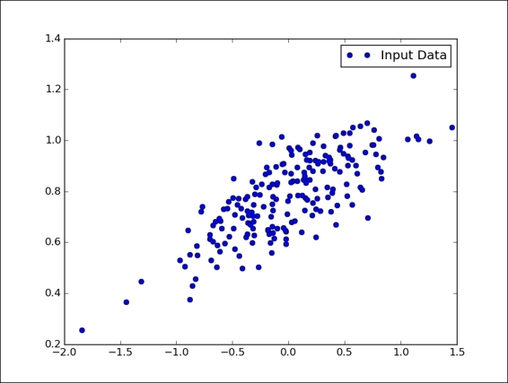
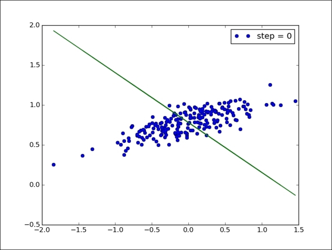
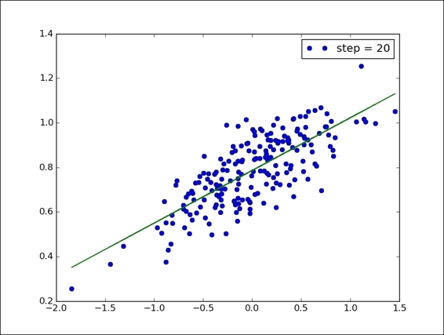
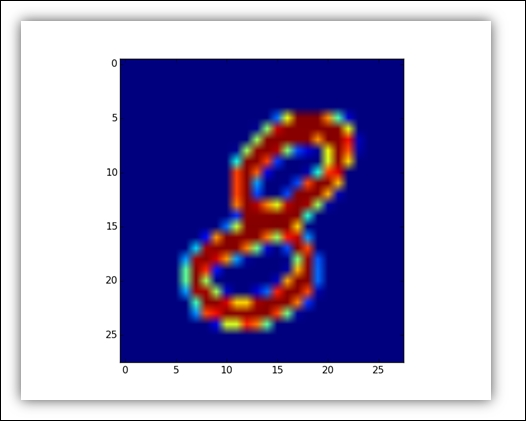
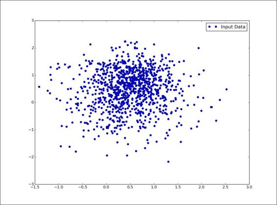
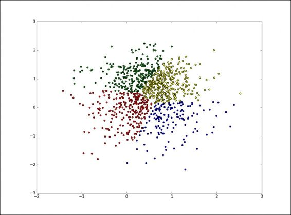

# 三、开始机器学习

## 线性回归

```py
# 以导入 NumPy 来起步
import numpy as np

# 然后我们定义我们想要绘制的点数
number_of_points = 500

# 初始化如下两个列表
# 包含生成的点
x_point = []
y_point = []

# 然后我们设置两个常量
# 将出现在 y 与 x 的线性关系中
a = 0.22
b = 0.78

# 通过 NumPy 的random.normal 函数
# 我们在回归方程 y = 0.22x + 0.78 周围
# 生成 300 个随机点
for i in range(number_of_points):
    x = np.random.normal(0.0,0.5)
    y = a*x + b +np.random.normal(0.0,0.1)
    x_point.append([x])
    y_point.append([y])
    
# 最后通过 matplotlib 观察生成的点
import matplotlib.pyplot as plt
plt.plot(x_point,y_point, 'o', label='Input Data')
plt.legend()
plt.show()
```



```py
# 第一步是导入 TF 库
import tensorflow as tf

# 然后使用 TensorFlow tf.Variable 
# 定义 A 和 b 未知数
A = tf.Variable(tf.random_uniform([1], -1.0, 1.0))

# 使用 -1 和 1 之间的随机值
# 初始化未知因子 A
# 而变量 b 最初设置为零
b = tf.Variable(tf.zeros([1]))

# 我们写出将 y 绑定到 x 的线性关系
y = A * x_point + b

# 成本函数具有一些参数
# 包含要确定的一对值 A 和 b 的
# 这些参数返回一个值
# 估计参数正确程度
# 在此示例中，我们的成本函数是均方误差
cost_function = tf.reduce_mean(tf.square(y - y_point))

# 使用 TensorFlow，梯度下降的应用非常简单
# 0.5 是学习率
optimizer = tf.train.GradientDescentOptimizer(0.5)

# 我们通过最小化函数
# 将 train 定义为成本函数的应用结果
train = optimizer.minimize(cost_function)

# 现在我们可以在之前创建的数据模型上
# 测试梯度下降算法
# 像往常一样，我们必须初始化所有变量
model = tf.initialize_all_variables()

# 因此，我们构建迭代（20 个计算步骤）
# 允许我们确定 A 和 b 的最佳值
# 它们定义最适合数据模型的直线
# 实例化求值图
with tf.Session() as session:
    session.run(model)
    for step in range(0,21):
        # 对于每次迭代，我们执行优化步骤
        session.run(train)
        # 每五个步骤，我们打印我们的点
        if (step % 5) == 0:
            plt.plot(x_point,y_point,'o',
                label='step = {}'
                .format(step))
            # 并且通过以下命令获得直线
            plt.plot(x_point,
                session.run(A) * 
                x_point + 
                session.run(B))
            plt.legend()
            plt.show()
```






## MNIST 数据集

```py
import input_data
import numpy as np
import matplotlib.pyplot as plt

# 使用 input_data，我们加载数据集
mnist_images = input_data.read_data_sets\
    ("MNIST_data/",\
    one_hot=False)

# 返回前 10 个图像
pixels,real_values = mnist_images.train.next_batch(10)

# 这也返回两个列表
# 加载的像素矩阵
# 和包含加载的实际值的列表
print "list of values loaded ",real_values
example_to_visualize = 5
print "element N° " + str(example_to_visualize + 1)\
      + " of the list plotted"
'''
Extracting MNIST_data/train-labels-idx1-ubyte.gz
Extracting MNIST_data/t10k-images-idx3-ubyte.gz 
Extracting MNIST_data/t10k-labels-idx1-ubyte.gz 
list of values loaded  [7 3 4 6 1 8 1 0 9 8] 
element N 6 of the list plotted
'''

# 在显示元素时
# 我们可以使用matplotlib，如下所示
image = pixels[example_to_visualize,:]
image = np.reshape(image,[28,28])
plt.imshow(image)
plt.show()
```



## KNN

```py
# 导入所需的库
import numpy as np
import tensorflow as tf
import input_data

# 要构建训练集的数据模型
# 请使用前面介绍的
# input_data.read_data_sets 函数
mnist = input_data.read_data_sets("/tmp/data/", one_hot=True)

# 在我们的例子中
# 我们将采用由 100 个 MNIST 图像
# 组成的训练阶段
train_pixels,train_list_values = mnist.train.next_batch(100) 

# 我们为 10 个图像测试算法
test_pixels,test_list_of_values  = mnist.test.next_batch(10) 

# 最后，我们定义了
# 用于构造分类器的张量
# train_pixel_tensor 
# 和 test_pixel_tensor
train_pixel_tensor = tf.placeholder\
    ("float", [None, 784])
test_pixel_tensor = tf.placeholder\
    ("float", [784])

# 成本函数由像素的距离表示
distance = tf.reduce_sum\
    (tf.abs\
    (tf.add(train_pixel_tensor, \
        tf.neg(test_pixel_tensor))), \
    reduction_indices=1)

# tf.reduce_sum 计算张量维度上的元素总和
# 例如（来自T ensorFlow 在线手册）
'''
'x' is [[1, 1, 1]
        [1, 1, 1]]
tf.reduce_sum(x) ==> 6
tf.reduce_sum(x, 0) ==> [2, 2, 2]
tf.reduce_sum(x, 1) ==> [3, 3]
tf.reduce_sum(x, 1, keep_dims=True) ==> [[3], [3]]
tf.reduce_sum(x, [0, 1]) ==> 6
'''

# 最后，为了最小化距离函数
# 我们使用 arg_min
# 它返回距离最小的索引（最近邻居）
pred = tf.arg_min(distance, 0)

# 准确度是一个参数
# 可以帮助我们计算分类器的最终结果
accuracy = 0

# 初始化变量
init = tf.initialize_all_variables()

# 开始模拟
with tf.Session() as sess:
    sess.run(init)
    for i in range(len(test_list_of_values)):
        # 然后我们使用前面定义的 pred 函数
        # 求解最近邻居索引
        nn_index = sess.run(pred,\
            feed_dict={train_pixel_tensor:train_pixels,\
            test_pixel_tensor:test_pixels[i,:]})
            
        # 最后，我们找到最近的邻居类标签
        # 并将其与其真实标签进行比较
        print "Test N° ", i,"Predicted Class: ", \
            np.argmax(train_list_values[nn_index]),\
            "True Class: ", np.argmax(test_list_of_values[i])
        if np.argmax(train_list_values[nn_index])\
            == np.argmax(test_list_of_values[i]):
            # 然后我们评估并报告分类器的准确性
            accuracy += 1./len(test_pixels)
        print "Result = ", accuracy
    
'''
Extracting /tmp/data/train-labels-idx1-ubyte.gz                                Extracting /tmp/data/t10k-images-idx3-ubyte.gz
Extracting /tmp/data/t10k-labels-idx1-ubyte.gz 
Test N°  0 Predicted Class:  7 True Class:  7 
Test N°  1 Predicted Class:  2 True Class:  2 
Test N°  2 Predicted Class:  1 True Class:  1 
Test N°  3 Predicted Class:  0 True Class:  0 
Test N°  4 Predicted Class:  4 True Class:  4 
Test N°  5 Predicted Class:  1 True Class:  1 
Test N°  6 Predicted Class:  4 True Class:  4 
Test N°  7 Predicted Class:  9 True Class:  9 
Test N°  8 Predicted Class:  6 True Class:  5 
Test N°  9 Predicted Class:  9 True Class:  9 
Result =  0.9
'''
```

## KMeans

```py
# 导入所需的库
import matplotlib.pyplot as plt
import numpy as np
import tensorflow as tf
import pandas as pd

# 我们必须定义问题的参数
# 我们想要聚类的总点数是 1000
num_vectors = 1000

# 所有簇的数量
num_clusters = 4

# 我们设置了 k-means 算法的计算步数
num_steps = 100

# 我们初始化最初输入的数据结构
x_values = []
y_values = []
vector_values = []

# 训练集创建了一组随机点
# 这就是我们使用 random.normal NumPy 函数的原因
# 它许我们构建 x_values 和 y_values 向量
for i in xrange(num_vectors):
  if np.random.random() > 0.5:
    x_values.append(np.random.normal(0.4, 0.7))
    y_values.append(np.random.normal(0.2, 0.8))
else:
    x_values.append(np.random.normal(0.6, 0.4))
    y_values.append(np.random.normal(0.8, 0.5))

# 我们使用 Python zip 函数
# 来获取 vector_values 的完整列表
vector_values = zip(x_values,y_values)

# 然后将 vector_values 转换为常量
# 可由 TensorFlow 使用
vectors = tf.constant(vector_values)

# 我们可以使用以下命令
# 查看聚类算法的训练集
plt.plot(x_values,y_values, 'o', label='Input Data')
plt.legend()
plt.show()
```



```py
# 在随机构建训练集之后
# 我们必须生成（k = 4）个质心
# 然后使用 tf.random_shuffle 确定索引
n_samples = tf.shape(vector_values)[0]
random_indices = tf.random_shuffle(tf.range(0, n_samples))

# 通过采用这个程序
# 我们能够确定四个随机索引
begin = [0,]
size = [num_clusters,]
size[0] = num_clusters

# 初始质心索引
centroid_indices = tf.slice(random_indices, begin, size)
centroids = tf.Variable(tf.gather\
    (vector_values, centroid_indices))

# 为了管理先前定义的张量，向量和质心
# 我们使用 TensorFlow 函数 expand_dims
# 它自动扩展两个参数的大小
expanded_vectors = tf.expand_dims(vectors, 0)
expanded_centroids = tf.expand_dims(centroids, 1)

# 此函数允许你标准化两个张量的形状
# 以便通过 tf.sub 方法评估差异
vectors_subtration = tf.sub(expanded_vectors,expanded_centroids)

# 最后，我们使用 tf.reduce_sum 函数
# 构建欧氏距离成本函数
# 该函数计算张量维度上元素的总和
# 而 tf.square 函数
# 逐元素计算 vectors_subtration 的平方
euclidean_distances = tf.reduce_sum(tf.square\
    (vectors_subtration), 2)
assignments = tf.to_int32(tf.argmin(euclidean_distances, 0))

# 以下代码获取每个样本的最近索引
# 并使用 tf.dynamic_partition 
# 将它们作为单独的组抓取
partitions = tf.dynamic_partition\
    (vectors, assignments, num_clusters)

# 最后，我们使用 tf.reduce_mean
# 更新单个组的质心
# 来找到该组的平均值，形成新的质心
update_centroids = tf.concat(0, \
    [tf.expand_dims\
    (tf.reduce_mean(partition, 0), 0)\
    for partition in partitions])

# 是时候测试和评估算法了
# 第一个过程是初始化所有变量
# 并实例化求值图
init_op = tf.initialize_all_variables()
sess = tf.Session()
sess.run(init_op)

# 现在开始计算
for step in xrange(num_steps):
    _, centroid_values, assignment_values =\
       sess.run([update_centroids,\
                centroids,\
                assignments])
                
# 要显示结果，我们实现以下函数
# 接受训练集的 x_values 和 y_values 向量
# 以及 assignemnt_values 向量来绘制簇
def display_partition(x_values,y_values,assignment_values):
    labels = []
    # 它通过以下数据结构
    # 将每种聚类的颜色与其相关联
    colors = ["red","blue","green","yellow"]
    for i in xrange(len(assignment_values)):
      labels.append(colors[(assignment_values[i])])
    color = labels
    df = pd.DataFrame\
         (dict(x =x_values,y = y_values ,color = labels ))
    fig, ax = plt.subplots()
    # 然后它通过 matplotlib 的
    # scatter 函数绘制它们
    ax.scatter(df['x'], df['y'], c=df['color'])
    plt.show()

display_partition(x_values,y_values,assignment_values)
```


