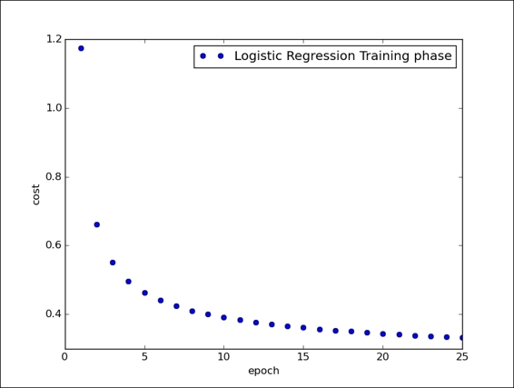

# 四、神经网络导论

## Logistic 回归

```py
# 导入所有所需库
import input_data
import tensorflow as tf
import matplotlib.pyplot as plt

# 使用 MNIST 数据集的 input_data.read 函数
# 将图像上传到我们的代码中
mnist = input_data.read_data_sets("/tmp/data/", one_hot=True)

# 然后我们设置训练阶段的总时期数
training_epochs = 25

# 定义构建模型所需的其他参数
learning_rate = 0.01
batch_size = 100
display_step = 1

# 将 x 定义为输入张量
# 它代表尺寸为 28 x 28 = 784 像素的
# MNIST 数据图像
x = tf.placeholder("float", [None, 784]) 

# 所以我们得到的输出将是
# 一个具有 10 个概率的输出张量
# 每个概率对应一个数字
# （当然概率之和必须是 1）
y = tf.placeholder("float", [None, 10]) 

# 我们首先将权重输入张量定义为 W
W = tf.Variable(tf.zeros([784, 10]))

# 对于给定的图像
# 我们可以通过简单地将张量 W 乘以输入张量 x 
# 来评估每个类别 i 的证据
# 使用 TensorFlow，我们应该有以下内容
evidence = tf.matmul(x, W)

# 通常，模型包括表示偏差的额外参数
# 其表示一定程度的不确定性
# 因此，为了定义证据
# 我们必须定义以下的偏差张量
b = tf.Variable(tf.zeros([10]))

# 在我们的案例中，证据的最终公式如下
evidence = tf.matmul(x, W) + b

# 第二步是最终使用 softmax 函数
# 来获得概率的输出向量，即激活
activation = tf.nn.softmax(evidence)

# 在这个例子中
# 我们使用所谓的交叉熵误差函数
# 它被定义为
cross_entropy = y*tf.lg(activation)

为了最小化交叉熵
# 我们可以使用以下 tf.reduce_mean 和 tf.reduce_sum 的组合
# 来构建成本函数
cost = tf.reduce_mean\
    (-tf.reduce_sum\
    (cross_entropy, reduction_indices=1)) 
    
# 然后我们必须使用梯度下降优化算法
# 将其最小化
optimizer = tf.train.GradientDescentOptimizer\
    (learning_rate).minimize(cost)

# 我们使用以下列表来可视化训练会话
avg_set = []
epoch_set=[]

# 之后初始化 TF 变量
init = tf.initialize_all_variables()

# 启动会话
with tf.Session() as sess:
    sess.run(init)
    
    # 如上所述，每个迭代都是一个训练循环
    for epoch in range(training_epochs):
        avg_cost = 0.
        total_batch = int(mnist.train.num_examples/batch_size)
        
        # 遍历所有批量
        for i in range(total_batch):
            batch_xs, batch_ys = \
                mnist.train.next_batch(batch_size)
            
            # 使用批量数据拟合训练
            sess.run(optimizer, feed_dict={x: batch_xs, y: batch_ys})
            
            # 使用给定的图像值（x）
            # 和实际输出（y_）
            # 计算训练操作的平均损失
            avg_cost += sess.run\
                (cost, feed_dict={x: batch_xs,\
                y: batch_ys})/total_batch
                
        # 在计算过程中
        # 我们显示每个迭代步骤的日志
        if epoch % display_step == 0:
            print "Epoch:",\
                  '%04d' % (epoch+1),\
                  "cost=","{:.9f}".format(avg_cost)
    print " Training phase finished"
    
    # 获取准确率
    # 使用 x 和 y 的图像和标签
    correct_prediction = tf.equal\
        (tf.argmax(activation, 1),\
        tf.argmax(y, 1))
    accuracy = tf.reduce_mean\
        (tf.cast(correct_prediction, "float"))
    print "MODEL accuracy:", accuracy.eval({x: mnist.test.images,\
        y: mnist.test.labels})

'''
Extracting /tmp/data/train-images-idx3-ubyte.gz 
Extracting /tmp/data/train-labels-idx1-ubyte.gz 
Extracting /tmp/data/t10k-images-idx3-ubyte.gz 
Extracting /tmp/data/t10k-labels-idx1-ubyte.gz 
Epoch: 0001 cost= 1.174406662 
Epoch: 0002 cost= 0.661956009 
Epoch: 0003 cost= 0.550468774 
Epoch: 0004 cost= 0.496588717 
Epoch: 0005 cost= 0.463674555 
Epoch: 0006 cost= 0.440907706 
Epoch: 0007 cost= 0.423837747 
Epoch: 0008 cost= 0.410590841 
Epoch: 0009 cost= 0.399881751 
Epoch: 0010 cost= 0.390916621 
Epoch: 0011 cost= 0.383320325 
Epoch: 0012 cost= 0.376767031 
Epoch: 0013 cost= 0.371007620 
Epoch: 0014 cost= 0.365922904 
Epoch: 0015 cost= 0.361327561 
Epoch: 0016 cost= 0.357258660 
Epoch: 0017 cost= 0.353508228 
Epoch: 0018 cost= 0.350164634 
Epoch: 0019 cost= 0.347015593 
Epoch: 0020 cost= 0.344140861 
Epoch: 0021 cost= 0.341420144 
Epoch: 0022 cost= 0.338980592 
Epoch: 0023 cost= 0.336655581 
Epoch: 0024 cost= 0.334488012 
Epoch: 0025 cost= 0.332488823 
Training phase finished
Model Accuracy: 0.9475
'''

# 最后，使用以下代码行
# 我们可以看到网络的训练阶段
plt.plot(epoch_set,avg_set, 'o',\
     label='Logistic Regression Training phase')
plt.ylabel('cost')
plt.xlabel('epoch')
plt.legend()
plt.show()
```



